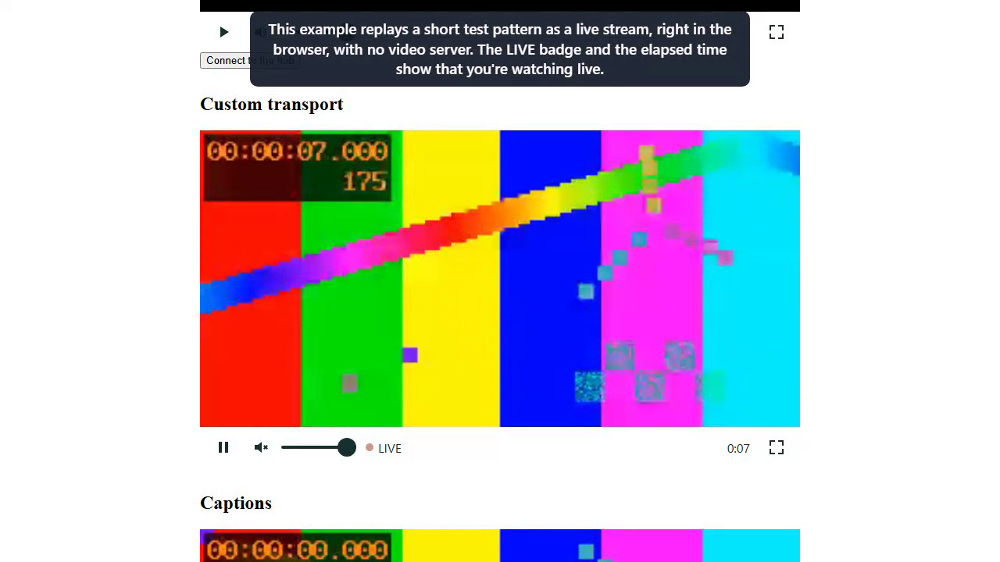

# Demo videos

Recordings made by driving Tessera's real components in Chromium. The SCORM walkthrough is silent and captioned; the combobox walkthrough includes spoken narration.

## Applications

| Application | Purpose | Status |
|-------------|---------|--------|
| [Dev app](../../src/dev-app/) | Playground that hosts the SCORM player with an example LMS host | Recorded: [`scorm-player-dev-app.webm`](scorm-player-dev-app.webm) |
| `e2e-app` (`src/e2e-app/`) | Hosts acceptance scenarios and shared combobox examples | Combobox examples recorded: [`combobox.webm`](combobox.webm); excluded from the SCORM take |
| `tools/course-server.mjs` | Serves the isolated course origin the dev app needs | Excluded: supporting tooling, started for the recording |

## scorm-player-dev-app


- Video: [`scorm-player-dev-app.webm`](scorm-player-dev-app.webm), 1:35 (95.2 s), 1280 × 720, 2.1 MB
- Poster: [`scorm-player-dev-app-poster.png`](scorm-player-dev-app-poster.png), a frame decoded from the video at 0:37

| Time | Chapter |
|------|---------|
| 0:04 | 1. Load the course |
| 0:19 | 2. A lesson reports progress |
| 0:46 | 3. Move between lessons |
| 1:07 | 4. Come back to a lesson |
| 1:17 | 5. Leave the course |

Each chapter was asserted while recording: the course title, edition and outline load; the lesson's API calls
return `true` and the player shows status completed, score 85 and "Progress saved" with one save and one outcome
event; Next, Previous and the outline move between lessons with focus on the new heading and a blocked Next on
the last lesson explained in text; the first lesson reads its saved status and score back; Exit reaches the host
as one exit event.

### What the recording shows and what it does not

- The lesson content is the repository's **probe** fixture (`test/fixtures/courses/multi-sco-12`), a page that
  runs the SCORM API calls typed into it. It is not a real course.
- The host is the dev app's in-memory example (`src/components-examples/tessera/scorm-player/`). Saved state lives
  only for the page's lifetime, so "come back to a lesson" is within one session, not a reload.
- Only SCORM 1.2 is implemented. SCORM 2004 courses are recognised and refused; ZIP loading, save failure and
  retry, and the narrow-screen layout exist and are covered by the acceptance tests but are not in this recording.
- **Known behaviour the recording exposes:** the Status and Score panel shows the outcome of the last saved lesson. After moving
  to Lesson two it still reads "completed, 85", which belongs to Lesson one. This is a limitation of the current SCORM 1.2
  outcome rule (it uses the saved activity), not something the video hides.
- The player is unstyled apart from layout, so it looks plain. No screen reader was used; accessibility is only
  covered by automated checks and keyboard tests.

## Rerun

Prerequisites: Node 24, `corepack pnpm install` run once, and Chromium installed for Playwright
(`corepack pnpm exec playwright install chromium`). Ports 4200 and 4300 must be free: the recording refuses to
reuse a server it did not start. Run from the repository root:

```
node demo/run.mjs
```

This starts the dev app (`ng serve dev-app`, port 4200) and the course server (`tools/course-server.mjs`, port
4300, after bundling the wrapper into `dist/wrapper`), records one continuous take with
`demo/playwright.config.ts` and `demo/scorm-player-dev-app.demo.ts`, then decodes the video in Chromium with
`demo/finalize.mjs` (no ffmpeg is required) to measure it, locate the chapter cards, extract the poster, and
publish the files here. Playwright stops both servers when the take ends. Intermediate files, review frames and
traces stay in the ignored `demo/.run/` and `test-results/` folders. The demo needs no credentials or
configuration variables and uses no database.

Pass `--stage-only` to `node demo/run.mjs` to record and inspect without publishing; then run
`node demo/finalize.mjs promote` after reviewing `demo/.run/review/`.

Recording source: [`demo/scorm-player-dev-app.demo.ts`](../../demo/scorm-player-dev-app.demo.ts),
[`demo/narration.ts`](../../demo/narration.ts).

<!-- combobox-demo:start -->
## Narrated combobox walkthrough

[Watch the video](combobox.webm) · [Captions](combobox.vtt) · [Chapter metadata](combobox.chapters.json)


Recorded 4:03 (243.5 seconds), 1280 × 720, 9.73 MiB. Spoken narration uses the local Microsoft Zira Desktop synthetic voice. The poster is decoded from the final encoded WebM at 0:47. Short outcome captions are burned into the footage; the WebVTT file contains the complete spoken narration.

| Time | Verified workflow |
|---|---|
| 0:19 | 1. Search and select |
| 1:04 | 2. Keyboard and removal |
| 1:54 | 3. Angular binding patterns |
| 2:23 | 4. Custom content |
| 2:56 | 5. Paged results |

This recording uses the real component and the five shared adoption examples at the acceptance app's `/?screen=combobox-examples` route. The existing in-memory learner source provides synthetic names and a 150 ms delay; no network responses or selection state are injected. Selections live for this page session and are not persisted to an LMS. Narration is prerecorded and synchronized to recorded caption timestamps. No screen reader is used; manual accessibility, actual zoom and real touch-keyboard release checks remain pending.

Documentation discrepancy: the root README still contains a historical design-stage status paragraph. This video demonstrates the implemented component from the current working tree.

Application inventory for this request: the acceptance app hosts the in-scope combobox examples (recorded); the dev app hosts the same examples plus SCORM (excluded from this take to keep scope on combobox); the SCORM player story and course-server tooling are excluded and their prior recording is preserved. Neither host requires authentication or a database. There are no separate first-party API or worker applications.

### Reproduce the narrated recording

From `C:\projects\Tessera`, install locked dependencies and Chromium with `pnpm install --frozen-lockfile` and `pnpm exec playwright install chromium`. Narration preparation needs Windows PowerShell with System.Speech and an installed SAPI voice; this run used Microsoft Zira Desktop, rate 0. A full FFmpeg build with libopus is required. Set `COMBOBOX_DEMO_FFMPEG` to its executable path, or install the isolated binary used here:

```powershell
python -m pip install --target demo/.run/combobox-tools --platform win_amd64 --only-binary=:all: imageio-ffmpeg==0.6.0
node demo/combobox/run.mjs
```

The recording command starts `ng serve e2e-app --host 127.0.0.1 --port 4321`, checks readiness, records one continuous Chromium take with no retries, synthesizes and mixes narration, validates decoded dimensions/audio and chapter cards, and stages media plus review frames under ignored `demo/.run/combobox/<timestamp>/`. Port 4321 must be free; `COMBOBOX_DEMO_PORT` chooses another port. `COMBOBOX_DEMO_VOICE` chooses an installed voice. No course server is needed. Playwright owns and stops the Angular process on success or failure; all subprocesses launch with hidden Windows windows and finite deadlines. Other processes and environment settings are untouched. No demo storage is reset.

Run `node demo/combobox/finalize.mjs "<absolute run directory>" review` to play the encoded video from beginning to end at normal speed and record playback health. Inspect the chapter frames, caption readability and narration timing as well. Write `review-approved.json` in that run directory with the reviewer and observations, then promote:

```powershell
node demo/combobox/finalize.mjs "<absolute run directory>" promote
```

Promotion backs up and replaces this video's WebM, poster, captions, chapter metadata and this marked README section as one set; it restores the prior set if promotion fails. Unrelated demo files and manual README text are preserved. Failed captures remain in the ignored run directory and do not replace the published recording.

Sources: [recording](../../demo/combobox/record.story.ts), [page object](../../demo/combobox/page.ts), [narration script](../../demo/combobox/storyboard.json), [finalizer](../../demo/combobox/finalize.mjs), [component examples](../../src/components-examples/tessera/combobox/combobox-examples.ts), [acceptance scenario](../../test/e2e/combobox-examples.spec.ts). Revision `4f4ea1c34302c480d86d8258285db1cd875c77b9` plus uncommitted combobox and demo changes; Node v22.23.2. Recording order has no dependency on the SCORM demo.
<!-- combobox-demo:end -->

<!-- video-player-demo:start -->
## Narrated video player walkthrough

[Watch the video](video-player.webm) · [Narration](video-player-narration.md) · [Chapter metadata](video-player.chapters.json) · [Pronunciations](pronunciations.json)



Recorded 3:34 (214.7 s), 1280 × 720, 18.80 MiB, VP8 video with one Opus 48 kHz mono, 96 kb/s, loudness-normalised to -16 LUFS narration track. Narrator: Microsoft Edge read-aloud voice `en-US-AndrewMultilingualNeural` via edge-tts 7.2.8. Each narration paragraph is burned in as the caption while it is spoken. The poster is decoded from the final WebM at 0:21.

| Time | Chapter | Verified while recording |
|---|---|---|
| 0:14 | 1. Watch a live stream | Live state, LIVE badge and running elapsed time; Pause holds the picture and the badge reads "Go to live, n seconds behind"; Play returns within 5 s of the live edge with "Back live."; Unmute announces "Unmuted, volume 100%." and the slider lowers the volume |
| 1:02 | 2. Keyboard and captions | Click the section heading, then Tab lands on Play with a visible focus ring; Space plays; M mutes and unmutes; Arrow Down twice sets 90%; C turns captions on ("Captions on.", active cue); stepping away hides the bar after 3 s and the cue is visible |
| 1:49 | 3. Make it yours | Spanish strings: region "Reproductor de vídeo: Lecture hall A", Play labelled "Reproducir", badge "EN DIRECTO"; themed player accent rgb(122, 62, 157) |
| 2:11 | 4. When the hub can't be reached | Connect to the hub with no hub listening: state error, role="alert" message "The connection was lost and couldn't be restored." with Retry |
| 2:33 | 5. Recover from interruptions | Simulated loss: reconnecting, "Reconnecting… attempt 1 of 5", dimmed frame, "Connection lost. Reconnecting."; restore: live, "Reconnected. Live.", state log ends reconnecting → live; an 8-fragment stream ends with "Stream ended" and "Live for 1 minute" |

### Applications for this recording

| Application | Status |
|---|---|
| `e2e-app` (`src/e2e-app/`), screens `/?screen=video-player-examples` and `/video-player` | Recorded in this take |
| Dev app (`src/dev-app/`) | Excluded: without the demonstration backend it shows the same custom-transport example and the shared examples recorded here |
| Demonstration video backend (L2-085 to L2-094) | Not implemented, so nothing to record; the hub example's failure in chapter 4 is real |

The SCORM and combobox recordings are unrelated and unchanged.

### What the recording shows and what it does not

- Every stream is the committed 10.24 s test pattern `src/e2e-app/public/lecture-10s.fmp4` replayed in the page as live fMP4 fragments: by the documented `ReplayVideoStreamTransport` example in chapters 1 to 3, and by the acceptance app's fixture transport in chapter 5. No video server or SignalR hub runs. Playwright captures video only, so the stream's 440 Hz tone is not in the recording; the only audio is the narration.
- Chapter 5's connection loss and recovery are simulated through the fixture transport's test controls (`window.__videoFixture.drop()` and `restore()`), which report the same `reconnecting` and `reconnected` events the SignalR transport would. No network was cut. The fixture's descriptor says the stream started 60 s earlier, which is why it reads "Live for 1 minute".
- **Known issue the recording exposes:** at player widths of 47.5em (760 px) and above the control bar overlays the bottom of the video, and while it is showing it covers the caption cue. The cue becomes visible when the bar hides after 3 s. This is product behaviour, not a recording artefact; a plain `<video>` in the same browser shows the cue.
- On the final stream load in chapter 5, Chromium blocked audible autoplay, so the player started muted and showed its Unmute chip. This is the player's documented fallback and is visible but not narrated.
- No screen reader was used. Announcements are verified by reading the player's polite live region and `role="alert"`; the manual screen reader matrix is still open. Fullscreen and touch are not shown.

### Reproduce the recording

From `C:\projects\Tessera`, with Node 22 or later, locked dependencies and Chromium installed (`corepack pnpm install --frozen-lockfile`, `corepack pnpm exec playwright install chromium`), Python with `edge-tts` (`python -m pip install edge-tts`), internet access for synthesis, and a full FFmpeg build with ffprobe, libopus and libvpx on `PATH`:

```
node demo/video-player/run.mjs
node demo/video-player/finalize.mjs "<run directory>" review
node demo/video-player/finalize.mjs "<run directory>" promote
```

`run.mjs` refuses to start if port 4331 (or `VIDEO_PLAYER_DEMO_PORT`) is in use, or if anything listens on port 5180, where the hub example connects. It synthesizes one clip per paragraph of [`narration.md`](../../demo/video-player/narration.md) after applying [`pronunciations.json`](../../demo/video-player/pronunciations.json), starts `ng serve e2e-app --host 127.0.0.1 --port 4331` through Playwright, records one continuous Chromium take with no retries, and runs `finalize.mjs stage`. Staging measures the take, locates the chapter cards to correct the browser clock (offset 0.23 s for this take), places each clip at its caption time, loudness-normalises and muxes the narration with `-c:v copy`, then checks the streams, durations, chapter positions and that every paragraph starts within a second of its caption (largest lag 0.15 s). `review` plays the staged file at normal speed in Chromium. `promote` requires a `review-approved.json` in the run directory, backs up the published files and this README, and restores them if publishing fails. Optional variables: `PYTHON`, `EDGE_VOICE`, `FFMPEG`, `FFPROBE`, `VIDEO_PLAYER_DEMO_PORT`. No credentials, database or demo storage are used. Playwright stops the Angular server on success or failure; clips, the raw take, review frames and traces stay in the ignored `demo/.run/video-player/<timestamp>/`.

Sources: [story](../../demo/video-player/record.story.ts), [page object](../../demo/video-player/page.ts), [Playwright config](../../demo/video-player/playwright.config.ts), [runner](../../demo/video-player/run.mjs), [finalizer](../../demo/video-player/finalize.mjs), [caption helper](../../demo/narration.ts), [examples](../../src/components-examples/tessera/video-player/video-player-examples.ts), [acceptance screen](../../src/e2e-app/src/app/video/video-player-fixture.ts). Revision `5968fab68f3dea36f216b951ee6f4b8e1fcfdfc2` plus the uncommitted demo files; Node v22.23.2; ffmpeg version 9.0.2-full_build-www.gyan.dev Copyright (c) 2000-2026 the FFmpeg developers
.
<!-- video-player-demo:end -->
