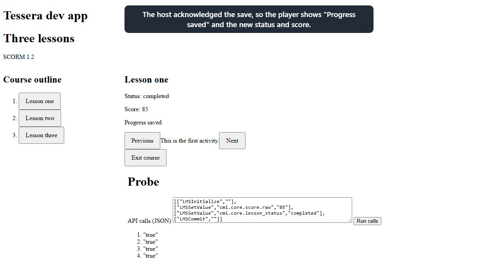

# Demo videos

Silent, captioned recordings of Tessera's executable application, made by driving the real app in Chromium.

## Applications

| Application | Purpose | Status |
|-------------|---------|--------|
| [Dev app](../../src/dev-app/) | Playground that hosts the SCORM player with an example LMS host | Recorded: [`scorm-player-dev-app.webm`](scorm-player-dev-app.webm) |
| `e2e-app` (`src/e2e-app/`) | Host used by the acceptance tests | Excluded: a test harness, not a product application |
| `tools/course-server.mjs` | Serves the isolated course origin the dev app needs | Excluded: supporting tooling, started for the recording |

## scorm-player-dev-app



- Video: [`scorm-player-dev-app.webm`](scorm-player-dev-app.webm), 1:35 (95.2 s), 1280 × 720, 2.1 MB
- Poster: [`scorm-player-dev-app-poster.png`](scorm-player-dev-app-poster.png), a frame decoded from the video at 0:37

| Time | Chapter |
|------|---------|
| 0:04 | 1. Load the course |
| 0:19 | 2. A lesson reports progress |
| 0:46 | 3. Move between lessons |
| 1:07 | 4. Come back to a lesson |
| 1:17 | 5. Leave the course |

Each chapter was asserted while recording: the course title, edition and outline load; the lesson's API calls
return `true` and the player shows status completed, score 85 and "Progress saved" with one save and one outcome
event; Next, Previous and the outline move between lessons with focus on the new heading and a blocked Next on
the last lesson explained in text; the first lesson reads its saved status and score back; Exit reaches the host
as one exit event.

### What the recording shows and what it does not

- The lesson content is the repository's **probe** fixture (`test/fixtures/courses/multi-sco-12`), a page that
  runs the SCORM API calls typed into it. It is not a real course.
- The host is the dev app's in-memory example (`src/components-examples/tessera/scorm-player/`). Saved state lives
  only for the page's lifetime, so "come back to a lesson" is within one session, not a reload.
- Only SCORM 1.2 is implemented. SCORM 2004 courses are recognised and refused; ZIP loading, save failure and
  retry, and the narrow-screen layout exist and are covered by the acceptance tests but are not in this recording.
- **Known behaviour the recording exposes:** the Status and Score panel shows the outcome of the last saved lesson. After moving
  to Lesson two it still reads "completed, 85", which belongs to Lesson one. This is a limitation of the current SCORM 1.2
  outcome rule (it uses the saved activity), not something the video hides.
- The player is unstyled apart from layout, so it looks plain. No screen reader was used; accessibility is only
  covered by automated checks and keyboard tests.

## Rerun

Prerequisites: Node 24, `corepack pnpm install` run once, and Chromium installed for Playwright
(`corepack pnpm exec playwright install chromium`). Ports 4200 and 4300 must be free: the recording refuses to
reuse a server it did not start. Run from the repository root:

```
node demo/run.mjs
```

This starts the dev app (`ng serve dev-app`, port 4200) and the course server (`tools/course-server.mjs`, port
4300, after bundling the wrapper into `dist/wrapper`), records one continuous take with
`demo/playwright.config.ts` and `demo/scorm-player-dev-app.demo.ts`, then decodes the video in Chromium with
`demo/finalize.mjs` (no ffmpeg is required) to measure it, locate the chapter cards, extract the poster, and
publish the files here. Playwright stops both servers when the take ends. Intermediate files, review frames and
traces stay in the ignored `demo/.run/` and `test-results/` folders. The demo needs no credentials or
configuration variables and uses no database.

Pass `--stage-only` to `node demo/run.mjs` to record and inspect without publishing; then run
`node demo/finalize.mjs promote` after reviewing `demo/.run/review/`.

Recording source: [`demo/scorm-player-dev-app.demo.ts`](../../demo/scorm-player-dev-app.demo.ts),
[`demo/narration.ts`](../../demo/narration.ts).
