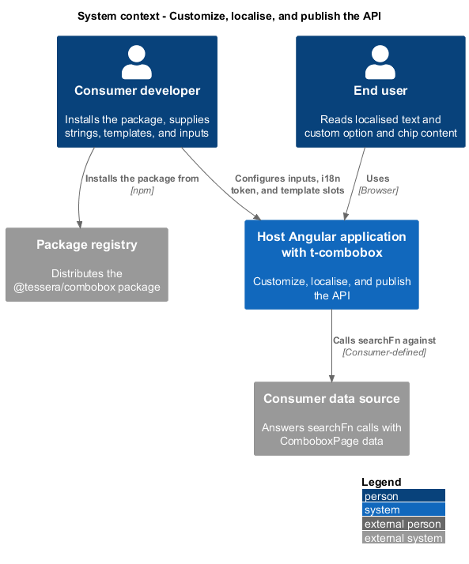
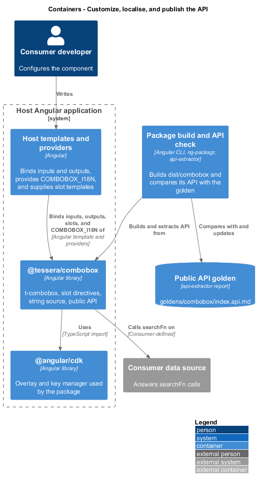
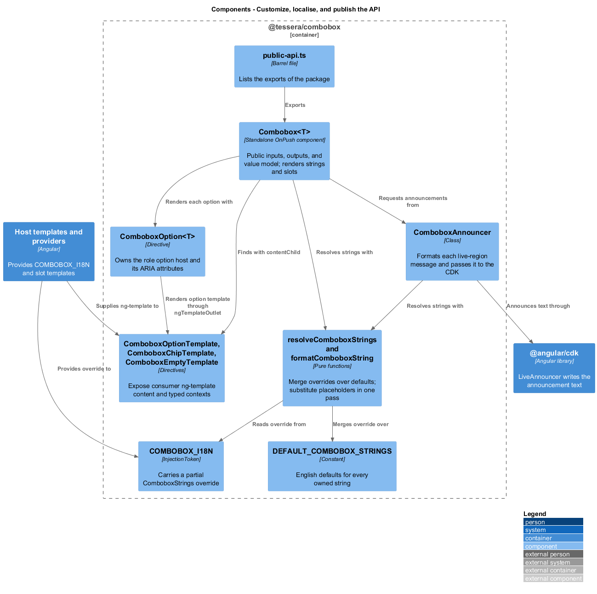
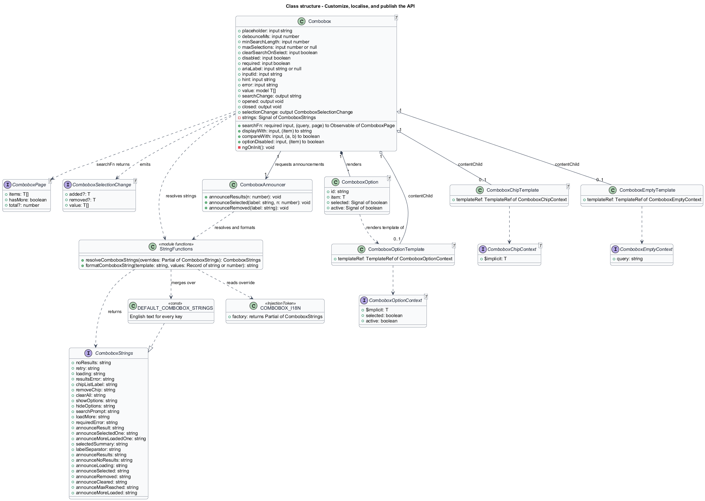
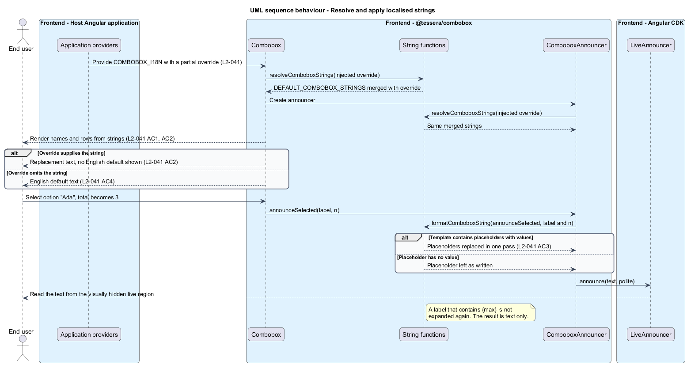
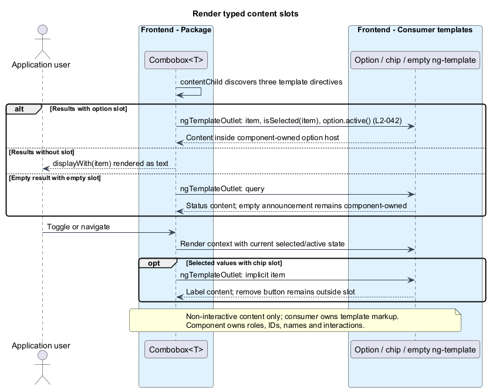

# Customize, localise, and publish the API

## Overview

`t-combobox` is a multi-select form control that searches a consumer-supplied data source. This feature defines how a consuming application adapts the component without changing its source: it replaces text, supplies content for selected parts of the markup, and binds a documented set of inputs and outputs.

**Consumer** — Angular application that hosts `t-combobox` and supplies its data source, label, and customizations

**i18n token** — Angular injection token through which a consumer supplies replacement strings

**String** — user-visible or assistive-technology text the component owns, such as a button name or a live-region message

**Placeholder** — brace-delimited name inside a string, such as `{label}`, that the component replaces with a current value

**Template slot** — named `ng-template` directive through which a consumer supplies content for one part of the component

**Public API** — set of exports, inputs, outputs, and types a consumer may depend on

**API golden** — recorded report of the exported API that a check compares with the built package

Three constraints shape the design. Every owned string is replaceable, so no consumer forks the component to translate it. Slots replace content only, so no consumer template changes the roles and ARIA attributes the component sets. The public surface is small, typed, and guarded by a golden, so an accidental change fails a check.

The feature belongs to the combobox subsystem and refines `L1-016`. It supplies the string source that [Expose state to assistive technology](../expose-to-assistive-tech/) and [Select values](../select-values/) read, and it publishes the types that [Search options](../search-options/) and [Integrate with forms](../integrate-forms/) define.

## Description

**Localisable strings**

- `ComboboxStrings` is an interface with one `string` property for every string the component owns. `DEFAULT_COMBOBOX_STRINGS` is a constant of that type holding the English defaults.
- `COMBOBOX_I18N` is an `InjectionToken<Partial<ComboboxStrings>>` whose default factory returns `{}`. A consumer overrides any subset with `{ provide: COMBOBOX_I18N, useValue: { ... } }` at application, route, or component level.
- `resolveComboboxStrings(overrides)` returns `{ ...DEFAULT_COMBOBOX_STRINGS, ...overrides }`. `Combobox<T>` and `ComboboxAnnouncer` each call it with the injected token, so an override of one string leaves every other string at its default (`L2-041` AC4).
- `formatComboboxString(template, values)` replaces each `{name}` found in `values` with `String(values[name])` in one pass. A substituted value is never scanned again, so a label that contains `{max}` stays literal. A placeholder without a value stays as written. The result is a plain string, never markup.
- The `Combobox<T>` template reads every visible string and accessible name from a `strings` computed signal. `ComboboxAnnouncer` reads every live-region message from an identically resolved object, so `L2-036` messages and `L2-035` names share one source.
- String overrides resolve once per instance. A locale change recreates the component with new providers; live locale mutation is outside v1. The host retains its value before recreation.
- The component owns no string outside `ComboboxStrings`. Consumer-supplied text, namely `placeholder`, `hint`, `error`, and the output of `displayWith`, is not a component string and is not translated by the component.

| Key | English default | Placeholders | Used for |
|-----|-----------------|--------------|----------|
| `noResults` | No results | none | Empty row text |
| `retry` | Retry | none | Retry button name in the error row |
| `loading` | Loading | none | Loading row text |
| `resultsError` | Results could not be loaded. | none | Error row text and assertive failure announcement, using the same key |
| `chipListLabel` | Selected values | none | Accessible name of the chip list |
| `removeChip` | Remove {label} | `{label}` | Chip remove button name |
| `clearAll` | Clear all selections | none | Clear-all button name |
| `showOptions` | Show options | none | Closed toggle name |
| `hideOptions` | Hide options | none | Open toggle name |
| `searchPrompt` | Type at least {min} characters to search. | `{min}` | Below-minimum query |
| `loadMore` | Load more results | none | Paging action |
| `requiredError` | Select at least one option. | none | Required empty value without supplied error |
| `announceResult` | 1 result available. | none | Singular first-page result |
| `announceSelectedOne` | {label} selected. 1 selected in total. | `{label}` | Singular selection total |
| `announceMoreLoadedOne` | 1 more result loaded. | none | Singular appended result |
| `selectedSummary` | {n} selected: {labels} | `{n}`, `{labels}` | Hidden selected-values summary |
| `labelSeparator` | `", "` | none | Joins labels inside `{labels}` |
| `announceResults` | {n} results available. | `{n}` | Search completed with results |
| `announceNoResults` | No results found. | none | Search completed with none |
| `announceLoading` | Loading results. | none | Request still running after 1 s |
| `announceSelected` | {label} selected. {n} selected in total. | `{label}`, `{n}` | Option selected |
| `announceRemoved` | {label} removed. | `{label}` | Option deselected, chip removed, or Backspace removal |
| `announceCleared` | All selections cleared. | none | Clear-all |
| `announceMaxReached` | Maximum of {max} selections reached. | `{max}` | Limit reached |
| `announceMoreLoaded` | {n} more results loaded. | `{n}` | Next page appended |

These keys settle the sibling designs' owned strings. requiredError is used only for an empty required value without a supplied error input. Consumer error text stays consumer-owned.

A count of 1 selects the singular result, selected-total, or appended-result key; other counts select the existing plural key. Partial overrides can replace either independently. Locales with additional grammatical cases can replace the message through their consumer labels or provide already formatted strings by recreating the instance. v1 does not introduce ICU parsing.

**Template slots**

- `ComboboxOptionTemplate`, `ComboboxChipTemplate`, and `ComboboxEmptyTemplate` are directives with selectors `ng-template[tComboboxOption]`, `ng-template[tComboboxChip]`, and `ng-template[tComboboxEmpty]`. Each injects its `TemplateRef` and holds nothing else. Each declares `ngTemplateContextGuard` so consumer templates type-check.
- `ComboboxOptionContext<T>` carries `$implicit: T`, `selected: boolean`, and `active: boolean`. `ComboboxChipContext<T>` carries `$implicit: T`. `ComboboxEmptyContext` carries `query: string`.
- `Combobox<T>` finds each slot with `contentChild`. Each `ComboboxOption<T>` host renders the option template through `ngTemplateOutlet` with a `computed()` context that is rebuilt when the item, its selected state, or the active index changes, so `selected` and `active` stay current (`L2-042` AC1).
- The component owns the `li role="option"` host, its `id`, `aria-selected`, `aria-disabled`, and the decorative checkbox. The template output sits in a content wrapper inside that host. A consumer template cannot reach the host attributes (`L2-035` AC9).
- A chip renders its template inside a label wrapper. The remove button, its `Remove {label}` name, and its keyboard handling stay in the component, outside the template content (`L2-042` AC2).
- The status row renders `ComboboxEmptyTemplate` with `{ query }` set to the current query. `ComboboxAnnouncer` still announces `announceNoResults`, because the announcement does not depend on the row content (`L2-042` AC3).
- Without a slot, options and chips render `displayWith(item)` as text (`L2-042` AC4).
- The component adds no interactive element around template content and no duplicate landmark or role. Consumer templates shall contain non-interactive content only; nested controls, links, conflicting roles, and handlers that replace the interaction model are unsupported. The nine-state axe run in [Verify and document](../verify-and-document/) includes a custom-templates state (`L2-042` AC5).

**Public API and package**

- `Combobox<T>` is a standalone component with selector `t-combobox`. Its inputs use the signal `input()` function, its outputs use `output()`, and its model uses `model<T[]>([])`.
- `searchFn` is input.required. Reading it during ngOnInit with no supplied value raises Angular NG0950; the package documents that code rather than promising a custom error that cannot run before the required signal throws. Strict template compilation catches missing required inputs earlier. Configuration numbers are validated as defined in L2-043.

| Input | Type | Default |
|-------|------|---------|
| `searchFn` | `(query: string, page: number) => Observable<ComboboxPage<T>>` | required |
| `displayWith` | `(item: T) => string` | `String` |
| `compareWith` | `(a: T, b: T) => boolean` | `Object.is` |
| `optionDisabled` | `(item: T) => boolean` | `() => false` |
| `placeholder` | `string` | `''` |
| `debounceMs` | `number` | `300` |
| `minSearchLength` | `number` | `1` |
| `maxSelections` | `number \| null` | `null` |
| `clearSearchOnSelect` | `boolean` | `false` |
| `disabled` | `boolean` | `false` |
| `required` | `boolean` | `false` |
| `ariaLabel` | `string \| null` | `null` |
| `inputId` | `string` | Generated per-instance input id |
| `hint` | `string` | `''` |
| `error` | `string` | `''`; requiredError fallback for an empty required value |

- The outputs are `searchChange` (`string`), `opened` and `closed` (`void`), and `selectionChange` (`ComboboxSelectionChange<T>`). Their emission rules belong to `L2-022`, `L2-026`, and `L2-029` and are unchanged here (`L2-043` AC2).
- `ComboboxPage<T>` has `items: T[]`, `hasMore: boolean`, and optional `total: number`. A host `searchFn` returning `Observable<ComboboxPage<MyItem>>` type-checks against it (`L2-043` AC3).
- `public-api.ts` exports `Combobox`, the three slot directives, the three context types, `COMBOBOX_I18N`, `ComboboxStrings`, `DEFAULT_COMBOBOX_STRINGS`, `ComboboxPage`, `ComboboxSelectionChange`, and `ComboboxHarness`. `ComboboxOption`, `ComboboxSearch`, `ComboboxPopup`, `ComboboxAnnouncer`, and `COMBOBOX_PARENT` stay internal. `index.ts` re-exports `public-api.ts`. The package has no secondary entry point.
- `src/combobox/package.json` names the package `@tessera/combobox`, sets `sideEffects: false`, and declares peer dependencies on `@angular/core`, `@angular/common`, `@angular/forms`, `@angular/cdk`, and `rxjs`. `src/combobox/ng-package.json` sets `dest` to `../../dist/combobox` relative to ng-package.json and `lib.entryFile` to `index.ts`, as for `scorm-player`. The root `package.json` adds `@angular/cdk`, which the workspace does not yet depend on.
- CDK OverlayContainer loads its structural styles through its style loader ([upstream source](https://github.com/angular/components/blob/main/src/cdk/overlay/overlay-container.ts)). The packed-package smoke check verifies that the pinned CDK does this too; the package uses public CDK APIs and does not import its private loader.
- The selector remains `t-combobox` as specified. Existing `tsr-` selectors are unchanged; convergence is outside this feature.
- The API golden is `goldens/combobox/index.api.md`. A second api-extractor configuration under `tools/public_api_guard/` points at `dist/combobox`, and the `api:update` and `api:check` scripts cover both packages. `api:check` fails when the built API differs from the golden (`L2-043` AC6).
- A separate browser-only Angular smoke application installs the built ng-packagr tarball, with matching Angular/CDK peers. It imports the entry point, binds a FormControl, searchFn, and label, and uses no repo path alias or manual stylesheet setup. Chromium verifies behavior and axe. A workspace example build alone does not satisfy L2-043 criterion 5.

Production work follows `AGENTS.md`. Each slice starts from one Given-When-Then criterion and a failing Playwright test through `ComboboxDemoPage`. The first slices are: default strings, one replaced string, placeholder substitution, partial override, each slot, the missing `searchFn` error, and the golden check. No test asserts code structure.

## Requirements

Source: [L2 detailed requirements](../../../specs/L2.md). The table quotes source wording exactly, including its use of `must`.

| L2 ID | Refines (L1) | Requirement |
|-------|--------------|-------------|
| `L2-041` | `L1-016` | Every user-visible and assistive-technology string the component owns, including live-region messages and button names, must come from an injectable i18n token with English defaults, so a consumer can localise them without forking the component. |
| `L2-042` | `L1-016` | The component must accept `ng-template` slots for custom option content (`tComboboxOption`), chip content (`tComboboxChip`), and the empty state (`tComboboxEmpty`). Templates supply content only; the component owns the host elements and their ARIA attributes. |
| `L2-043` | `L1-016` | The component must be consumable as the standalone `@tessera/combobox` Angular package with the documented inputs, outputs, and types below, in addition to the `value` model. |

## Diagrams

The context view places the component between the consumer developer, the end user, and the consumer's data source. The package registry delivers the package to the consumer.

The container view shows the consumer's providers and templates feeding `@tessera/combobox`, and the build chain that checks the API golden.

The component view shows the string source, the three slot directives, and the public API file inside the package. `Combobox<T>` and `ComboboxAnnouncer` resolve `ComboboxStrings` through the same function.

The class view records the strings contract, the slot directives and contexts, and the public inputs and outputs of `Combobox<T>`.

A partial override resolves against the defaults once. Each announcement then substitutes its placeholders from current values.

Slot content renders inside component-owned hosts. The context updates as selection and active state change.

