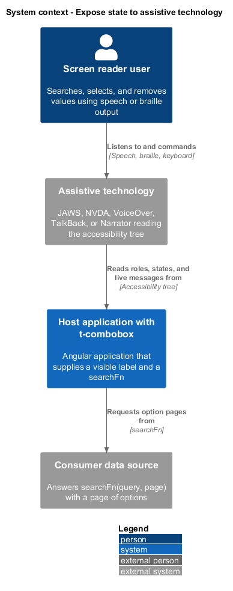
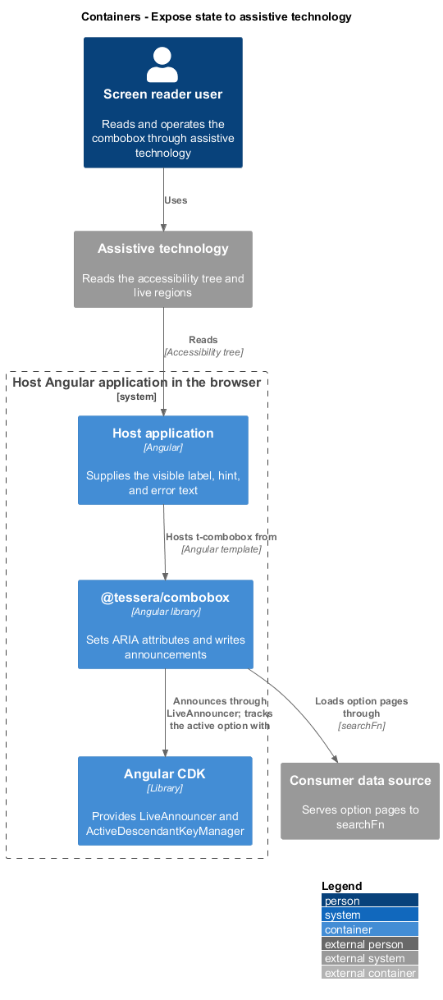
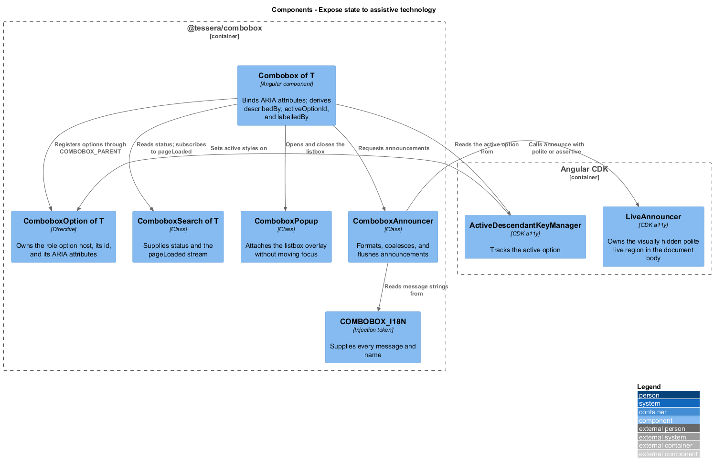
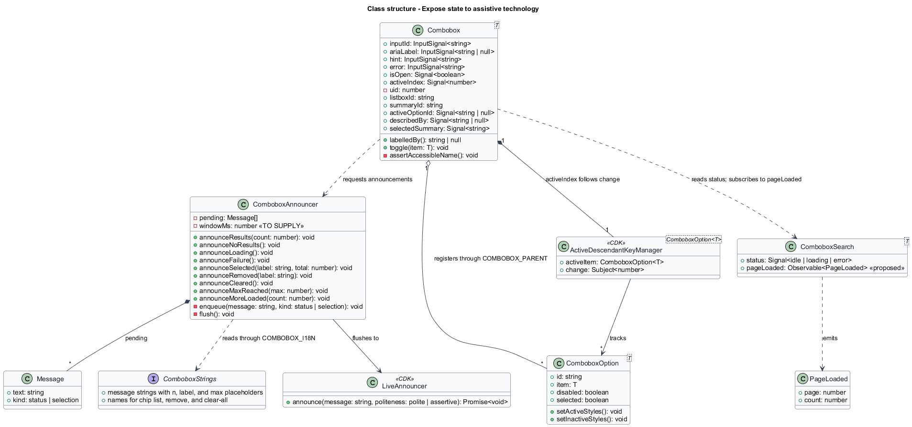
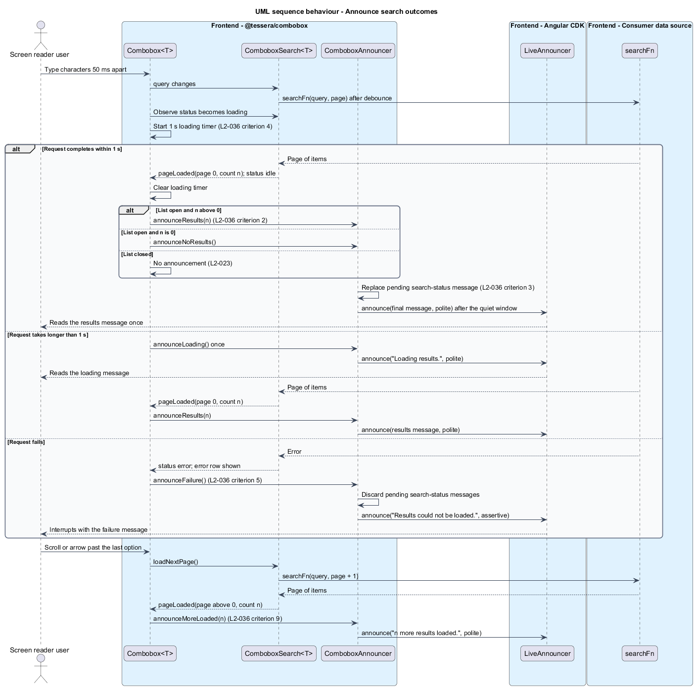
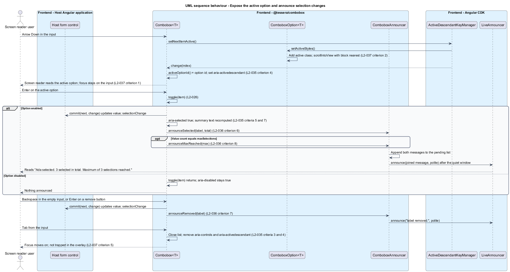

# Expose state to assistive technology

## Overview

`t-combobox` is a form control that lets a user search a data source by typing, select multiple results from a popup list, and see each selection as a removable chip. Screen reader users receive the same information as sighted users only if the component exposes its structure, state, and changes in a form that assistive technology reads. This feature specifies that exposure.

**Assistive technology** — software that adapts a user interface for a person with a disability, such as a screen reader

**Accessibility tree** — browser representation of the page that assistive technology reads, built from elements, roles, and ARIA attributes

**ARIA attribute** — markup attribute from the WAI-ARIA specification that adds role, state, or property information to an element

**Live region** — visually hidden element whose text changes assistive technology reads aloud without moving focus

**Active descendant** — option that the input names through `aria-activedescendant` while DOM focus stays on the input

The feature covers three concerns. The first is the roles, states, and properties that follow the WAI-ARIA 1.2 combobox pattern (`L2-035`). The second is the messages the component writes to a live region (`L2-036`). The third is the focus rules that keep DOM focus on the input and keep the active option visible (`L2-037`). The consuming application supplies a visible label. The component supplies everything else, and the component owns the `role="option"` host so that a consumer template cannot break the pattern.

Key handling, searching, selection state, and visual styling belong to sibling features. They appear here as the sources of the state this feature exposes.

## Description

The slice adds ARIA bindings to `Combobox<T>` and `ComboboxOption<T>`, an announcement policy to `ComboboxAnnouncer`, and focus rules to the input, the option, and the popup.

- `Combobox<T>` binds the ARIA attributes of the input, the listbox, the chip list, and the buttons in its template. Derived values use `computed()`: `activeOptionId`, `describedBy`, `selectedSummary`, and `labelledBy`. Identifiers come from `ComboboxIds` ([Secure and perform](../secure-and-perform/)), so every id has the form `t-combobox-{uid}-{part}`, is created once per instance, and never derives from item data (`L2-044`).
- `ComboboxOption<T>` owns the option host element. It sets its attributes through directive `host` metadata. A consumer template renders inside the host through `ngTemplateOutlet` and has no access to the host's attributes (`L2-035` criterion 9).
- `ComboboxAnnouncer` wraps the CDK `LiveAnnouncer`, reads every message from the resolved `COMBOBOX_I18N` strings, and coalesces messages. The CDK service creates its visually hidden `aria-live="polite"` element in `document.body`, outside the overlay container, when the service is first injected. `Combobox<T>` injects `ComboboxAnnouncer` in its constructor, so the region exists before any message is written (`L2-036` criterion 1). The element is shared with every other user of `LiveAnnouncer` in the application, which keeps the count at one region.
- `ComboboxSearch<T>` supplies `status`. This feature proposes one addition to its surface in [Search options](../search-options/): the observable `pageLoaded`, which emits `{ page, count }` once for each response that belongs to the current query. `count` is the length of that page's `items`. Outdated responses never emit (`L2-023`). `Combobox<T>` subscribes with `takeUntilDestroyed`.
- `ActiveDescendantKeyManager<ComboboxOption<T>>` tracks the active option. Its `change` stream drives `activeIndex`, which `activeOptionId` reads.

**Input.**

| Attribute | Binding |
|-----------|---------|
| `role` | `combobox` |
| `aria-autocomplete` | `list` |
| `autocomplete` | `off` |
| `aria-expanded` | `"true"` while `isOpen()`, otherwise `"false"` |
| `id` | The `inputId` input; a generated `t-combobox-{uid}-input` when absent |
| `aria-label` | The `ariaLabel` input, present only when it is non-empty |
| `aria-controls` | The listbox id, present only while the listbox is rendered |
| `aria-activedescendant` | `activeOptionId()`, which is the active option's id while the list is open, and absent when no option is active or the list is closed |
| `aria-describedby` | `describedBy()`: the hint id, the error id while the error is shown, and the summary id while at least one value is selected |

The visible name comes from the consumer's `<label for>` and the `inputId` input. Without a visible label and without `ariaLabel`, the component reports a development-time error. The check runs once in `afterNextRender` when `isDevMode()` is true. It looks for a `label[for]` that matches the input id in the host's root node. It logs a documented message through `console.error` and never throws, so a missing label cannot break a running page. The message wording and its documentation page are `<TO SUPPLY>` in [Verify and document](../verify-and-document/).

The summary is a visually hidden element with a generated id. Its text comes from the `selectedSummary` string, which takes the count and the labels joined by `labelSeparator`, for example "3 selected: Ada, Grace, Linus". Each label is `displayWith(item)` written as text. The element is not rendered while no value is selected, so `describedBy()` omits its id. The input therefore announces the summary when it receives focus (`L2-036` criterion 10). The hint and error elements, and the `aria-required` and `aria-invalid` attributes, follow [Integrate with forms](../integrate-forms/).

**Listbox, options, and chips.**

| Element | Attributes |
|---------|------------|
| Listbox (`ul`) | `role="listbox"`, `aria-multiselectable="true"`, `aria-busy="true"` only while `search.status()` is `loading`, and a name from the visible label |
| Option host (`li`) | `role="option"`, generated `id`, `aria-selected` of `"true"` or `"false"` on every option, `aria-disabled="true"` only when disabled |
| Decorative checkbox | `aria-hidden="true"`, inside the option host before the consumer content |
| Chip list (`ul`) | `aria-label` from `chipListLabel`, default "Selected values"; rendered only while a value exists |
| Chip remove button | Name "Remove {label}" from `removeChip` through `aria-label`, with `{label}` replaced by `displayWith(item)` |
| Clear-all button | Name "Clear all selections" from `clearAll` |
| Toggle button | `tabindex="-1"`; name from `toggleList`, whose default is `<TO SUPPLY>` in [Customize, localise, and publish the API](../customize-and-localise/) |

The listbox name uses `aria-labelledby`. `Combobox<T>.labelledBy()` finds the `label[for]` element on each open. If that element has no id, the component assigns a generated one. When no visible label exists, the listbox takes the `ariaLabel` text through `aria-label`. The component writes the id only when it is missing, and it never rewrites a consumer's id.

The option id comes from `ComboboxIds.nextOptionId()`, which the directive calls once in its constructor through the `COMBOBOX_PARENT` token. The counter never reuses a value, so an id stays unique and stable for as long as its option element exists. Disabled options carry `aria-disabled="true"` and remain in the key manager's item list, so Arrow keys reach them. They cannot be selected, because `Combobox<T>.toggle(item)` returns for a disabled option ([Select values](../select-values/)). The status rows have no `role="option"` and register no `ComboboxOption`.

**Live announcements.** `ComboboxAnnouncer` exposes one method per message and reads its text from the resolved strings whose keys [Customize, localise, and publish the API](../customize-and-localise/) defines. Placeholders `{n}`, `{label}`, and `{max}` are replaced from current values.

| Event | Default message and key | Raised by | Politeness |
|-------|-----------------|-----------|------------|
| First page with items | "{n} results available." (`announceResults`) | `pageLoaded` with `page` 0 and `count` above 0, while the list is open | polite |
| First page without items | "No results found." (`announceNoResults`) | `pageLoaded` with `page` 0 and `count` 0, while the list is open | polite |
| Request longer than 1 second | "Loading results." (`announceLoading`) | A 1 s timer started when `status` becomes `loading` | polite |
| Request failed | "Results could not be loaded." (`resultsError`) | `status` becomes `error`, while the list is open | assertive |
| Option selected | "{label} selected. {n} selected in total." (`announceSelected`) | `commit` after adding a value | polite |
| Option or chip removed | "{label} removed." (`announceRemoved`) | `commit` after removing a value, from `toggle`, `removeChip`, or Backspace | polite |
| Clear-all | "All selections cleared." (`announceCleared`) | `commit` from `clearAll` | polite |
| Limit reached | "Maximum of {max} selections reached." (`announceMaxReached`) | `commit` when the new value count equals `maxSelections`, and each time the list opens while the limit holds ([Select values](../select-values/)) | polite |
| Next page appended | "{n} more results loaded." (`announceMoreLoaded`) | `pageLoaded` with `page` above 0 and `count` above 0, while the list is open | polite |

Rules for the table:

- `{n}` for results is `count` of the first page. `{n}` for the selection total is `value().length` after the change.
- The loading timer is cleared when `status` leaves `loading`, when the list closes, and when the component is destroyed. A request that completes within 1 s therefore produces no loading message. One loading period produces at most one message, even when consecutive requests keep `status` at `loading`.
- Only user actions raise selection messages. A programmatic write to `value` raises none, which matches the rule that it does not emit `selectionChange` (`L2-026`).
- A response that arrives while the list is closed raises no results message (`L2-023`).

**Coalescing.** The CDK `LiveAnnouncer` replaces its text on each call, so two calls in quick succession would lose the first message. `ComboboxAnnouncer` therefore holds a pending list and flushes it after a quiet window. The window length is `<TO SUPPLY>` and is the open decision named in the subsystem page. Two message classes follow different rules:

- A search-status message (results, no results, loading, more results) replaces any pending search-status message. Rapid typing therefore yields one results message for the final results (`L2-036` criterion 3). The search debounce and `switchMap` already deliver only the final results, and this rule is a second guard.
- A selection message (selected, removed, cleared, limit reached) is appended to the pending list. Selecting the last allowed option raises "Ada selected. 3 selected in total." and "Maximum of 3 selections reached." in one window, and the flush joins both in arrival order with a space. An identical pending message is not added twice. This rule settles how the limit message coalesces with the selection message, which [Select values](../select-values/) leaves to this feature.
- The assertive failure message flushes at once, discards pending search-status messages, and calls `announce(message, 'assertive')`.

All text reaches the region through `textContent`, so a label that contains markup appears as literal text (`L2-044`).

**Focus management.**

- DOM focus never leaves the input during option navigation, selection, opening, or closing. Options and status rows are not focusable and have no `tabindex`. The Retry button in the error row has `tabindex="-1"`, because Tab closes the list and keyboard users retry with Enter. `ComboboxPopup` never calls `focus()`, and no focus-trap directive is attached (`L2-037` criteria 1 and 5).
- The listbox panel and its options call `preventDefault()` on `mousedown`, so a pointer press does not move focus. [Present the component accessibly](../present-accessibly/) owns the pointer handlers. This feature requires only that no pointer path moves focus off the input.
- The overlay carries no `aria-modal`, and Tab from the input closes the list and follows the browser's order, as specified in [Operate by keyboard](../operate-by-keyboard/).
- `ComboboxOption.setActiveStyles()` adds the active class and scrolls the option into view. It calls `scrollIntoView({ block: 'nearest' })` on the host, so the list scrolls only when the option lies outside the visible area. The overlay container is fixed-positioned, so the call does not scroll the page. The listbox sets no `scroll-behavior`, so scrolling is instant under every motion preference (`L2-037` criterion 2).
- The active, selected, and hover treatments use three separate hooks: the active class from `setActiveStyles()`, the `aria-selected` attribute with the checkmark, and the `:hover` pseudo-class. Hover does not change the active option. [Present the component accessibly](../present-accessibly/) assigns the visual cues (`L2-037` criterion 4).
- The field wrapper shows the focus indicator through `:focus-within`, and the chip remove buttons and clear-all show it through `:focus-visible`. The colors and the 3:1 contrast are theme tokens, `<TO SUPPLY>` in the same feature (`L2-037` criterion 3).

**Acceptance criteria coverage.**

| Criterion | Where the design satisfies it |
|-----------|-------------------------------|
| `L2-035` 1 | Input table; the `inputId` and `ariaLabel` rules |
| `L2-035` 2 | Development-time check in `afterNextRender` |
| `L2-035` 3, 4 | `aria-controls` and `aria-activedescendant` rows |
| `L2-035` 5 | `describedBy()` and the summary element |
| `L2-035` 6 | Listbox row; `labelledBy()` |
| `L2-035` 7 | Option rows; `ComboboxIds.nextOptionId()`; `aria-disabled`; disabled options not skipped |
| `L2-035` 8 | Chip list, remove button, and clear-all rows |
| `L2-035` 9 | Option host `host` metadata; `ngTemplateOutlet` |
| `L2-036` 1 | `LiveAnnouncer` element created on injection |
| `L2-036` 2, 9 | `pageLoaded` rows of the announcement table |
| `L2-036` 3 | Search-status replacement rule |
| `L2-036` 4 | 1 s loading timer |
| `L2-036` 5 | Assertive failure message |
| `L2-036` 6, 7, 8 | Selection messages raised by `commit`; appending rule |
| `L2-036` 10 | Summary through `aria-describedby` |
| `L2-037` 1, 5 | Focus rules; `tabindex="-1"` on Retry; no focus trap |
| `L2-037` 2 | `setActiveStyles()` scroll rule |
| `L2-037` 3, 4 | Focus indicator hooks and the three state hooks |

Open points. Plural handling for "{n} results available." is `<TO SUPPLY>` in [Customize, localise, and publish the API](../customize-and-localise/). The requirements name no accessible name for the toggle button, which the same page leaves open. The behavior on a screen reader inside a modal dialog host, which sets `aria-hidden` on other page content, belongs to the manual scripts in [Verify and document](../verify-and-document/).

## Requirements

Source: [L2 detailed requirements](../../../specs/L2.md). The table quotes source wording exactly, including its use of `must`.

| L2 ID | Refines (L1) | Requirement |
|-------|--------------|-------------|
| `L2-035` | `L1-014` | The input, listbox, options, chips, and buttons must expose the roles, states, and properties of the WAI-ARIA 1.2 combobox pattern, and the component must own the `role="option"` host so consumers cannot break the pattern. |
| `L2-036` | `L1-014` | The component must announce changes through a single visually hidden polite live region that exists in the DOM before any message is written, and lives outside the overlay. Announcements must be debounced so rapid typing does not flood the queue. |
| `L2-037` | `L1-014` | DOM focus must stay on the input while the user navigates options, the active option must be scrolled into view, and every focusable control must show a visible, high-contrast focus indicator. |

## Diagrams

The context view shows the screen reader user, the host application with `t-combobox`, the data source behind `searchFn`, and the assistive technology that reads the accessibility tree.

The container view places `@tessera/combobox` and Angular CDK in the host application. The CDK supplies the live announcer and the active-descendant key manager.

The component view shows which parts write ARIA state and which parts raise announcements. `ComboboxAnnouncer` is the only writer to the live announcer.

The class view records the derived ARIA values on `Combobox<T>`, the announcer's messages, and the proposed `pageLoaded` stream.

The first sequence follows a search from typing to the polite results message, including the delayed loading message, the assertive failure message, and the silent cases.

The second sequence follows the active option and a selection. It shows `aria-activedescendant`, the scroll into view, the joined selection and limit messages, and the unchanged focus.

