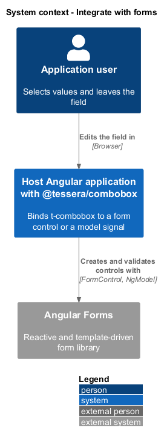
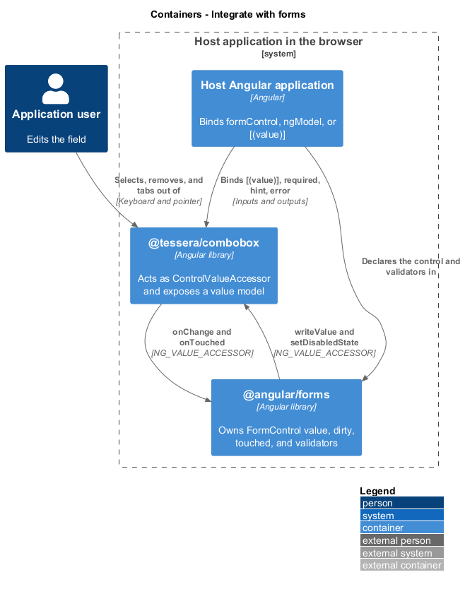
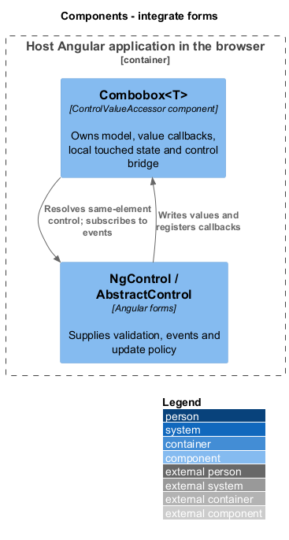
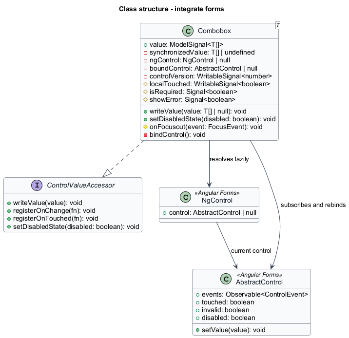
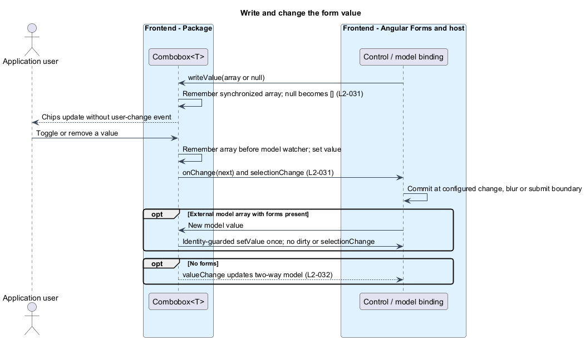
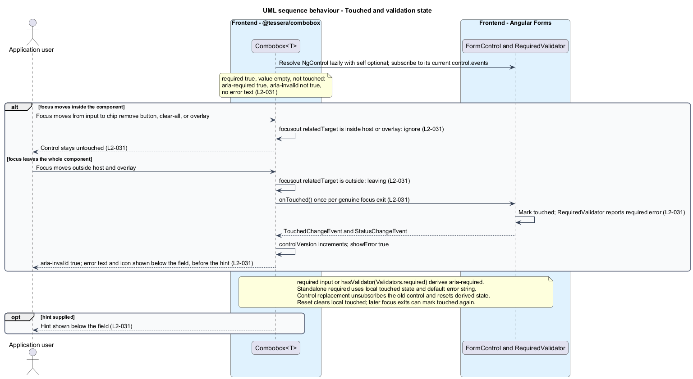

# Integrate with forms

## Overview

`t-combobox` is a form control. An application binds it to an Angular form control and reads a `T[]` value, a disabled state, a touched state, and validation errors, as it would for a native input. An application that does not use Angular forms binds a signal instead.

**ControlValueAccessor** — Angular interface that connects a custom component to a form control through `writeValue`, `registerOnChange`, `registerOnTouched`, and `setDisabledState`

**Touched** — control state that records the user has visited the field and left it

**Dirty** — control state that records the user has changed the value

**Invalid** — control state in which at least one validator reports an error

**Model binding** — two-way `[(value)]` binding of a signal to the component's `value` model

This feature owns the contract between `Combobox<T>` and Angular forms. The contract covers writing a value in, reporting a change out, disabling, marking touched when focus leaves the whole component, the `required` validation, and the hint and error text. The selection logic that produces a change belongs to [Select values](../select-values/).

## Description

The slice lives in `Combobox<T>`. It adds no new class. Angular Forms and the host application supply the control side.

### Registration

`Combobox<T>` provides itself under `NG_VALUE_ACCESSOR` with `useExisting` and `forwardRef`. A constructor injection of `NgControl` would form a cycle with that provider, so the component obtains the control lazily with `Injector.get(NgControl, null, { self: true, optional: true })` in `ngOnInit`. The result is `null` when the application uses no Angular forms. `onChange` and `onTouched` default to no-op functions until Angular registers real ones, so the component works without a control.

### ControlValueAccessor methods

| Method | Behavior |
|--------|----------|
| `writeValue(value)` | Sets `value` to `value ?? []`. An array renders as chips. `null` becomes `[]`, and no chip renders. It never calls `onChange`, so a write from the control cannot echo back. It does not emit `selectionChange` |
| `registerOnChange(fn)` | Stores `fn` as `onChange` |
| `registerOnTouched(fn)` | Stores `fn` as `onTouched` |
| `setDisabledState(isDisabled)` | Sets the `formDisabled` signal |

`commit(next, change)` from [Select values](../select-values/) calls `onChange(next)` once per user change. Angular then sets the control value to the new `T[]`, emits `valueChanges` once, and marks the control dirty. A programmatic write marks nothing dirty because `writeValue` bypasses `commit`.

### Disabled state

`isDisabled` is a `computed()` that is true when the `disabled` input or `formDisabled` is true. `FormControl.disable()` and `setDisabledState(true)` set `formDisabled` to true; `enable()` and `setDisabledState(false)` set it to false.

- The template binds `[disabled]="isDisabled()"` on the input, on every chip remove button, on clear-all, and on the toggle button.
- An effect on `isDisabled()` calls `close()`, which [Open and position the list](../open-and-position-list/) defines, and `ComboboxSearch<T>.cancel()`, which [Search options](../search-options/) defines.
- `toggle`, `removeChip`, and `clearAll` return without effect while `isDisabled()` is true, so no interaction changes the value.
- Because the controls bind to a computed signal, re-enabling makes the input and buttons operable again on the next render.

### Touched

The host element listens for `focusout`, and `ComboboxPopup` routes `focusout` from the overlay pane to the same handler. The handler reads `event.relatedTarget`.

- When `relatedTarget` lies inside the host element or inside the overlay pane, focus moved within the component. The handler does nothing. Moves from the input to a chip remove button, to clear-all, or into the overlay therefore do not mark the control touched.
- Otherwise focus left the whole component, and the handler calls `onTouched()` once. A `null` `relatedTarget`, such as a click on a non-focusable area, counts as leaving.

Option and Retry mouse presses prevent a default focus change; their click handlers retain input focus. Chip removal focuses a surviving destination before the tracked chip is removed. Touched is reported once per genuine exit, not once forever: resets and `updateOn: blur` still receive later exits. Both host and popup route focusout through this boundary check.

### Required and invalid state

`required` is a boolean input. With forms, Angular RequiredValidator or Validators.required supplies the empty-array error. `isRequired` is true when the input is true or the control has Validators.required. Without forms, required and an empty value supply local invalid state; local touched state records genuine exits. aria-required follows isRequired, using the public [AbstractControl.hasValidator API](https://angular.dev/api/forms/AbstractControl#hasValidator).

Signals do not observe AbstractControl state. When the same-element NgControl reports a different control instance, the bridge unsubscribes the old control and subscribes to the new control.events. Rebinding refreshes a controlVersion signal and disabled, touched, and invalid state. An after-render check detects identity replacement; control.events detects resets and validator changes. showError reads that signal and control state, or local required/touched state without forms. A form reset clears touched state; host-only model writes do not mark touched.

| Control state | `aria-invalid` | Error text |
|---------------|----------------|------------|
| `required`, value `[]`, not touched | not `"true"` | hidden |
| `required`, value `[]`, touched | `"true"` | shown |
| valid, any touched state | not `"true"` | hidden |

### Hint and error text

`hint` and `error` default to empty strings. A non-empty hint renders below the field. While showError is true, supplied error text renders; an empty required value with no supplied text uses the i18n requiredError default. Other validator errors need consumer error text. Hint and rendered error ids feed aria-describedby.

### Model binding without forms

`value` is `model<T[]>([])`. With `[(value)]="selected"`:

- The initial signal value renders as chips.
- A user selection or chip removal calls `commit`, which sets `value`, and the binding updates the host signal.
- A host write of a new array updates the chips and does not emit `selectionChange`, because only `commit` emits it.
- With both a form control and `[(value)]`, the latest external write determines the value. writeValue updates the model without onChange. An external model array write calls control.setValue(next) once, without dirty state or selectionChange. An identity guard records the synchronized array and prevents echoes. User commit calls onChange once and records the synchronized array before the model watcher runs. Hosts supply new arrays rather than mutating an array in place.

### Test support

`ComboboxHarness` exposes the disabled state, the chips, and the error text to consumer tests. Acceptance tests bind a `FormControl`, a `ngModel`, and a `[(value)]` signal in turn, and they use `ComboboxDemoPage` for every selector.

## Requirements

Source: [L2 detailed requirements](../../../specs/L2.md). The table quotes the source wording exactly, including its modal verb.

| L2 ID | Refines (L1) | Requirement |
|-------|--------------|-------------|
| `L2-031` | `L1-012` | The component must implement `ControlValueAccessor` with a `T[]` value so that it works with Angular reactive and template-driven forms. `onTouched` must fire only when focus leaves the whole component. The component must support `required` and reflect the control's invalid state once touched. |
| `L2-032` | `L1-012` | The component must be usable without Angular forms through a two-way `[(value)]` model binding of type `T[]` with default `[]`. |

## Diagrams

The context view shows the host application connecting the combobox to Angular Forms or to a signal.

The container view shows `@tessera/combobox` exchanging value, disabled, and touched state with `@angular/forms` inside the host application.

The component view shows the accessor methods, the control bridge, and the model binding inside `Combobox<T>`, and the form control on the other side.

The class view records the accessor contract, the disabled and error signals, and the model.

A form control writes a value in and receives each user change. A model binding exchanges the same value without forms.

Focus moves inside the component leave the control untouched. Focus leaving the component marks it touched and reveals the required error.

