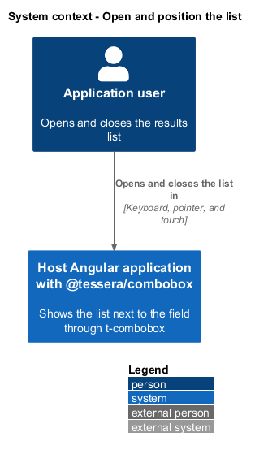
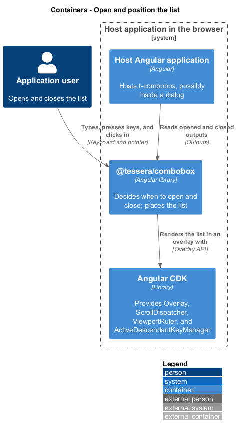
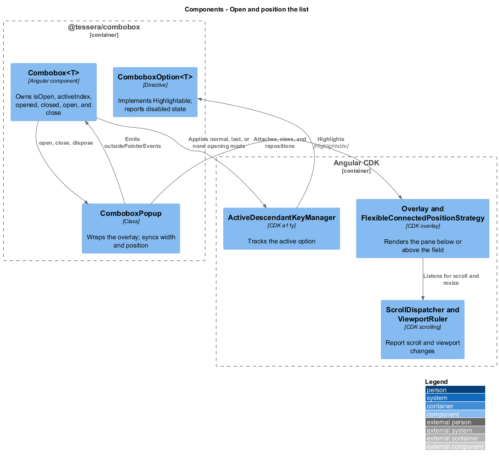
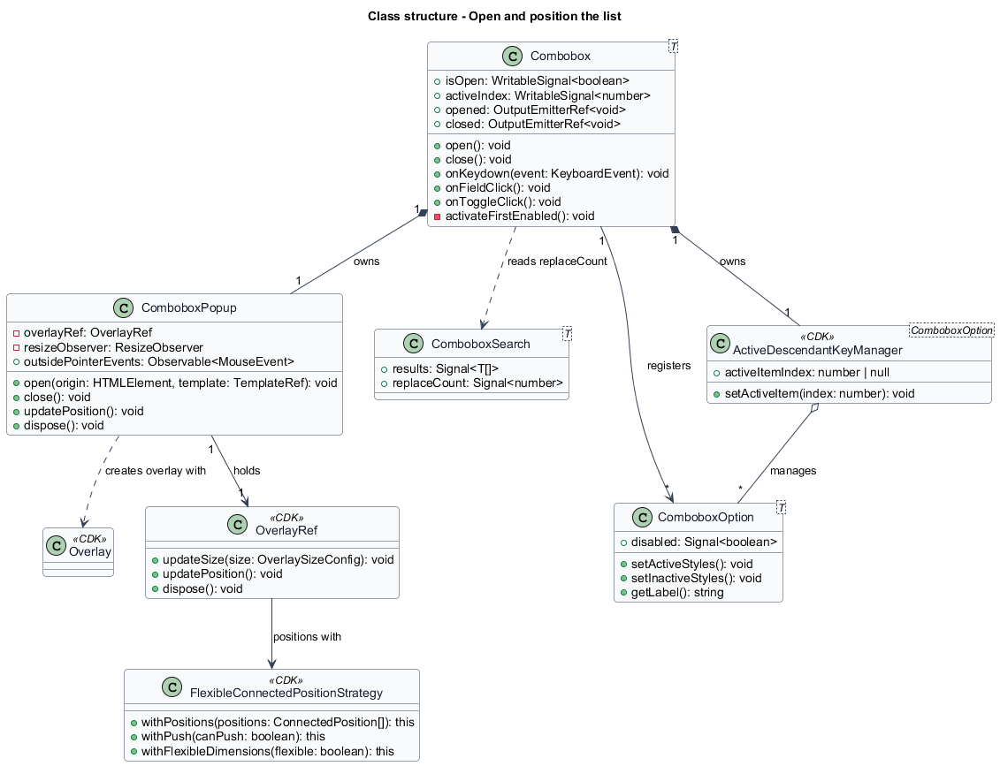
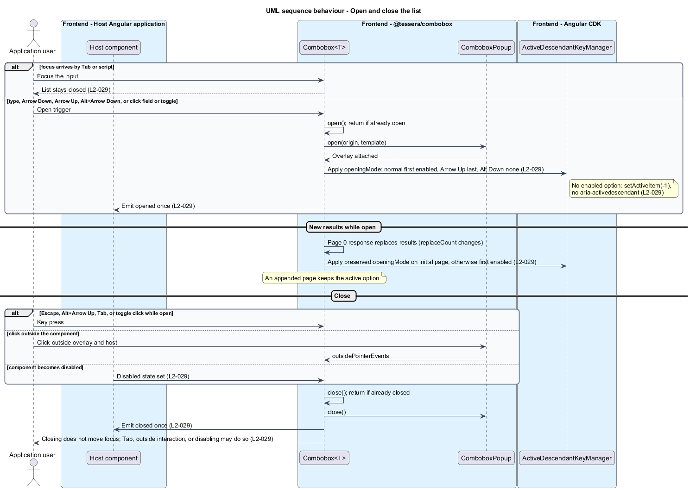
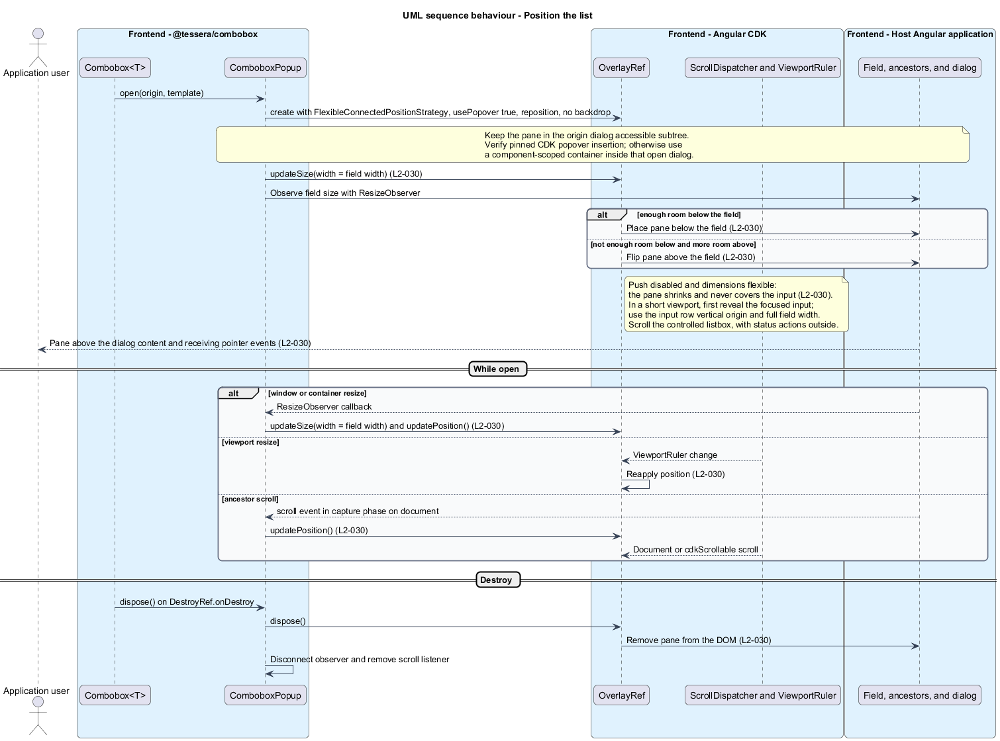

# Open and position the list

## Overview

`t-combobox` shows its options in a popup list below the input. The list opens when the user asks for it, close predictably, and sit next to the field without hiding what the user types. This feature covers when the list opens and closes, which option is active when it opens, and where and how wide the list renders.

**Popup list** — panel of options that appears next to the field while the combobox is open

**Overlay** — Angular CDK layer that renders content outside its parent element, attached to a page-level container

**Active option** — option that the input points to through `aria-activedescendant` while DOM focus stays on the input

**Origin element** — field element that the overlay attaches to and takes its width from

The list renders in an overlay so that no ancestor's `overflow` or stacking context clips it. The overlay is not modal and does not trap focus. Option navigation keeps input focus. Closing itself does not focus anything; Tab, outside interactions, and disabling may move focus through browser behavior.

## Description

The slice is frontend-only. `Combobox<T>` decides when to open and close. `ComboboxPopup` places the list. The CDK supplies the overlay and the key manager.

### Opening and closing

`Combobox<T>` owns the `isOpen` signal, the `opened` and `closed` outputs, and the methods `open()` and `close()`. Each method returns without effect when the state already matches, so `opened` and `closed` each emit once per transition.

| Trigger | Handler | Result |
|---------|---------|--------|
| Printable character, paste, or IME input | `input` event | `open()` |
| Arrow Down, Arrow Up, or Alt+Arrow Down | `keydown` on the input | `open()` |
| Click on the field or the toggle button | `click` | Focus the input, then `open()` |
| Focus arrives by Tab or by script | none | Nothing; no focus handler calls `open()` |

| Trigger | Handler | Result |
|---------|---------|--------|
| Escape on an open list | `keydown` on the input | `close()` |
| Alt+Arrow Up | `keydown` on the input | `close()` |
| Tab or Shift+Tab | Bubbling `keydown` on host or popup | `close()`; no `preventDefault()`, so focus moves naturally |
| Click outside the component | `ComboboxPopup.outsidePointerEvents` | `close()` |
| Component becomes disabled | effect on `isDisabled()` | `close()`; the search feature cancels the request in the same step |

An outside click is a click whose target lies outside the overlay pane and outside the host element. A click on a chip, a button, or the field is inside the component and does not close the list. Escape on a closed list and the full key map belong to [Operate by keyboard](../operate-by-keyboard/); the Arrow Up rule that activates the last option belongs there as well.

The toggle button is a `<button tabindex="-1">` named Show options when closed and Hide options when open. A click toggles the list and focuses the input. Its `mousedown` prevents a mouse focus change. On a touch click the handler focuses the input synchronously. All names come from the i18n contract.

`close()` sets `isOpen` to false, calls `ComboboxPopup.close()`, and emits `closed`. It calls no `focus()` method, so closing itself does not move focus. Tab and outside interactions follow browser focus behavior; disabling may also move focus. Escape from a chip preserves that chip focus; Escape from a popup action returns focus to the input. The overlay has no backdrop, no focus trap, and no `aria-modal` attribute, so focus moves freely between the input and the overlay content.

### Active option

`ComboboxOption<T>` directives register with `Combobox<T>` through `COMBOBOX_PARENT` and implement CDK `Highlightable`. `Combobox<T>` wraps the registered options in an `ActiveDescendantKeyManager` without a wrap and without a skip predicate, so arrow keys reach disabled options. The component mirrors the manager's active index in the `activeIndex` signal.

`activateFirstEnabled()` chooses the first enabled registered option, or `-1` when all are disabled. Opening records a mode: normal, last, or none. Normal opening and page 0 replacement activate the first enabled option; Arrow Up opening activates the last loaded option, even when disabled; Alt+Arrow Down opening leaves no active option. The mode survives the initial asynchronous response and clears on a plain arrow key. Arrow Down from no active option starts at the first loaded option; Arrow Up starts at the last. Appended pages preserve the active option. Active items scroll inside the panel without scrolling the document.

### Popup

`ComboboxPopup` wraps the CDK `Overlay`. Its members are `open(origin, template)`, `close()`, `dispose()`, `updatePosition()`, and the `outsidePointerEvents` Observable.

- **Overlay configuration.** `hasBackdrop` is false. The scroll strategy is `scrollStrategies.reposition()`. The position strategy is a `FlexibleConnectedPositionStrategy` attached to the origin element.
- **Positions.** Two positions in preference order: the overlay's top edge at the field's bottom edge, then the overlay's bottom edge at the field's top edge. Neither position overlaps the field. `withPush(false)` prevents the strategy from sliding the list over the field, and `withFlexibleDimensions(true)` shrinks the list to the available space, so the input stays visible at every supported viewport size (WCAG 2.2 SC 2.4.11, `L2-030`). When the space below is too small, the strategy chooses the position with the larger visible area, which is above when more space exists above.
- **Very short viewports.** If the full field leaves insufficient room for an option and the status actions, the vertical origin becomes the input row while the width remains the full field width. The popup may cover chips but shall not cover the focused input. Opening or reflow shall bring the focused input into the visual viewport first, with instant document scrolling when necessary. The controlled listbox scrolls independently; non-option status actions remain outside it. Keyboard navigation adjusts only the listbox scroll position.
- **Width.** The overlay width equals the field's bounding width, set when the overlay opens. A `ResizeObserver` on the origin element calls `updateSize({ width })` and `updatePosition()` when the field changes size, through a window resize or a container resize. The observer disconnects on `close()`.
- **Scrolling.** The reposition strategy follows the document and any `cdkScrollable`. The CDK `ScrollDispatcher` does not report a scroll in an arbitrary ancestor. While the list is open, `ComboboxPopup` therefore also listens for `scroll` in the capture phase on `document` and calls `updatePosition()`. The overlay stays attached to the field whichever ancestor scrolls. The capture handler ignores events from inside the panel to avoid reposition loops.
- **Viewport resize.** The position strategy reapplies on each `ViewportRuler` change.
- **Destruction.** `Combobox<T>` registers `popup.dispose()` with `DestroyRef.onDestroy`. `dispose()` removes the overlay pane from the DOM even when the list is open.
- **Inside a dialog.** CDK overlays use `usePopover: true` and the connected strategy insertion point under the origin, retaining the dialog DOM ancestry while entering the top layer. Without Popover API, a component-scoped OverlayContainer attaches inside the closest open native dialog, or uses the ordinary CDK container outside a dialog. No application-wide container is moved. Both CDK and native dialog fixtures verify pointer interaction, Escape, and announcements. The pinned CDK public API shall be verified before its ATDD slice; the [upstream overlay implementation](https://github.com/angular/components/blob/main/src/cdk/overlay/overlay.ts) is the current reference.

### Test support

`ComboboxDemoPage` owns the selectors for the field, the toggle button, and the listbox, and `ComboboxHarness` exposes `open()`. Acceptance tests run in Chromium at each supported viewport width, with a dialog host, and with a scrolled ancestor.

## Requirements

Source: [L2 detailed requirements](../../../specs/L2.md). The table quotes the source wording exactly, including its modal verb.

| L2 ID | Refines (L1) | Requirement |
|-------|--------------|-------------|
| `L2-029` | `L1-011` | The list must open on typing, Arrow Down, Arrow Up, Alt+Arrow Down, or a click on the field or toggle button, and must not open on focus alone. It must close on Escape, Tab, an outside click, Alt+Arrow Up, or a click on the toggle while open. Closing itself must not move focus; Tab, an outside interaction, or disabling may move focus through browser behavior. |
| `L2-030` | `L1-011` | The results list must render in a CDK overlay attached to the field, with the field's width, flipping above the field when there is no room below, and repositioning on scroll and resize. The open list must not hide the focused input. |

## Diagrams

The context view shows the user opening and closing the list in a host application.

The container view shows the overlay and key manager coming from the Angular CDK, with the combobox package deciding when to open.

The component view shows `Combobox<T>` driving `ComboboxPopup` and the key manager, and `ComboboxPopup` using the CDK overlay.

The class view records the open state, the popup members, and the CDK types the slice uses.

Opening applies its active-option mode and emits `opened`. Closing emits `closed` once; Tab and outside interactions follow the browser focus behavior.

The overlay flips above the field when there is no room below. It follows field resizes and ancestor scrolls, and it is removed when the component is destroyed.

