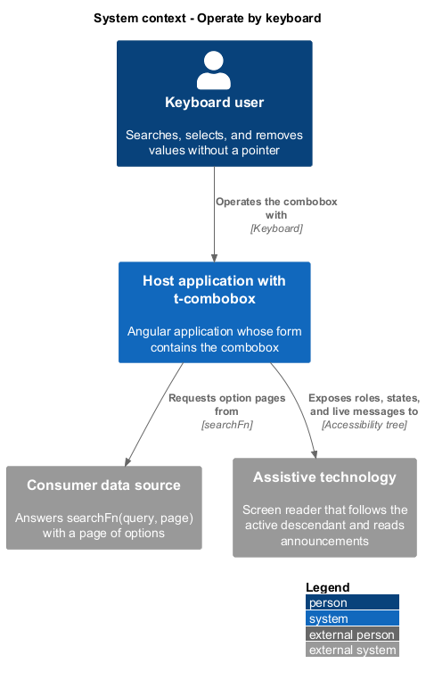
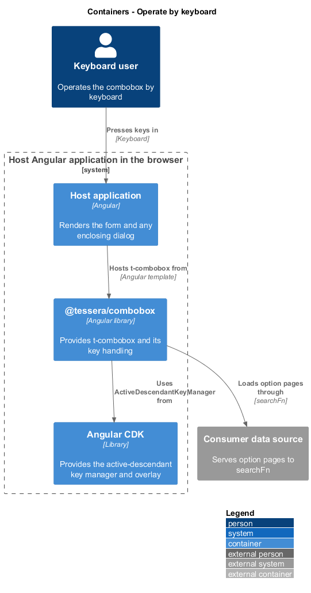
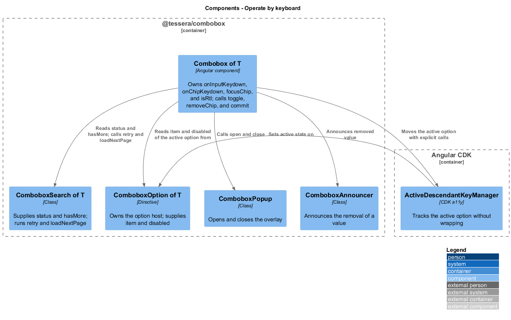
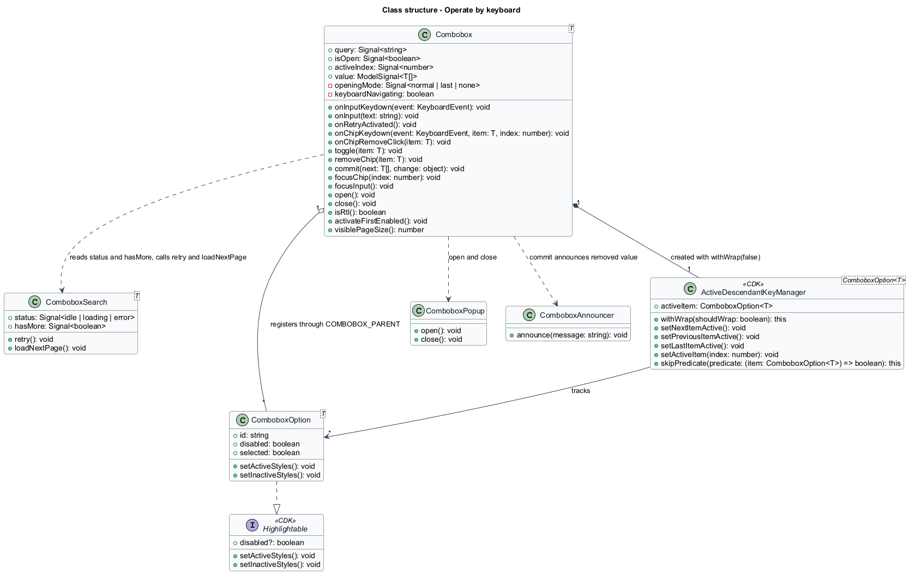
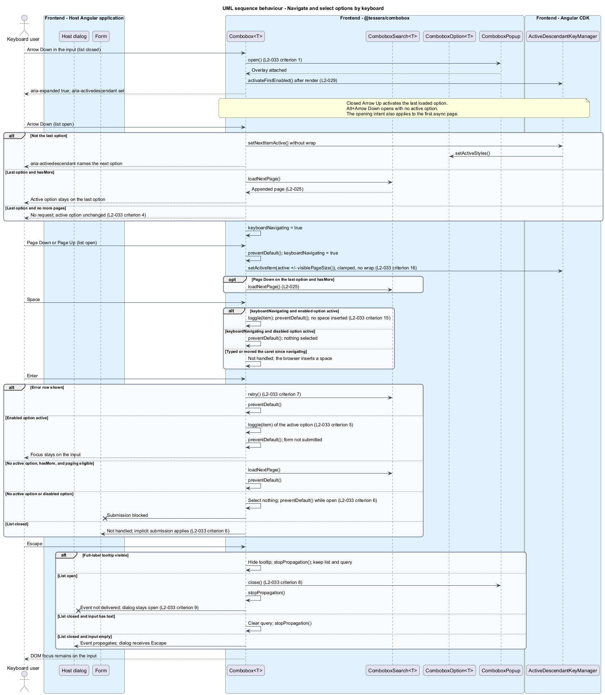
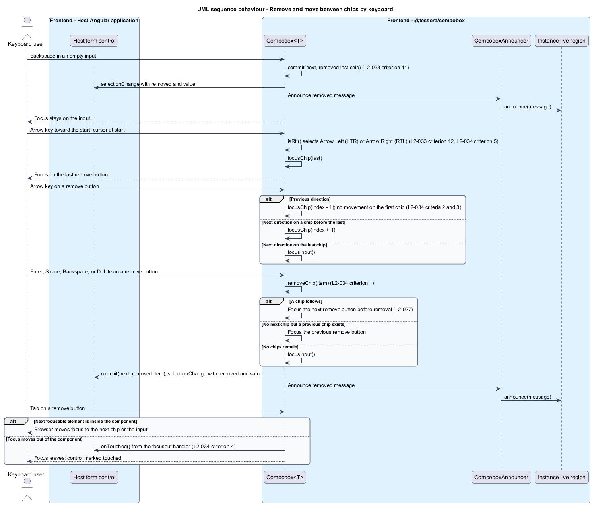

# Operate by keyboard

## Overview

`t-combobox` is the form control of the `@tessera/combobox` package. A user searches a data source by typing, selects multiple results from a popup list, and sees each selection as a removable chip. This feature specifies how the keyboard operates every part of that control, in left-to-right and right-to-left layouts.

**Active option** — option in the popup list that is the current target of keyboard actions while DOM focus stays on the input

**Active descendant** — WAI-ARIA mechanism in which the input names the active option through `aria-activedescendant`, so the screen reader follows the active option without receiving focus

**Remove button** — button inside a chip that removes that chip's value

**Error row** — status row at the end of the list that reports a failed request and offers a Retry action

**Right-to-left layout** — layout in which the inline start edge is the right edge, as in Arabic and Hebrew

DOM focus rests on the input while the user navigates options. The input handles each key and moves the active option by keyboard, so the user needs no pointer. Chips sit before the input in the field, and the remove button of each chip is a second place that holds focus. The feature extends the WAI-ARIA Authoring Practices combobox input-focus model with a multi-select listbox and applies the v1 decisions of the subsystem: Arrow navigation does not wrap, Home and End move the text cursor, Space toggles only after keyboard navigation, and Page Up and Page Down move by one visible page.

This feature owns key handling only. Searching, selection state, list positioning, announcements, and form integration belong to sibling features and appear here as collaborators.

## Description

The slice adds two key handlers to `Combobox<T>` and wires them to collaborators that other features own.

- `Combobox<T>.onInputKeydown(event)` handles `keydown` on the input. It returns at once when `event.isComposing` is true, so keys that drive an input method editor reach the editor unchanged. It tests `altKey` combinations before plain Arrow keys, and it resolves the key to one row of the input key map below.
- `Combobox<T>.onInput(text)` is the `input` handler specified in [Search options](../search-options/). In addition to updating `query`, it calls `open()` when the list is closed, so printable characters, paste, and composed text all open the list. Printable keys are not intercepted in `keydown` and are never default-prevented.
- `Combobox<T>.onChipKeydown(event, item, index)` handles `keydown` on a chip remove button and resolves Backspace, Delete, and the Arrow keys.
- `Combobox<T>.onChipRemoveClick(item)` handles the native `click` that Enter and Space raise on a button. It calls `removeChip(item)`, so Enter, Space, and pointer activation share one path.
- `Combobox<T>.removeChip(item)` is specified in [Select values](../select-values/). It chooses the focus target first: the next chip's remove button, else the previous chip's, else the input (`L2-027` criterion 6). It focuses that target and then calls `commit(next, { removed: item })`, which emits `selectionChange` and announces "{label} removed." through `ComboboxAnnouncer`.
- `Combobox<T>.focusChip(index)` and `focusInput()` move DOM focus. Chip remove buttons are found with `viewChildren`, so the template owns their DOM.
- `Combobox<T>.isRtl()` reads the computed CSS `direction` of the host element. A `dir="rtl"` attribute or a `direction: rtl` style on any ancestor therefore mirrors the keys, and no extra import is needed. The value is read on each key press, so a change of direction at run time takes effect immediately.
- `ActiveDescendantKeyManager<ComboboxOption<T>>` from the CDK `a11y` module tracks the active option. The component creates it with `withWrap(false)` and `skipPredicate(() => false)`, because the manager skips disabled items by default. It does not enable type-ahead or Home and End handling. The component never forwards `keydown` to the manager's `onKeydown`. It calls `setNextItemActive()`, `setPreviousItemActive()`, `setLastItemActive()`, and, for Page Down and Page Up, `setActiveItem(index)` explicitly, so the manager cannot react to keys outside the key map. Because disabled options are not skipped, Arrow keys reach them (`L2-035` criterion 7). The open-time rule that activates the first enabled option is `activateFirstEnabled()`, specified in [Open and position the list](../open-and-position-list/).
- `ComboboxOption<T>` publishes the manager's active state through `aria-activedescendant` on the input and exposes `item` and `disabled`. Enter calls `Combobox<T>.toggle(item)` for the active option ([Select values](../select-values/)). `Combobox<T>` removes the attribute when the list is closed or no option is active.
- `ComboboxSearch<T>` supplies `status`, `hasMore`, `retry()`, and `loadNextPage()`. The keyboard layer reads the first two and calls the last two.
- `ComboboxPopup` supplies `open()` and `close()` for the overlay. It does not subscribe to the CDK overlay `keydownEvents()`, so Escape is handled by component handlers rather than the CDK dispatcher. A shared bubbling boundary handler on the host closes on Tab or Escape from chips, clear-all, and popup actions; popup keys reach it by bubbling in the inline popover placement, and the handler is also attached to the pane only in the fallback placement, so each key is handled once. It preserves chip focus, restores input focus from popup actions, and never prevents Tab. Input-handled Escape stops propagation to avoid handling it twice; a visible tooltip has first priority.
- `openingMode` records normal, last, or none. It stays in effect through the first asynchronous response. Arrow Up chooses last; Alt+Arrow Down chooses none; other opens choose normal. A plain arrow clears this mode and navigates from the current index, or from the corresponding end when none is active. The popup feature owns these rules.
- `keyboardNavigating` records whether the user last moved or set the active option with Arrow Down, Arrow Up, Page Down, or Page Up. Those keys set it. `onInput(text)`, `compositionstart`, Arrow Left, Arrow Right, Home, End, a pointer press in the input, and `close()` clear it. Space reads it (`L2-033` criterion 15).
- `visiblePageSize()` counts the options whose boxes lie fully inside the listbox's visible area, with a minimum of 1. Page Down and Page Up move by that count (`L2-033` criterion 16).

**Input key map** (focus on the input):

| Key | State | Behavior |
|-----|-------|----------|
| Arrow Down | List closed | `open()`. The first enabled option becomes active when the options render. |
| Arrow Down | List open | `setNextItemActive()`. The key manager does not wrap. On the last option, the active option stays, and `loadNextPage()` runs when `hasMore` is true. On the last option with no further pages, nothing changes and no request is issued. |
| Arrow Up | List closed | Sets `openingMode` to last, then `open()`. The last option becomes active when the options render. |
| Arrow Up | List open | `setPreviousItemActive()`. On the first option, the first option stays active. |
| Alt + Arrow Down | List closed | `open()` with mode none. No active descendant, including after the first response. |
| Alt + Arrow Up | List open | `close()`. |
| Enter | Error row shown | `onRetryActivated()`, which calls `search.retry()`, and `preventDefault()`. |
| Enter | List open, enabled option active | `toggle(item)` for that option and `preventDefault()`, which blocks form submission. |
| Enter | List open, no active option or a disabled one | Selects nothing and calls `preventDefault()`. With no active option and hasMore, calls loadNextPage; disabled active options do not trigger paging. |
| Enter | List closed, error row not shown | Selects nothing. The browser default applies, including implicit form submission (`L2-033` criterion 6). |
| Space | List open, `keyboardNavigating` true, enabled option active | `toggle(item)` for that option and `preventDefault()`, so no space is inserted. |
| Space | List open, `keyboardNavigating` true, disabled option active | `preventDefault()` only. Nothing is selected and no space is inserted. |
| Space | Any other state | Not handled. The browser inserts a space and `onInput(text)` updates `query`. |
| Page Down | List open | `preventDefault()` and set `keyboardNavigating`. Moves the active option forward by `visiblePageSize()`, stopping at the last loaded option. On the last option, `loadNextPage()` runs when `hasMore` is true, as for Arrow Down. With no active option, the first loaded option becomes active. |
| Page Up | List open | `preventDefault()` and set `keyboardNavigating`. Moves the active option back by `visiblePageSize()`, stopping at the first option. With no active option, the last loaded option becomes active. |
| Page Down, Page Up | List closed | Not handled. The page scrolls by browser default. |
| Escape | Full-label tooltip visible | Dismiss tooltip and stop propagation before all other Escape handling. |
| Escape | List open | `close()` and `stopPropagation()`. |
| Escape | List closed, input has text | Clears `query` and calls `stopPropagation()`. |
| Escape | List closed, input empty | Not handled. The event propagates. |
| Home, End | Any | Not forwarded to the key manager. The text cursor moves, no option becomes active, and `keyboardNavigating` is cleared. |
| Backspace | Input empty, chips exist | `commit(next, { removed: last })` without moving focus. Focus stays on the input. |
| Backspace | Input has text | Not handled. The browser edits the text. |
| Arrow Left (Arrow Right in right-to-left) | Cursor at start or input empty, chips exist | `focusChip(last)` and `preventDefault()`. |
| Tab, Shift + Tab | List open | `close()` without `preventDefault()`. Focus moves by the browser's normal order and the active option is not selected. |
| Printable character | List closed | Not intercepted. The `input` event updates `query` and `onInput(text)` opens the list. |

The cursor is at the start when `selectionStart` and `selectionEnd` are both 0. A text selection therefore keeps the Arrow key inside the input.

**Chip key map** (focus on a remove button). The mirrored column applies when `isRtl()` is true.

| Key | Left-to-right | Right-to-left |
|-----|---------------|---------------|
| Enter, Space | Native click calls `removeChip(item)` | Same |
| Backspace, Delete | `removeChip(item)` and `preventDefault()` | Same |
| Arrow Left | `focusChip(index - 1)`. No movement on the first chip. | `focusChip(index + 1)`, or `focusInput()` from the last chip |
| Arrow Right | `focusChip(index + 1)`, or `focusInput()` from the last chip | `focusChip(index - 1)`. No movement on the first chip. |
| Tab | Not handled. Focus moves to the next focusable element in the component. | Same |

The Arrow keys resolve through two values, `previousKey` and `nextKey`, computed from `isRtl()`. The same mapping decides which Arrow key leaves the input toward the chips, so the input and chip handlers share one direction rule.

DOM order inside the host is the chip remove buttons, the input, the toggle, the popover list, and then, below the field, the error, the hint, and the clear-all button. Popup actions stay outside the Tab sequence. The toggle button has `tabindex="-1"`. Tab from a chip therefore reaches the next chip or the input, then the clear-all button, and then leaves the component. A `focusout` handler, specified in [Integrate with forms](../integrate-forms/), marks the control touched when `relatedTarget` lies outside the host. Moving between chips, the input, and the buttons does not mark the control touched.

Acceptance criteria coverage:

| Criterion | Where the design satisfies it |
|-----------|-------------------------------|
| `L2-033` 1, 2 | Arrow Down and Arrow Up rows; `openingMode` |
| `L2-033` 3 | Alt + Arrow Down and Alt + Arrow Up rows |
| `L2-033` 4 | `withWrap(false)`; the last-option rule and `hasMore` |
| `L2-033` 5, 6, 7 | Enter rows; `preventDefault()` while the list is open; `onRetryActivated()` for the error row |
| `L2-033` 8, 9 | Escape rows; `stopPropagation()` only when Escape acted; `ComboboxPopup` leaves Escape to the input, so a first Escape closes only the list and a second reaches the enclosing dialog |
| `L2-033` 10 | Home and End are not handled and not forwarded to the key manager |
| `L2-033` 11 | Backspace rows; `commit` emits and announces as for chip removal |
| `L2-033` 12 | Start-direction Arrow row; cursor test |
| `L2-033` 13 | Tab rows |
| `L2-033` 14 | `onInput(text)` |
| `L2-033` 15 | Space rows; `keyboardNavigating` |
| `L2-033` 16 | Page Down and Page Up rows; `visiblePageSize()` and `setActiveItem(index)` |
| `L2-034` 1 | Chip key map, first two rows; `removeChip(item)` |
| `L2-034` 2, 3 | Chip key map, Arrow rows; `previousKey` and `nextKey` |
| `L2-034` 4 | Tab row; DOM order; `focusout` and touched |
| `L2-034` 5 | Start-direction Arrow row with `isRtl()` true |

Opening modes are specified consistently in L2-029 and L2-033. Arrow Up starts at the last loaded option, not the last option of the remote data set. Escape reaches an enclosing dialog only after the tooltip, popup, and non-empty query have been dismissed in that order. Bubbling Tab and Escape handlers on the host, and on the pane in the fallback placement, also cover chip and popup-action focus.

## Requirements

Source: [L2 detailed requirements](../../../specs/L2.md). The table quotes source wording exactly, including its use of `must`.

| L2 ID | Refines (L1) | Requirement |
|-------|--------------|-------------|
| `L2-033` | `L1-013` | With focus in the input, the keyboard must operate the combobox exactly as the following behaviors specify. Arrow navigation must not wrap. |
| `L2-034` | `L1-013` | With focus on a chip remove button, the keyboard must remove chips and move between them. In right-to-left layouts, Arrow Left and Arrow Right must be mirrored. |

## Diagrams

The context view shows the keyboard user, the host application that contains `t-combobox`, the data source behind `searchFn`, and the assistive technology that reads the announcements.

The container view places `@tessera/combobox` and Angular CDK inside the host application. The package runs in the browser and reaches the consumer's data source only through `searchFn`.

The component view shows the collaborators of the key handlers. `Combobox<T>` interprets keys and delegates to the key manager, the search, the popup, and the announcer.

The class view records the key-handling methods of `Combobox<T>` and its relationships to the collaborators. Types shared with other features keep the meaning given in the subsystem page.

The first sequence follows the input keys: opening the list, moving the active option, toggling it, retrying a failed request, and closing the list. The Escape branch shows why an enclosing dialog stays open on the first press.

The second sequence follows the chip keys: leaving the input toward the chips, mirroring in a right-to-left layout, removing a chip, and tabbing out of the component.

