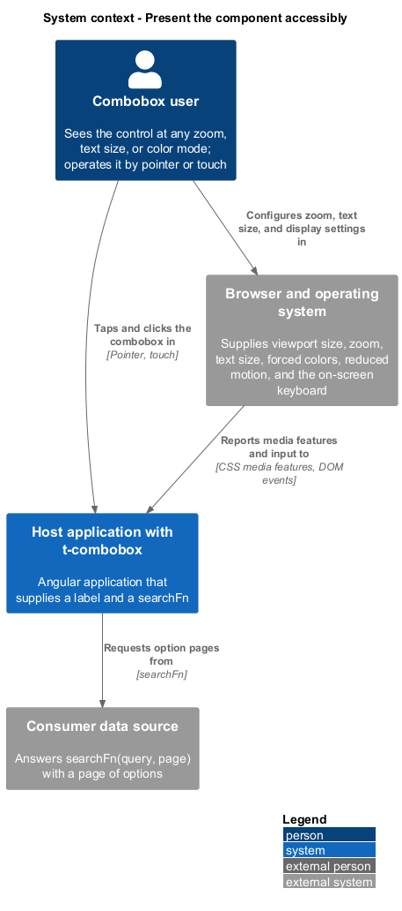
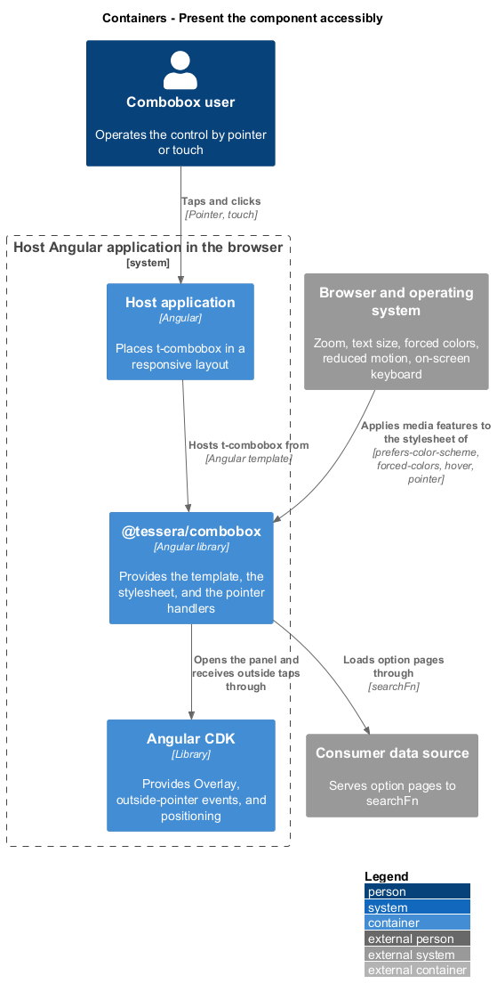
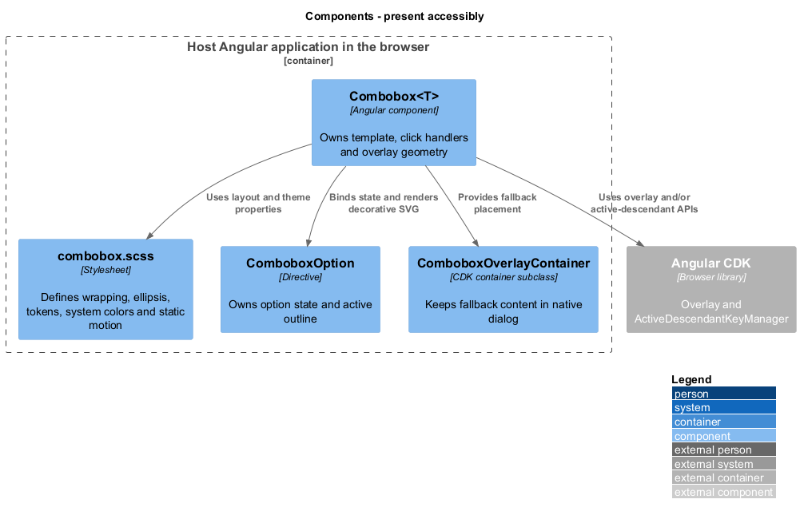
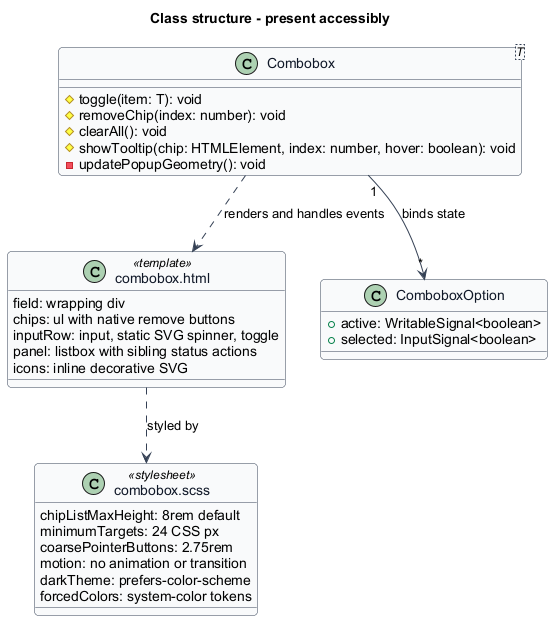
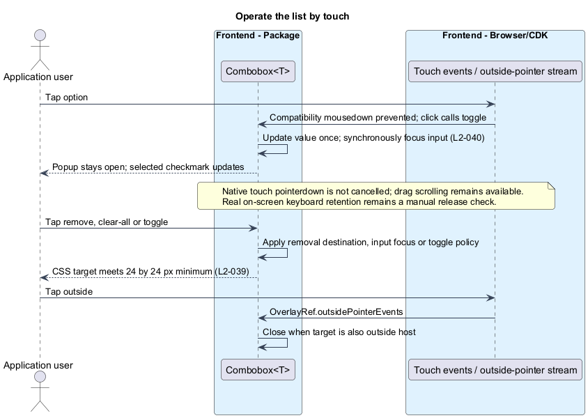
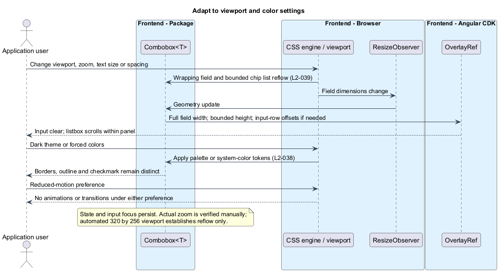

# Present the component accessibly

## Overview

`t-combobox` is a form control that lets a user search a data source by typing, select multiple results from a popup list, and see each selection as a removable chip. This feature specifies how the control looks and how pointer and touch input reach it. Users who see poorly, zoom the page, enlarge text, rely on high-contrast modes, avoid motion, or use a touch screen operate the same component as everyone else.

**Design token** — named CSS custom property that carries one visual decision, such as a color, so a theme changes it in one place

**Contrast ratio** — ratio of the relative luminance of two colors, from 1:1 (identical) to 21:1 (black on white)

**Forced-colors mode** — operating-system mode, such as Windows High Contrast, in which the browser replaces authored colors with a small set of system colors

**Reduced-motion preference** — operating-system setting that asks applications to avoid animation, exposed to CSS as `prefers-reduced-motion: reduce`

**Reflow** — rearrangement of content to fit a narrow viewport without horizontal scrolling

**Pointer target** — area that a mouse, pen, or finger activates

The feature applies WCAG 2.2 AA. The relevant success criteria are 1.4.1 (use of color), 1.4.3 and 1.4.11 (contrast), 1.4.4 (text resize), 1.4.10 (reflow), 1.4.12 (text spacing), 2.3.3 (animation, an additional AAA target), and 2.5.8 (target size). The feature combines CSS layout with pointer handlers and popup geometry updates. Its design is the template structure, the style contract, and the rules that tie them together.

Keyboard operation, ARIA exposure, and list positioning belong to sibling features. The visual rules for focus indicators and for the active option follow from [Expose state to assistive technology](../expose-to-assistive-tech/).

## Description

The feature comprises the template and stylesheet of `Combobox<T>`, plus the pointer handlers that keep focus on the input.

**Template parts.** Every interactive part is a native element, so the browser supplies its pointer and touch behavior.

| Part | Element and class | Notes |
|------|-------------------|-------|
| Field | `div.t-combobox-field` | Flex container with wrapping. Draws the border and, through `:has(.t-combobox-input:focus-visible)`, the focus indicator, so a focused chip remove button shows only its own indicator. |
| Chip list | `ul.t-combobox-chips` of `li.t-combobox-chip` | Each chip holds `span.t-combobox-chip-label` and `button`. |
| Input row | `div.t-combobox-input-row` | Holds the input, the spinner, and the toggle. Sits beside the chip list while the chips fit on one row, and on the row below once they wrap. |
| Input | `input.t-combobox-input` | Takes the free space in the input row. |
| Spinner | `svg.t-combobox-spinner` | Decorative, `aria-hidden="true"`. Shown while a request is in flight. |
| Hint row | `div.t-combobox-below` | Below the field and after the error. Holds the hint, when supplied, at the inline start and clear-all at the inline end; rendered while either exists. |
| Clear-all button | `button.t-combobox-clear` | Text button showing its name, "Clear all selections", at the inline end of the hint row. Rendered while a value exists. Outside the input row, it cannot be mistaken for a control that clears the typed text. |
| Toggle button | `button.t-combobox-toggle` | `tabindex="-1"`. Mouse and touch affordance at the inline end of the field. |
| Panel | `div.t-combobox-panel` in the CDK popover inserted after the field | Holds the independently scrolling listbox and wrapping sibling status rows and actions inside the space the overlay grants. |
| Option | `li[tComboboxOptionHost]` | Holds `svg.t-combobox-checkbox` (decorative) and the content. |
| Error | `p.t-combobox-error` | Shown directly below the field and before the hint, with a decorative error icon. |

**Icons.** Built-in inline SVG path icons use currentColor and aria-hidden for chevron, loading, chip removal, checkmark, and error. No icon package or background image is needed. Loading always has text, and a static indicator is sufficient under reduced motion.

**Design tokens.** Light defaults: text #18312e, placeholder/disabled text #536763, surface #ffffff, border #657f73, focus #b35c14, active outline/selected mark #126454, and hover #f4f7f5, chip background #e4f2ec, and error #8a1c12. Dark defaults: text #f4f7f5, placeholder/disabled text #b6cbc3, surface #18312e, border #8fa9a0, focus #ffbf69, active outline/selected mark #8fd5ba, hover #244b42, chip background #244b42, and error #ffb4a8. A selected checkbox is filled with the selected-mark token and draws its checkmark in the surface token. The chip area defaults to 8 rem and motion duration to 0 ms. Consumers may override tokens while retaining contrast targets.

| Token | Applies to | Target | Forced-colors value |
|-------|------------|--------|---------------------|
| `--t-combobox-text` | Input, chip label, option text, hidden summary | 4.5:1 against the surface | `CanvasText` |
| `--t-combobox-placeholder` | Placeholder text and hint text | 4.5:1 against the surface and the page background | `GrayText` |
| `--t-combobox-surface` | Field and panel background; checkmark of a selected checkbox | Reference color for the text targets | `Canvas` |
| `--t-combobox-chip-bg` | Chip background | Chip text 4.5:1 and chip border 3:1 against it | `Canvas` |
| `--t-combobox-border` | Field, chip, panel, and checkbox borders; icons | 3:1 against the adjacent color | `ButtonText` |
| `--t-combobox-focus-ring` | Focus indicator of the field, chip remove buttons, and clear-all | 3:1 against the adjacent colors | `Highlight` |
| `--t-combobox-active-outline` | Outline of the active option | 3:1 against the surface | `Highlight` |
| `--t-combobox-hover-bg` | Hover background of an option | Distinct from the surface | `Canvas` |
| `--t-combobox-selected-mark` | Fill and border of a selected option's checkbox | 3:1 against the surface and against its checkmark | `Highlight`, with the checkmark in `HighlightText` |
| `--t-combobox-disabled-text` | Text of a disabled option; input, placeholder, chips, and icons of a disabled component | 4.5:1, so no inactive-component exemption is relied on | `GrayText` |
| `--t-combobox-error` | Error text, error icon, and the invalid field border | 4.5:1 against the surface and the page background | `CanvasText` |
| `--t-combobox-motion-duration` | Reserved motion setting; currently unused | Not applicable | Not applicable |
| `--t-combobox-chip-list-max-height` | Chip-list height before it scrolls vertically, in `rem` | Not applicable | Not applicable |

The default palette follows the system light/dark color preference. Consumer token overrides supply application themes. A block under `@media (forced-colors: active)` reassigns the tokens in the right-hand column. The selected checkbox additionally sets `forced-color-adjust: none` and uses `HighlightText` for its checkmark (`L2-038` criterion 4). The field, chip, checkbox, and panel use real `border` declarations, because `box-shadow` is removed in forced-colors mode. The focus indicator and the active outline use `outline`, which forced-colors mode keeps. The panel uses a border in every mode and declares no elevation shadow.

**State cues beyond color (`L2-038` criterion 2).**

| State | Color cue | Non-color cue |
|-------|-----------|---------------|
| Selected | `--t-combobox-selected-mark` | Filled checkbox with a checkmark; `aria-selected="true"`. The row itself is not tinted. |
| Active | `--t-combobox-active-outline` | 2 px outline inset on the option row |
| Hover | `--t-combobox-hover-bg` | Background change on every option, selected or not, under `@media (hover: hover)` only |
| Disabled | `--t-combobox-disabled-text` | Italic text and a dashed checkbox border; `aria-disabled="true"`. A disabled component also shows a dashed field border. |

The disabled treatment is a default. It remains distinct from the other three states in each theme.

**Reduced motion (`L2-038` criterion 3).** The stylesheet declares no animations or transitions, including spinner rotation. The loading SVG remains static under all motion preferences. `--t-combobox-motion-duration` defaults to 0 ms but no animation or transition currently consumes it. Active-option scrolling is instant. Hover rules apply only under `@media (hover: hover)`.

**Layout rules (`L2-039`).** One stylesheet serves every width. It has no breakpoints, and no script switches the template by width, so a resize preserves the template while CSS and overlay geometry adapt.

- `t-combobox` is `display: block` with `max-width: 100%` and `min-width: 0`. The field is one wrapping flex layout of two items: the chip list, which wraps its own chips, and the input row, which holds the input, the spinner, and the toggle. Their children have `min-width: 0`, so a long child shrinks rather than overflows.
- The input row takes `flex: 1 1` with a `rem` basis, so it falls below the chip list once the chips fill a row, and it stays visible at 320 CSS px.
- `.t-combobox-chip` has `max-width: 100%`. `.t-combobox-chip-label` has `overflow: hidden`, `text-overflow: ellipsis`, and `white-space: nowrap`. This ellipsis is the single documented truncation. The full label stays available as the text content, as the name of the remove button, and as a tooltip. The dismissible, hoverable tooltip mechanism is defined in [Select values](../select-values/).
- Option text wraps with `overflow-wrap: anywhere`. Options and status rows never truncate.
- Lengths use `rem` and `em`, so text and spacing scale with the user's text size. No text container sets a fixed `height` or a pixel `line-height`. Rows use `min-height` only. At 200% text and under the text-spacing overrides (line height 1.5, paragraph spacing 2, letter spacing 0.12, word spacing 0.16 times the font size), rows grow, and nothing clips or overlaps.
- Default metrics: the input row has a 2.5 rem minimum height, chips have a 2 rem minimum height, options use 0.5 rem by 0.75 rem padding, and the status row is one line that wraps only when narrow. Under `@media (pointer: coarse)`, the input row and the buttons grow to 2.75 rem. The field and panel share one corner radius (0.5 rem); chips, options, and checkboxes share another (0.25 rem).
- The panel is a bounded flex column; the controlled listbox has `min-height: 0` and `overflow-y: auto`, and sibling status actions remain available. The narrow-height positioning fallback uses the input row as the vertical origin, as defined in [Open and position the list](../open-and-position-list/). At 400% zoom in a 1280 by 1024 window, the viewport is 320 by 256 CSS px, and the list scrolls inside the panel. The page does not scroll horizontally. [Open and position the list](../open-and-position-list/) sizes the overlay and keeps the focused input visible.
- A resize or zoom change reflows CSS and refreshes popup geometry. The `ResizeObserver` owned by `Combobox<T>` updates the overlay width and position. The component keeps `value`, `query`, and `isOpen`, and no DOM node is recreated, so the typed text, the selection, and the focused input persist (`L2-039` criterion 6).

**Target size (`L2-039` criterion 5).** The chip remove button, the clear-all button, the toggle button, and each option set `min-width: 24px` and `min-height: 24px`. These minimums use CSS pixels because the criterion is stated in CSS pixels. Surrounding padding uses `rem`. Options span the full panel width. The glyph of a button may be smaller than its target.

**Pointer and touch handling (`L2-040`).**

- Template `mousedown` bindings call `preventDefault()` to prevent a default focus change on options and popup actions for mouse and compatibility events. Touch pointerdown is not cancelled, so native drag scrolling remains available. A completed touch click toggles once and synchronously restores input focus. The toggle has the same mousedown prevention. Clear-all focuses the input in its click handler; chip removal uses its surviving-button focus rule. Chromium touch emulation checks focus; the manual device matrix checks the real on-screen keyboard.
- The option template binds `click` to `Combobox<T>.toggle(item)`, the single entry point specified in [Select values](../select-values/). A touch scroll raises no `click`, so dragging the list never toggles an option. The list stays open and the input keeps focus (`L2-040` criterion 1).
- The clear-all and remove buttons bind `click` to `clearAll()` and `removeChip(index)`. Their focus rules come from `L2-027`. The toggle button's `click` behavior comes from [Open and position the list](../open-and-position-list/). Each button meets the 24 px target (`L2-040` criterion 2).
- Outside taps use the path that outside clicks use. `Combobox<T>` subscribes to `OverlayRef.outsidePointerEvents()`, and `Combobox<T>` calls `close()` unless the target lies inside the host element or the overlay pane ([Open and position the list](../open-and-position-list/)). CDK routes outside pointer interactions; a tap outside the host closes the list (`L2-040` criterion 3).

The [verification design](../verify-and-document/) defines Chromium layout, contrast, target, and touch checks. Actual browser zoom, real on-screen keyboard behavior, and screen-reader gestures remain separate manual release checks.

## Requirements

Source: [L2 detailed requirements](../../../specs/L2.md). The table quotes source wording exactly, including its use of `must`.

| L2 ID | Refines (L1) | Requirement |
|-------|--------------|-------------|
| `L2-038` | `L1-015` | The combobox's colors, states, motion, and forced-colors rendering must conform to WCAG 2.2 AA. |
| `L2-039` | `L1-015` | The combobox must remain fully usable at extra-small, small, medium, large, and extra-large viewport widths, at up to 400% browser zoom, with enlarged text, and with text-spacing overrides, without horizontal scrolling or loss of content or functionality. Pointer targets must be at least 24 by 24 CSS pixels. |
| `L2-040` | `L1-015` | Touch interaction must toggle options without dismissing the on-screen keyboard. |

## Diagrams

The context view shows the user, the host application, and the browser and operating system that supply zoom, text size, forced colors, reduced motion, and the on-screen keyboard.

The container view places `@tessera/combobox` and Angular CDK inside the host application, beside the browser settings that the stylesheet reads through media features.

The component view shows the template, the stylesheet with its token contract, the option directive, and the popup. The CDK overlay supplies outside-click events and positioning.

The class view records the template parts, the pointer handlers, and the style contract that holds the tokens and the media-feature blocks.

The first sequence follows a touch user. A tap on an option toggles it and restores input focus, and a tap outside closes the list.

The second sequence follows changes in the environment: a resize or zoom with the list open, the reduced-motion preference, and forced-colors mode. CSS and geometry adapt while preserving component state.

