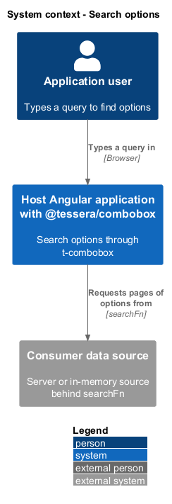
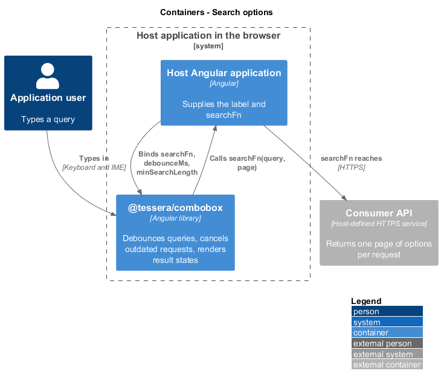
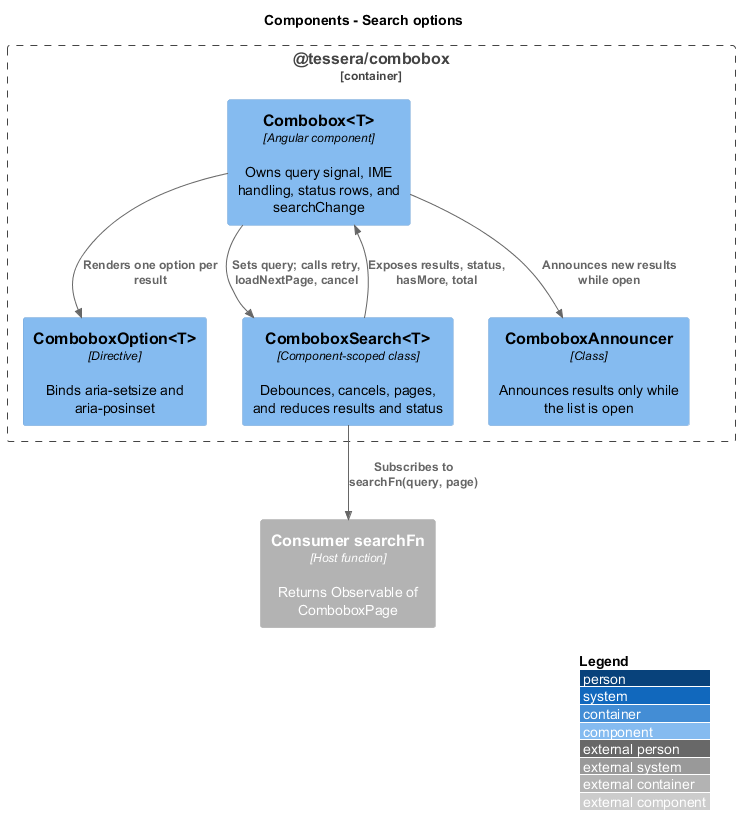
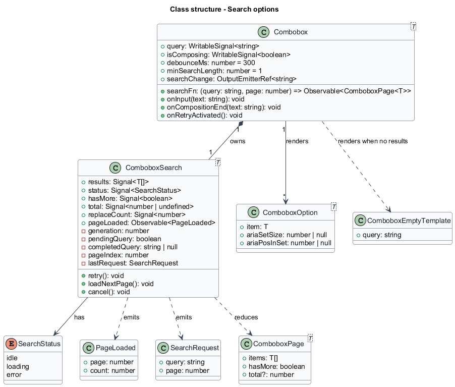
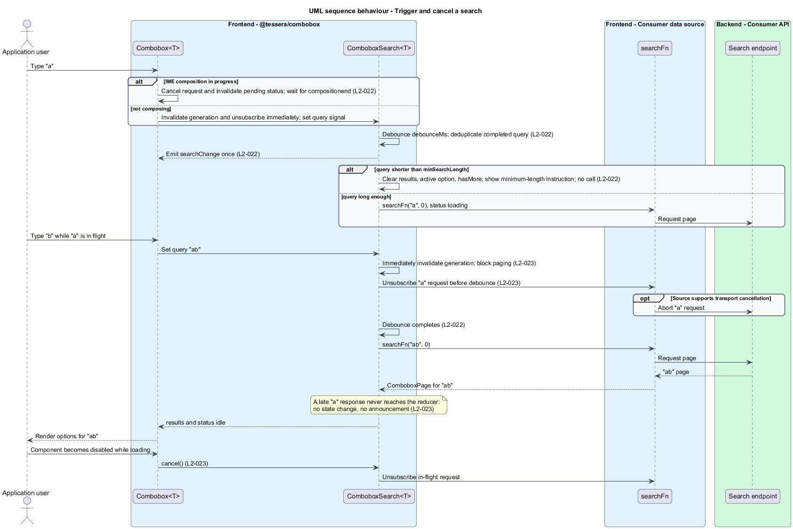
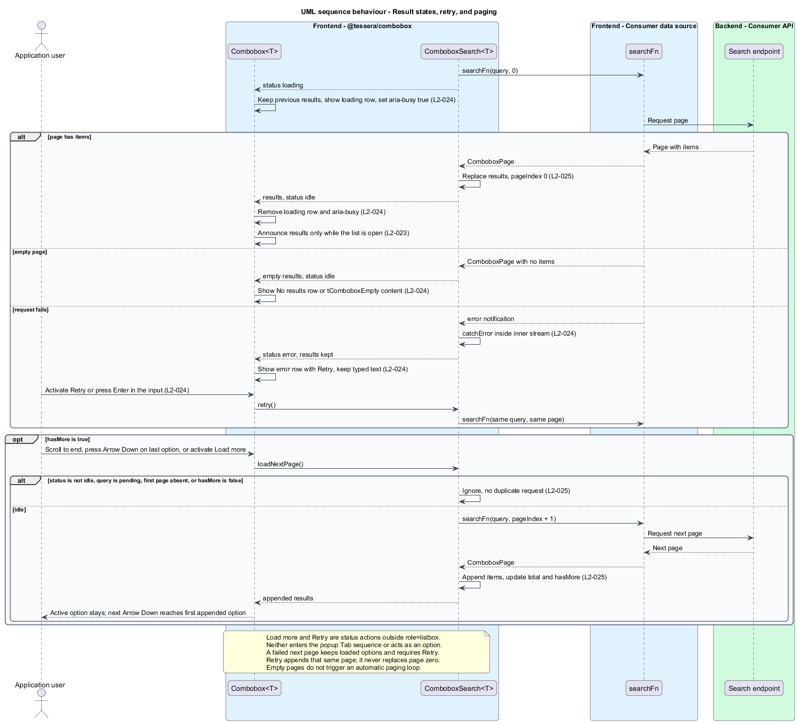

# Search options

## Overview

`t-combobox` lets a user find options in a remote data set by typing. The data set is too large to load up front, so the component asks the consuming application for matching options as the text changes.

**searchFn** — consumer-supplied function that takes a query and a page number and returns an Observable of one page of options

**Query** — text currently typed in the input

**Page** — result of one call to `searchFn(query, page)`, numbered from 0

**Debounce** — pause after the last keystroke before the component acts on the query

**IME composition** — input method editor session in which a user assembles a character from multiple keystrokes

This feature covers everything between a keystroke and a rendered list of results. It triggers searches, cancels outdated ones, shows loading, empty, and error states, and appends further pages. Selecting results, opening the popup, and keyboard operation belong to sibling features.

The component has no backend of its own. `searchFn` may call a server or an in-memory source. A failure in `searchFn` never throws out of the component, and later searches keep working after a failure.

## Description

The slice is frontend-only and has four building blocks.

- `Combobox<T>` owns the `query` signal, input handlers, and list template. The input value changes during IME composition, but partial text never enters the search pipeline. `compositionstart` cancels pending debounce and requests. `compositionend` commits the composed text after the debounce (`L2-022`). The template binds `aria-busy` on the listbox.

- `ComboboxSearch<T>` is a component-scoped class that runs the asynchronous pipeline. Its inputs are the `query` signal, `debounceMs` (default 300), `minSearchLength` (default 1), and `searchFn`. Its outputs are the signals `results`, `status`, `hasMore`, `total`, and `replaceCount` (a counter that increments each time a page 0 response replaces the results, which [Open and position the list](../open-and-position-list/) reads), and the observable `pageLoaded`, which emits `{ page, count }` once for each response that belongs to the current query and which [Expose state to assistive technology](../expose-to-assistive-tech/) reads to choose the results announcement, and the methods `retry()`, `loadNextPage()`, and `cancel()`.
- `ComboboxOption<T>` is the option directive. This slice adds the `aria-setsize` and `aria-posinset` bindings to it.
- `ComboboxPage<T>` is the interface a page carries: `items`, `hasMore`, and optional `total`.

### Search pipeline

The pipeline has two stages.

1. **Query stage.** The input handler invalidates the request generation immediately on any edit, before debounce. `toObservable(query)` feeds `debounce(() => timer(debounceMs()))`, reading the current delay for each change. A completed query with current results suppresses identical re-fetches; cancelled requests and failures remain retryable. The initial empty query produces neither a request nor `searchChange`. Every debounced text change emits `searchChange` once, including a below-minimum query. Configuration changes re-evaluate eligibility without emitting a text-change event.

2. **Request stage.** A merged stream carries four kinds of request: a new query at page 0, a next page, a retry, and a cancel. `switchMap` subscribes to `defer(() => searchFn(query, page))` for the latest request and unsubscribes the previous inner Observable first. `catchError` sits inside the inner stream and converts a failure, including a synchronous throw from `searchFn`, into an error result. The outer stream therefore survives every failure and later searches still run (`L2-024`).

A debounced query shorter than `minSearchLength` cancels requests, clears results, `total`, `hasMore`, and the active descendant, and returns status to `idle`. A localisable `searchPrompt` instruction replaces No results. Chips remain. Paging is blocked from the first edit until a successful page 0 for that exact query.

With `minSearchLength` set to 0, opening an empty field requests page 0 without a typing debounce. An unchanged completed query reuses its current results on reopen; no per-query cache exists. Re-enabling after cancellation permits the same query to be requested again. Search configuration or `searchFn` changes cancel the current generation and invalidate current results. Each search request consumes the first page emission and completes (`take(1)`); a source completing without a page becomes a recoverable error.

### Cancellation and stale responses

`switchMap` unsubscribes the previous request. A generation token also rejects responses as soon as the input changes, while the next query is still debouncing. A request descriptor holds the query and page; paging and Retry use that descriptor, never a mixture of typed text and older results. Disabled state cancels immediately. Current responses arriving after close may update stored results but shall not reopen or announce. Invalidating a generation clears its pending status announcements.

### State and rows

`status` is `idle`, `loading`, or `error`. A `scan` reducer builds `results`: a page 0 response replaces the array, a later page appends to it, and an error leaves it unchanged. The previous results therefore stay visible while a new request is in flight (`L2-024`).

| State | Row shown | Listbox | Notes |
|-------|-----------|---------|-------|
| `loading` | Loading row, previous results above it | `aria-busy="true"` | The attribute is removed when the request completes |
| `idle`, zero items | "No results" row | `aria-busy` removed | Default text "No results", or the content of a `tComboboxEmpty` template with context `{ query }` |
| `error` | Error row with a Retry button | `aria-busy` removed | Typed text and loaded options remain; no exception reaches the application's `ErrorHandler` |

The status rows are plain elements rendered beside the option list, not `role="option"` elements. No `ComboboxOption` registers for them, so the key manager never counts them and Arrow keys never activate them. Row text comes from `COMBOBOX_I18N`. The string keys are defined in [Customize, localise, and publish the API](../customize-and-localise/).

`retry()` re-emits the last request with the same query and page. Pointer activation of the Retry button calls it. The Enter handler of `Combobox<T>` calls it while `status` is `error`, because Tab closes the list (v1 decision; key map in [Operate by keyboard](../operate-by-keyboard/)). On success the results replace the error row. A new query after a failure runs normally.

### Paging

`ComboboxSearch<T>` tracks `pageIndex`, the highest successfully loaded page. `loadNextPage()` returns without effect when `status` is not `idle`, the query is pending, or `hasMore` is false, which prevents a duplicate request for an in-flight page. Otherwise it requests `pageIndex + 1` for the current query. Three triggers call it:

- The listbox scroll handler calls it when the scroll position reaches the end of the list. The end-of-list tolerance is 8 CSS px.
- The Load more results action calls it on pointer activation or Enter with no active option.
- The Arrow Down handler calls it when the active option is the last option and `hasMore` is true. The active option stays on the last option while the page loads. After the page arrives, the next Arrow Down activates the first appended option. When `hasMore` is false, Arrow Down issues no request and changes nothing.

A failed next-page request sets `status` to `error` and does not change `pageIndex`. The error row appears below the loaded options, which remain. Retry requests the same page. A new query resets `pageIndex` to 0 when its first page arrives and replaces the list.

When a page reports `total`, each `ComboboxOption` sets `aria-setsize` to `total` and `aria-posinset` to its 1-based position. When `total` is absent, neither attribute is set.

An explicit Load more results action is rendered whenever `hasMore` is true. It sits outside the listbox, has `tabindex="-1"`, and keeps input focus on activation. It is disabled while loading. Pointer users can page even when the list does not overflow. Keyboard users use Arrow Down at the last loaded option, or Enter when there is no active option. An empty page does not trigger an automatic request loop.

### Test support

`ComboboxDemoPage` owns every selector and interaction for acceptance tests of this slice. Tests use fake timers for debounce and cancellation, and a `searchFn` double whose responses resolve in a chosen order.

## Requirements

Source: [L2 detailed requirements](../../../specs/L2.md). The table quotes the source wording exactly, including its modal verb.

| L2 ID | Refines (L1) | Requirement |
|-------|--------------|-------------|
| `L2-022` | `L1-009` | Typing in the input must trigger a search through the consumer's `searchFn(query, page)` after the `debounceMs` pause, subject to `minSearchLength`. Identical consecutive queries must not re-fetch. A search must not fire while an input method editor (IME) composition is in progress. |
| `L2-023` | `L1-009` | A new query must cancel the in-flight request, and a response for an outdated query must never replace newer results. Disabling the component must cancel any in-flight request. |
| `L2-024` | `L1-009` | The list must show a loading indicator while a request is in flight, a "No results" row when the result set is empty, and an error row with a Retry action when the request fails. A failure in `searchFn` must never throw out of the component, and later searches must still work after a failure. |
| `L2-025` | `L1-009` | When a page reports `hasMore: true`, the component must load and append the next page when the user scrolls to the end of the list or arrows past the last option. A page request must not duplicate an in-flight page request. |

## Diagrams

The context view shows the user searching through a host application whose data source answers each query.

The container view places `@tessera/combobox` in the host application's browser. The consumer API is reached only through `searchFn`.

The component view shows `Combobox<T>` feeding the query to `ComboboxSearch<T>`, which calls `searchFn` and returns results and status to the template and options.

The class view records the signals, methods, and the page and status types of the slice.

Typing starts a debounced search, a newer query cancels the older request, and a query below `minSearchLength` cancels without a call.

A request resolves to results, an empty page, or an error, and a next page appends to the loaded results. Retry repeats the failed request.

