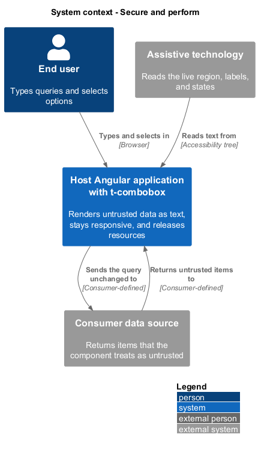
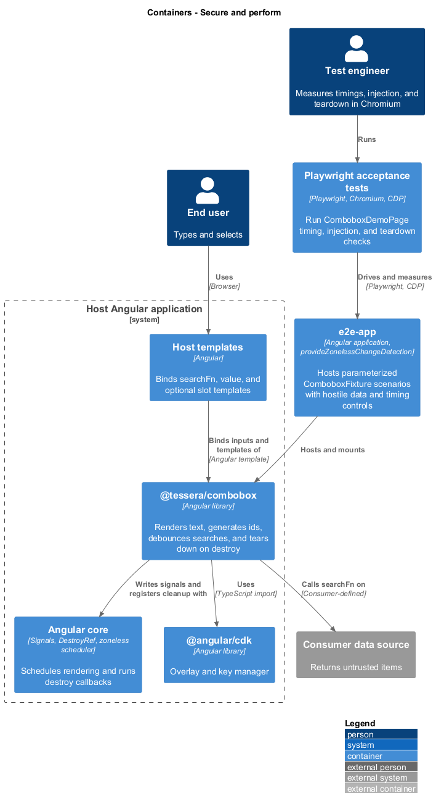
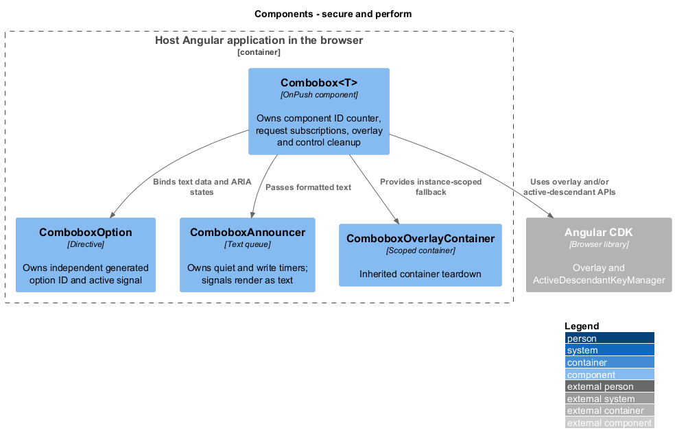
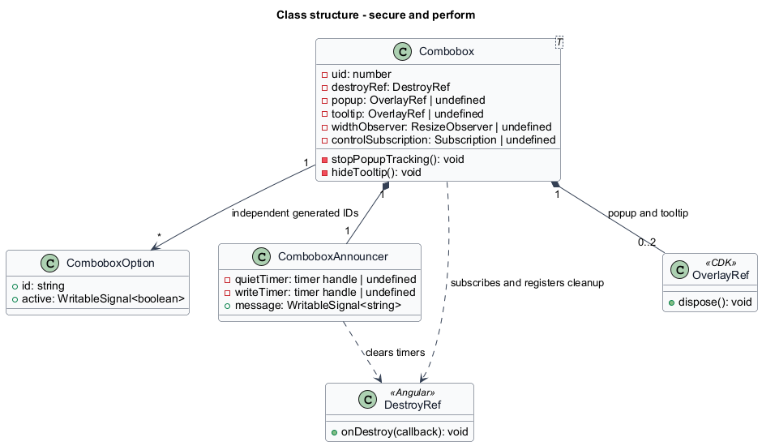
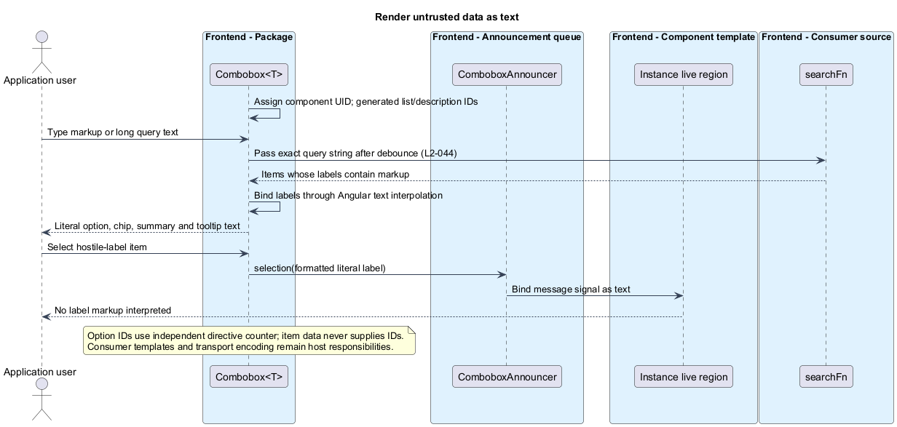
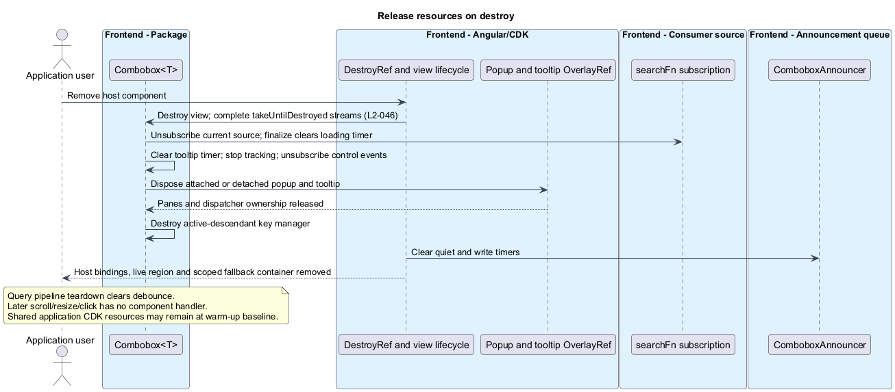

# Secure and perform

## Overview

`t-combobox` renders text it does not author. The consumer's `searchFn` returns items, the host writes the `value`, and the user types the query. Any of these may carry markup or long text. The component also runs inside applications that have no zone.js and that create and destroy it repeatedly. This feature fixes how the component renders untrusted text, how it stays responsive, and how it releases everything it acquires.

**Untrusted data** — data the component does not author, namely `searchFn` results, the written `value`, and typed text

**Cross-site scripting (XSS)** — attack in which injected markup or script runs in the page of another user

**Instance identifier** — string that identifies one element of one component instance, such as a listbox id

**Zoneless change detection** — Angular mode in which signal writes and event bindings, not zone.js patches, schedule rendering

**Teardown** — release of every request, timer, listener, observer, and DOM node that a component instance acquired

**CPU slowdown** — Chromium emulation that runs script slower by a stated factor, such as 4×

The feature belongs to the combobox subsystem and refines `L1-017`. It defines rendering and resource behavior across the component. [Search options](../search-options/) supplies the debounce and cancellation behavior that this feature relies on for responsiveness, and [Expose state to assistive technology](../expose-to-assistive-tech/) supplies the live region that this feature keeps free of markup.

## Description

**Data boundary.** Angular interpolation renders default item labels, chip labels, hidden summaries, errors, status text, tooltips, and announcements as text. The input binds its native value; ARIA bindings carry strings as attributes. Item data never becomes an element identifier. Consumer template markup remains the consumer's responsibility and is limited to non-interactive content.

`Combobox<T>` passes query text unchanged to the consumer, without trimming, case conversion, encoding, or length limits. Authentication, authorization, transport encoding, remote access, and server-side cancellation belong to `searchFn` and its host. The package persists no learner data and sends no telemetry.

**Identifiers.** A module-level component counter assigns `uid` once per instance. A separate module-level option counter assigns an ID when `ComboboxOption` is created. These counters are independent of item data.

| Element | Identifier |
|---------|------------|
| Input | Consumer `inputId`, otherwise `t-combobox-{uid}-input` |
| Listbox | `t-combobox-{uid}-list` |
| Hint, error, summary | `t-combobox-{uid}-hint`, `-error`, `-summary` |
| Tooltip | `t-combobox-{uid}-tooltip` |
| Option | `t-combobox-option-{n}`, independent of component UID and result data |

Generated IDs remain stable for each element's lifetime. Consumers keep supplied input IDs unique. The chip list has no ID. Active and description references point only to the generated hosts; labels, query text, and item identifiers never enter these references.

**Responsiveness.** `Combobox<T>` uses `ChangeDetectionStrategy.OnPush` and signal state. Input handlers update text, cancel stale work, and enqueue debounced queries. They do not wait for remote responses. One request follows a typing burst; the consumer's observable and subscription cancellation control the asynchronous work. Synchronous blocking work inside a consumer callback remains outside the component's scheduling guarantee.

The template tracks chips by item identity and options by result index. Appending preserves existing option hosts; replacement can reuse an indexed host for a different item. Selection checks use `compareWith` against held values. The directive receives selected state through input bindings and owns an active signal. Navigation updates the key manager's old and new active hosts and scrolls only the listbox. Performance is established by measurements rather than an assumed constant-time algorithm.

| Criterion | Target | Sampling conditions |
|-----------|--------|---------------------|
| `L2-045` AC1 | At least 95/100 keystrokes within 100 ms | A 5 s request remains pending; no CPU throttle |
| `L2-045` AC2 | One request | Ten characters 50 ms apart; default debounce |
| `L2-045` AC3 | At least 95/100 renders within 200 ms | 50 options; 4× CPU slowdown |
| `L2-045` AC4 | At least 95/100 toggles within 200 ms | 200 chips; 4× CPU slowdown |
| `L2-045` AC5 | At least 95/100 arrows within 100 ms | Five appended pages of 50 options; no CPU throttle |

The Chromium measurement discards ten warm-ups before collecting 100 samples. Timing starts at browser keydown or source emission and ends at the first animation frame with the expected state, followed by a frame opportunity. The [performance evidence](../../../verification/combobox-performance.md) records raw samples, environment, thresholds, and rerun instructions. Its recorded headless run passes these checks; it does not establish foreground-display or screen-reader latency. Foreground validation remains separate from those recorded samples.

**Zoneless operation.** The package's signal writes and Angular event bindings schedule view updates with `provideZonelessChangeDetection()`. It does not require application `NgZone` calls or zone.js. Form-control events increment a signal to refresh invalid, touched, and required state. Popup geometry callbacks update CDK sizing directly. The zoneless acceptance host exercises search, selection, removal, and keyboard navigation.

**Resource ownership.** Angular view destruction removes host bindings, rendered content, and the instance live region. `takeUntilDestroyed` unsubscribes both query and request pipelines, including debounce and the current source subscription. Request `finalize` clears its loading timer.

| Resource | Owner and release |
|----------|-------------------|
| Popup and tooltip overlay references | `Combobox<T>` disposes both through its destroy callback |
| Field observer and explicit scroll/resize listeners | `stopPopupTracking()` disconnects and removes them on close and destruction |
| Tooltip dismissal timer | `hideTooltip()` clears it on destruction and relevant interactions |
| Key manager | Destroyed on option-collection replacement and component destruction |
| Current form-control event subscription | Unsubscribed on control replacement and destruction |
| Announcement quiet/write timers | `ComboboxAnnouncer` clears them through `DestroyRef` |
| Outside-pointer subscription | `takeUntilDestroyed`; CDK releases overlay dispatcher ownership on disposal |
| Fallback overlay container | Component-scoped `ComboboxOverlayContainer`; inherited teardown removes its container |

Closing detaches the popup and stops tracking but retains the reusable overlay reference. Destruction disposes attached or detached overlays. Application-scoped CDK resources may remain; component-owned panes, timers, listeners, and live-region nodes return to their warm-up baseline. Lifecycle acceptance checks include in-flight cancellation, events after destruction, and 100 mount/destroy cycles.

## Requirements

Source: [L2 detailed requirements](../../../specs/L2.md). The table quotes source wording exactly, including its use of `must`.

| L2 ID | Refines (L1) | Requirement |
|-------|--------------|-------------|
| `L2-044` | `L1-017` | Data returned by `searchFn` and written to the value is untrusted. The component must render it as text, must not interpret it as HTML, and must not derive element ids or ARIA references from it. |
| `L2-045` | `L1-017` | The component must stay responsive while requests are in flight, must not issue a request per keystroke, and must render a page of options promptly. |
| `L2-046` | `L1-017` | The component must use OnPush change detection, must work with `provideZonelessChangeDetection()` and not require zone.js or application `NgZone` calls, and must release its requests, overlay, observers, and listeners when destroyed. |

## Diagrams

The context view shows the data flow that this feature protects: the consumer's data source returns untrusted items, and the component renders them for the user and for assistive technology.

The container view places the package beside Angular core and the CDK in the host application. It also shows the zoneless end-to-end application and the Chromium tests that measure the package.

The component view shows the resource owners. Component and option counters generate identifiers independently of item data.

The class view records the identifier source, the option identifier flow, and the teardown surface of each resource owner.

Hostile text travels from the input and from `searchFn` to the DOM and to the live region as text, and no identifier uses it.

Destruction unsubscribes the request, disposes the overlay, disconnects the observer, and clears timers, so later events reach no component code.

