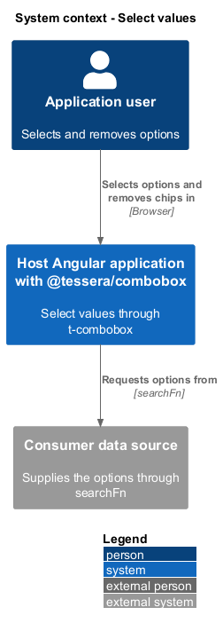
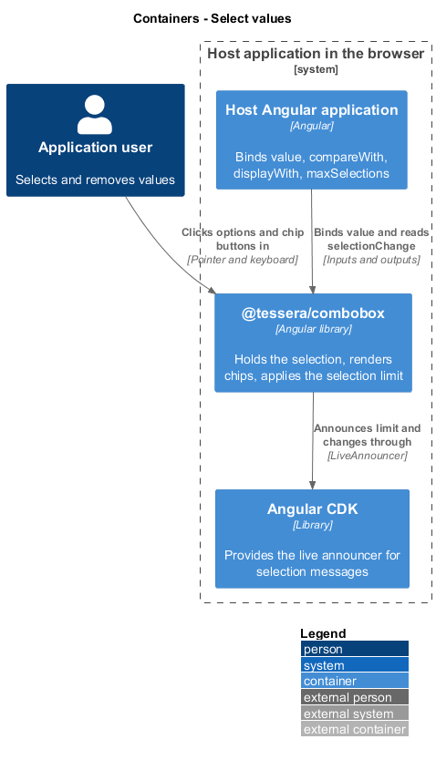
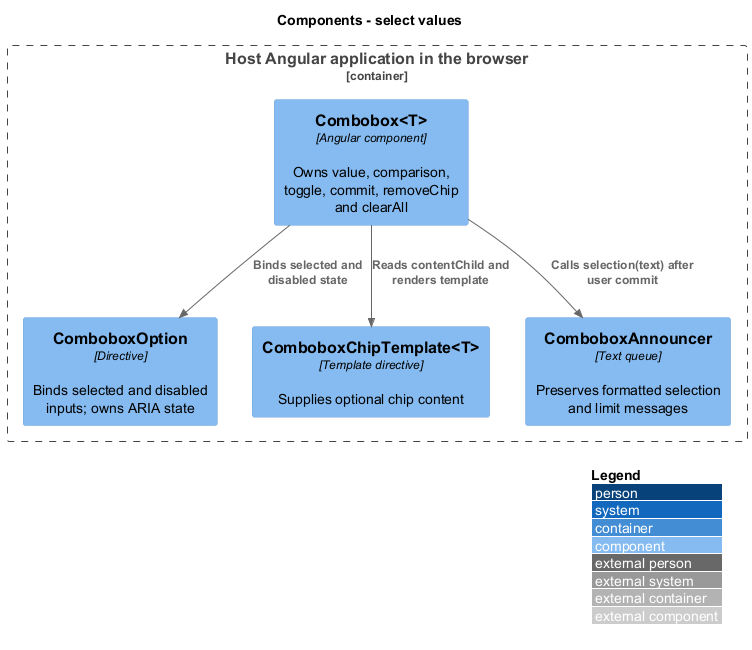
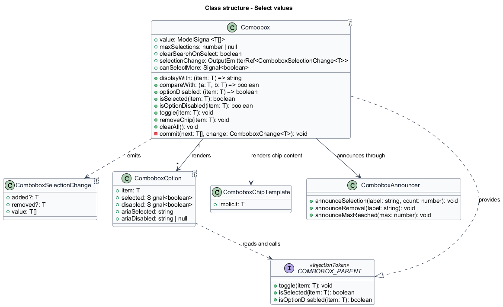
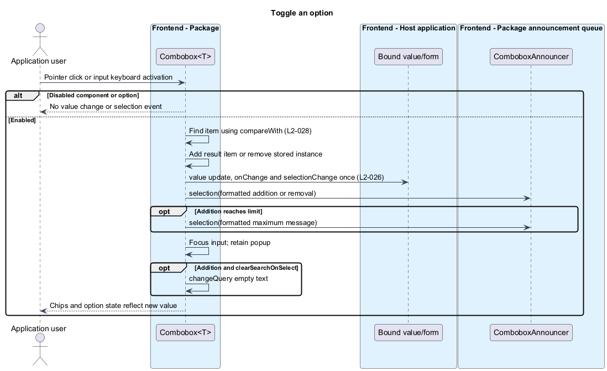
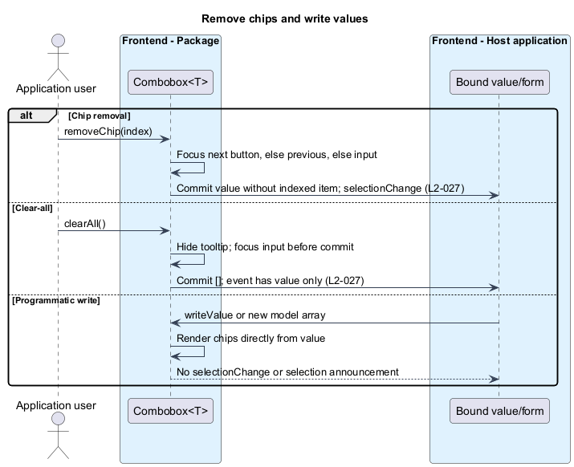

# Select values

## Overview

`t-combobox` lets a user pick multiple options from its results and shows every pick as a removable chip. The selection is the component's value, an array of items. This feature covers selecting and deselecting options, rendering and removing chips, recognising an item that is already selected, and limiting how many items may be selected.

**Selection** — set of items the user has chosen, held in the `value` model as `T[]`

**Chip** — removable token that shows one selected item inside the field

**Remove button** — button inside a chip that removes that chip's item from the selection

**Clear-all button** — button that removes every item from the selection

**Selection limit** — optional maximum count of selected items, set through `maxSelections`

Results come from the search feature. A selected item need not appear in the current results, because the chips render from the value itself. Two result objects may describe the same entity, so identity comes from a consumer-supplied comparison and not from object reference.

The list stays open after a selection and DOM focus stays on the input, so a user can search and pick repeatedly without reopening the list. Selected options are not pinned to the top of the results (v1 decision).

## Description

The slice lives inside `Combobox<T>` and `ComboboxOption<T>`. It adds no new class.

### Inputs and outputs

| Name | Kind | Default | Purpose |
|------|------|---------|---------|
| `value` | `model<T[]>` | `[]` | Selection, two-way bound |
| `displayWith` | input | `String` | Label of an item for chips, options, and announcements |
| `compareWith` | input | `Object.is` | Identity of two items |
| `optionDisabled` | input | `() => false` | Per-item disabled state |
| `maxSelections` | input | `null` | Selection limit; `null` means no limit |
| `clearSearchOnSelect` | input | `false` | Clears the query after a selection |
| `selectionChange` | output | none | `ComboboxSelectionChange<T>` for a user-made change |

`ComboboxSelectionChange<T>` has an optional `added`, an optional `removed`, and the new `value` array.

### Derived state

- `isSelected(item)` returns true when `value()` holds an item for which `compareWith` returns true. Each option reads it to set `aria-selected` to `"true"` or `"false"` and to show the checked indicator. The indicator is decorative and carries `aria-hidden`.
- `canSelectMore` is a `computed()` that is true when `maxSelections` is `null` or `value().length` is below it.
- `isOptionDisabled(item)` is true when `optionDisabled(item)` is true, or when `canSelectMore` is false and the item is not selected. Each option binds it to `aria-disabled`. A selected option stays enabled at the limit, so the user can deselect it.

### Toggling an option

`Combobox<T>.toggle(item)` is the single entry point for pointer and keyboard activation.

1. It returns without effect when the component is disabled or `isOptionDisabled(item)` is true. No change occurs and no `selectionChange` is emitted (`L2-026`).
2. It looks up the item in `value()` with `compareWith`.
3. When found, it builds the next array without that entry and calls `commit(next, { removed })`. `removed` is the instance the value held, which may differ from the instance in the results. The option's `aria-selected` becomes `"false"`.
4. When not found, it appends the item and calls `commit(next, { added: item })`. The option's `aria-selected` becomes `"true"`.

`commit(next, change)` sets `value`, notifies the form control through `onChange` (see [Integrate with forms](../integrate-forms/)), emits `selectionChange` once with `{ ...change, value: next }`, and calls `ComboboxAnnouncer`. Only the user paths `toggle`, `removeChip`, and `clearAll` call `commit`. A programmatic write through `writeValue` or the `[(value)]` binding replaces `value` without calling `commit`, so `selectionChange` does not emit (`L2-026`). The announcement text for a selection or removal belongs to [Expose state to assistive technology](../expose-to-assistive-tech/).

Pointer activation uses `click`, with `mousedown.preventDefault()` to retain input focus for mouse and compatibility mouse events. Touch pointerdown is not cancelled, so native list scrolling remains possible. A click after a tap calls the same toggle method and synchronously restores input focus. The list stays open. `clearSearchOnSelect` clears the query only after adding a selection, not after deselection, removal, or clear-all; the search feature applies `minSearchLength`.

### Value identity

Matching always goes through `compareWith`. With value `[{ id: 1 }]` and a comparison on `id`, a new object `{ id: 1 }` returned by `searchFn` renders as selected, and activating it deselects the stored entry and removes it from `value`. Without `compareWith`, `Object.is` applies.

### Selection limit

- At the limit, `canSelectMore` is false. Unselected options get `aria-disabled="true"` and `toggle` ignores them. Selected options remain selectable for deselection.
- `ComboboxAnnouncer` announces "Maximum of {max} selections reached." when a selection reaches the limit and again each time the list opens while the limit holds. The string comes from `COMBOBOX_I18N`. How this message coalesces with the selection announcement is a decision of [Expose state to assistive technology](../expose-to-assistive-tech/).
- A deselection makes `canSelectMore` true, and the unselected options become enabled again.
- A programmatic write with more items than `maxSelections` keeps and renders all of them. The comparison is `length < maxSelections`, so `canSelectMore` is false and no further option can be selected.
- With `maxSelections` of `null`, no limit applies.

### Chips

The field renders `value()` in a `<ul>` of `<li>` elements in selection order. Each chip shows `displayWith(item)`, or the `tComboboxChip` template content when supplied, and holds a remove button. The chips render from `value`, so an item never returned by `searchFn` still appears.

- **Remove.** `removeChip(item)` chooses the focus destination first: the next chip's remove button, else the previous chip's remove button, else the input. It focuses that element, then calls `commit(next, { removed: item })`. Chips are tracked by item, so the destination element survives the removal, and focus is never lost to the page body.
- **Clear-all.** The `@if (value().length > 0)` block renders the clear-all button, so it is absent for an empty value. `clearAll()` calls `commit([], {})`, which emits `selectionChange` once with `{ value: [] }` and no `removed` property, and focuses the input. It is a text button showing its name, below the field at the inline end of the hint row, so it cannot be mistaken for a control that clears the typed text ([Present the component accessibly](../present-accessibly/)).
- **Long labels.** The label uses ellipsis within the field width. The remove button keeps the full accessible name. A component-owned full-label tooltip appears on chip hover and remove-button focus. It is hoverable, persists across pointer movement into the tooltip, and dismisses on Escape before popup or query handling. It does not contain controls or enter Tab order. Its surface and text use the theme tokens. The tooltip lives inside a dialog host when present and is removed on destruction (`L2-027` criterion 9).

- **Many chips.** Only the chip list scrolls, with `max-height: 8rem`, `overflow-y: auto`, and wrapping children. The input follows the list in the field's wrapping flex layout: beside the chips while they fit on one row, and on the row below once they wrap, so it remains visible without sticky positioning. Clear-all sits below the field. The `--t-combobox-chip-list-max-height` token permits a consumer override. Focused chips scroll within this area without moving the page.

The chip list name, the remove-button name "Remove {label}", and the clear-all name "Clear all selections" come from `COMBOBOX_I18N`. The keyboard operation of chips belongs to [Operate by keyboard](../operate-by-keyboard/).

### Test support

`ComboboxDemoPage` owns the selectors for options, chips, remove buttons, and clear-all. `ComboboxHarness` exposes `toggleOption()`, `getChips()`, and `removeChip()` to consumer tests.

## Requirements

Source: [L2 detailed requirements](../../../specs/L2.md). The table quotes the source wording exactly, including its modal verb.

| L2 ID | Refines (L1) | Requirement |
|-------|--------------|-------------|
| `L2-026` | `L1-010` | Activating an option by pointer or keyboard must toggle its selection, keep the list open and the input focused, and keep selected options in the list shown as selected. The search text must be kept unless `clearSearchOnSelect` is true. |
| `L2-027` | `L1-010` | Each selected value must render as a chip with a remove button, even when the value is not in the current results. A clear-all button must remove every value. Long labels and many selections must not break the layout. |
| `L2-028` | `L1-010` | Selected values must be matched by `compareWith` (default `Object.is`) so that new object instances for the same entity are recognised. When `maxSelections` is reached, unselected options must be disabled and the limit announced. |

## Diagrams

The context view shows the user choosing options in a host application that supplies the results.

The container view shows the selection held inside `@tessera/combobox`, with the host reading the value and the component announcing changes through its own live region.

The component view shows `Combobox<T>` committing every user change and each option reading selection and limit state from it.

The class view records the inputs, derived state, and change payload of the slice.

Activating an option toggles it, emits one change, and applies the limit. A disabled option changes nothing.

Removing a chip focuses the next destination before the removal commits. Clear-all empties the value, and a programmatic write renders chips without an event.

