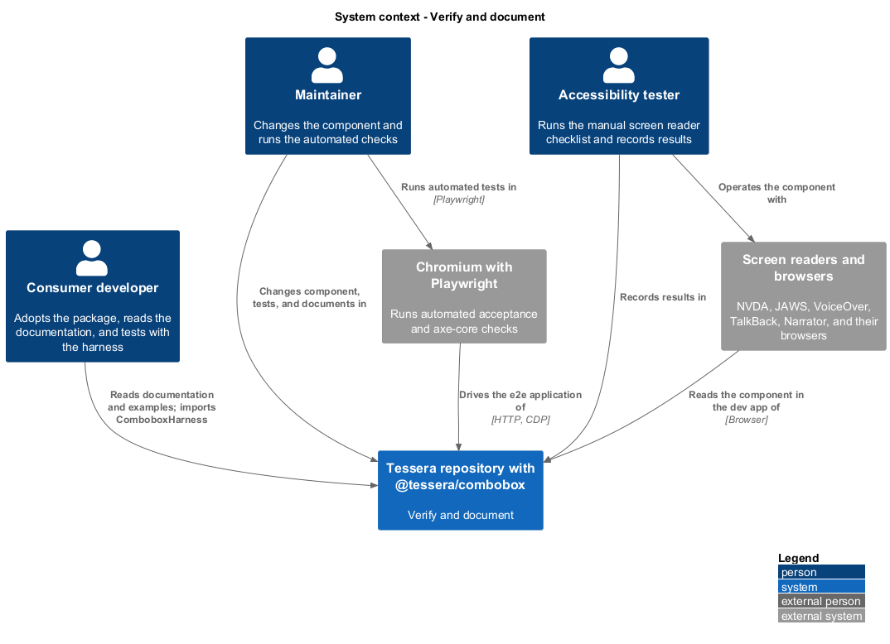
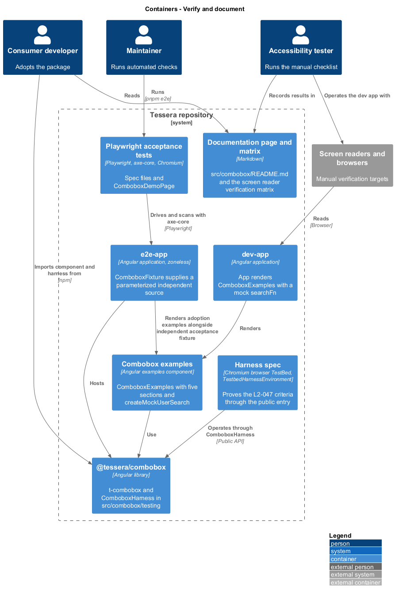
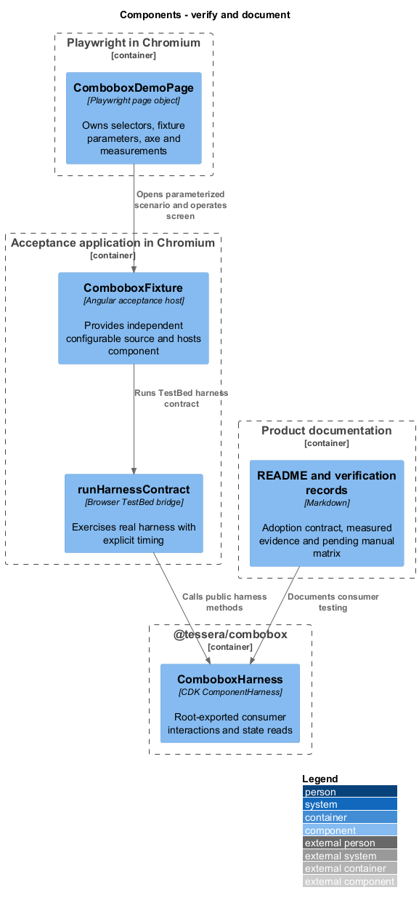
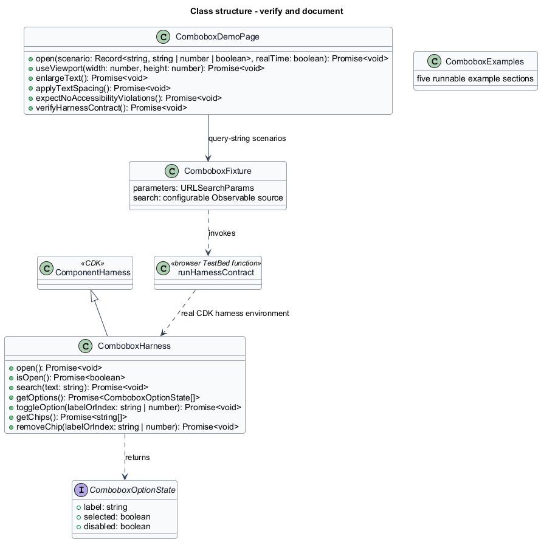
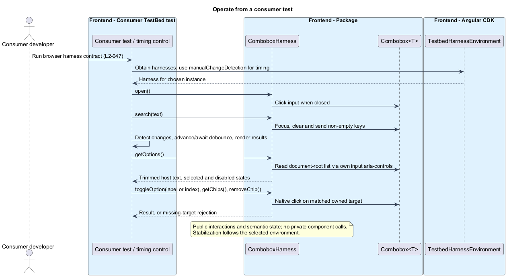
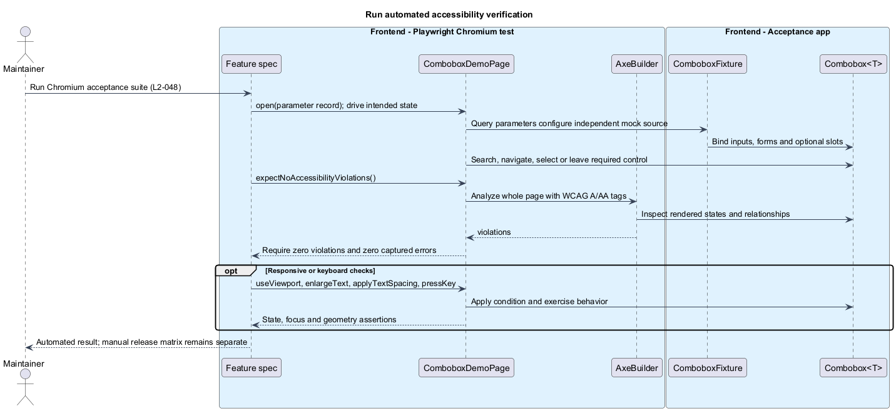

# Verify and document

## Overview

`t-combobox` ships with the means to test it, to prove its accessibility, and to adopt it. This feature describes those means: a harness for consumers' tests, automated accessibility checks, a manual screen reader procedure with a record, and a documentation page with runnable examples. Automated observations and pending manual release checks are recorded separately from the product design.

**Component harness** — class that wraps one component's DOM behind a stable test API, built on the CDK `ComponentHarness`

**Page object** — class that owns the selectors and interactions of one screen, so that tests state intent only

**axe-core** — rule engine that detects accessibility defects in a rendered page

**Screen reader** — assistive technology that presents on-screen content as speech or braille

**Verification matrix** — table that records, for each screen reader and browser combination, the date, version, result, and defects

**Definition of done** — list of conditions under which the component counts as complete

Automated tests cannot judge what a screen reader says, so the design pairs two kinds of verification. Chromium Playwright tests cover keyboard behavior, layout, and axe-core rules on every change. Manual runs with five screen readers cover speech output and are recorded in the repository. The harness serves consumers, who write tests against the component without knowing its markup.

The feature belongs to the combobox subsystem and refines `L1-018`. It covers all component features through a shared page object and accessibility-checking method.

## Description

**Consumer harness.** `ComboboxHarness` extends CDK `ComponentHarness` in `src/combobox/testing/combobox-harness.ts`. The package root exports it and `ComboboxOptionState`; there is no testing secondary entry point. `ComboboxOptionState` contains `label`, `selected`, and `disabled`.

| Method | Behavior |
|--------|----------|
| `open()` | Click the input when closed; no action when open |
| `isOpen()` | Read the input's expanded state |
| `search(text)` | Focus and clear the input, then send non-empty text as key events |
| `getOptions()` | Return trimmed option-host text and selected/disabled state in order |
| `toggleOption(labelOrIndex)` | Open, find a label or zero-based integer index, and click; reject a missing target |
| `getChips()` | Return trimmed chip-label-wrapper text in selection order |
| `removeChip(labelOrIndex)` | Click the matched remove button; reject a missing target |

The harness reads semantic attributes and package-owned DOM hooks. It never calls private component members. It locates the listbox at document root through its own input's `aria-controls`, covering inline and fallback placement and multiple instances. Option labels include custom content within the option host; chip labels include custom chip content. No filter predicate is supplied.

Search timing follows the selected harness environment. The harness does not advance timers or wait explicitly for results. Timing-sensitive consumer tests control debounce and rendering through CDK `manualChangeDetection` or their environment's stabilization policy.

**Automated verification.** `ComboboxDemoPage` in `test/e2e/pages/combobox-demo-page.ts` owns selectors and interactions. `open(scenario)` serializes a `Record<string, string | number | boolean>` into query parameters. `ComboboxFixture` in `src/e2e-app/src/app/combobox-fixture.ts` reads these parameters, hosts the production component, and provides its own controllable search observable. The acceptance source is separate from the examples' mock.

The harness contract runs through `runHarnessContract()` in `combobox-harness-contract.ts`, using a real browser TestBed fixture and `TestbedHarnessEnvironment`. `test/e2e/combobox-harness.spec.ts` invokes it through the page object. The contract uses explicit change detection and timing and destroys its fixture afterward.

Chromium is the only automated frontend browser. `expectNoAccessibilityViolations()` runs `AxeBuilder` over the page with `wcag2a`, `wcag2aa`, `wcag21a`, `wcag21aa`, and `wcag22aa` tags. It also checks captured page and console errors. Feature tests cover closed, result, loading, empty, error, required/touched, disabled, maximum-reached, and custom-template states. They contain requirement comments and use the page object for selectors.

| Verification area | Acceptance files |
|-------------------|------------------|
| Search and paging | `combobox.spec.ts`, `combobox-paging.spec.ts`, `combobox-configuration.spec.ts` |
| Selection and forms | `combobox-selection.spec.ts`, `combobox-forms.spec.ts` |
| Keyboard, announcements, popup | `combobox-keyboard.spec.ts`, `combobox-announcements.spec.ts`, `combobox-popup.spec.ts`, `combobox-positioning.spec.ts` |
| Presentation and input | `combobox-presentation.spec.ts`, `combobox-touch.spec.ts`, `combobox-tooltip.spec.ts` |
| Customisation and hardening | `combobox-customization.spec.ts`, `combobox-security.spec.ts`, `combobox-lifecycle.spec.ts` |
| Consumer adoption | `combobox-harness.spec.ts`, `combobox-examples.spec.ts`, `combobox-packed.spec.ts` |
| Measured responsiveness | `combobox-performance.spec.ts`, isolated with one worker |

Responsive checks cover 320, 576, 768, 992, 1200, and 1920 CSS px, a 320 by 256 reflow viewport, 200% text, and WCAG text-spacing overrides. Page-object helpers include `useViewport(width, height)`, `enlargeText()`, `applyTextSpacing()`, and `expectResponsiveField()`. A reflow viewport does not establish actual browser zoom.

`pnpm e2e` excludes render-latency samples; `pnpm e2e:performance` runs the isolated measurements. After a library build, `pnpm e2e:packed` installs the tarball into a separate consumer, compiles the README adoption snippets, and runs Chromium acceptance checks without repository aliases or manual CDK stylesheet setup. `pnpm api:check` compares built exports against both package goldens. The [implementation record](../../../verification/combobox-implementation.md) and [performance record](../../../verification/combobox-performance.md) hold observed results separately from the design contract.

**Manual release verification.** The [screen reader matrix](../../../verification/combobox-screen-reader-matrix.md) records combination, date, versions, result, defects, and sign-off. Required combinations are NVDA/Chrome and JAWS/Chrome on Windows, VoiceOver/Safari on macOS and iOS, TalkBack/Chrome on Android, and Narrator/Edge on Windows. No Firefox automated or manual run is part of this matrix.

Each run records tester, revision including local changes, fixture, device, AT/browser/OS/package versions, and keyboard setup. The checklist covers label/role/selection speech, expanded state, loaded counts, selected and disabled options, ordered selection/removal announcements, errors, required state, keyboard-only interaction, RTL, and tooltip-first dismissal. Normal, CDK dialog, and native dialog hosts are included. Mobile runs check swipe reading order and actual on-screen keyboard retention, then repeat keyboard operation with a hardware keyboard.

Layout verification includes 320 CSS px, actual 200% zoom, 200% text, text spacing, forced colors, and reduced motion where supported. Desktop Chrome additionally uses a real 1280 by 1024 window at actual 400% browser zoom. Unsupported platform settings carry a reasoned Not applicable result; required supported checks retain Not run until executed.

The current matrix records these manual gates as Not run. Release requires all `L2-022` to `L2-050` acceptance criteria, zero axe violations, zoneless operation, packed-package checks, and a dated signed-off manual matrix with no open failures. Automated passes do not complete manual rows.

**Documentation and examples.** `src/combobox/README.md` documents installation, label requirements, inputs/outputs, forms/model binding, slots, i18n keys, keyboard behavior, accessibility, security boundaries, harness use, and release conditions. `tools/package-docs-compile/combobox.mjs` compiles its TypeScript and HTML adoption snippets in the packed consumer.

`ComboboxExamples` in `src/components-examples/tessera/combobox/combobox-examples.ts` contains five runnable sections: reactive forms, template-driven forms, two-way model, custom content, and paging. It uses `ExampleLearner`, `EXAMPLE_LEARNERS`, and `createMockUserSearch(pageSize = 20)` from `mock-user-search.ts`. The in-memory source filters learner names, slices pages, supplies total/hasMore, and applies a 150 ms observable delay. The paging section uses page size three. The reactive example demonstrates binding without declaring required validation.

The dev app's `App` renders `<tsr-combobox-examples>` beside the player example. The acceptance app also renders these examples for adoption checks. One shared examples component supplies all five adoption sections.

## Requirements

Source: [L2 detailed requirements](../../../specs/L2.md). The table quotes source wording exactly, including its use of `must`.

| L2 ID | Refines (L1) | Requirement |
|-------|--------------|-------------|
| `L2-047` | `L1-018` | The package must ship a component harness in `src/combobox/testing/` that lets consumers' tests operate and inspect the combobox without depending on its DOM. |
| `L2-048` | `L1-018` | Every component change must ship with automated accessibility tests, and the automated verification must run in Chromium with Playwright using page objects. |
| `L2-049` | `L1-018` | Before the component is released, manual verification must be completed with the assistive technology and browser combinations below, and the results recorded. |
| `L2-050` | `L1-018` | The package must ship a documentation page and runnable examples for adopting the combobox. |

## Diagrams

The context view shows the three people who use the verification and documentation kit: the consumer developer, the maintainer, and the accessibility tester. It also shows the external browsers and screen readers.

The container view separates the package, its examples, the dev app, the end-to-end application, the Playwright tests, and the repository documents.

The component view shows the harness, the page object, the fixture, the spec files, and the documents that make up the kit.

The class view records the harness API, page object, parameterized acceptance fixture, browser TestBed bridge, and examples component.

A consumer test operates the combobox through the harness, which finds the listbox through the input's `aria-controls` identifier.

A Playwright test enters a state through `ComboboxDemoPage` and runs axe over the page, including the open list. Responsive and keyboard checks use the same page object.

