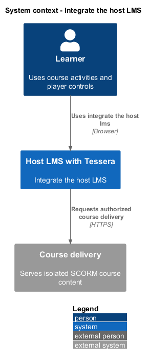
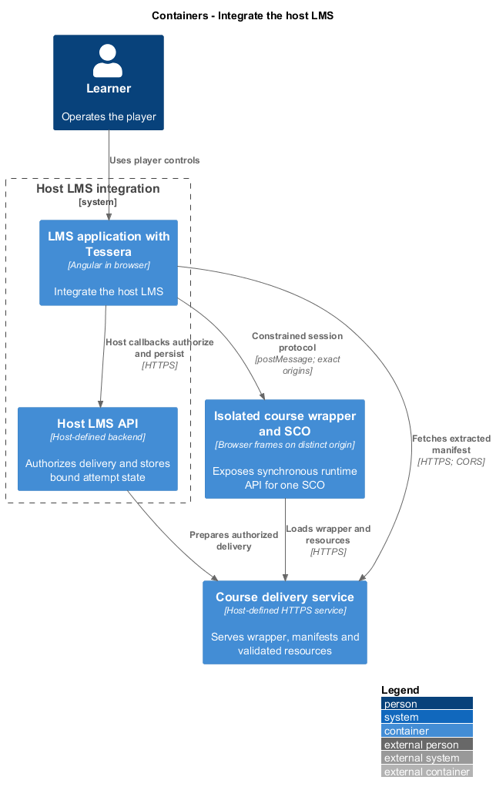
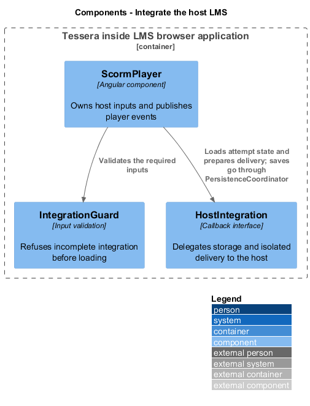
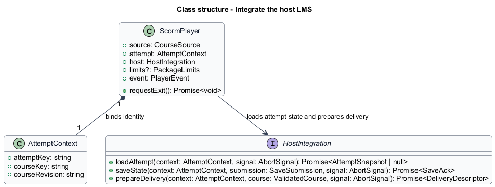
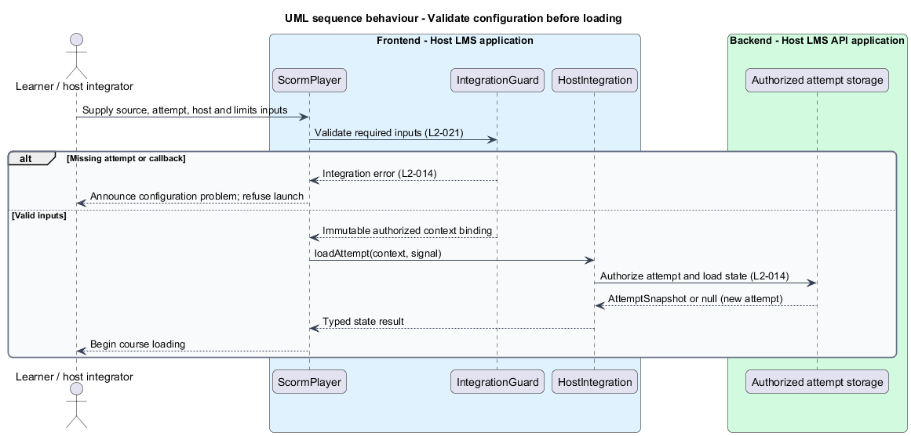
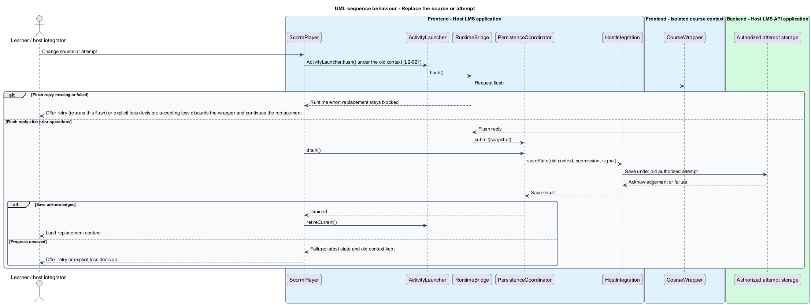

# Integrate the host LMS

## Overview

Tessera supplies an Angular component for a learning management system (LMS), the host application that authorizes learners and stores course progress.

**Attempt context** — host-issued identity binding one learner, one course revision, and one attempt

This feature connects the host application to the browser player before course loading starts. Course scripts never establish that identity. The same public component interface accepts an archive or an extracted manifest.

## Description

The repository contains requirements and an HTML mock in `docs/mocks/scorm-player/`. It contains no production component. The types below are proposed design elements.

- `ScormPlayer`, in `src/scorm-player/scorm-player.ts`, is the standalone Angular component exported by `public-api.ts` and `index.ts`.
- `ScormPlayer` has four inputs, `source: CourseSource`, `attempt: AttemptContext`, `host: HostIntegration`, and an optional `limits: PackageLimits` that falls back to the package defaults, and one `event: PlayerEvent` output.
- `CourseSource` is a discriminated union of `{kind: 'zip', file: File}` and `{kind: 'manifest', manifestUrl: string}`.
- `AttemptContext` contains an opaque `attemptKey`, a `courseKey`, and a `courseRevision`. The host binds these values to its authenticated learner.
- `HostIntegration` supplies `loadAttempt`, `saveState`, and `prepareDelivery` functions. Their browser calls resolve asynchronously.
- `IntegrationGuard` checks required inputs before any network request for course content. Invalid configuration emits a sanitized `PlayerError` with category `integration`.
- `PlayerEvent` carries load state, save state, acknowledged outcomes, or categorized errors. Event payloads exclude raw runtime values except in the documented persistence contract.

`loadAttempt(context, signal)` resolves to a versioned `AttemptSnapshot`, or to `null` for a new attempt. A read failure rejects; it never resolves to `null`, so it cannot silently start a new attempt. `saveState(context, submission, signal)` returns an acknowledgement containing the submitted revision. `prepareDelivery(context, validatedCourse, signal)` returns an isolated delivery descriptor.

The library is one package without secondary entry points. Angular CLI configuration in `angular.json` builds it through `src/scorm-player/ng-package.json`. Consumer examples belong in `src/components-examples/tessera/scorm-player/`; the development and acceptance applications belong in `src/dev-app/` and `src/e2e-app/`. Browser execution is the supported target.

The host checks authorization on every delivery, read, and save request. The component checks configuration but cannot prove server authorization. The public contract contains no bearer tokens, host cookies, or learner identity obtained from a SCO.

Changing `source` or `attempt` initiates the same flush and unsaved-state workflow as an explicit exit. The component prevents replacement until the host acknowledges the latest revision or the learner explicitly accepts loss. If the flush itself fails, the same choice is offered; Retry re-runs the pending replacement (flush, then drain); accepting loss discards the unresponsive wrapper and continues the replacement. Callbacks remain bound to the old immutable context until that workflow finishes.

Decided for the first implementation: Angular 22 (standalone, signals, zoneless), selector `tsr-scorm-player`, inputs `source`, `attempt`, `host` and `limits`, and one `event` output carrying the `PlayerEvent` union. `IntegrationGuard` is `checkIntegration` in `src/scorm-player/integration-guard.ts`; it reports `attempt-missing`, `source-missing`, `host-missing` and `host-incomplete`. Host endpoint routes, snapshot migration policy, and the authorization mechanism remain `<TO SUPPLY>`. These choices precede public API publication.

Each production slice follows the source Given-When-Then criteria. A Chromium Playwright consumer test imports the package through its public API. Its `PlayerPage` owns selectors and interactions. Missing-input and unauthorized-context cases run red before production implementation.

## Requirements

Source: [L2 detailed requirements](../../../specs/L2.md). The table quotes source wording exactly, including its use of `must`.

| L2 ID | Refines (L1) | Requirement |
|-------|--------------|-------------|
| `L2-014` | `L1-006` | The host LMS must authorize course access and supply an opaque attempt context before the player loads content. The player must never treat an identifier or claim from course content as authority to switch learners, courses, or attempts. |
| `L2-021` | `L1-005` | The player must be consumable as the standalone `@tessera/scorm-player` Angular package. Its documented public interface must let an LMS provide either supported course source, the authorized attempt context, the host persistence functions, and receive state and error events. Browser support is required; server-side rendering is not required. |

## Diagrams

The context view places this capability between the learner, the host LMS, and isolated course delivery. Authorization remains the host's responsibility.

The container view separates the LMS browser application, host API, isolated course frames, and course delivery. Tessera deploys as part of the LMS browser application.

The component view shows the proposed collaborators for this slice. Components inside the course boundary hold only the current SCO's allowed runtime state.

The class view records the proposed fields, methods, and ownership relationships. Types shared between slices retain the same meaning throughout the design tree.

The guard rejects missing inputs before course execution. The host authorizes reads against the supplied immutable context.

Input replacement waits for the previous context's flush workflow. A save failure leaves the replacement pending.

