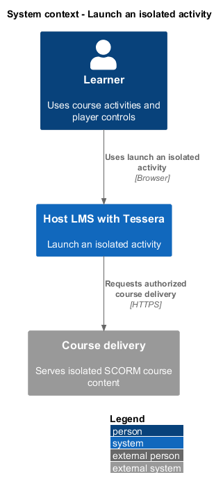
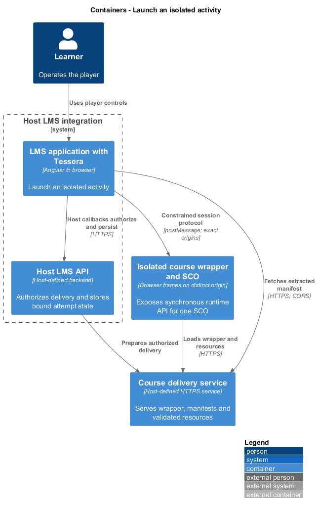
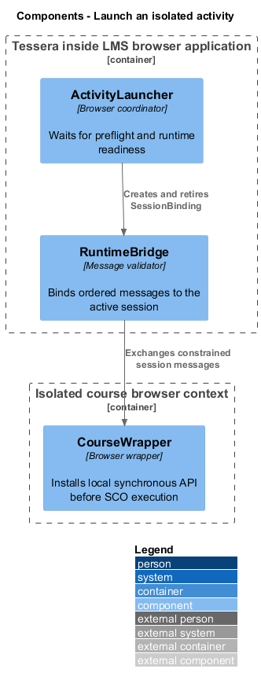
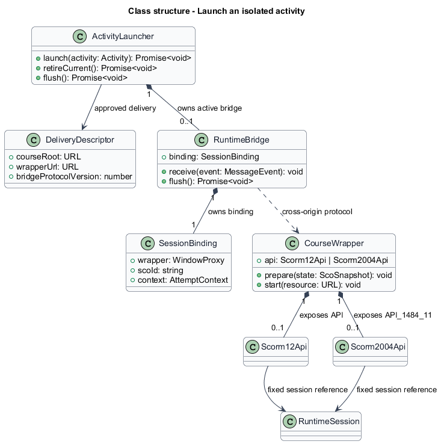
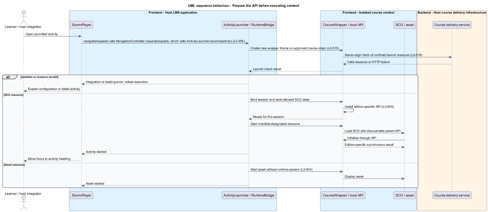
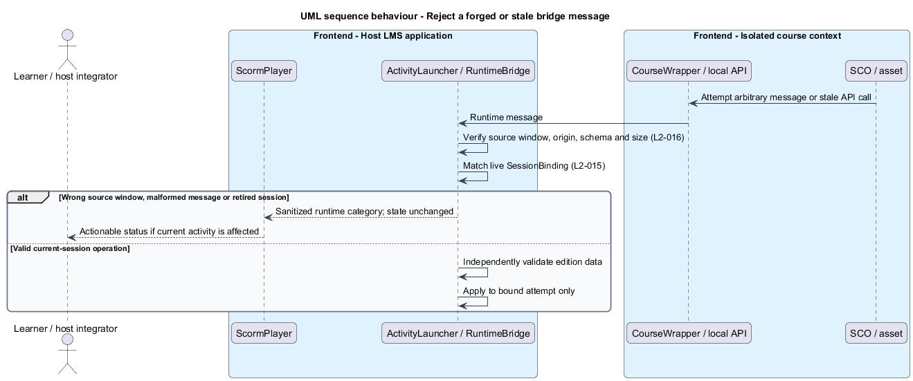

# Launch an isolated activity

## Overview

A learner opens an activity from the validated course structure.

**Sharable content object (SCO)** — course resource that uses the edition-specific SCORM runtime API

**Asset** — course resource that does not require a SCORM runtime session

The launch feature displays either resource inside an isolated course context. It establishes a SCO's API before the launch page executes. The host LMS supplies course delivery without exposing its application state.

## Description

- `ActivityLauncher` coordinates preflight, final-state transfer, session retirement, and the selected launch resource. Its `flush()` asks `RuntimeBridge.flush()` for the current session's final state without launching anything, for exit and source or attempt replacement.
- `DeliveryDescriptor` names a host-approved `courseRoot`, `wrapperUrl`, and supported `bridgeProtocolVersion`. Exact-origin checks use `courseRoot.origin`.
- `CourseWrapper` is a browser wrapper served on the isolated course origin. It hosts one nested course frame and the synchronous runtime object.
- `RuntimeBridge`, in `src/scorm-player/runtime/`, validates cross-origin messages and binds them to a single live `SessionBinding`.
- `SessionBinding` contains the SCO identifier, the live wrapper window, and the immutable host attempt context.
- `CourseWrapper` exposes `Scorm12Api` as `API` or `Scorm2004Api` as `API_1484_11`; each adapter holds its `RuntimeSession`. A host-side `RuntimeSession` validates the ordered changes independently.

The delivery origin differs from the LMS origin and contains no LMS cookies or credentials. The host isolates concurrent learner attempts from course-origin storage and server resources. A dedicated ephemeral origin per active attempt avoids another attempt's browser storage. Host cookies never scope across that boundary.

The outer frame uses `sandbox="allow-scripts allow-same-origin"` on the distinct course origin. The wrapper and nested course frame share that origin so the SCO can discover its parent API. Top navigation, popups, and extra sandbox capabilities remain denied unless an explicit reviewed host policy provides them.

Same-origin access inside the course boundary is untrusted. The wrapper holds only the current SCO's allowed state. The host retains prior SCO and other-attempt state outside that boundary. Runtime claims never confer authority.

The bridge verifies the exact `event.origin`, that `event.source` is the live wrapper window, and the message's protocol version, schema, and size. Each session gets a new wrapper iframe, so a retired session's window never matches the live binding. Messages carry no attempt, learner, or SCO identity; the binding supplies it. Outbound messages use an exact target origin. Unknown message kinds and messages from retired windows fail without mutating state. Origin checks follow [MDN's postMessage guidance](https://developer.mozilla.org/en-US/docs/Web/API/Window/postMessage).

The wrapper checks the launch resource with a same-origin `fetch` before loading it, because an iframe load event alone cannot prove HTTP success. A failed check reports the activity as a loading error. The wrapper sends ready only after its API and restored state exist. The launcher then permits SCO execution. An asset skips runtime initialization.

Activity changes send the wrapper a flush request before retirement; a Terminate the host has already validated counts as the flush reply. Because `postMessage` delivers one window's messages in order, the flush reply follows every earlier operation. The host validates and retains those operations, then removes the old iframe. A missing or failed flush reply leaves the activity change blocked with a runtime error. When the current session already holds that runtime error, `launch()` discards the unresponsive wrapper instead of waiting for a flush again. Retrying that error discards the unresponsive wrapper and relaunches from the state the host has already validated; operations the host never received are lost, and the runtime `PlayerError` text says so. Late old-session messages never target the replacement session.

The wrapper build and deployment contract, per-attempt origin provisioning, CSP and cookie settings, redirect validation, bridge byte limits, handshake timeout, and permitted course capabilities are `<TO SUPPLY>`. A host that cannot satisfy isolation and synchronous API discovery receives an integration error before launch. Browser sandbox behavior is described in [MDN's iframe reference](https://developer.mozilla.org/en-US/docs/Web/HTML/Reference/Elements/iframe).

Acceptance fixtures try host DOM, cookie, and storage access. Forged messages, another SCO's stale API, missing wrapper readiness, launch-resource failure, and asset launch each form separate Chromium ATDD slices.

## Requirements

Source: [L2 detailed requirements](../../../specs/L2.md). The table quotes source wording exactly, including its use of `must`.

| L2 ID | Refines (L1) | Requirement |
|-------|--------------|-------------|
| `L2-004` | `L1-002` | The player must launch the resource selected by the manifest and make the edition-specific SCORM API available before a sharable content object (SCO) runs. Each runtime session must belong to one SCO and one learner attempt. |
| `L2-015` | `L1-006` | The player must run course content in an isolated execution context that cannot read host credentials, other learner attempts, or arbitrary host application state. The host must provide a delivery origin and runtime bridge that preserve SCORM API access without granting course content direct access to the LMS application. |
| `L2-016` | `L1-006` | The player must validate package paths, runtime values, and bridge messages, and must keep learner data out of URLs, console output, and diagnostic events unless explicitly required for the host callback contract. |

## Diagrams

The context view places this capability between the learner, the host LMS, and isolated course delivery. Authorization remains the host's responsibility.

The container view separates the LMS browser application, host API, isolated course frames, and course delivery. Tessera deploys as part of the LMS browser application.

The component view shows the proposed collaborators for this slice. Components inside the course boundary hold only the current SCO's allowed runtime state.

The class view records the proposed fields, methods, and ownership relationships. Types shared between slices retain the same meaning throughout the design tree.

The launcher waits for isolated delivery and restored runtime readiness. Assets open without a SCO runtime session.

Validation uses the sender window and active binding as well as the origin. A course-provided attempt identifier cannot select host state.

