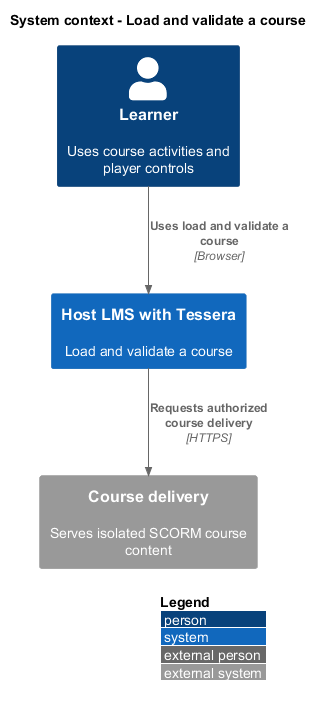
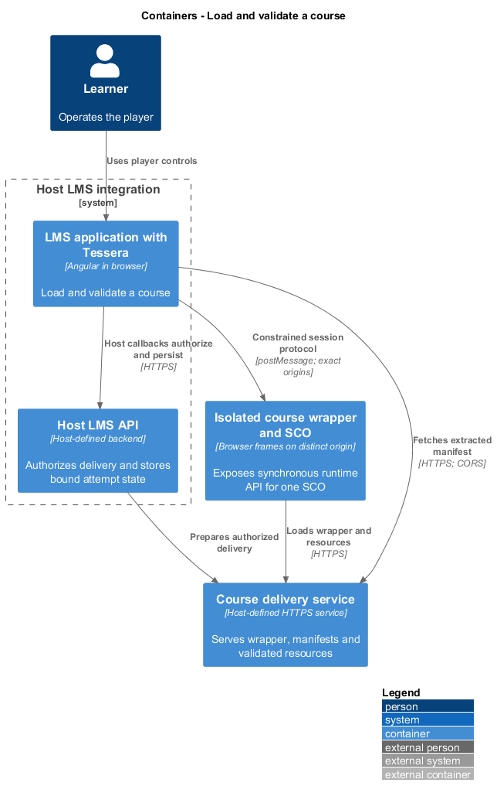
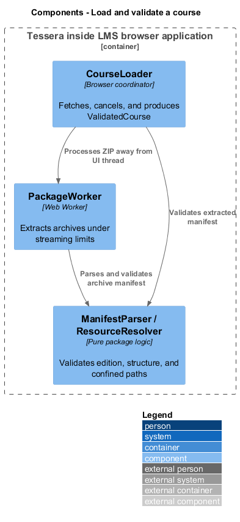
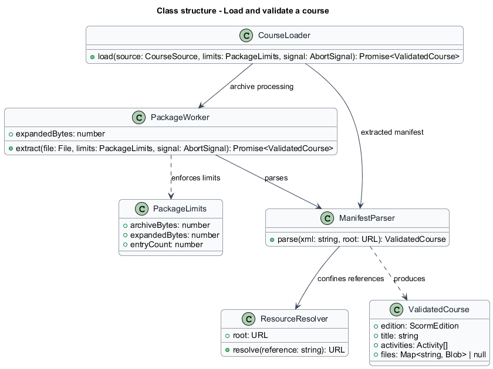
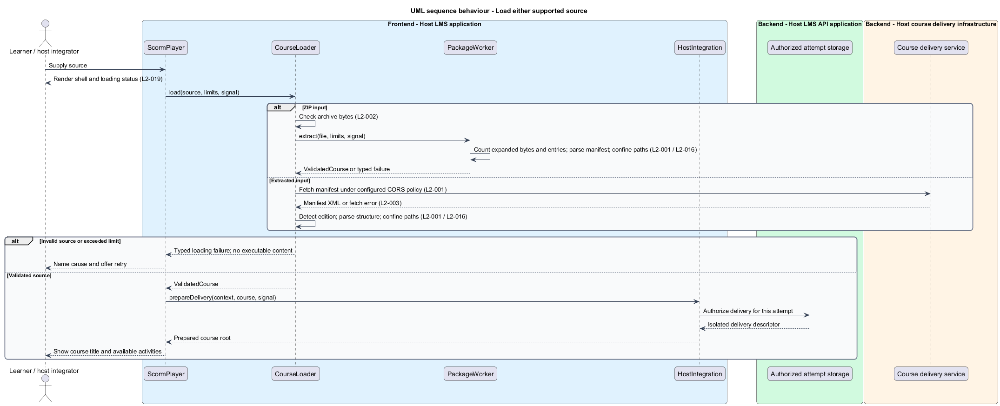
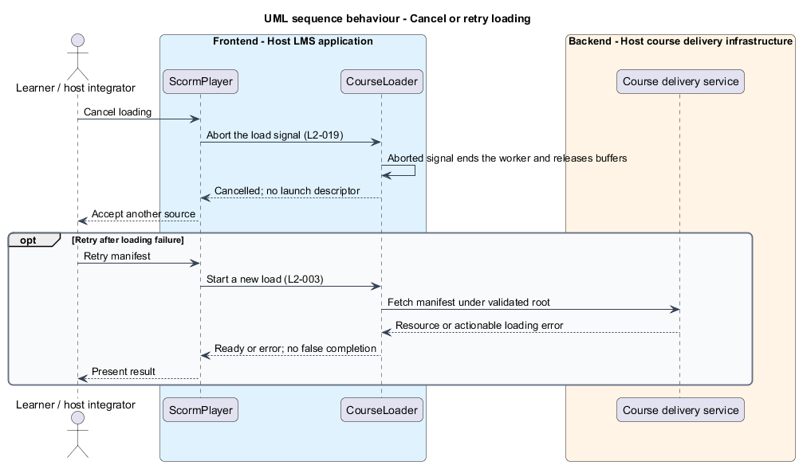

# Load and validate a course

## Overview

A SCORM course describes learning activities in an XML manifest named `imsmanifest.xml`. SCORM (Sharable Content Object Reference Model) defines how those activities communicate with a learning management system.

**Course root** — base that contains the manifest and its permitted resources: the manifest URL's directory for an extracted course, or a package-relative base for an archive before `prepareDelivery` assigns its delivery location

The loading feature accepts a ZIP archive or an extracted manifest URL. It produces a validated course model before any course script executes. Loading remains cancellable while the archive is processed.

## Description

- `CourseLoader`, in `src/scorm-player/package/`, coordinates input validation, fetches, version detection, and cancellation.
- `PackageWorker` extracts archives and parses their manifests away from the UI thread. The UI shows the `loading` state while it runs; it sends no progress messages.
- `PackageLimits` contains `archiveBytes`, `expandedBytes`, and `entryCount`. The loader checks archive size before transfer and counts actual expanded bytes while extracting.
- `ManifestParser` reads namespace-qualified organization, item, resource, and sequencing metadata. `ScormEdition` distinguishes `1.2`, `2004-2nd`, `2004-3rd`, and `2004-4th`.
- `ResourceResolver` resolves declared base paths and resource references against the course root.
- `ValidatedCourse` contains edition, title, organization structure, activity identifiers, resource kind, launch references, and edition-specific sequencing metadata. For an archive it also carries the validated `files`, which `prepareDelivery` hands to the host to serve; an extracted course has none.
- `LoadState` represents idle, loading, or ready. Cancel returns it to idle. A loading failure is a `PlayerError` with category `loading`, held in `PlayerViewState.error`. The player region and its loading status, with Cancel, remain visible while the loader processes its source.

The loader refuses a missing root manifest, malformed XML, unsupported edition, invalid resource reference, or exceeded limit. The parser disables external entity resolution and rejects document type declarations. Archive entries never write arbitrary filesystem paths.

`ResourceResolver` checks decoded path segments, absolute paths, separators, and normalized root containment before resolution. It rejects traversal, executable URL schemes, unexpected external origins, and redirects outside the permitted delivery root. The same resolver handles archive names, manifest base paths, and extracted-course references.

For archives, extraction completes validation before `prepareDelivery` receives the package. The host serves validated assets on an isolated course origin; host-origin blob URLs do not constitute isolated delivery. Asset lookup preserves relative URLs and content types.

For extracted courses, the supplied URL names the manifest rather than a launch page. The host makes the manifest fetchable under its CORS policy. Delivery preflight checks selected launch resources before the course wrapper starts them. Failed activities remain incomplete and retryable.

Each load receives an `AbortSignal` from the shell. Cancel aborts that signal, which aborts requests, terminates the active worker, and disposes temporary buffers. The loader discards any result whose signal is aborted, so a cancelled load never launches.

The shell and loading status target 2 seconds in at least 95 of 100 warm-bundle extracted-course runs at 4× CPU slowdown. A 50 MB ZIP fixture exercises Cancel within 200 ms. Both measurements use Chromium.

Archive library choice, exact edition detection rules, multiple-organization selection, default package limits, the expanded-byte treatment of nested archives, and reference-machine conditions are `<TO SUPPLY>`. Edition detection rules come from the relevant ADL packaging specifications before implementation.

Acceptance slices cover extracted input, each supported ZIP edition, each rejection category, relative paths, retry, and cancellation separately. Each test uses `PlayerPage` in `src/e2e-app/` and runs red before its production change.

## Requirements

Source: [L2 detailed requirements](../../../specs/L2.md). The table quotes source wording exactly, including its use of `must`.

| L2 ID | Refines (L1) | Requirement |
|-------|--------------|-------------|
| `L2-001` | `L1-001` | The player must accept either a SCORM ZIP package or an extracted course manifest URL through its documented input interface. It must identify SCORM 1.2 or SCORM 2004 2nd, 3rd, or 4th Edition before launch. |
| `L2-002` | `L1-001` | The player must validate the archive, root manifest, launch references, and package structure before launching content. Package size, expanded size, and entry-count limits must be configurable by the host and enforced before or during extraction. |
| `L2-003` | `L1-001` | For an extracted course, the player must resolve launch resources relative to the manifest URL and fail clearly if the manifest or a selected activity cannot be loaded. |
| `L2-016` | `L1-006` | The player must validate package paths, runtime values, and bridge messages, and must keep learner data out of URLs, console output, and diagnostic events unless explicitly required for the host callback contract. |
| `L2-019` | `L1-008` | The player must show its shell promptly, keep its controls responsive during package processing, and communicate loading progress. Course-authored content load time is outside the player-shell target. |

## Diagrams

The context view places this capability between the learner, the host LMS, and isolated course delivery. Authorization remains the host's responsibility.

The container view separates the LMS browser application, host API, isolated course frames, and course delivery. Tessera deploys as part of the LMS browser application.

The component view shows the proposed collaborators for this slice. Components inside the course boundary hold only the current SCO's allowed runtime state.

The class view records the proposed fields, methods, and ownership relationships. Types shared between slices retain the same meaning throughout the design tree.

Both inputs produce the same validated course model. Validation failure prevents delivery and launch.

Cancellation aborts the load before late worker or network results can reach launch. Retry starts a new load.

