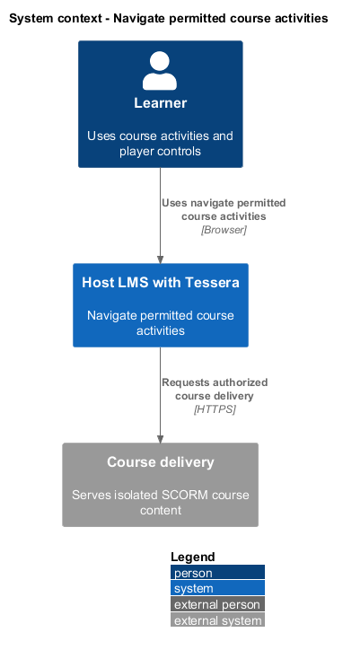
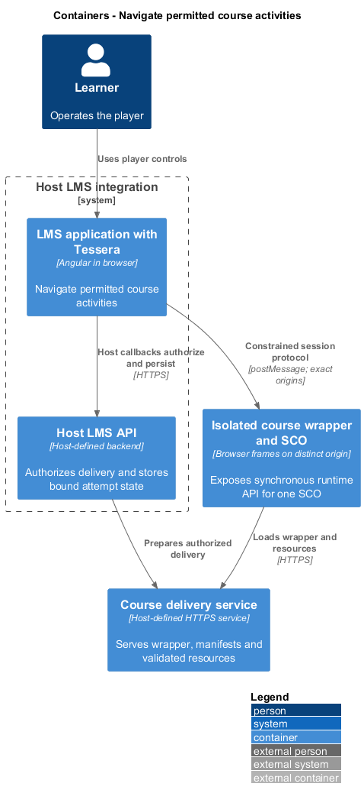
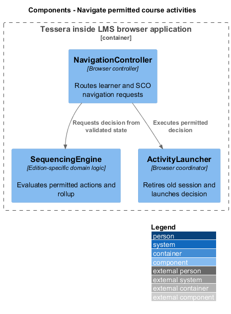
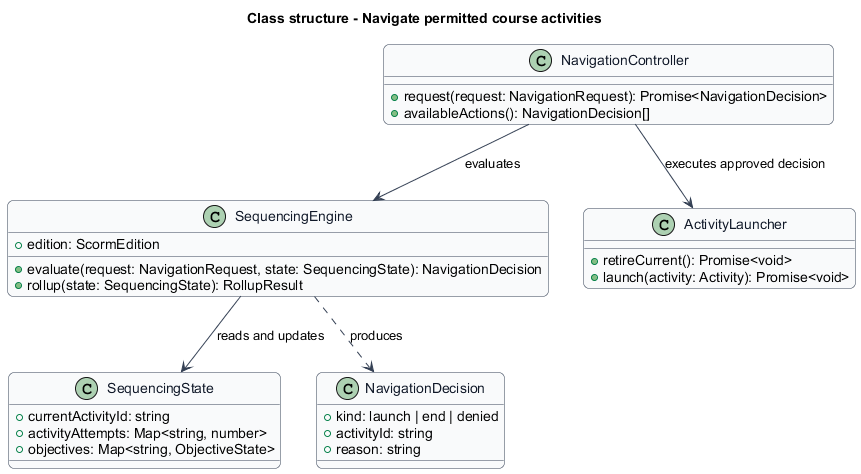
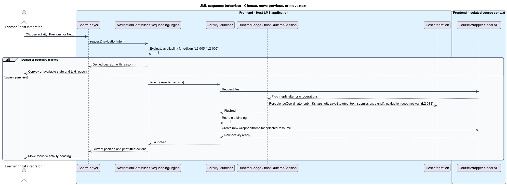
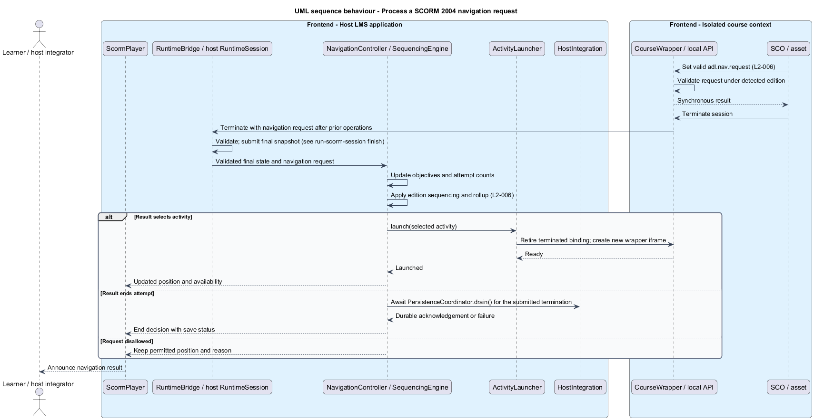

# Navigate permitted course activities

## Overview

The course outline presents activities that the learner may currently open.

**Sequencing** — edition-defined rules selecting the next eligible learning activity

**Rollup** — edition-defined aggregation of child activity results into parent outcomes

SCORM 1.2 uses the launchable manifest structure. SCORM 2004 additionally applies the detected edition's sequencing rules. A fixed list order cannot substitute for those rules.

## Description

- `NavigationController` receives learner choice, previous, next, and SCO navigation requests.
- `SequencingEngine` computes permitted actions and the next delivery decision from manifest metadata and attempt state.
- `SequencingState` stores activity attempts, objective state, and current position inside `AttemptSnapshot`. Rollup is recomputed from that state, not stored.
- `NavigationDecision` represents launch, end-attempt, or denied, with a textual reason where applicable.
- `ActivityLauncher` completes the current session's flush before acting on a launch decision.
- `ScormPlayer` projects permitted actions into outline and navigation controls.

SCORM 1.2 selection uses validated launchable items. The controller disables previous at the first permitted activity and next at the last. It exposes unavailable activities with their reason.

For SCORM 2004, choice and flow controls, attempt limits, objectives, and rollup all participate in the decision. Both UI requests and `adl.nav.request` pass through the same edition-specific engine. UI disablement alone never enforces availability.

The engine processes a valid SCO request after session termination. It updates attempt and objective state, applies sequencing and rollup, then returns the resulting launch or end decision. A denied choice never starts a resource.

`SequencingEngine.rollup` returns a `RollupResult` with course-level completion and success; `OutcomeCalculator` is the only producer of `CourseOutcome`. Sequencing updates and SCO state share one attempt snapshot. Resume restores that snapshot before calculating availability. Course-level outcomes consume the same rollup result, preventing a separate progress algorithm from contradicting navigation.

The complete per-edition sequencing algorithm, request vocabulary, previous-action interpretation, objective mappings, and end-attempt transitions are `<TO SUPPLY>`. These tables come from the relevant ADL sequencing specifications. No supported edition launches until its required rule coverage exists.

ATDD slices cover SCORM 1.2 choice and boundaries, then each supported edition's flow, blocked choice, navigation request, attempt limit, objective prerequisite, and rollup. The Chromium `PlayerPage` exposes navigation intent. Course fixtures encode each rule rather than mocking an engine decision.

## Requirements

Source: [L2 detailed requirements](../../../specs/L2.md). The table quotes source wording exactly, including its use of `must`.

| L2 ID | Refines (L1) | Requirement |
|-------|--------------|-------------|
| `L2-005` | `L1-002` | The player must expose the activities the learner may currently choose and support previous and next navigation where the course rules permit it. |
| `L2-006` | `L1-002` | For each supported SCORM 2004 edition, the player must apply the edition's sequencing and navigation rules, including choice and flow controls, attempt limits, objective rules, and rollup, rather than using a fixed lesson order. |

## Diagrams

The context view places this capability between the learner, the host LMS, and isolated course delivery. Authorization remains the host's responsibility.

The container view separates the LMS browser application, host API, isolated course frames, and course delivery. Tessera deploys as part of the LMS browser application.

The component view shows the proposed collaborators for this slice. Components inside the course boundary hold only the current SCO's allowed runtime state.

The class view records the proposed fields, methods, and ownership relationships. Types shared between slices retain the same meaning throughout the design tree.

Every request reaches the rule engine. A denial updates accessible controls without starting content.

The controller uses final SCO state to apply objectives, attempt limits, and rollup before selecting the next activity.

