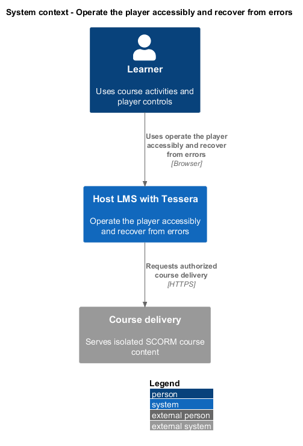
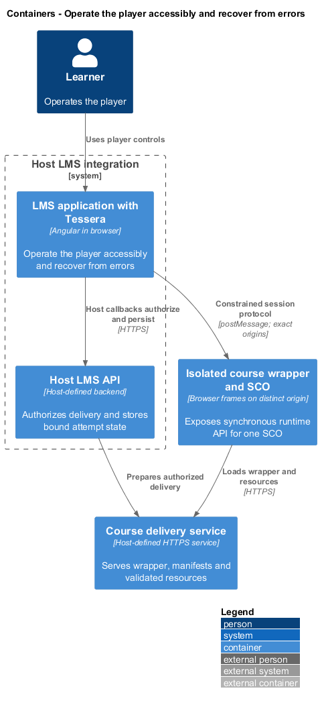
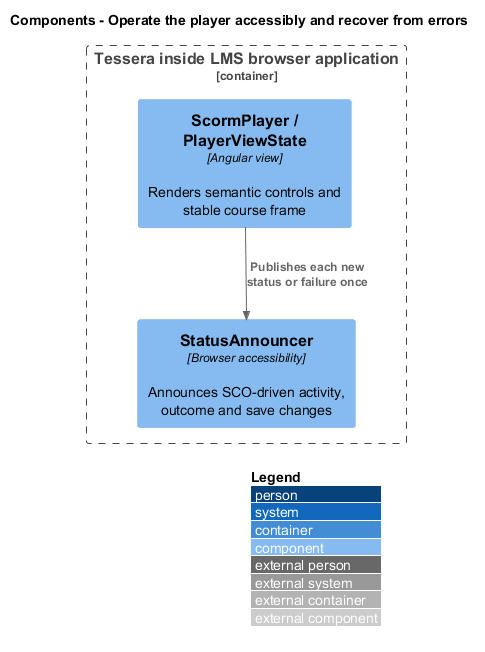
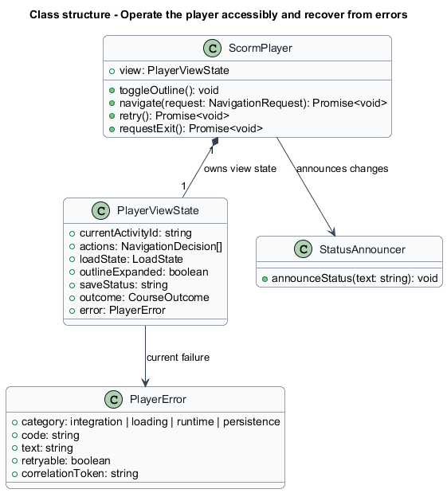
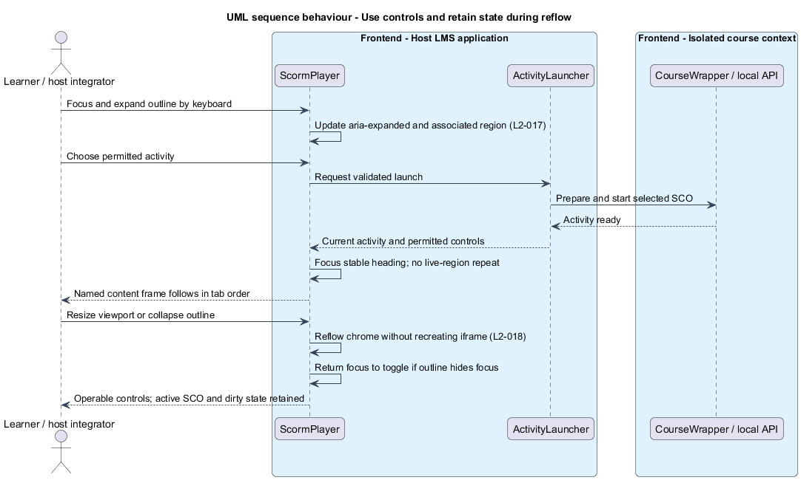
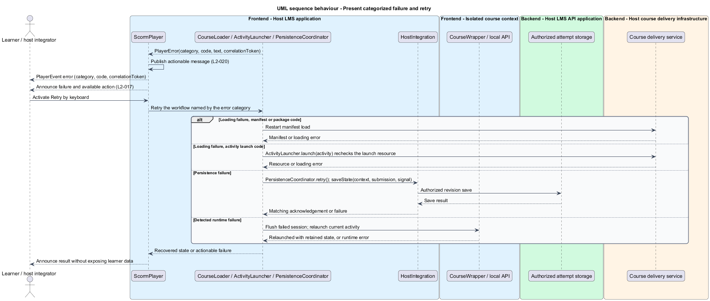

# Operate the player accessibly and recover from errors

## Overview

The player shell surrounds course-authored content with outline, navigation, status, and recovery controls.

**Player chrome** — controls and layout owned by the component outside course-authored content

This feature makes those controls usable by keyboard and assistive technology from extra-small to extra-large widths and at up to 400% zoom. It preserves the active course session when layout or zoom changes and presents actionable loading, runtime, and save failures.

## Description

- `ScormPlayer` owns the shell in `scorm-player.html` and responsive styles in `scorm-player.scss`.
- `PlayerViewState` holds current activity, permitted actions, outline expansion, load/save status, outcome, and categorized error.
- `PlayerError` contains `category`, stable `code`, safe text, retryability, and an opaque `correlationToken`. Categories distinguish integration, loading, runtime, and persistence.
- `StatusAnnouncer` updates a polite live region for SCO-driven activity changes, outcome, and save changes. A learner-initiated launch is announced by moving focus to the activity heading, not by the live region. Urgent actionable errors use an alert, not the live region as well. Each new failure is announced, including a repeated failure after Retry; one event is never announced twice.
- `ScormPlayer.retry()` routes by error category, then `code` within `loading`: manifest or package codes restart `CourseLoader`, a failed activity launch retries `ActivityLauncher.launch(activity)`, runtime errors relaunch the current activity through `ActivityLauncher`, and persistence errors call `PersistenceCoordinator.retry()`. No separate recovery class exists.
- `PlayerPage` in `src/e2e-app/` owns all Playwright selectors and interactions for the player screen. `ScormPlayerHarness` in `src/scorm-player/testing/` exposes consumer test actions through the same package entry point.

The outline uses a semantic navigation region and an ordered list of activity buttons. It does not introduce a tree widget unless its full keyboard behavior is specified. Current activity uses `aria-current="step"`. Unavailable activities and blocked Previous or Next actions use `aria-disabled="true"` rather than `disabled`, so they stay focusable; visible reason text is linked with `aria-describedby`. Activating a blocked control does nothing.

The narrow outline toggle is a button with `aria-expanded` and `aria-controls`. Collapsing an outline containing focus returns focus to that toggle. A successful learner launch moves focus to a stable, named activity heading outside the isolated content. A titled iframe follows in the keyboard sequence. SCO-driven transitions announce the new activity without stealing focus unnecessarily.

All actions have visible focus, accessible names, and target dimensions meeting WCAG 2.2 AA. Status announcements do not require searching the page. Unknown outcomes use text; progress bars appear only with a defined value and accessible label.

Flexible columns use zero minimum widths, wrapping controls, and bounded content-frame dimensions. Sizes use relative units so player text scales with the user's text size, and text containers do not fix their heights, so 200% text and the WCAG text-spacing overrides cause no clipping or overlap. At 320, 576, 768, 992, 1200, and 1920 px, and at 400% zoom in a 1280 px window, player chrome produces no horizontal page scrolling; at 400% zoom the layout uses the same single column as the 320 px width. Reflow changes styles and outline visibility without destroying the iframe, session, or pending save.

Errors and the unsaved-exit warning are inline regions above the player, not modal dialogs. A save failure uses `role="alert"`; the exit warning receives focus on its heading. When an error or warning region closes while it contains focus, focus moves to the activity heading. Loading retry starts a fresh validated load. Runtime retry relaunches the current activity through the normal launch, which flushes the failed session first and keeps validated attempt state. Failed persistence offers Retry and blocks unacknowledged exit until the warning is resolved. Cross-origin script errors are detectable only through the supported bridge or host delivery signals.

Diagnostic callbacks carry category, stable code, and correlation token. URLs, raw runtime values, learner identifiers, stack contents, and raw host errors stay out of console output and diagnostics. Required SCO state and score fields appear only in their documented state/outcome contracts.

Final labels, host exit behavior, runtime restart safety, and detailed screen reader scripts are `<TO SUPPLY>`. Reference WCAG criteria and interaction patterns are the [WCAG 2.2 standard](https://www.w3.org/TR/WCAG22/) and [WAI-ARIA Authoring Practices](https://www.w3.org/WAI/ARIA/apg/).

Each component change includes Chromium keyboard behavior and automated accessibility checks. Manual verification covers JAWS, NVDA, VoiceOver, TalkBack, and Narrator on their supported platforms. Manual verification is separate from automated browser tests, which run only in Chromium.

ATDD slices cover outline use, launch focus, disabled explanations, Retry, exit warning, live announcements, each specified width, 400% zoom, 200% text, text-spacing overrides, and resize or zoom with unsaved values. Manual records include platform, screen reader version, script, result, and defects. These designs do not claim that verification has occurred.

## Requirements

Source: [L2 detailed requirements](../../../specs/L2.md). The table quotes source wording exactly, including its use of `must`.

| L2 ID | Refines (L1) | Requirement |
|-------|--------------|-------------|
| `L2-017` | `L1-007` | The player controls must use semantic roles, visible focus, predictable focus movement, and text status announcements. Player-owned interactions must satisfy WCAG 2.2 AA and the applicable WAI-ARIA Authoring Practices. |
| `L2-018` | `L1-008` | The player shell and its own controls must remain fully usable at extra-small, small, medium, large, and extra-large viewport widths, at up to 400% browser zoom, and with enlarged text or increased text spacing, without horizontal page scrolling or loss of content or functionality caused by player chrome. |
| `L2-020` | `L1-008` | The player must distinguish loading, runtime, and persistence failures; show the learner an actionable message; and send the host a machine-readable error category without exposing private learner data. |

## Diagrams

The context view places this capability between the learner, the host LMS, and isolated course delivery. Authorization remains the host's responsibility.

The container view separates the LMS browser application, host API, isolated course frames, and course delivery. Tessera deploys as part of the LMS browser application.

The component view shows the proposed collaborators for this slice. Components inside the course boundary hold only the current SCO's allowed runtime state.

The class view records the proposed fields, methods, and ownership relationships. Types shared between slices retain the same meaning throughout the design tree.

Keyboard actions operate semantic controls. Responsive reflow preserves the same course frame and runtime session.

Each error offers the relevant recovery workflow. Host diagnostics omit private runtime data.

