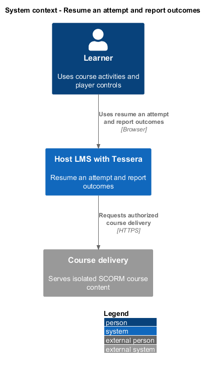
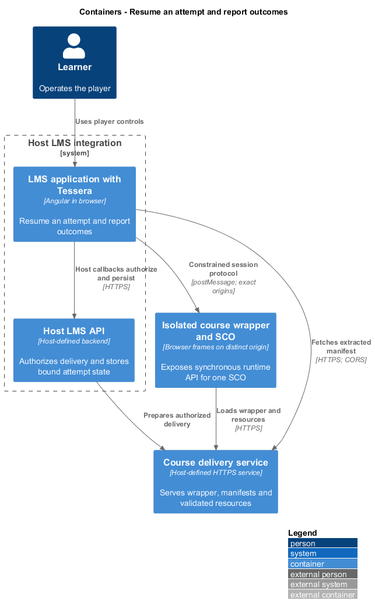
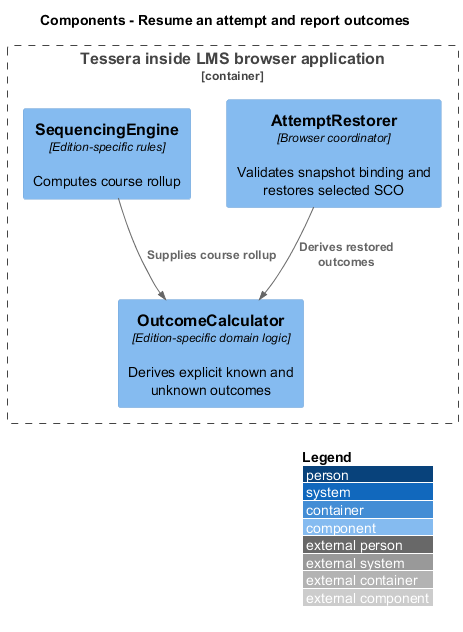
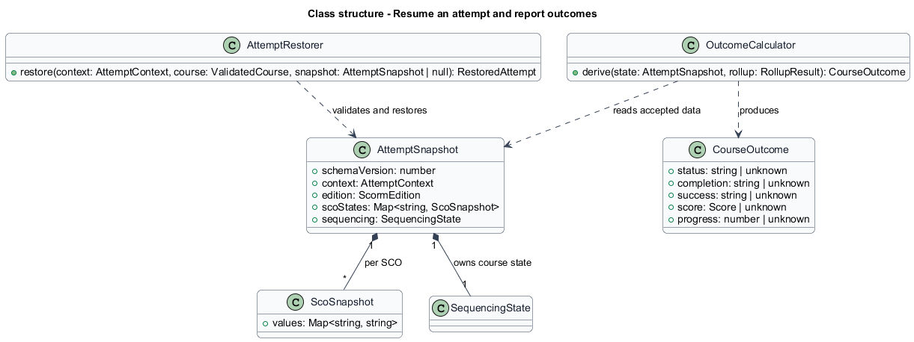
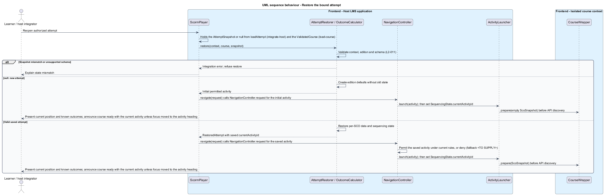
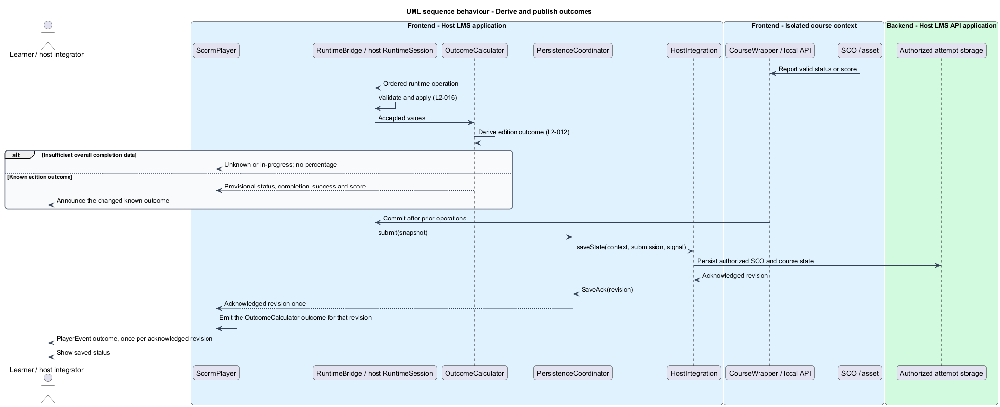

# Resume an attempt and report outcomes

## Overview

A learner returns to a course using state supplied by the host LMS.

**Attempt snapshot** — versioned saved state for one course revision and host-authorized attempt

**Outcome** — edition-derived status, completion, success, or score with unknown values represented explicitly

This feature restores each SCO's saved data and the permitted current activity. It derives outcomes from accepted runtime data and course rules without inventing a completion percentage.

## Description

- `AttemptRestorer` validates the host snapshot's context, schema version, edition, and course revision against the loaded course.
- `AttemptSnapshot` contains `schemaVersion`, immutable context, edition, per-SCO snapshots, and sequencing state. The current activity is `SequencingState.currentActivityId`.
- `ScoSnapshot` stores valid runtime values by element name. Only the selected SCO's state enters the isolated wrapper.
- `OutcomeCalculator` maps accepted edition-specific runtime values and sequencing rollup into `CourseOutcome`.
- `CourseOutcome` contains distinct `status`, `completion`, `success`, `score`, and `progress`. Unknown fields remain explicit.
- `AttemptRestorer` returns the saved `currentActivityId`; `NavigationController.request` decides whether it is still permitted, as it does for every launch.
- `PersistenceCoordinator` publishes each accepted save revision once; `ScormPlayer` emits the matching `CourseOutcome` from `OutcomeCalculator` as one outcome event.

The host loads state only after authorization. Snapshot mismatch produces an integration error rather than applying another attempt's values. A new attempt starts only when `loadAttempt` resolves to `null`. Deliberate state transfer requires the host to supply a snapshot rebound to that new context.

The restorer returns a `RestoredAttempt`; `ActivityLauncher` then sends the selected SCO's `ScoSnapshot` through `CourseWrapper.prepare()` before the API becomes discoverable. Edition rules derive resume-related runtime elements from saved exit and attempt state. The previous SCO's data never seeds a different SCO.

For SCORM 1.2, lesson status and score retain their edition meaning. For SCORM 2004, completion and success remain distinct, and course rollup uses the detected edition's rules. Unknown overall completion remains unknown. A count of visited activities does not establish completion.

The player displays provisional outcomes from validated current state. Host outcome events describe acknowledged saved revisions; failed saves remain visible as "Not saved". Score events contain only fields documented for the outcome contract.

Snapshot migration, course-revision mismatch recovery, fallback activity selection, edition-specific outcome mappings, and valid percentage derivation are `<TO SUPPLY>`. These gaps do not authorize inferred completion.

Separate Chromium ATDD slices restore suspend data and location, reject context mismatches, open a new attempt, isolate two learners, report SCORM 1.2 status, and separate SCORM 2004 completion from success. Unknown-outcome fixtures assert text state rather than fabricated percentages.

## Requirements

Source: [L2 detailed requirements](../../../specs/L2.md). The table quotes source wording exactly, including its use of `must`.

| L2 ID | Refines (L1) | Requirement |
|-------|--------------|-------------|
| `L2-011` | `L1-004` | The player must restore the saved state for the same course, learner attempt, and SCO without mixing it with another attempt. |
| `L2-012` | `L1-004` | The player must derive status, completion, success, and score from edition-specific SCO data and course rollup rules. It must identify unknown outcomes instead of inventing completion or a percentage. |

## Diagrams

The context view places this capability between the learner, the host LMS, and isolated course delivery. Authorization remains the host's responsibility.

The container view separates the LMS browser application, host API, isolated course frames, and course delivery. Tessera deploys as part of the LMS browser application.

The component view shows the proposed collaborators for this slice. Components inside the course boundary hold only the current SCO's allowed runtime state.

The class view records the proposed fields, methods, and ownership relationships. Types shared between slices retain the same meaning throughout the design tree.

Snapshot validation occurs before runtime setup. A new attempt receives no prior values without an explicit host-supplied transfer.

Validated SCO data feeds edition-specific rollup. Host publication waits for a save acknowledgement.

