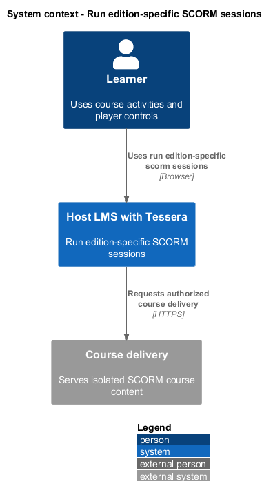
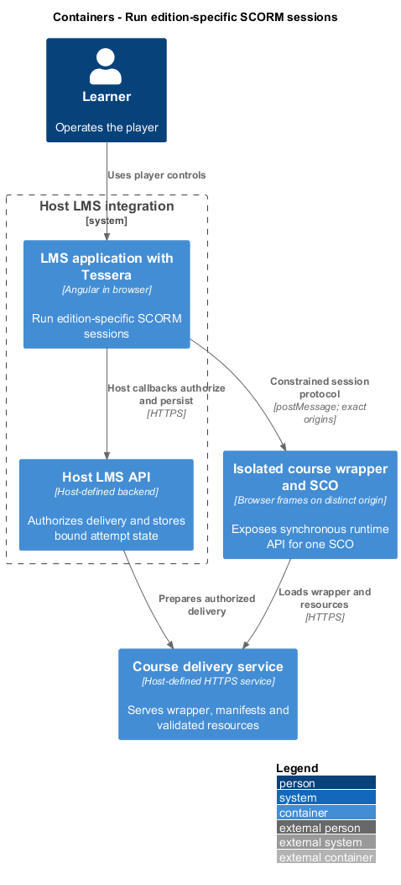
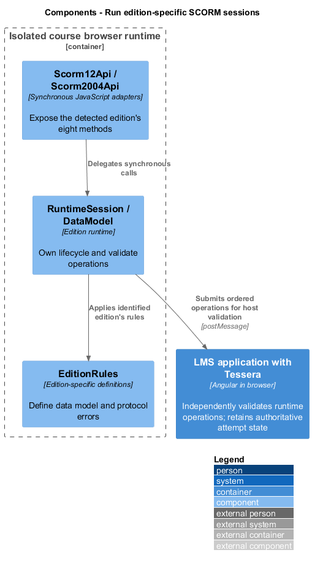
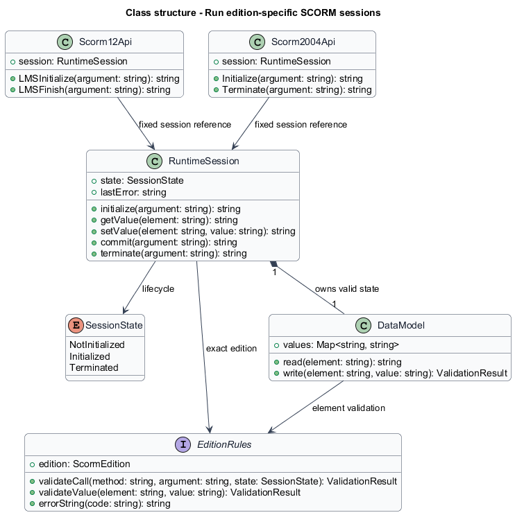
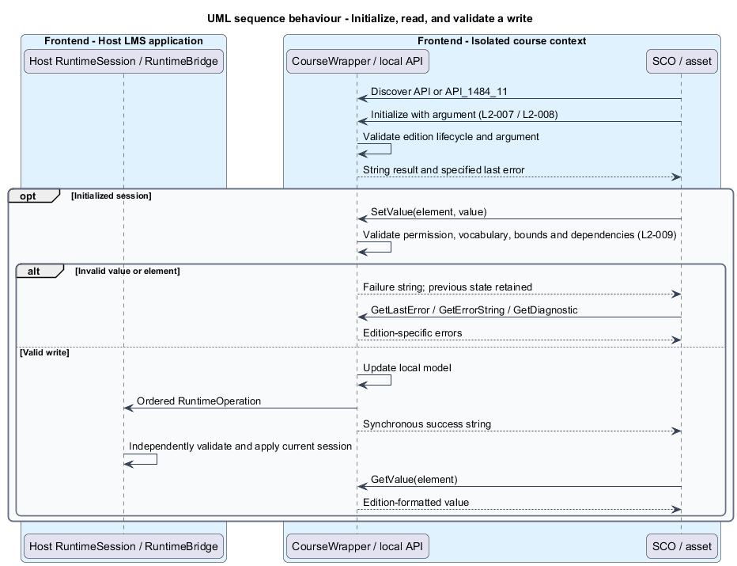
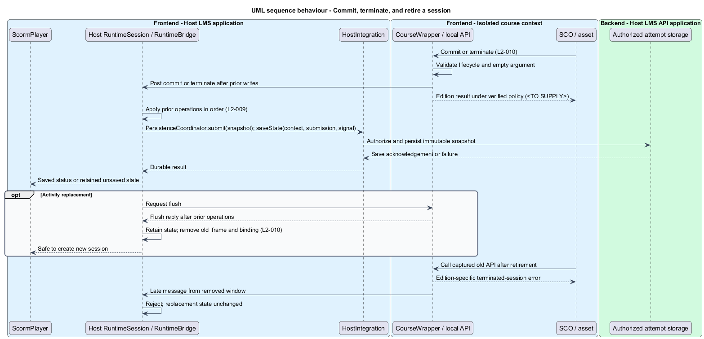

# Run edition-specific SCORM sessions

## Overview

SCORM content reads and writes learner state through a browser JavaScript object.

**Runtime session** — lifecycle and data model belonging to one SCO in one learner attempt

The feature implements the synchronous SCORM 1.2 and SCORM 2004 calls. Each detected edition selects its own validation rules and error behavior. Invalid calls preserve the previous valid state.

## Description

- `RuntimeSession`, in `src/scorm-player/runtime/`, contains lifecycle state, data model, and last error. It holds no attempt or learner identity; on the host side, `RuntimeBridge` pairs it with the `SessionBinding`.
- `Scorm12Api` exposes `LMSInitialize`, `LMSFinish`, `LMSGetValue`, `LMSSetValue`, `LMSCommit`, `LMSGetLastError`, `LMSGetErrorString`, and `LMSGetDiagnostic` on `API`.
- `Scorm2004Api` exposes `Initialize`, `Terminate`, `GetValue`, `SetValue`, `Commit`, `GetLastError`, `GetErrorString`, and `GetDiagnostic` on `API_1484_11`.
- `EditionRules` supplies data-element definitions, defaults, read/write permissions, collection dependencies, vocabularies, value bounds, and diagnostic mappings.
- `DataModel` validates a write before replacing its previous value. It preserves protocol strings and edition-specific lexical formats.
- `RuntimeOperation` contains the operation kind and bounded arguments. The bridge supplies the session binding. The host independently validates the operation stream through its own `RuntimeSession`.

The lifecycle has not-initialized, initialized, and terminated states. Edition rules determine each call's result and last-error effects in each state. The API captures its original session object; an old reference never dereferences a mutable global current session.

The local adapter returns SCORM strings synchronously. It never returns a Promise or waits synchronously on `postMessage`. Valid writes update the local model and post each operation to the host in call order. The host validates them before persistence or outcome derivation.

Commit and termination are posted after the writes they cover. The host applies every preceding write before taking a snapshot. Navigation waits for the host's flush acknowledgement. Termination submits the final state even without a separate commit.

A SCORM API success value and a durable host-save acknowledgement are distinct signals. The course-side commit policy is `<TO SUPPLY>`, pending verification against each edition's ADL runtime specification. Implementation of commit and finish success paths is blocked until the policy defines permitted buffering, failure codes, and transport failure behavior. The persistence design never labels merely queued data as saved.

The same edition rules run in the isolated wrapper and host application. The host treats wrapper output as untrusted; it reconstructs state from validated ordered operations. A course can report allowed values for its own SCO, but cannot select a different attempt or SCO.

Complete element catalogs, exact lifecycle transition tables, edition-specific error codes, collection dependency rules, and duration/score parsing rules are `<TO SUPPLY>`. The sources are the ADL runtime specifications named in [L2 requirements](../../../specs/L2.md). No common subset substitutes for a supported edition.

ATDD slices introduce initialization, valid reads and writes, invalid operations, commit, finish, and stale-session behavior one at a time. Chromium SCO fixtures exercise the public API. Pure runtime tests cover edition tables, lengths, ranges, vocabularies, and state preservation after rejected writes.

## Requirements

Source: [L2 detailed requirements](../../../specs/L2.md). The table quotes source wording exactly, including its use of `must`.

| L2 ID | Refines (L1) | Requirement |
|-------|--------------|-------------|
| `L2-007` | `L1-003` | For SCORM 1.2 SCOs, the player must expose the `API` object and implement the eight `LMS*` methods, their string return values, session states, and error reporting according to SCORM 1.2. |
| `L2-008` | `L1-003` | For SCORM 2004 SCOs, the player must expose `API_1484_11` and implement `Initialize`, `Terminate`, `GetValue`, `SetValue`, `Commit`, `GetLastError`, `GetErrorString`, and `GetDiagnostic` according to the identified edition. |
| `L2-009` | `L1-003` | The player must enforce each edition's required data elements, read/write rules, vocabulary, range and length limits, and element-specific error codes. It must not silently accept invalid values. |
| `L2-010` | `L1-003` | The player must preserve valid SCO changes through commit, termination, and activity changes, and must prevent one SCO from manipulating another SCO's live runtime session. |

## Diagrams

The context view places this capability between the learner, the host LMS, and isolated course delivery. Authorization remains the host's responsibility.

The container view separates the LMS browser application, host API, isolated course frames, and course delivery. Tessera deploys as part of the LMS browser application.

The component view shows the proposed collaborators for this slice. Components inside the course boundary hold only the current SCO's allowed runtime state.

The class view records the proposed fields, methods, and ownership relationships. Types shared between slices retain the same meaning throughout the design tree.

Each call returns synchronously through the correct edition adapter. Rejected writes leave valid state unchanged.

A flush preserves changes through navigation. The API success policy remains an explicit prerequisite for implementation.

