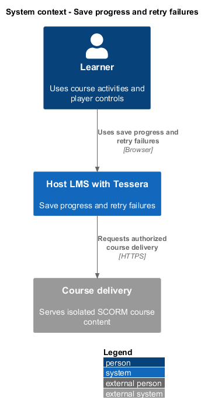
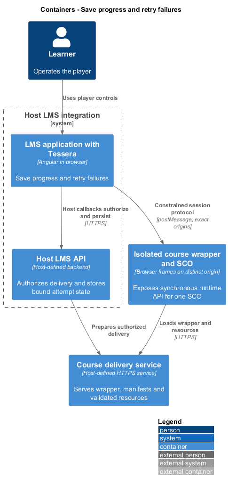
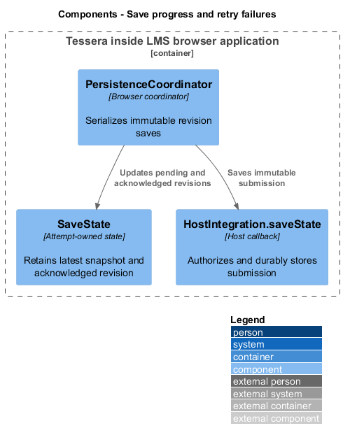
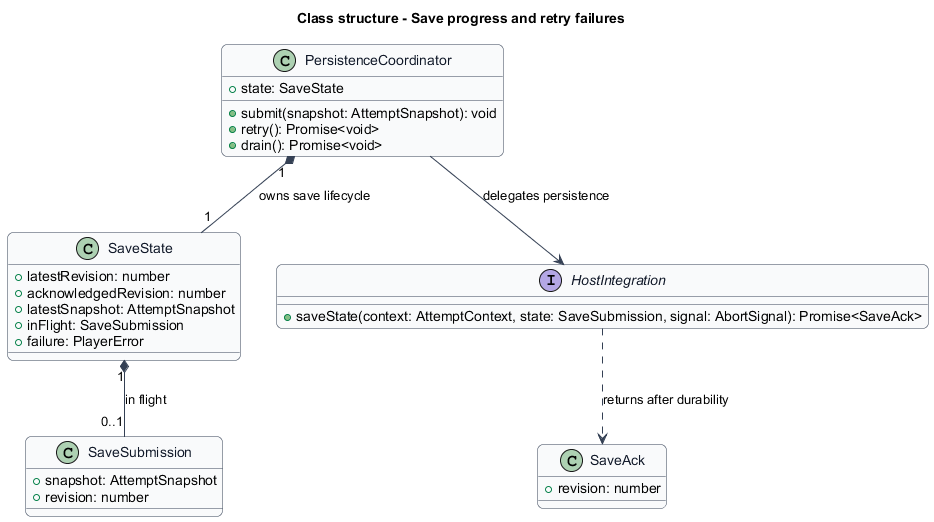
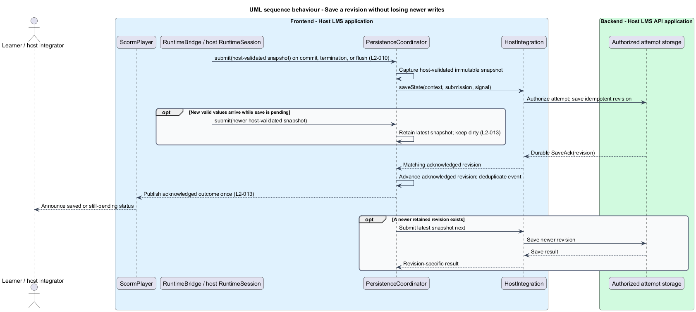
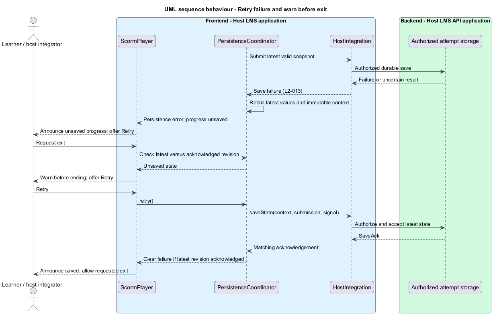

# Save progress and retry failures

## Overview

SCORM runtime changes become durable only when the host LMS acknowledges a save.

**Save submission** — immutable attempt snapshot paired with a monotonic revision

**Save acknowledgement** — host confirmation that a submitted revision has reached its durable storage boundary

This feature preserves the latest valid state through commits, termination, retries, and navigation. A failed save remains visible without discarding newer SCO changes.

## Description

- `PersistenceCoordinator` captures validated state and serializes saves within one attempt.
- `SaveSubmission` contains the snapshot and its revision. The attempt key and revision together identify the submission, so the host can treat a repeated revision as idempotent.
- `SaveAck` contains the acknowledged revision. The host echoes that revision only after its configured durable storage boundary.
- `SaveState` contains latest valid revision, latest acknowledged revision, in-flight submission, retained latest snapshot, and the last sanitized failure.
- `HostIntegration.saveState` performs authorized persistence. A retry of the same immutable revision repeats the same submission.
- `ScormPlayer` shows pending, saved, and unsaved statuses, with keyboard-operable Retry and exit warning actions.

Every save in the player goes through `PersistenceCoordinator.submit()`; no other component calls `saveState`. `submit` returns immediately; a caller that needs the outcome awaits `drain()`, which settles when the latest revision is acknowledged or fails. The coordinator receives only host-validated operations. Each commit, termination, or activity flush takes a consistent snapshot of SCO and sequencing state. Each attempt has at most one in-flight save.

When changes arrive during a save, the coordinator retains a newer snapshot and submits it after the in-flight request settles. An acknowledgement clears dirty status only through its revision. It never labels newer changes saved.

A failure retains the latest valid snapshot. Retry submits that latest snapshot rather than a stale failed copy. If the network outcome is uncertain, the host's idempotent revision contract prevents duplicate persistence effects.

The coordinator emits a saved outcome once per newly acknowledged revision. Duplicate acknowledgements do not duplicate events. Host errors become a persistence category and correlation token, never raw response bodies or learner values.

Activity navigation preserves failed state in host memory and continues once the flush has transferred the final state; it does not wait for the save acknowledgement. Exiting the player while unsaved shows a warning and Retry before ending the attempt. Explicit acceptance of loss is separate from successful saving.

Browser process termination cannot guarantee an asynchronous save. Normal exit drains pending work while the page remains alive. The host's crash-recovery strategy, background transport policy, duplicate-tab conflict policy, and retention lifetime are `<TO SUPPLY>`. In-memory retry is not durable crash recovery.

The SCORM commit return policy described in [runtime sessions](../run-scorm-session/) remains `<TO SUPPLY>`. Queue acceptance never produces a saved status or a durable host acknowledgement.

ATDD slices cover successful commit, termination without commit, failed save retention, newer values during failure, retry of latest state, stale acknowledgement, duplicate acknowledgement, and an unsaved exit. Chromium host fixtures expose deterministic deferred success and failure through `PlayerPage` actions.

## Requirements

Source: [L2 detailed requirements](../../../specs/L2.md). The table quotes source wording exactly, including its use of `must`.

| L2 ID | Refines (L1) | Requirement |
|-------|--------------|-------------|
| `L2-013` | `L1-005` | The component must document the host inputs and callbacks for loading attempt state, saving SCO state, and receiving outcome and error events. A save failure must remain visible and retryable without discarding the unsaved state. |
| `L2-010` | `L1-003` | The player must preserve valid SCO changes through commit, termination, and activity changes, and must prevent one SCO from manipulating another SCO's live runtime session. |

## Diagrams

The context view places this capability between the learner, the host LMS, and isolated course delivery. Authorization remains the host's responsibility.

The container view separates the LMS browser application, host API, isolated course frames, and course delivery. Tessera deploys as part of the LMS browser application.

The component view shows the proposed collaborators for this slice. Components inside the course boundary hold only the current SCO's allowed runtime state.

The class view records the proposed fields, methods, and ownership relationships. Types shared between slices retain the same meaning throughout the design tree.

The coordinator serializes requests and treats each acknowledgement as revision-specific. Newer values remain dirty until their own acknowledgement.

Retry uses the latest validated values. An exit remains pending while the learner resolves unsaved progress.

