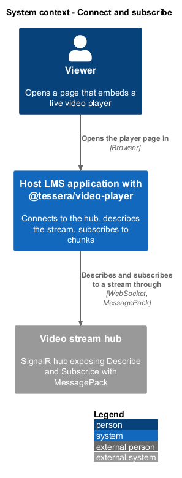
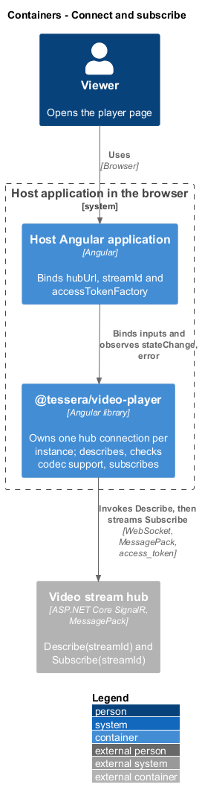
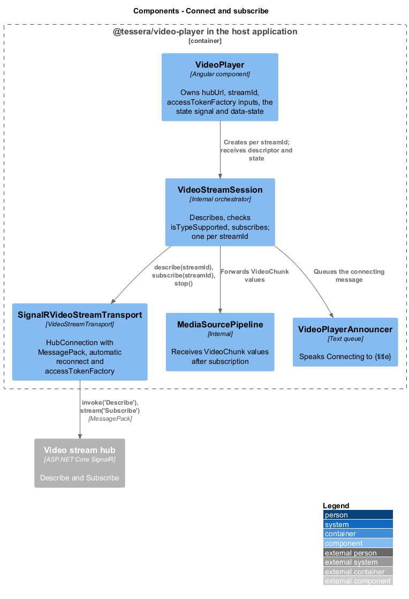
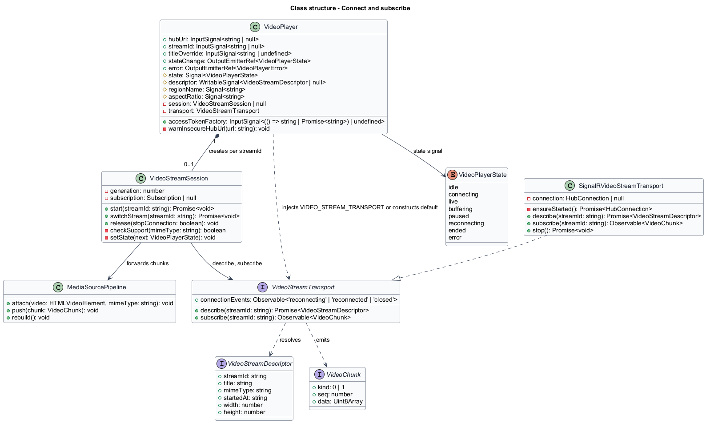
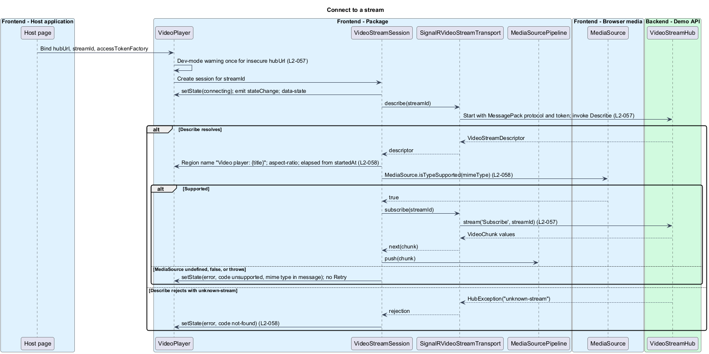
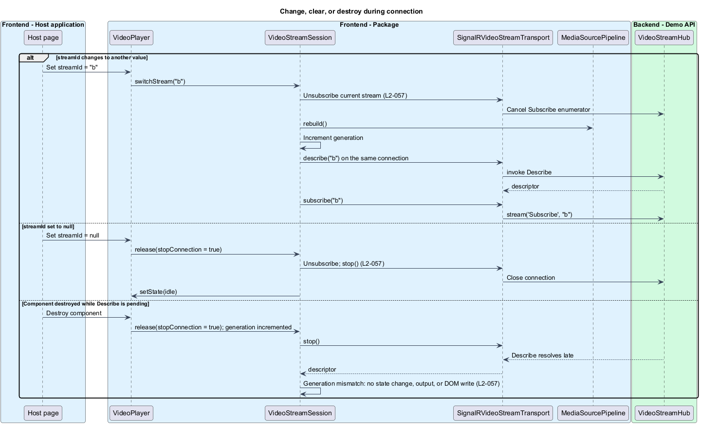

# Connect and subscribe

## Overview

`t-video-player` plays a live stream that a host SignalR hub pushes to the browser. Before any bytes flow, the player opens one hub connection, asks the hub to describe the stream, checks that the browser can decode it, and only then subscribes to the chunk stream. This feature covers that lifecycle from the moment `streamId` is set until the subscription is released.

**hub connection** — SignalR `HubConnection` using the MessagePack protocol, owned by one player instance

**descriptor** — `VideoStreamDescriptor` returned by `Describe(streamId)` with `streamId`, `title`, `mimeType`, `startedAt`, `width`, and `height`

**codec support check** — call to `MediaSource.isTypeSupported(mimeType)` made before `Subscribe`

**subscription** — server-to-client stream of `VideoChunk` opened by `Subscribe(streamId)` and disposed by unsubscribing

**generation** — integer incremented on every `streamId` change or destroy, used to discard results of outdated asynchronous work

The feature ends when chunks start arriving. Appending them belongs to [play live stream](../play-live-stream/); transport loss, backoff, and error panels belong to [recover from interruptions](../recover-from-interruptions/). The transport decision itself is recorded in [ADR-0002](../../../adr/frontend/0002-stream-live-video-as-fmp4-over-signalr-messagepack.md).

## Description

`VideoPlayer` owns the inputs `hubUrl`, `streamId`, `accessTokenFactory`, and `titleOverride`, the `state` signal, and the host `data-state` attribute. It does not talk to the hub itself. An `effect` over `hubUrl` and `streamId` creates one `VideoStreamSession` per non-null `streamId` and tears it down when the value changes or becomes `null`. `VideoStreamSession` drives `describe`, the codec support check, and `subscribe` through the `VideoStreamTransport` interface and forwards every `VideoChunk` to `MediaSourcePipeline`.

**Transport selection.** `VideoPlayer` injects `VIDEO_STREAM_TRANSPORT` optionally. When the host supplies no provider, the component constructs a `SignalRVideoStreamTransport` for itself, so two players on one page each own one hub connection (`L2-057`). The default transport builds the connection with `HubConnectionBuilder`, `withUrl(hubUrl, { accessTokenFactory })`, `withHubProtocol(new MessagePackHubProtocol())`, and `withAutomaticReconnect([0, 2000, 5000, 10000, 10000])`. The token reaches the transport only through `accessTokenFactory`. The way a host-supplied transport receives `hubUrl` and `accessTokenFactory` is `<TO SUPPLY>`.

In development mode, a `hubUrl` whose scheme is neither `https:` nor `wss:` and whose host is neither `localhost` nor `127.0.0.1` produces one console warning per instance; production builds stay silent. The warning text is `<TO SUPPLY>`.

**Connect.** When `hubUrl` and `streamId` are set and the component is in the document, the session sets the state to `connecting`, which emits `stateChange` and updates `data-state`. The region's accessible name is "Video player" until the descriptor arrives. The session calls `transport.describe(streamId)`, which starts the hub connection on first use and invokes `Describe`. The session awaits the result before any `subscribe` call.

**Apply the descriptor.** On resolution the session applies the descriptor to `VideoPlayer` (`L2-058`):

| Descriptor field | Effect |
|------------------|--------|
| `title` | Region name "Video player: {title}"; `titleOverride` replaces it when set; the value is bound as text, never as HTML |
| `startedAt` | Elapsed-time display starts at the current wall-clock time minus `startedAt` and advances once per second |
| `width`, `height` | Stage `aspect-ratio` is `width / height` when both are greater than 0; otherwise 16:9 |
| `mimeType` | Passed verbatim to `isTypeSupported` and later to `addSourceBuffer` |

Applying the descriptor queues "Connecting to {title}." on `VideoPlayerAnnouncer`.

**Check codec support.** The session then checks `window.MediaSource` and `MediaSource.isTypeSupported(mimeType)`. An undefined `MediaSource`, a `false` result, or an exception thrown by the check sets the state to `error` with code `unsupported`. The message includes the mime type as text, and the error panel shows no Retry control. `subscribe` is not called.

**Subscribe.** With support confirmed, the session calls `transport.subscribe(streamId)`. The default transport wraps `HubConnection.stream('Subscribe', streamId)` in an Observable whose unsubscribe disposes the server stream. Each `next` value is a `VideoChunk` handed to `MediaSourcePipeline`. Completion and errors of the Observable are handled by the sibling features named above.

**Describe failures.** A rejection whose `HubException` message is `unknown-stream` sets the state to `error` with code `not-found`. Other rejections are mapped in [recover from interruptions](../recover-from-interruptions/).

**Change or clear the stream.** When `streamId` changes to another value, the effect disposes the current subscription, calls `MediaSourcePipeline.rebuild()`, increments the generation, and runs `describe` then `subscribe` for the new identifier on the same hub connection. When `streamId` becomes `null`, the effect disposes the subscription, calls `transport.stop()`, and sets the state to `idle`.

The transitions owned by this feature are listed below; every other transition belongs to a sibling feature.

| From | Event | To |
|------|-------|----|
| `idle` | `hubUrl` and `streamId` set, component in the document | `connecting` |
| `connecting` | `MediaSource` missing, `isTypeSupported` false, or the check throws | `error` (`unsupported`) |
| `connecting` | `Describe` rejects with `unknown-stream` | `error` (`not-found`) |
| any | `streamId` set to `null` | `idle` |
| any except `idle` | `streamId` changes to another value | `connecting` |

Behaviour on a `hubUrl` change while a session is active is `<TO SUPPLY>`.

**Destroy.** A `DestroyRef` callback disposes the subscription, stops the transport, and increments the generation. Every continuation in the session compares its captured generation with the current one and returns early on mismatch. A `Describe` that resolves after destroy therefore causes no state change, output emission, or DOM write. Release of the media pipeline and listeners is specified under [secure and perform](../secure-and-perform/).

## Requirements

Source: [L2 detailed requirements](../../../specs/L2.md). The table quotes the source wording exactly, including its modal verb.

| L2 ID | Refines (L1) | Requirement |
|-------|--------------|-------------|
| `L2-057` | `L1-022` | The player must connect to `hubUrl` with the MessagePack protocol when `streamId` is set and the component is in the document, invoke `Describe` and then `Subscribe`, and stop the hub connection when the component is destroyed or `streamId` is cleared. |
| `L2-058` | `L1-020` | The player must use the `Describe` result to name the player, size the stage, and start the elapsed-time display, and must verify `MediaSource.isTypeSupported(mimeType)` before subscribing. |

## Diagrams

The context view shows a viewer in the host LMS application and the hub that describes and streams the video.

The container view places `@tessera/video-player` inside the host Angular application and shows the MessagePack connection to the video stream hub.

The component view shows `VideoPlayer` creating `VideoStreamSession`, which drives the transport and hands chunks to `MediaSourcePipeline`.

The class view records the inputs, the session, the transport interface and its SignalR implementation, and the descriptor and chunk types.

Setting `streamId` starts the connection, awaits the descriptor, checks codec support, and subscribes; unsupported media and an unknown stream end in distinct errors.

Changing `streamId` re-subscribes on the same connection, clearing it stops the connection, and a destroy during a pending `Describe` discards the result.

