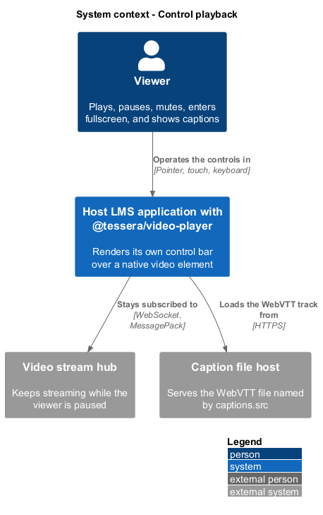
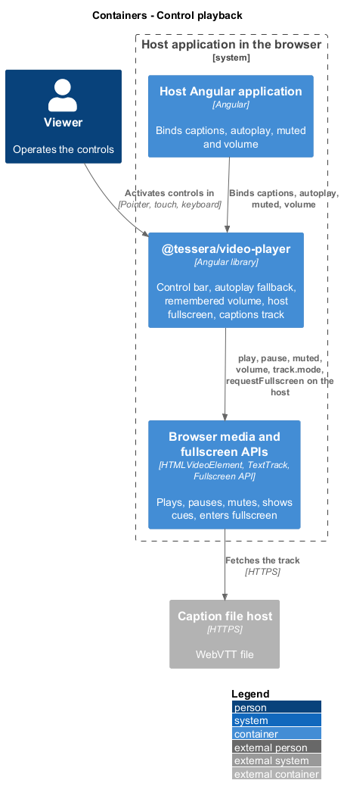
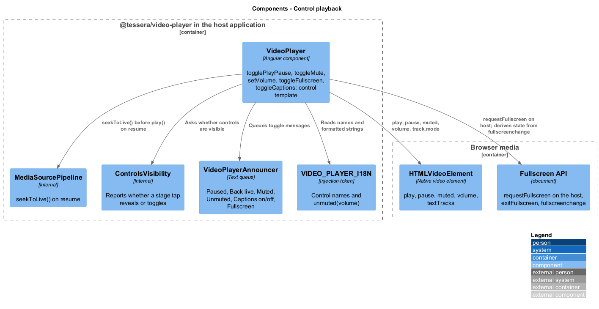
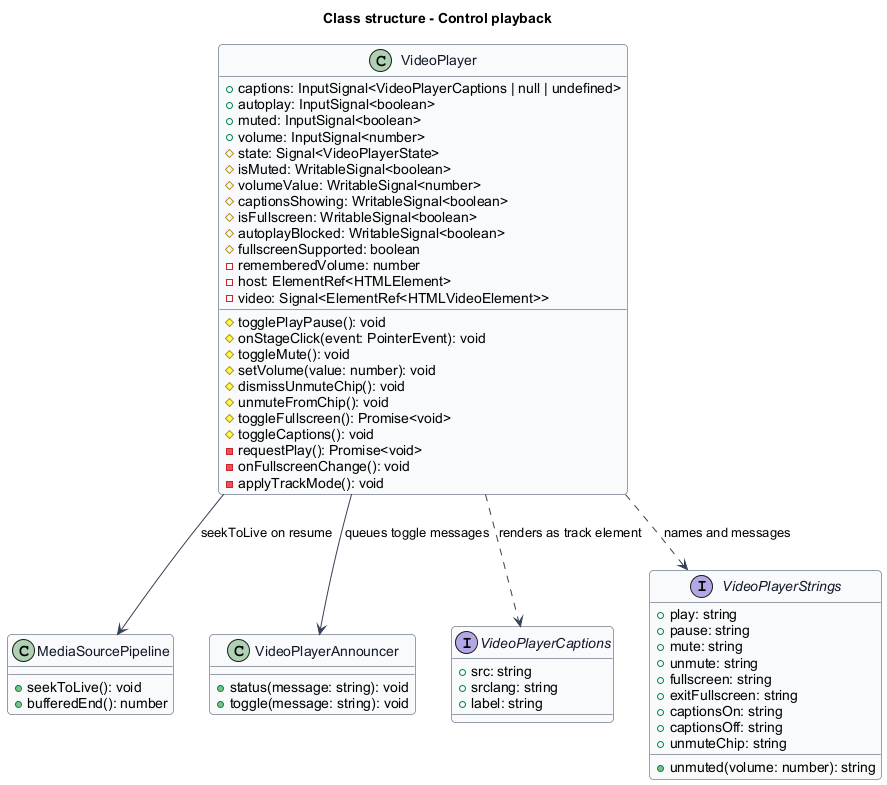
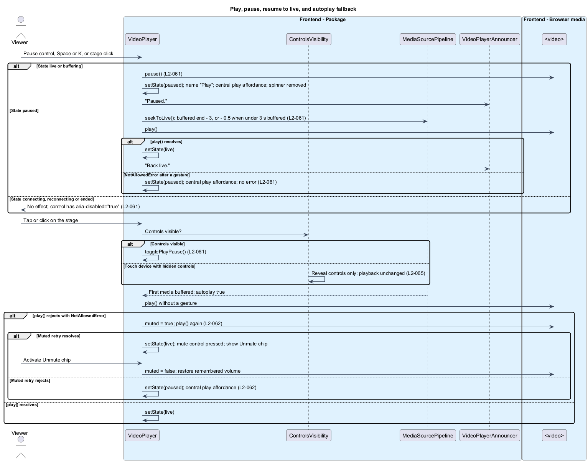
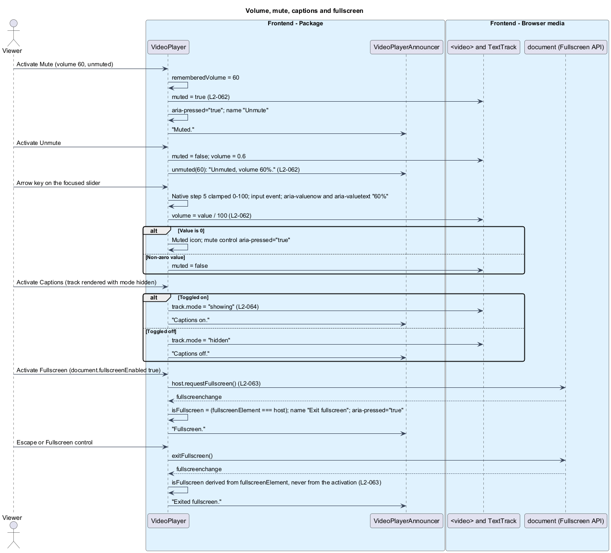

# Control playback

## Overview

`t-video-player` hides the native `<video>` controls and renders its own control bar so that the controls stay accessible, themeable, and consistent across browsers. This feature covers the four controls that act on the media element: play/pause with resume-to-live, mute and volume, fullscreen, and captions. It also covers the browser's autoplay policy, which can refuse audible playback until the viewer interacts.

**central play affordance** — large play indicator shown over the stage while the state is `paused`

**remembered volume** — slider value in effect before Mute was activated, restored on Unmute

**Unmute chip** — dismissible button shown on the stage after playback fell back to muted autoplay

**captions track** — `<track kind="captions">` element built from the host-supplied `VideoPlayerCaptions`

**pressed state** — `aria-pressed` on mute, captions, and fullscreen, conveyed by an icon change as well

Keyboard shortcuts that reach these controls are specified in [operate by keyboard](../operate-by-keyboard/). The control bar's visibility and the stage tap behaviour on touch devices belong to [show status and controls](../show-status-and-controls/). The live-edge seek used on resume is `MediaSourcePipeline.seekToLive()` from [play live stream](../play-live-stream/).

## Description

`VideoPlayer` owns the control template, the signals behind it, and the handlers. Each control is a `<button type="button">` with an `aria-label` from `VIDEO_PLAYER_I18N`; the volume slider is an `<input type="range" min="0" max="100" step="5">`. The `state` signal gates every handler, and `VideoPlayerAnnouncer` receives each toggle message.

| Control | Element | Name | State attribute |
|---------|---------|------|-----------------|
| Play/pause | `<button type="button">` | "Pause" while playing, "Play" otherwise | `aria-disabled="true"` in `connecting`, `reconnecting`, `ended` |
| Mute | `<button type="button">` | "Mute" or "Unmute" | `aria-pressed` |
| Volume | `<input type="range" min="0" max="100" step="5">` | "Volume" | `aria-valuenow`, `aria-valuetext` |
| Captions | `<button type="button">`, only with `captions` | "Captions" | `aria-pressed` |
| Fullscreen | `<button type="button">`, only when `document.fullscreenEnabled` | "Fullscreen" or "Exit fullscreen" | `aria-pressed` |

Disabled controls keep their `tabindex` so that focus never lands on `<body>`; the Tab order is specified in [operate by keyboard](../operate-by-keyboard/).

**Play and pause.** `togglePlayPause()` is reached from the play/pause control, the stage, and the keyboard. When the state is `live` or `buffering`, it calls `video.pause()`, sets the state to `paused`, renames the control "Play", shows the central play affordance, removes the buffering indicator, and queues "Paused." (`L2-061`). The subscription stays open; chunks keep arriving and the buffer window keeps pruning. When the state is `paused`, the method calls `MediaSourcePipeline.seekToLive()`, which targets the buffered end minus 3 (or minus 0.5 when less than 3 s is buffered), then calls `video.play()`. A resolved promise sets the state to `live` and queues "Back live.". When the state is `connecting`, `reconnecting`, or `ended`, the method returns without effect, and the control carries `aria-disabled="true"` while staying focusable.

A stage click calls `togglePlayPause()` only while the controls are visible. `ControlsVisibility` reports a touch tap on hidden controls as a reveal, and `VideoPlayer` ignores that tap for playback. A native `contextmenu` event on the stage is prevented so that a long press shows no `<video>` menu.

**`play()` rejections.** Every `play()` call is awaited through one `requestPlay()` helper. A `NotAllowedError` after a user gesture sets the state to `paused`, shows the central play affordance, and raises no error. The first `play()` after the first media append, requested without a gesture when `autoplay` is true, follows the fallback below (`L2-062`).

| Attempt | Outcome | Result |
|---------|---------|--------|
| Audible `play()` | resolves | State `live` |
| Audible `play()` | `NotAllowedError` | Set `video.muted = true` and retry |
| Muted retry | resolves | Playback runs muted, mute control pressed, Unmute chip shown |
| Muted retry | `NotAllowedError` | State `paused`, central play affordance |

Activating the Unmute chip restores the remembered volume, clears `video.muted`, and dismisses the chip. Dismissing the chip leaves playback muted.

**Mute and volume.** The `muted` and `volume` inputs seed the `isMuted` and `volumeValue` signals; an `effect` applies them to `video.muted` and `video.volume` whenever they change, without touching the stream (`L2-062`). `toggleMute()` stores the current slider value as the remembered volume, sets `video.muted` to true, gives the control `aria-pressed="true"` and the name "Unmute", and queues "Muted.". A second activation restores the remembered volume and queues `unmuted(volume)`, for example "Unmuted, volume 60%.". `setVolume(n)` clamps to 0–100, sets `video.volume = n / 100`, and updates `aria-valuenow` and `aria-valuetext` ("60%"). A value of 0 mutes and shows the muted icon with `aria-pressed="true"`; a non-zero value unmutes. Arrow keys on the focused slider use the native step of 5 and reach `setVolume` through the `input` event; the component applies no second change. Below 47.5em the slider is hidden by a container query, the mute control remains, and Arrow Up and Arrow Down still change the volume by 5 through the keyboard handler.

**Fullscreen.** `toggleFullscreen()` calls `requestFullscreen()` on the component host element, never on the `<video>`, so the control bar, announcer, and error panel stay inside the fullscreen element (`L2-063`). When the player is fullscreen the method calls `document.exitFullscreen()`. A `fullscreenchange` listener on `document` derives the `isFullscreen` signal from `document.fullscreenElement === host`, never from the last activation, and queues "Fullscreen." or "Exited fullscreen." on each change. The pressed state and the names "Exit fullscreen" and "Fullscreen" follow the signal. The control is omitted when `document.fullscreenEnabled` is false. While fullscreen with hidden controls, the stage sets `cursor: none` until the pointer moves. The listener is removed on destroy.

**Captions.** When `captions` is set, the template renders `<track kind="captions" [src] [srclang] [label]>` inside the `<video>`; the element is rendered through a `@for` block keyed by `src`, so a changed `src` removes the old element and creates a new one (`L2-064`). After the track element exists, an `effect` sets `track.mode` to `showing` when `captionsShowing` is true and `hidden` otherwise, which preserves the preference across a `src` change. `toggleCaptions()` flips `captionsShowing`, updates `aria-pressed`, and queues "Captions on." or "Captions off.". A `null` value renders no track and no control, and the C key does nothing. Cue text uses `::cue` with `--t-video-player-caption-bg` and `--t-video-player-caption-fg`; the built-in token values meet 4.5:1. Cue times are on the stream's media timeline, which the host aligns.

## Requirements

Source: [L2 detailed requirements](../../../specs/L2.md). The table quotes the source wording exactly, including its modal verb.

| L2 ID | Refines (L1) | Requirement |
|-------|--------------|-------------|
| `L2-061` | `L1-021` | The player must toggle playback from the play/pause control, the stage, and the keyboard; pausing must hold the current frame; resuming must jump to the live edge. |
| `L2-062` | `L1-021` | The player must expose mute and volume controls bound to the `<video>` element, remember the pre-mute volume, and fall back to muted playback when the browser blocks audible autoplay. |
| `L2-063` | `L1-021` | The player must enter and exit fullscreen on the component host, not on the bare `<video>` element, so that its own controls remain available. |
| `L2-064` | `L1-021` | The player must render a host-supplied WebVTT track as a `<track kind="captions">` element and toggle it with a captions control. |

## Diagrams

The context view shows the viewer operating the player's own controls; the hub keeps streaming regardless of pause.

The container view places the package between the host application, which supplies captions and the autoplay and volume inputs, and the browser's media and fullscreen APIs.

The component view shows `VideoPlayer` driving the `<video>` element, the host's fullscreen state, and the captions track, with `VideoPlayerAnnouncer` receiving toggle messages.

The class view records the control signals, handlers, and the captions and i18n types.

Pause holds the frame, resume seeks to live, the stage toggles only while controls are visible, and a blocked `play()` falls back to muted playback with an Unmute chip.

Mute remembers the volume, the slider drives `video.volume`, captions switch the track mode, and fullscreen state is derived from `fullscreenchange`.

