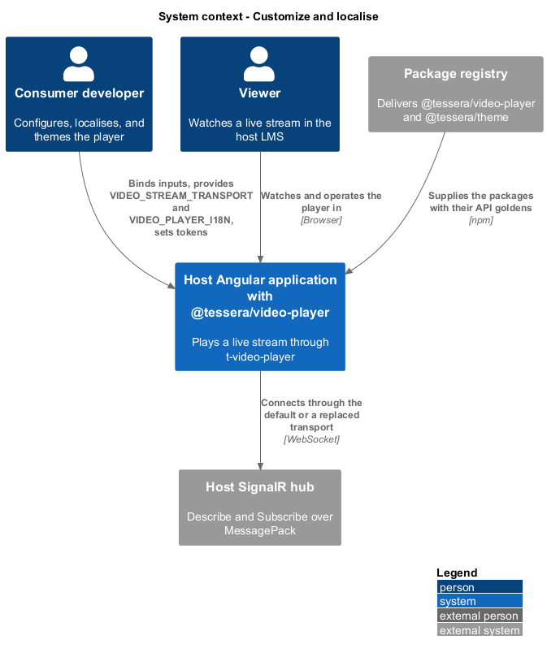
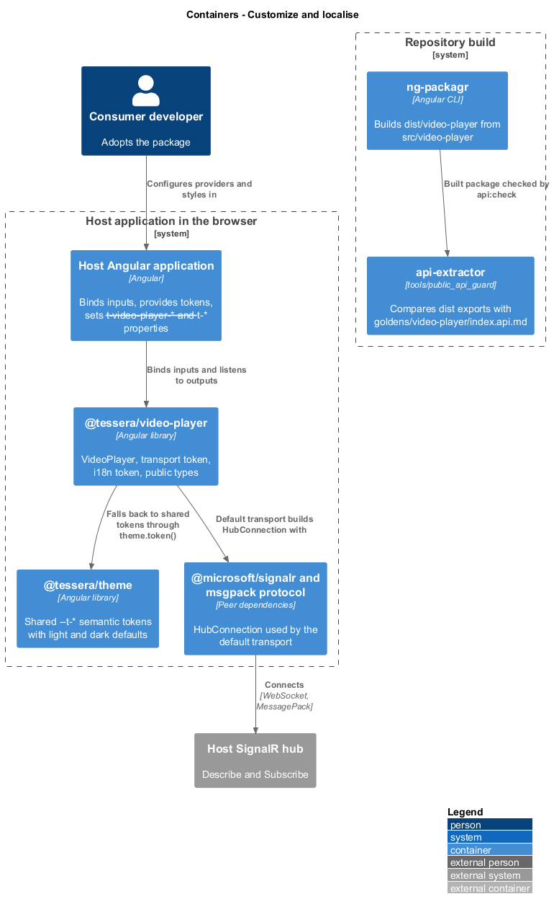
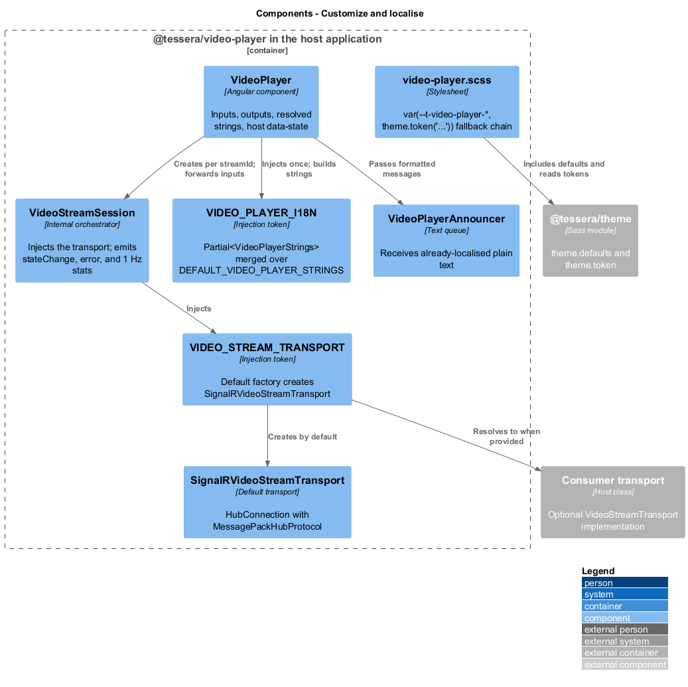
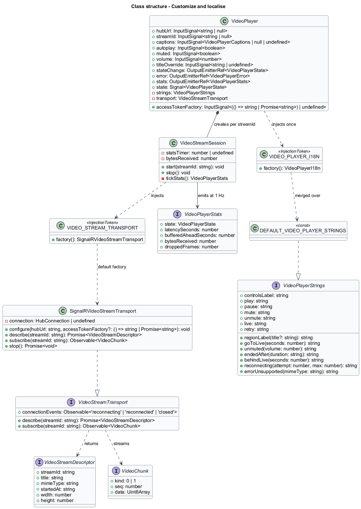
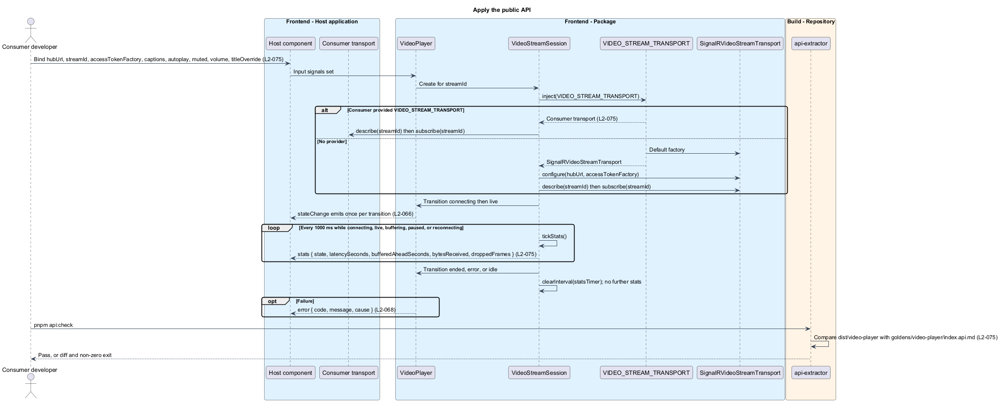
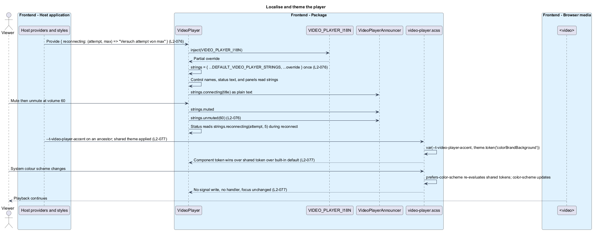

# Customize and localise

## Overview

`t-video-player` is a live video player that a Learning Management System hosts. This feature defines the surface through which a consuming application configures the player, replaces its transport, replaces its text, and themes it, without touching its source and without being able to break its accessibility pattern.

**Consumer** — Angular application that hosts `t-video-player` and supplies its hub location, stream identity, token, captions, and customizations

**Public API** — set of exports, inputs, outputs, tokens, and types a consumer may depend on

**API golden** — recorded api-extractor report of the exported API that a check compares with the built package

**Transport** — object that answers `describe` and `subscribe` for a stream identifier and reports connection events

**i18n token** — Angular injection token through which a consumer supplies replacement strings

**String** — user-visible or assistive-technology text the player owns, such as a control name, a status line, or a live-region message

**Function string** — string entry that is a function of one or two numbers, so that an override controls number placement and grammar

**Component token** — CSS custom property named `--t-video-player-*` that overrides one visual decision of the player

**Shared token** — CSS custom property named `--t-*` that `@tessera/theme` defines for every Tessera component

The package has one entry point, one component, one transport interface, and one string source. The SignalR transport is the default and is replaceable through `VIDEO_STREAM_TRANSPORT`. Every owned string is replaceable through `VIDEO_PLAYER_I18N`. Colours, radius, and motion resolve through a three-level fallback chain in `video-player.scss`.

The feature belongs to the video-player subsystem and refines `L1-026` and `L1-019`. It publishes the types that [connect and subscribe](../connect-and-subscribe/) and [play live stream](../play-live-stream/) consume, and it supplies the string source that [expose to assistive tech](../expose-to-assistive-tech/) and [show status and controls](../show-status-and-controls/) read.

## Description

**Public API and package**

- `VideoPlayer` is a standalone OnPush component with selector `t-video-player`. Its inputs use the signal `input()` function and its outputs use `output()`. The package layout mirrors `src/combobox/`: `index.ts` re-exports `public-api.ts`, and there is no secondary entry point (`L2-075` AC1).

| Input | Type | Default |
|-------|------|---------|
| `hubUrl` | `string \| null` | `null` |
| `streamId` | `string \| null` | `null` |
| `accessTokenFactory` | `(() => string \| Promise<string>) \| undefined` | `undefined` |
| `captions` | `VideoPlayerCaptions \| null \| undefined` | `undefined` |
| `autoplay` | `boolean` | `true` |
| `muted` | `boolean` | `false` |
| `volume` | `number` | `100` |
| `titleOverride` | `string \| undefined` | `undefined` |

- The outputs are `stateChange` (`VideoPlayerState`), `error` (`VideoPlayerError`), and `stats` (`VideoPlayerStats`). `stateChange` emits once per transition as defined in `L2-066`. `error` emits once per failure as defined in `L2-068`.
- `VideoStreamSession` runs one `setInterval` of 1000 ms while the state is `connecting`, `live`, `buffering`, `paused`, or `reconnecting`. Each tick emits `stats` with `state`, `latencySeconds` (buffered end minus `currentTime`, rounded to 0.1 s), `bufferedAheadSeconds`, `bytesReceived` (sum of `data.byteLength` since subscription), and `droppedFrames` (from `getVideoPlaybackQuality()`). The interval is cleared on entry to `idle`, `ended`, or `error`, so `stats` never emits in those states (`L2-075` AC5).
- `VideoStreamTransport` is the interface `describe(streamId): Promise<VideoStreamDescriptor>`, `subscribe(streamId): Observable<VideoChunk>`, and `connectionEvents: Observable<'reconnecting' | 'reconnected' | 'closed'>`. `VIDEO_STREAM_TRANSPORT` is an `InjectionToken<VideoStreamTransport>` whose default factory creates a `SignalRVideoStreamTransport`. `VideoPlayer` injects the token once; a provider at application, route, or component level replaces the SignalR transport for every player below it (`L2-075` AC2). `SignalRVideoStreamTransport` reads `hubUrl` and `accessTokenFactory` through a `configure()` call that `VideoStreamSession` makes before `describe`; a custom transport may ignore both.
- `src/video-player/package.json` names the package `@tessera/video-player`, sets `sideEffects: false`, and declares peer dependencies on `@angular/core`, `@angular/common`, `@angular/cdk`, `rxjs`, `@microsoft/signalr`, and `@microsoft/signalr-protocol-msgpack`. The two SignalR packages are peers, not dependencies, so a consumer with a custom transport is not forced to bundle them (`L2-075` AC3). `src/video-player/ng-package.json` sets `dest` to `../../dist/video-player` and `lib.entryFile` to `index.ts`.
- `public-api.ts` exports `VideoPlayer`, `VideoPlayerState`, `VideoPlayerError`, `VideoPlayerErrorCode`, `VideoPlayerStats`, `VideoPlayerCaptions`, `VideoPlayerI18n`, `VideoPlayerStrings`, `DEFAULT_VIDEO_PLAYER_STRINGS`, `VIDEO_PLAYER_I18N`, `VideoStreamDescriptor`, `VideoChunk`, `VideoStreamTransport`, `VIDEO_STREAM_TRANSPORT`, `SignalRVideoStreamTransport`, and `VideoPlayerHarness` (`L2-075` AC4). `VideoStreamSession`, `MediaSourcePipeline`, `ReconnectPolicy`, `ControlsVisibility`, and `VideoPlayerAnnouncer` stay internal.
- The API golden is `goldens/video-player/index.api.md`. A third api-extractor configuration under `tools/public_api_guard/` points at `dist/video-player`, and the `api:update` and `api:check` scripts cover all three packages. `api:check` fails when the built API differs from the golden.

**Localisable strings**

- `VideoPlayerStrings` is an interface with one property per owned string. Plain strings are `string`; strings that embed a number are functions (`L2-076`). `DEFAULT_VIDEO_PLAYER_STRINGS` holds the English defaults. `VideoPlayerI18n` names `Partial<VideoPlayerStrings>`, the value type of the token.
- `VIDEO_PLAYER_I18N` is an `InjectionToken<VideoPlayerI18n>` provided in root with a factory returning `{}`. `VideoPlayer` builds `{ ...DEFAULT_VIDEO_PLAYER_STRINGS, ...inject(VIDEO_PLAYER_I18N) }` once per instance into a `strings` field, so an override of one key leaves every other key at its default (`L2-076` AC2). Control names, status text, the error panel, and every message passed to `VideoPlayerAnnouncer` read from `strings`, so one provider changes all three surfaces (`L2-076` AC4). Live locale mutation after injection is outside v1; a locale change recreates the component with new providers.
- Function strings are called with the values named in `L2-076` AC3: `unmuted(volume)` with the slider value 0–100, `endedAfter(duration)` with the formatted live duration, `behindLive(seconds)` with the whole seconds behind, and `reconnecting(attempt, max)` with the one-based attempt and 5. The player never concatenates a number onto a plain string.
- Placeholder substitution of the combobox kind is not used; the title appears through `regionLabel(title)`, `connecting(title)`, and `unsupported(mimeType)`, which are also functions. Descriptor fields pass through as plain text (`L2-058` AC5).

| Key | English default | Used for |
|-----|-----------------|----------|
| `regionLabel(title)` | Video player: {title} / Video player | Region name before and after `Describe` |
| `controlsLabel` | Player controls | Control bar group name |
| `play`, `pause` | Play, Pause | Play/pause control name |
| `mute`, `unmute` | Mute, Unmute | Mute control name |
| `volumeLabel`, `volumeValue(volume)` | Volume, {n}% | Slider name and `aria-valuetext` |
| `live`, `goToLive(seconds)` | Live, Go to live, {n} seconds behind | LIVE badge name |
| `captionsOn`, `captionsOff` | Captions on., Captions off. | Captions toggle announcements |
| `captions` | Captions | Captions control name |
| `fullscreen`, `exitFullscreen` | Fullscreen, Exit fullscreen | Fullscreen control name |
| `connectingStatus`, `connecting(title)` | Connecting…, Connecting to {title}. | Placeholder text and announcement |
| `liveAnnounced`, `paused`, `backLive`, `buffering` | Live., Paused., Back live., Buffering. | Milestone announcements |
| `waitingForSource` | Waiting for the source… | Status after 10 s without a chunk |
| `reconnecting(attempt, max)` | Reconnecting… attempt {attempt} of {max} | Status text |
| `connectionLost`, `reconnected` | Connection lost. Reconnecting., Reconnected. Live. | Reconnect announcements |
| `streamEnded`, `endedAfter(duration)` | Stream ended, Stream ended. It was live for {duration}. | Ended panel and announcement |
| `muted`, `unmuted(volume)` | Muted., Unmuted, volume {n}%. | Mute announcements |
| `fullscreenOn`, `fullscreenOff` | Fullscreen., Exited fullscreen. | Fullscreen announcements |
| `behindLive(seconds)` | {n} seconds behind live. Press Live to catch up. | Announced once at 10 s behind |
| `retry` | Retry | Retry control name |
| `errorUnsupported(mimeType)`, `errorUnauthorized`, `errorNotFound`, `errorConnection`, `errorSource`, `errorDecode`, `errorStalled` | The seven messages in `L2-068` AC2 | Error panel heading |

**Theme tokens**

- `video-player.scss` starts with `@use '../theme/styles/tokens' as theme;` and `@include theme.defaults((...))` listing every shared token it reads, as `combobox.scss` does. Each themed property is written `var(--t-video-player-<name>, theme.token('<sharedName>'))`. The `var()` fallback gives the component token precedence over the shared token, and `theme.token` resolves the shared token ahead of the built-in light or dark default (`L2-077` AC2).

| Component token | Shared token fallback | Applied to |
|-----------------|-----------------------|------------|
| `--t-video-player-scrim` | `colorNeutralBackground1` | Control bar and error panel background over the picture |
| `--t-video-player-control-fg` | `colorNeutralForeground1` | Control text and icons |
| `--t-video-player-control-bg-hover` | `colorNeutralBackground1Hover` | Hovered control |
| `--t-video-player-accent` | `colorBrandBackground` | Pressed-state icon and central play affordance |
| `--t-video-player-accent-fg` | `<TO SUPPLY>` | Text on the accent colour |
| `--t-video-player-live` | `<TO SUPPLY>` | LIVE dot at the live edge |
| `--t-video-player-focus-ring` | `colorStrokeFocus2` | `:focus-visible` outline |
| `--t-video-player-error` | `colorPaletteRedForeground1` | Error panel heading |
| `--t-video-player-error-fg` | `colorNeutralForeground1` | Error panel text |
| `--t-video-player-skeleton` | `colorNeutralBackground2` | Connecting placeholder |
| `--t-video-player-caption-bg`, `-caption-fg` | `<TO SUPPLY>` | `::cue` background and text |
| `--t-video-player-motion-duration` | `<TO SUPPLY>` | Control fade and spinner |
| `--t-video-player-radius` | `borderRadiusMedium` | Control bar and panel corners |

- The fourteen token names in `L2-077` AC4 are documented in `src/video-player/README.md`. Shared token fallbacks marked `<TO SUPPLY>` are chosen when `@tessera/theme` names a matching semantic token; until then the built-in default applies.
- The host sets `color-scheme: theme.token('colorScheme')`. The shared stylesheet defines its dark values under `prefers-color-scheme: dark` and under an explicit theme attribute. A system scheme change is therefore a stylesheet re-evaluation: no JavaScript listener runs, no signal changes, `<video>` keeps playing, and focus stays where it was (`L2-077` AC3). The combobox `matchMedia` subscription is not needed because the player has no detached overlay.
- Contrast of every token pair in the built-in light and dark themes is verified in [present accessibly](../present-accessibly/). Custom palettes remain the host's accessibility responsibility, as the theme README states.

## Requirements

Source: [L2 detailed requirements](../../../specs/L2.md). The table quotes the source wording exactly, including its modal verb.

| L2 ID | Refines (L1) | Requirement |
|-------|--------------|-------------|
| `L2-075` | `L1-026` | The player must ship as the standalone package `@tessera/video-player` with no secondary entry points, documented inputs, outputs, tokens, and types, and a public API golden. |
| `L2-076` | `L1-026` | Every user-visible string in the player must come from `VIDEO_PLAYER_I18N` with English defaults, and strings that embed numbers must be functions. |
| `L2-077` | `L1-019` | The player's colours, radius, and motion must resolve from `--t-video-player-*` overrides first, then from the shared `--t-*` semantic tokens of `@tessera/theme`, then from built-in defaults. |

## Diagrams

The context view places the package between the consumer developer who configures it, the viewer, the host's hub, and the package registry that delivers it.

The container view shows the consumer's providers and styles feeding `@tessera/video-player`, the shared theme package it falls back to, and the build chain that checks the API golden.

The component view shows the string source, the transport token with its default implementation, the stylesheet fallback chain, and the session that emits statistics.

The class view records the inputs, outputs, string interface with its function entries, the transport interface, and the public types.

Inputs are applied, a provided transport replaces the SignalR default, outputs are emitted on transitions, statistics tick at 1 Hz only in active states, and the build compares the API with its golden.

A partial string override merges over the defaults once, function strings receive numbers, component tokens win over shared tokens, and a system scheme change re-evaluates styles without touching playback.

