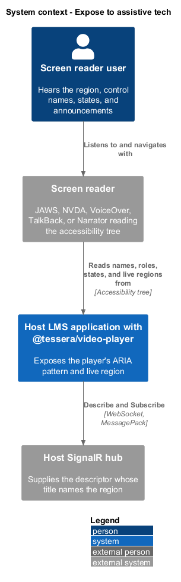
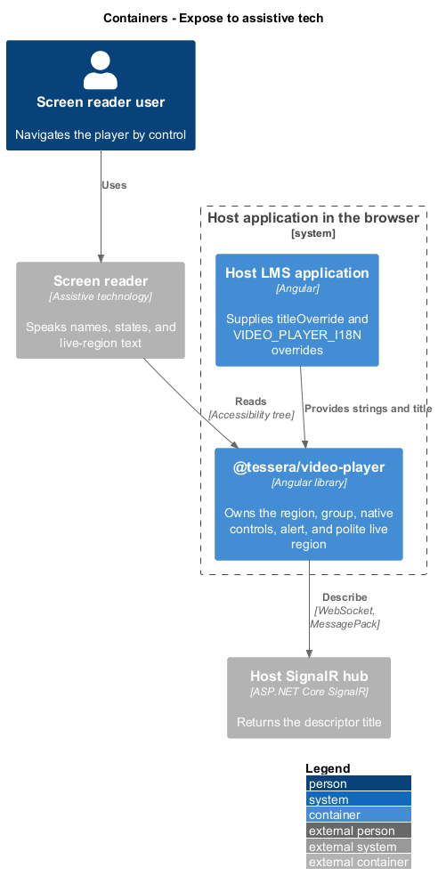
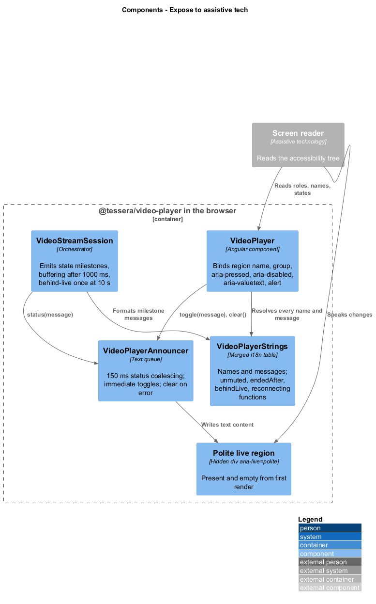
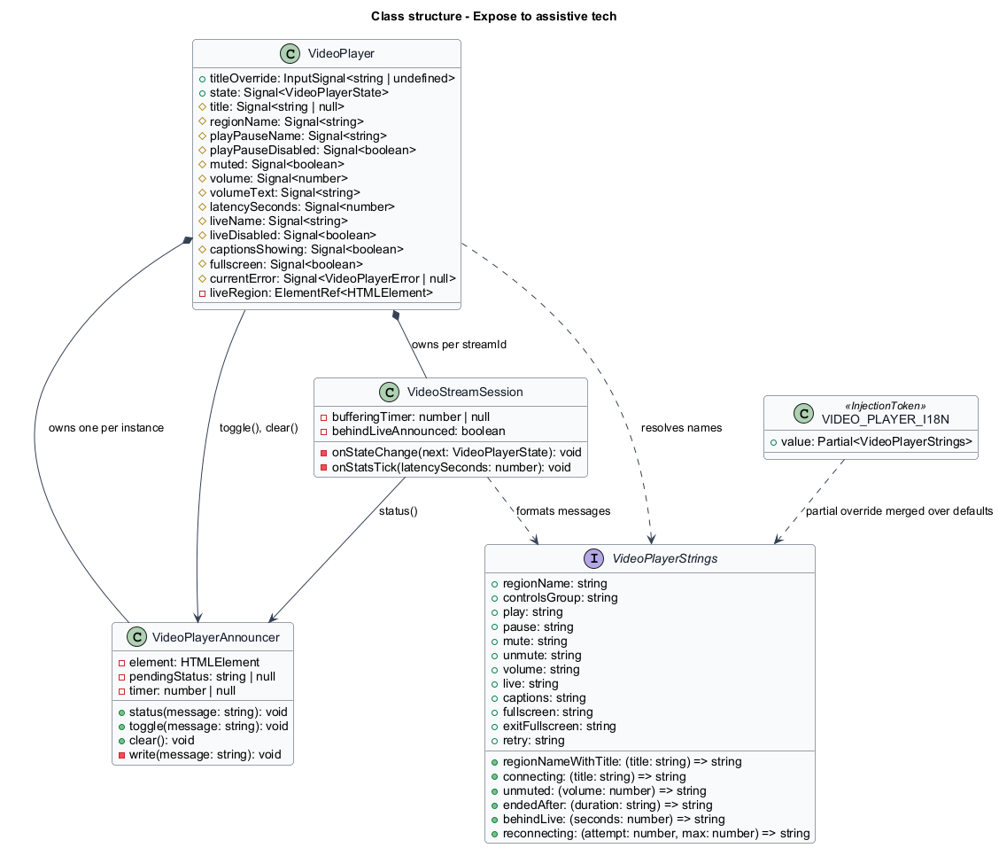
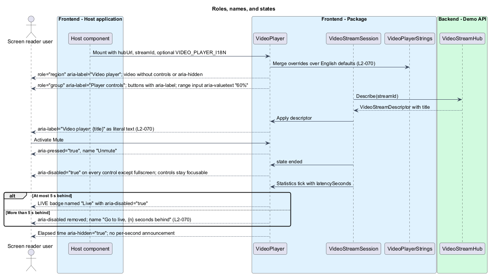
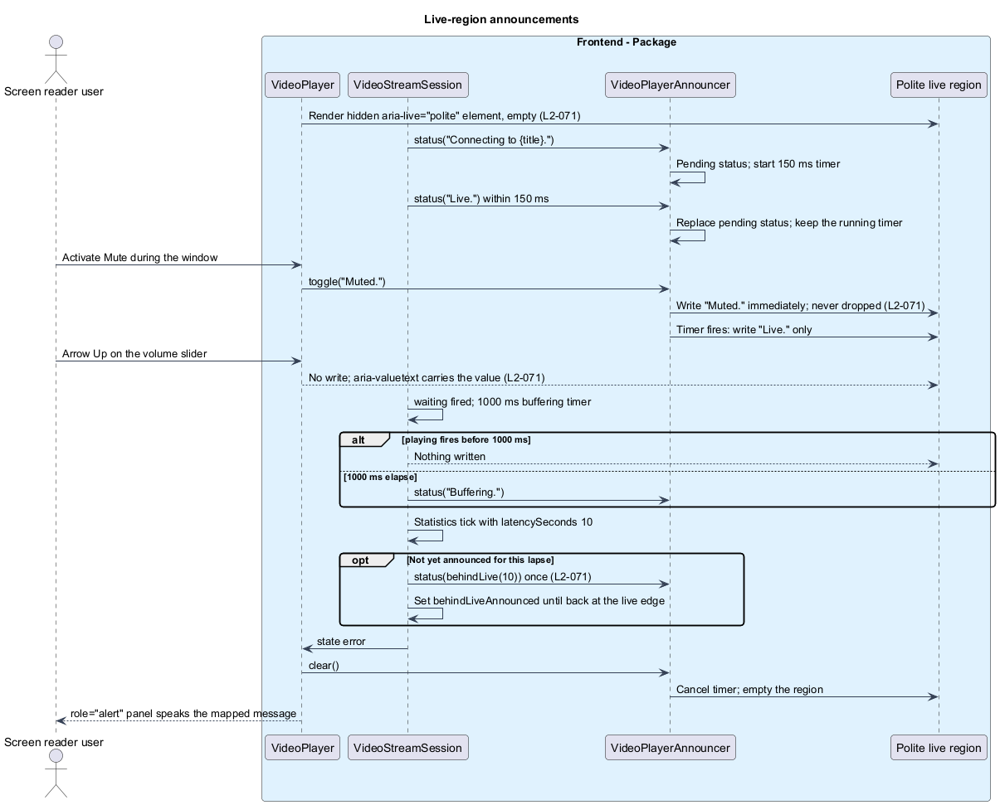

# Expose to assistive tech

## Overview

`t-video-player` gives a screen reader user the same information a sighted viewer gets from the picture, the control bar, and the status overlays. The component owns its whole ARIA pattern: a labelled region, a grouped control bar of native buttons and one native slider, pressed and disabled states on the controls, an alert for failures, and one polite live region that reports milestones and toggles. The consuming application supplies a stream title and nothing else; it cannot break the pattern, because none of it is configurable beyond the strings.

**region** — element with `role="region"` and the name "Video player: {title}" that wraps the whole player

**control bar** — element with `role="group"` named "Player controls" that holds the controls in reading order

**polite live region** — visually hidden element with `aria-live="polite"` that the player writes milestone and toggle messages into

**status message** — live-region message that reports a state milestone, such as "Live." or "Buffering."

**toggle message** — live-region message that confirms a control toggle, such as "Muted." or "Captions on."

**coalescing window** — 150 ms interval in which consecutive status messages collapse to the last one

This feature covers roles, names, states, properties, and announcements. The visual and pointer side of accessibility belongs to [present accessibly](../present-accessibly/), keyboard operation to [operate by keyboard](../operate-by-keyboard/), and the string table to [customize and localise](../customize-and-localise/).

## Description

`VideoPlayer` renders the pattern in `video-player.html` from its signals; `VideoPlayerAnnouncer` writes the live region; `VideoStreamSession` and the control methods decide what is announced and when. Every name and message resolves through `VideoPlayerStrings`, the merge of `VIDEO_PLAYER_I18N` over the English defaults, so an override changes names and announcements alike without re-creating the component.

**Region and control bar.** The first element inside the host has `role="region"` and `aria-label` bound to a computed signal: "Video player" until the descriptor arrives, then "Video player: {title}" from `titleOverride` or the descriptor (`L2-070`). The title is bound as an attribute value, never as HTML, so markup in a title is literal text. The `<video>` element has no `controls` attribute and no `aria-hidden`; its native text track remains exposed. The control bar is a `
`. The group role is deliberate: a toolbar would claim the arrow keys that volume uses.

| Control | Element | Name | State |
|---------|---------|------|-------|
| Play/pause | `<button type="button">` | "Pause" while playing, "Play" otherwise | `aria-disabled="true"` in `connecting`, `reconnecting`, `ended` |
| Mute | `<button type="button">` | "Mute" or "Unmute" | `aria-pressed` true when muted or volume 0 |
| Volume | `<input type="range" min="0" max="100" step="5">` | "Volume" | `aria-valuetext` "{n}%" |
| LIVE badge | `<button type="button">` | "Live", or "Go to live, {n} seconds behind" | `aria-disabled="true"` at the live edge |
| Captions | `<button type="button">` | "Captions" | `aria-pressed` follows the track mode |
| Fullscreen | `<button type="button">` | "Fullscreen" or "Exit fullscreen" | `aria-pressed` from `document.fullscreenElement` |

Disabled controls use `aria-disabled="true"` and keep their click handlers guarded, so they stay focusable and announce their state; `disabled` is never set. The LIVE badge derives its name and `aria-disabled` from `latencySeconds` on each 1 Hz statistics tick: at or below 5 s behind it is "Live" and disabled; above 5 s the attribute is removed and the name becomes the behind-live wording with the rounded whole seconds. The `VideoPlayerStrings` key for that badge name is `<TO SUPPLY>`; `behindLive(seconds)` serves the announcement. The elapsed-time text carries `aria-hidden="true"` because it changes every second. The error panel has `role="alert"`, a heading, and a Retry button named "Retry" where [recover from interruptions](../recover-from-interruptions/) offers one.

**Live region.** The template always contains one visually hidden `
` inside the host, empty at first render, so the region is registered by the browser before the first message (`L2-071`). Each instance owns its own region; two players on a page never share one. `VideoPlayerAnnouncer` holds a reference to the element and exposes three methods.

- `status(message)` replaces any pending status message and, when no timer is running, starts a 150 ms timer. When the timer fires, the pending message is written. Several transitions inside the window therefore produce one write with the last message, so "Connecting to {title}." followed by "Live." within 150 ms speaks only "Live.".
- `toggle(message)` writes immediately and never replaces or drops a pending status. A toggle during the window is spoken, and the status still follows when its timer fires.
- `clear()` cancels the timer, discards the pending status, and empties the region. `VideoPlayer` calls it when the error panel renders, so the alert is the only message spoken for a failure.

A write replaces the region's text content. The messages written, and only these, are listed in `L2-071`: the session writes "Connecting to {title}.", "Live.", "Buffering.", "Connection lost. Reconnecting.", "Reconnected. Live.", and "Stream ended. It was live for {duration}." as status messages; the control methods write "Paused.", "Back live.", "Muted.", "Unmuted, volume {n}%.", "Captions on.", "Captions off.", "Fullscreen.", and "Exited fullscreen." as toggle messages. "Buffering." is queued by a 1000 ms timer that `playing` cancels, so shorter stalls are silent. "Paused." and "Back live." are toggles, so a pause and resume in quick succession are both spoken.

| Message | Kind | Written by | Timing |
|---------|------|------------|--------|
| "Connecting to {title}." | Status | `VideoStreamSession` | After the descriptor is applied |
| "Live.", "Reconnected. Live." | Status | `VideoStreamSession` | On the transition to `live` |
| "Buffering." | Status | `VideoStreamSession` | 1000 ms after `waiting`, unless `playing` fires first |
| "Connection lost. Reconnecting." | Status | `VideoStreamSession` | On `reconnecting`; once per loss |
| "Stream ended. It was live for {duration}." | Status | `VideoStreamSession` | On `ended`, through `endedAfter(duration)` |
| "Paused.", "Back live." | Toggle | `togglePlayback()` | Immediately |
| "Muted.", "Unmuted, volume {n}%." | Toggle | `toggleMute()` | Immediately, through `unmuted(volume)` |
| "Captions on.", "Captions off." | Toggle | `toggleCaptions()` | Immediately |
| "Fullscreen.", "Exited fullscreen." | Toggle | `fullscreenchange` handler | Immediately |

**Behind live.** The session compares `latencySeconds` on each statistics tick. When it first reaches 10 s, the session writes `behindLive(10)` ("10 seconds behind live. Press Live to catch up.") once and sets a flag; the flag clears when playback returns to the live edge by any means, so the next lapse announces again. Smaller lags change only the LIVE badge name.

**What is never announced.** Volume changes by keyboard or pointer write nothing; the slider's `aria-valuetext` is read by the screen reader as part of the native range input. The elapsed-time text and the `stats` output produce no messages. Per-attempt reconnect status text is visible only; the live region speaks the loss once and the recovery once.

## Requirements

Source: [L2 detailed requirements](../../../specs/L2.md). The table quotes the source wording exactly, including its modal verb.

| L2 ID | Refines (L1) | Requirement |
|-------|--------------|-------------|
| `L2-070` | `L1-024` | The player must own its ARIA pattern so that a consuming application cannot break it: a labelled region, a grouped control bar of native buttons and a native slider, pressed and disabled states on the controls, and an alert for errors. |
| `L2-071` | `L1-024` | The player must own one visually hidden polite live region per instance, present from first render, announce state milestones and control toggles through it, report failures through its alert, and never announce per-second changes. |

## Diagrams

The context view shows a screen reader user receiving the player's names, states, and announcements through the host application.

The container view places `@tessera/video-player` in the host application's browser, read by a screen reader through the accessibility tree.

The component view shows `VideoPlayer` rendering the pattern, `VideoPlayerAnnouncer` writing the live region, and `VideoPlayerStrings` supplying every name.

The class view records the announcer's queue, the string functions, and the signals the template binds to roles and states.

The region name follows the descriptor, the control bar exposes pressed and disabled states, the slider reports its value text, and the LIVE badge changes name past 5 s behind.

Status messages coalesce within 150 ms, toggles are never dropped, an error clears the polite region in favour of the alert, and falling 10 s behind is announced once.

