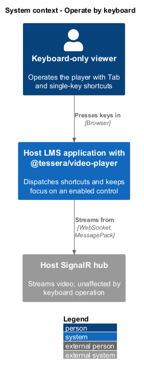
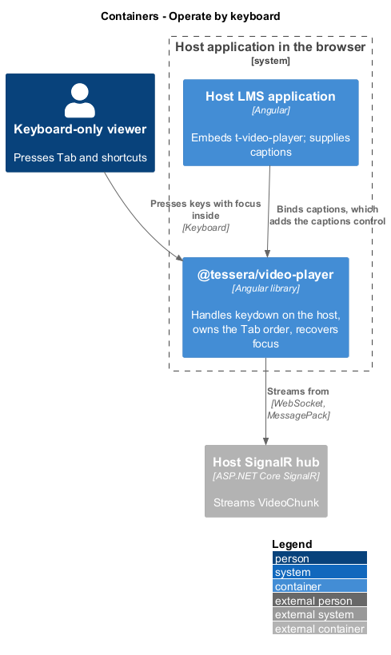
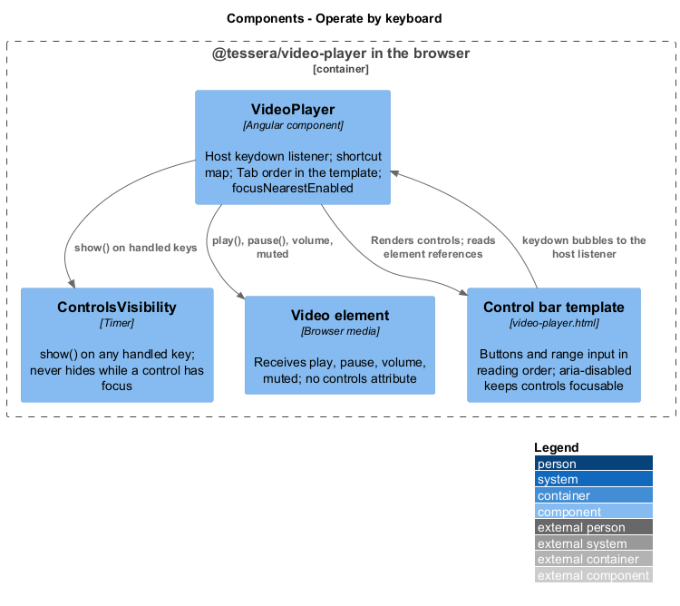
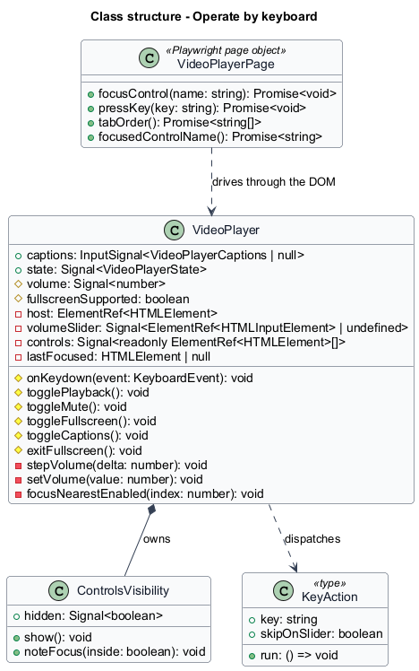
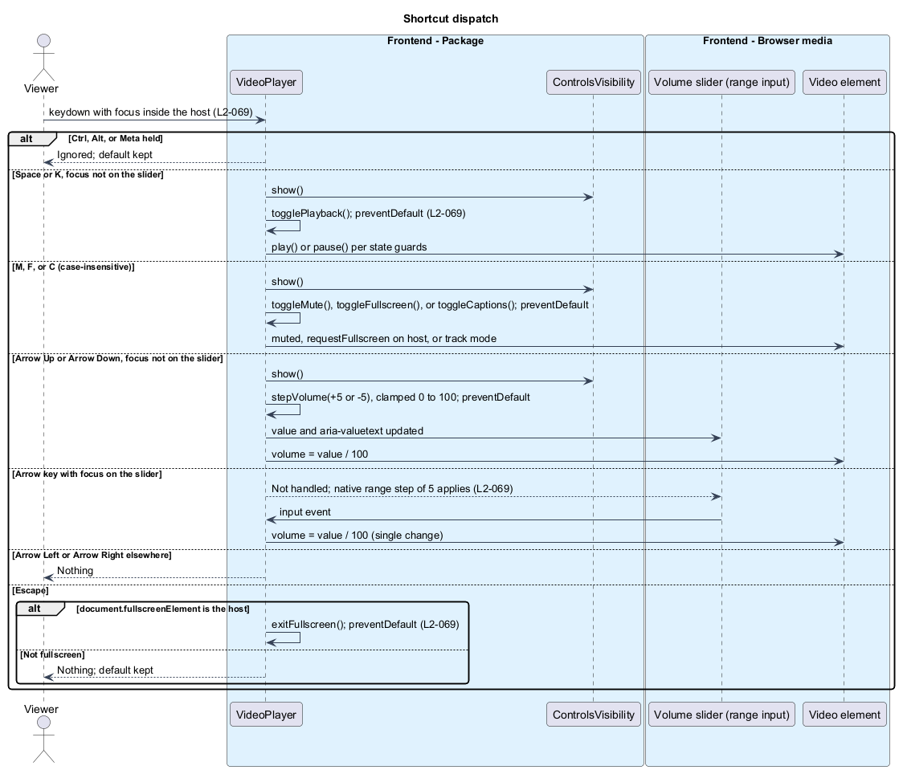
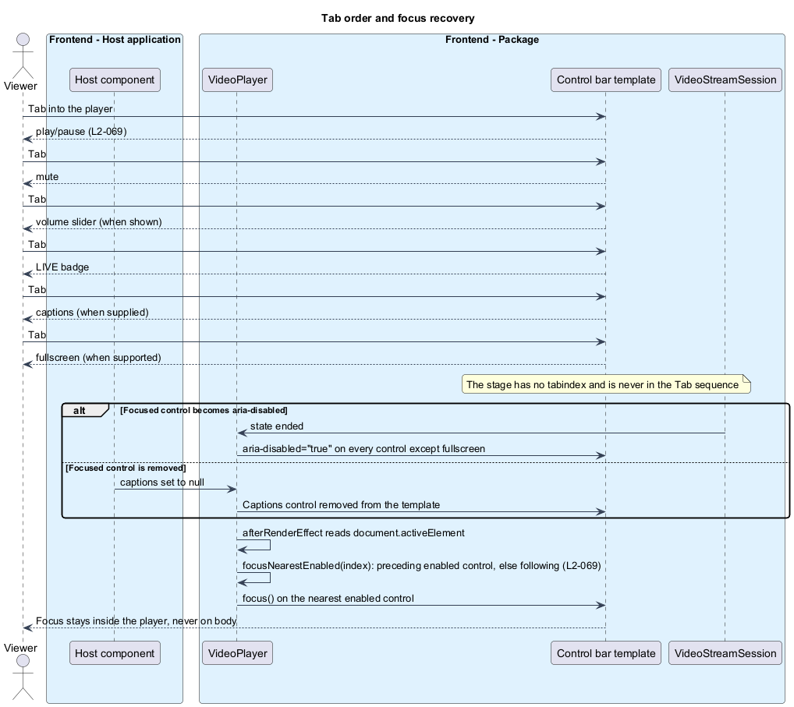

# Operate by keyboard

## Overview

`t-video-player` is fully operable without a pointer. Every control sits in the Tab sequence in reading order, and a small set of single-key shortcuts acts on the player while focus is anywhere inside its host. The shortcuts are the ones a viewer of other web players already expects, and they never override a key that has a native meaning on the focused element or a key that a browser or screen reader reserves.

**host** — `t-video-player` element that contains the stage, the control bar, the live region, and any error panel

**shortcut** — single unmodified key that acts on the player while focus is inside the host

**native meaning** — default action a key already has on the focused element, such as an arrow key on a range input

**Tab order** — sequence in which Tab moves focus through the controls, equal to their order in the template

**nearest enabled control** — closest control in Tab order, preceding first, that does not have `aria-disabled="true"`

This feature covers the shortcut map, modifier handling, the Tab order, and focus recovery when a focused control is disabled or removed. What each action does to playback, volume, captions, and fullscreen belongs to [control playback](../control-playback/); the accessible names and states that a screen reader announces belong to [expose to assistive tech](../expose-to-assistive-tech/).

## Description

`VideoPlayer` handles every key. A host listener `(keydown)` receives key events from any focused element inside the host, so the shortcuts work on the stage overlay, on any control, and on the error panel. There is no document-level listener; a key pressed outside the host reaches nothing in the player (`L2-069`).

**Shortcut dispatch.** `onKeydown(event)` returns at once when `ctrlKey`, `altKey`, or `metaKey` is set, so browser and assistive-technology chords pass through untouched. It compares `event.key.toLowerCase()` against the map below, so letter shortcuts are case-insensitive. A handled key calls `ControlsVisibility.show()` so the control bar reappears, then calls `event.preventDefault()`, except for Escape outside fullscreen. Each action routes through the same method the matching control uses, so the state guards of `L2-061` to `L2-064` apply: Space in `connecting`, `reconnecting`, or `ended` does nothing, F does nothing when the Fullscreen control is omitted, and C does nothing when `captions` is `null`.

| Key | Condition | Action |
|-----|-----------|--------|
| Space, K | Focus not on the volume slider | `togglePlayback()` |
| M | Any focus inside the host | `toggleMute()` |
| F | Fullscreen control present | `toggleFullscreen()` |
| C | `captions` supplied | `toggleCaptions()` |
| Arrow Up, Arrow Down | Focus not on the volume slider | `stepVolume(+5)` or `stepVolume(-5)`, clamped to 0–100 |
| Arrow Left, Arrow Right | Any focus | Nothing |
| Escape | `document.fullscreenElement` is the host | `exitFullscreen()`; otherwise nothing and the default is kept |

The volume slider check compares `event.target` with the slider's element reference. On the slider, Space, K, and the four arrow keys fall through to the native range behaviour, so the browser changes the value by the `step` of 5 and the `input` event updates `video.volume`; the component applies no second change. M, F, C, and Escape still act on the slider. Whether Space on a focused native button activates that button instead of toggling playback, as the HTML mock does, is `<TO SUPPLY>`; the acceptance criteria of `L2-069` take precedence until decided.

`stepVolume(delta)` sets the slider's value and `video.volume` through the same `setVolume(n)` path the slider's `input` event uses, so `aria-valuenow`, `aria-valuetext`, and the mute icon at 0 stay consistent. No live-region message follows a volume change.

**Tab order.** The template places the controls in reading order: play/pause, mute, volume slider, LIVE badge, captions, fullscreen. The Tab sequence is the subset that exists in the current layout and configuration.

| Position | Control | Present when |
|----------|---------|--------------|
| 1 | Play/pause | Always |
| 2 | Mute | Always |
| 3 | Volume slider | Host at least 47.5em wide |
| 4 | LIVE badge | Always |
| 5 | Captions | `captions` is supplied |
| 6 | Fullscreen | `document.fullscreenEnabled` is true |
| 7 | Retry | State is `error` with a code other than `unsupported` |

The slider is hidden by CSS rather than removed, so the same element returns to the sequence when the host widens again. The stage has no `tabindex` and the `<video>` element has no `controls` attribute, so neither is focusable. A hidden control bar uses a class, never `aria-hidden` or `display: none`, so Tab still reaches its controls and focus reveals the bar ([show status and controls](../show-status-and-controls/)). Disabled controls carry `aria-disabled="true"` rather than `disabled`, so they stay in the Tab sequence and announce their state. The error panel heading has `tabindex="-1"` and is reached by script, not by Tab; its Retry button is an ordinary button after the control bar.

**Focus recovery.** State changes disable controls (`ended` disables all but fullscreen; `connecting` disables play/pause) and input changes remove them (`captions` set to `null` removes the captions control; a resize below 47.5em hides the slider). When the focused control is affected, focus would otherwise fall to `<body>` or rest on an inert control. `VideoPlayer` runs an `afterRenderEffect` that reads `document.activeElement` after each render. When the previously focused element is no longer connected, or now has `aria-disabled="true"`, the component calls `focusNearestEnabled(index)` with that element's former position in the control list. The method walks backwards through the list for the first enabled control, then forwards, and focuses it (`L2-069`). The candidate list is the control bar's buttons and slider in DOM order followed by the Retry button when present. The fallback when no candidate is enabled is `<TO SUPPLY>`.

**Focus and the control bar.** Focus entering any control calls `ControlsVisibility.noteFocus(true)`, which shows the bar and suspends the hide timer; focus leaving the host calls `noteFocus(false)`. A keyboard user therefore never has the controls fade while working in them, and a Tab into a hidden bar reveals it in the same frame. After Retry, `VideoPlayer` focuses the play/pause control so the keyboard user lands on the first control of the reconnected player rather than on a removed button.

**Verification.** The Playwright suite drives every criterion of `L2-069` through `VideoPlayerPage`, which owns the selectors for the host, each control, and the error heading; tests state the key and the expected outcome only. `VideoPlayerHarness` does not expose shortcuts, because consumers operate the player through its controls.

## Requirements

Source: [L2 detailed requirements](../../../specs/L2.md). The table quotes the source wording exactly, including its modal verb.

| L2 ID | Refines (L1) | Requirement |
|-------|--------------|-------------|
| `L2-069` | `L1-023` | Every control must be reachable with Tab in reading order, and the documented shortcuts must act when focus is anywhere inside the host except where the key already has a native meaning. |

## Diagrams

The context view shows a keyboard-only viewer operating the player inside the host application.

The container view places `@tessera/video-player` in the host application's browser; the hub is unaffected by keyboard operation.

The component view shows `VideoPlayer` dispatching keys to its action methods and to `ControlsVisibility`.

The class view records the key handler, the action methods it calls, and the focus-recovery helpers.

A key inside the host is checked for modifiers and the slider target, then dispatched; Escape acts only in fullscreen.

Tab moves through the controls in reading order, skipping the stage, and a disabled or removed control hands focus to the nearest enabled one.

