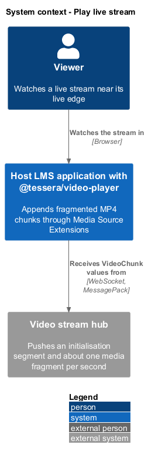
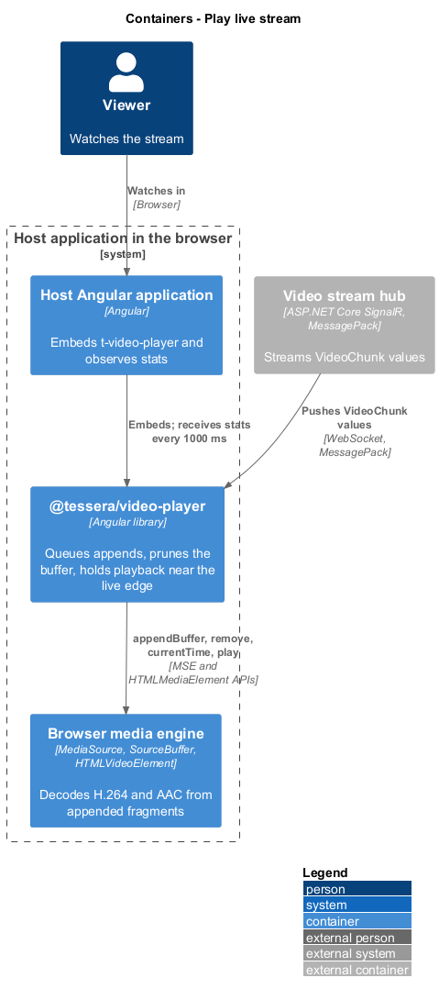
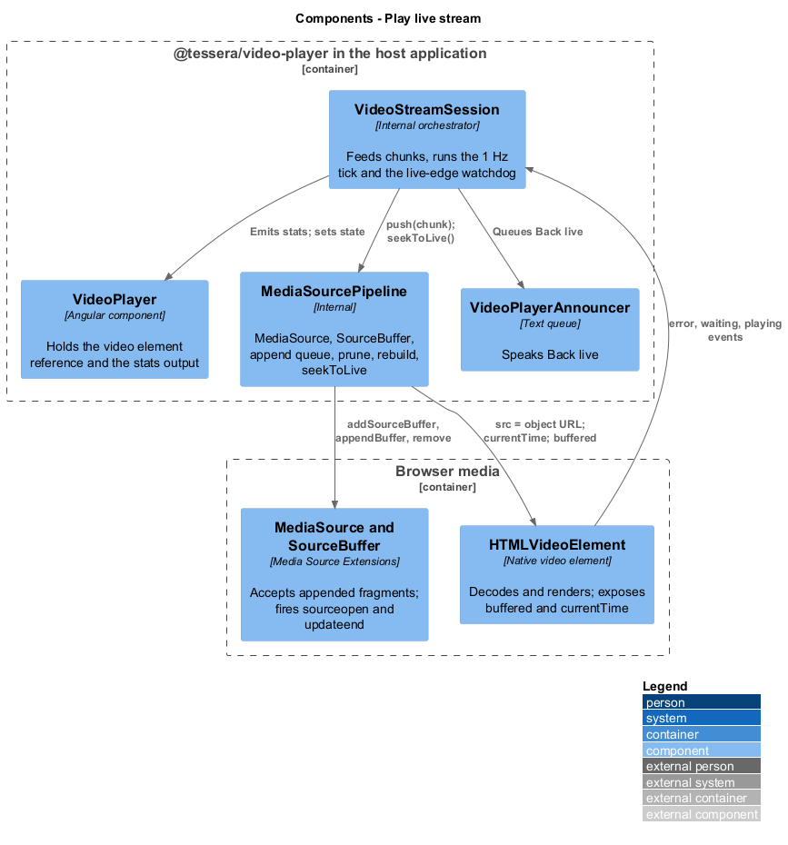
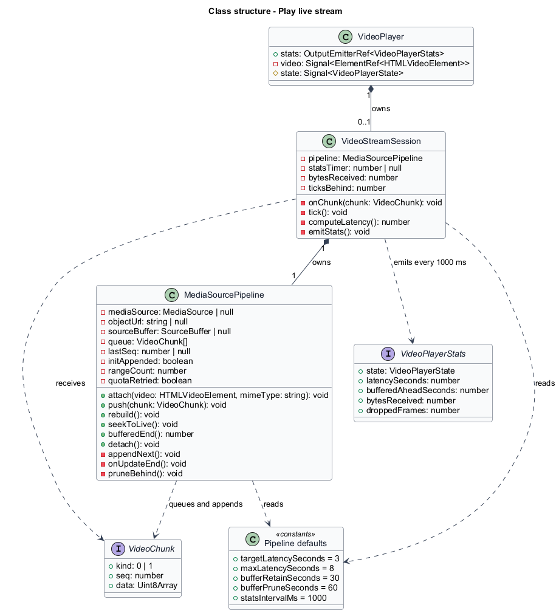
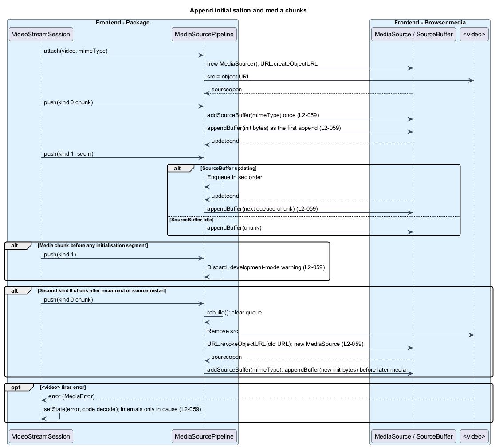
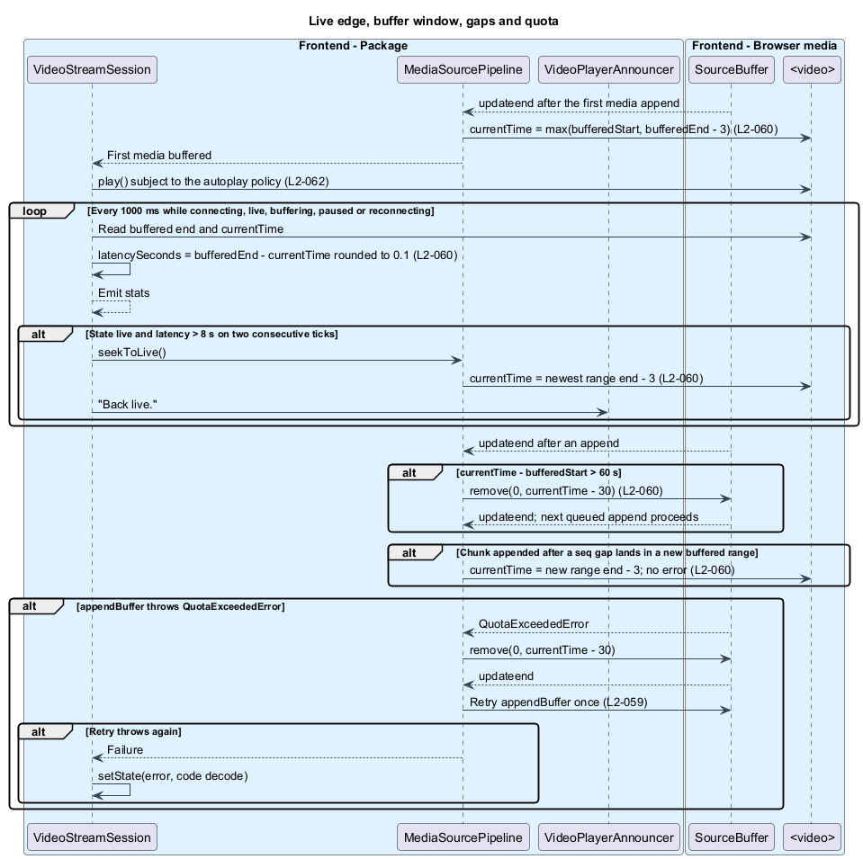

# Play live stream

## Overview

Once subscribed, `t-video-player` turns the chunk stream into pictures and sound through the browser's Media Source Extensions. This feature covers everything between a received `VideoChunk` and a frame on the native `<video>` element: attaching a `MediaSource`, appending the initialisation segment and media fragments in order, rebuilding the pipeline when a new initialisation segment arrives, keeping the retained buffer bounded, and holding playback near the live edge.

**initialisation segment** — `kind` 0 chunk carrying `ftyp` and `moov`, appended once per `SourceBuffer` before any media

**media fragment** — `kind` 1 chunk carrying one `moof` and `mdat` pair of about 1 s

**append queue** — ordered list of chunks waiting for the `SourceBuffer` to leave its `updating` state

**live edge** — buffered end of the newest buffered range

**buffer window** — retained media behind the playhead, 30 s after a prune and never more than 60 s plus one fragment

**latency** — buffered end minus `currentTime`, rounded to 0.1 s

Connecting and subscribing is specified in [connect and subscribe](../connect-and-subscribe/). Pause and resume-to-live belong to [control playback](../control-playback/), and the `buffering`, `ended`, and stall states to [show status and controls](../show-status-and-controls/). There is no seek bar, no DVR window, and no playback-rate catch-up: the player jumps to the live edge instead.

## Description

`MediaSourcePipeline` owns one `MediaSource`, its object URL, one `SourceBuffer`, and the append queue. `VideoStreamSession` feeds it chunks, runs the 1 Hz statistics tick, and owns the live-edge watchdog. `VideoPlayer` holds the `<video>` element reference and the `stats` output.

**Attach.** `attach(video, mimeType)` creates a `MediaSource`, assigns `URL.createObjectURL(mediaSource)` to `video.src`, and waits for `sourceopen`. The `mimeType` comes verbatim from the descriptor. Chunks that arrive before `sourceopen` wait in the append queue.

**Append order.** The first `kind` 0 chunk calls `addSourceBuffer(mimeType)` once and makes the initialisation bytes the first `appendBuffer` call (`L2-059`). An exception from `addSourceBuffer` maps to the `unsupported` error. Every later chunk enters the append queue. `appendNext()` runs when the queue is non-empty and `sourceBuffer.updating` is false; it is called after each `push` and on every `updateend`. Chunks are appended one at a time in `seq` order and never interleaved. A media chunk that arrives while no initialisation segment has been appended is discarded, and a development-mode warning is logged.

| Pipeline event | Response |
|----------------|----------|
| `sourceopen` | Start draining the append queue |
| `push(kind 0)` with no `SourceBuffer` | `addSourceBuffer(mimeType)`, append the initialisation bytes |
| `push(kind 0)` with an existing `SourceBuffer` | `rebuild()`, then append the new initialisation bytes |
| `push(kind 1)` before any initialisation segment | Discard, development-mode warning |
| `push(kind 1)` otherwise | Enqueue, then `appendNext()` |
| `updateend` | Seek on first media, prune when needed, then `appendNext()` |

**Rebuild on a new initialisation segment.** A second `kind` 0 chunk, which follows a reconnect or a source restart, calls `rebuild()`: the append queue is cleared, `video.src` is removed, `URL.revokeObjectURL` releases the old URL, and a fresh `MediaSource` is attached. The new initialisation bytes are appended before any later media. `SourceBuffer.changeType()` is not used.

**Sequence gaps.** The pipeline records the last appended `seq`. A gap, which the backend produces when it drops fragments for a slow subscriber, is not an error. After the next append completes, the pipeline compares the buffered ranges with the previous count; when the chunk landed in a new range, it sets `currentTime` to that range's end minus 3 (`L2-060`).

**First frame and target latency.** On the `updateend` that follows the first media append, the pipeline sets `currentTime` to the larger of the buffered start and the buffered end minus 3, then `VideoStreamSession` requests `play()`. The autoplay policy and the `NotAllowedError` handling for that request are specified in [control playback](../control-playback/).

**Buffer window.** After each `updateend`, when `currentTime` minus the start of the first buffered range exceeds 60 s, the pipeline calls `sourceBuffer.remove(0, currentTime − 30)`. The removal is itself an update, so the next queued append waits for its `updateend`. Buffered media behind the playhead therefore never exceeds 60 s plus one fragment. The subscription stays open and pruning continues while the player is paused.

**Quota.** When `appendBuffer` throws `QuotaExceededError`, the pipeline runs the same `remove(0, currentTime − 30)` call, waits for `updateend`, and retries the append once (`L2-059`). A second failure sets the state to `error` with code `decode`.

**Decode errors.** A `<video>` `error` event reads `video.error` and sets the state to `error` with code `decode`. The message is the plain-language default from `VIDEO_PLAYER_I18N`; the `MediaError` code and message travel only in `cause`.

**Live-edge watchdog and statistics.** `VideoStreamSession` runs a 1000 ms tick while the state is `connecting`, `live`, `buffering`, `paused`, or `reconnecting`. Each tick computes `latencySeconds` as the buffered end minus `currentTime`, rounded to 0.1 s, and emits `stats` with `state`, `latencySeconds`, `bufferedAheadSeconds`, `bytesReceived` (the sum of `data.byteLength` over received chunks), and `droppedFrames` from `video.getVideoPlaybackQuality()`. The relation between `bufferedAheadSeconds` and `latencySeconds` is `<TO SUPPLY>`. When the state is `live` and the latency exceeds 8 s on two consecutive ticks, the session calls `seekToLive()` and queues "Back live." on `VideoPlayerAnnouncer` (`L2-060`). A single tick above 8 s does nothing, so a momentary stall does not cause a jump. The LIVE badge reads the same latency to show how far behind playback is.

**`seekToLive()`.** The method sets `currentTime` to the end of the newest buffered range minus 3, or minus 0.5 when less than 3 s is buffered in that range. Because it targets the newest range, a resume after a pause longer than the buffer window lands inside buffered media.

| Trigger | Target `currentTime` |
|---------|----------------------|
| First media append | `max(bufferedStart, bufferedEnd − 3)` |
| Latency > 8 s on two consecutive ticks | newest range end − 3 |
| Append lands in a new buffered range | that range end − 3 |
| Resume from pause (control playback) | newest range end − 3, or − 0.5 when under 3 s buffered |

Resource release on destroy, including detaching the `MediaSource`, revoking the URL, clearing `video.src`, and calling `load()`, is specified under [secure and perform](../secure-and-perform/).

## Requirements

Source: [L2 detailed requirements](../../../specs/L2.md). The table quotes the source wording exactly, including its modal verb.

| L2 ID | Refines (L1) | Requirement |
|-------|--------------|-------------|
| `L2-059` | `L1-020` | The player must append the initialisation chunk to a fresh `SourceBuffer` before any media chunk, append media chunks in `seq` order one at a time, and rebuild the media pipeline whenever a new initialisation chunk arrives. |
| `L2-060` | `L1-020` | The player must start playback `targetLatencySeconds` behind the buffered end, keep the retained buffer within the buffer window, and jump to the live edge whenever playback falls more than `maxLatencySeconds` behind. |

## Diagrams

The context view shows the viewer watching a stream that the hub pushes as fragmented MP4 chunks.

The container view places the package between the host application and the browser's media engine, with the hub as the chunk source.

The component view shows `VideoStreamSession` feeding `MediaSourcePipeline`, which drives the `MediaSource` and `SourceBuffer` on the `<video>` element.

The class view records the pipeline's queue and buffer methods, the session's tick, and the statistics type.

The initialisation segment is appended first, media is queued behind `updateend`, early media is discarded, and a new initialisation segment rebuilds the pipeline.

The first append seeks near the live edge, the watchdog jumps when playback falls behind, the buffer is pruned, a sequence gap is handled by seeking, and a quota error retries once.

