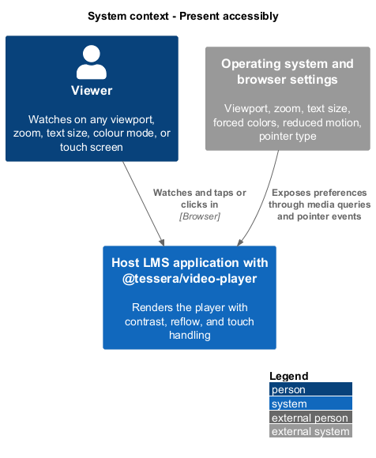
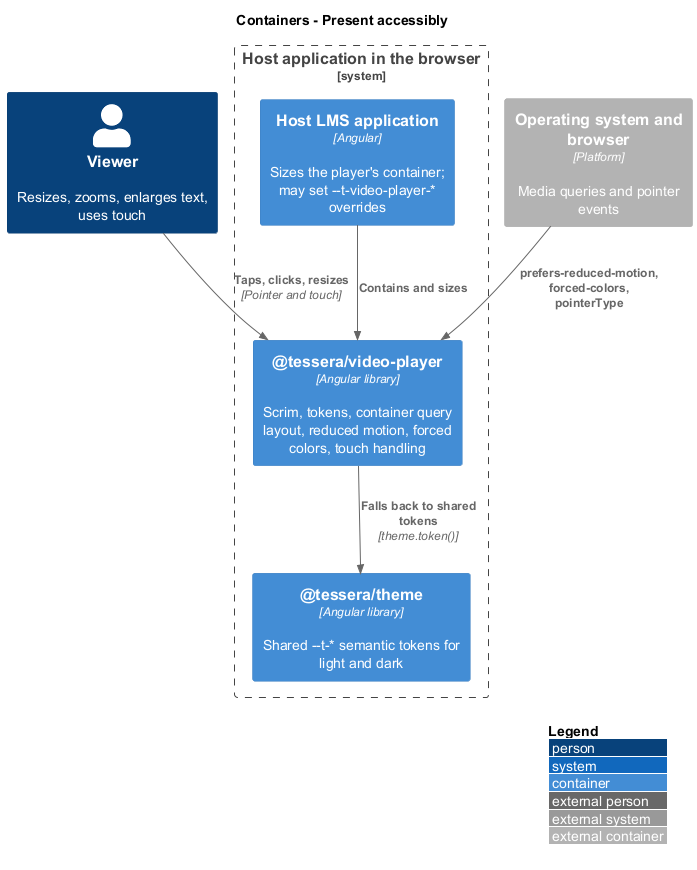
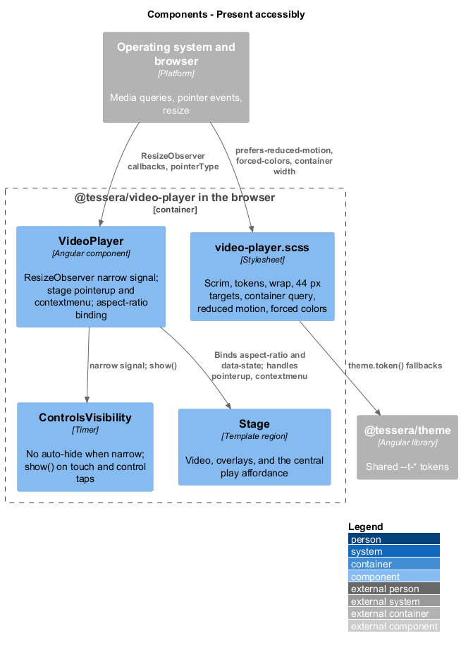
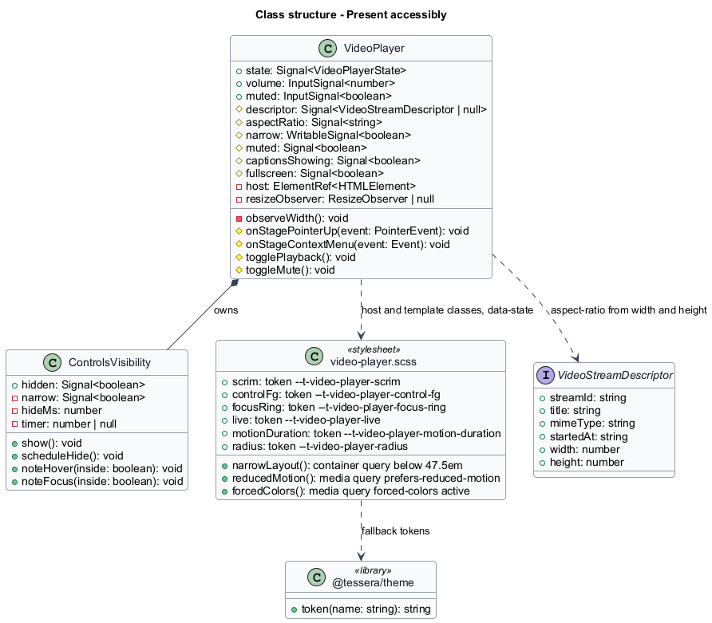
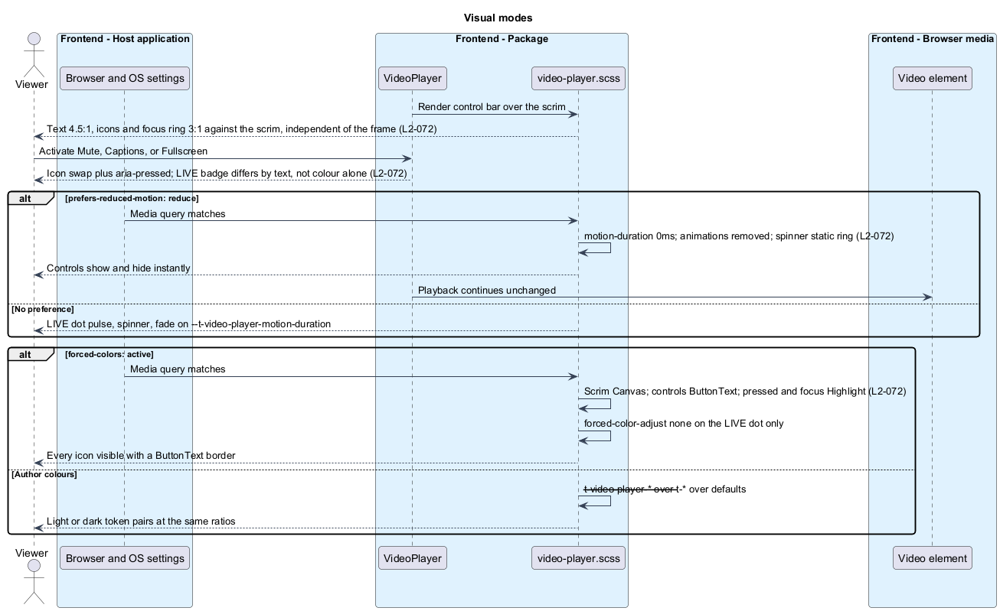
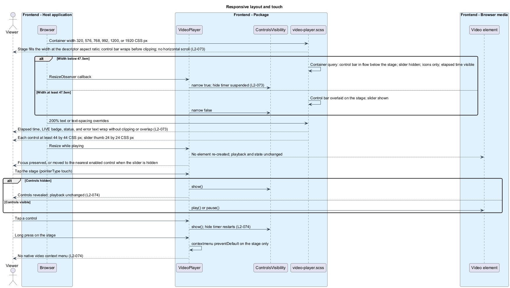

# Present accessibly

## Overview

`t-video-player` stays readable, operable, and complete whatever is drawn beneath its controls and whatever the viewer's display settings are. Controls sit on a scrim so their contrast does not depend on the picture; pressed states are conveyed by icon and `aria-pressed`, never by colour alone; motion stops under `prefers-reduced-motion`; forced-colors mode maps every surface to system colours. The player fills its container at the stream's aspect ratio and reflows from 320 CSS px to 1920 CSS px, at 400% browser zoom, with 200% text, and with WCAG text-spacing overrides. Touch reveals the controls before it acts, and no function needs a gesture that has no button.

**scrim** — translucent layer between the picture and the overlaid control bar that fixes the contrast background for text, icons, and focus rings

**narrow layout** — layout applied when the host is narrower than 47.5em, with the control bar in flow below the stage

**forced-colors mode** — operating-system mode, such as Windows high contrast, in which the browser replaces author colours with system colours

**reduced motion** — viewer preference exposed as `prefers-reduced-motion: reduce` under which no decorative animation runs

**target** — pointer-activatable area of a control, at least 44 by 44 CSS px

This feature covers the stylesheet, the layout modes, and pointer and touch handling. Keyboard operation belongs to [operate by keyboard](../operate-by-keyboard/), the ARIA pattern to [expose to assistive tech](../expose-to-assistive-tech/), the hide timer to [show status and controls](../show-status-and-controls/), and the token names to [customize and localise](../customize-and-localise/).

## Description

`video-player.scss` carries the presentation; `VideoPlayer` and `ControlsVisibility` carry the small amount of behaviour that layout and touch need. Every colour, radius, and duration resolves through a `--t-video-player-*` token with a `theme.token('…')` fallback to the shared `--t-*` tokens of `@tessera/theme` and then to a built-in default.

**Contrast and states.** The control bar is painted on `--t-video-player-scrim`, a gradient opaque enough at the control row that `--t-video-player-control-fg` reaches 4.5:1 for text and 3:1 for icons and the `--t-video-player-focus-ring` outline, independent of the frame beneath (`L2-072`). Icons are inline SVG with `fill: currentColor`. The focus indicator is a 2 px solid outline in the focus-ring token with a 2 px offset, so it stays visible over any control background. Each toggle control swaps its icon when pressed: mute shows a crossed speaker, captions a filled badge, fullscreen an inward arrow set, each alongside `aria-pressed`. The LIVE badge at the edge and behind the edge differ in text ("Live" against "Go to live, {n} seconds behind"), not only in colour. The light and dark token sets shipped with the player satisfy the same ratios; the default values are recorded in `video-player.scss` and verified by the contrast checks of [verify and document](../verify-and-document/).

| Token | Used for |
|-------|----------|
| `--t-video-player-scrim` | Gradient behind the overlaid control bar |
| `--t-video-player-control-fg` | Control text and icons |
| `--t-video-player-control-bg-hover` | Hover and pressed background on controls |
| `--t-video-player-accent`, `--t-video-player-accent-fg` | Central play affordance and the "Unmute" chip |
| `--t-video-player-live` | LIVE dot |
| `--t-video-player-focus-ring` | Focus outline on every control |
| `--t-video-player-error`, `--t-video-player-error-fg` | Error panel surface and text |
| `--t-video-player-skeleton` | Connecting placeholder |
| `--t-video-player-caption-bg`, `--t-video-player-caption-fg` | `::cue` background and text |
| `--t-video-player-motion-duration` | Every transition and animation |
| `--t-video-player-radius` | Control and panel corners |

**Motion.** The LIVE dot pulse, the spinner rotation, the placeholder shimmer, the control fade, and the central play affordance scale all run on `--t-video-player-motion-duration`. Under `@media (prefers-reduced-motion: reduce)` the stylesheet sets that token to `0ms` and removes the `animation` declarations, so the spinner is a static ring and the controls appear and disappear instantly. The `<video>` element is untouched; the stream keeps playing.

**Forced colors.** Under `@media (forced-colors: active)` the scrim becomes `Canvas`, control text and icons `ButtonText`, and pressed and focused states `Highlight`, with a 1 px `ButtonText` border on each control so its bounds remain visible. Only the LIVE dot carries `forced-color-adjust: none`, so it keeps `--t-video-player-live`; every other surface follows the system palette.

**Layout.** The host is `display: block` with `container-type: inline-size`. The stage sets `aspect-ratio` from the descriptor's `width` and `height` through a style binding, and `16 / 9` otherwise, so the player fills its container's width and derives its height (`L2-073`). The control bar is a flex row with `flex-wrap: wrap`, so at 320, 576, 768, 992, 1200, and 1920 CSS px the controls wrap onto a second row before any is clipped and the page never scrolls horizontally. Sizes use `rem` and `em`, no element has a fixed height, and status, error, and elapsed text use `overflow-wrap: anywhere`, so 200% text and the text-spacing overrides (line height 1.5, paragraph spacing 2, letter spacing 0.12 em, word spacing 0.16 em) wrap rather than clip or overlap. Each button has `min-inline-size` and `min-block-size` of 44 px; the slider thumb is 24 by 24 CSS px. The 1280 by 1024 CSS px window at 400% zoom is a manual check; a 320 by 256 CSS px viewport is the automated reflow proxy.

| Width | Control bar | Volume slider | Labels | Auto-hide |
|-------|-------------|---------------|--------|-----------|
| At least 47.5em | Overlaid on the stage over the scrim | Shown | Icon and text | 3000 ms while `live` |
| Below 47.5em | In flow below the stage | Hidden | Icon only; `aria-label` unchanged | Never |

`@container (width < 47.5em)` switches the narrow layout: the host becomes a two-row grid with the control bar in the second row, the slider is `display: none`, button text is visually hidden, and the elapsed time remains visible. `VideoPlayer` observes the host with a `ResizeObserver` and sets a `narrow` signal when the inline size is below 47.5 times the host's computed font size, so `ControlsVisibility` suspends its hide timer in the narrow layout and the touch logic knows whether the controls can be hidden. A resize changes CSS only: no element is re-created, no state changes, and the `<video>` keeps playing. A slider that loses its display while focused triggers the focus recovery of [operate by keyboard](../operate-by-keyboard/), so focus moves to the mute control rather than `<body>`.

**Touch.** `VideoPlayer` listens for `pointerup` on the stage. When `pointerType` is `touch` and `ControlsVisibility.hidden()` is true, it calls `show()` and returns, so the first tap reveals the controls and playback does not change (`L2-074`). When the controls are visible, or the pointer is a mouse or pen, the tap toggles playback. A tap on a control runs that control and calls `show()`, which restarts the hide timer. The narrow layout hides the slider, so on a touch device in that layout volume is set through the mute control or the `volume` input. A `contextmenu` listener on the stage calls `preventDefault()`, so a long press shows no native `<video>` menu; the listener is scoped to the stage element, not the host page. Every pointer function has a button or keyboard equivalent, because the stage tap duplicates play/pause.

## Requirements

Source: [L2 detailed requirements](../../../specs/L2.md). The table quotes the source wording exactly, including its modal verb.

| L2 ID | Refines (L1) | Requirement |
|-------|--------------|-------------|
| `L2-072` | `L1-025` | The player's controls, states, motion, and forced-colors presentation must meet WCAG 2.2 AA regardless of the video content beneath them. |
| `L2-073` | `L1-025` | The player must fill its container at the descriptor's aspect ratio (16:9 by default), must not introduce horizontal page scrolling or lose functionality at 320, 576, 768, 992, 1200, and 1920 CSS px, at 400% browser zoom, with 200% text, and with WCAG text-spacing overrides, and must meet pointer target sizes. |
| `L2-074` | `L1-025` | Touch must reveal the controls before acting, and no function is permitted to require a gesture that has no button equivalent. |

## Diagrams

The context view shows a viewer whose display settings and input device shape how the host application presents the player.

The container view places `@tessera/video-player` and `@tessera/theme` in the host application's browser.

The component view shows the stylesheet, the token fallbacks, and the behaviour that `VideoPlayer` and `ControlsVisibility` add for layout and touch.

The class view records the signals, observers, and listeners that layout and touch rely on.

Reduced motion, forced colors, and the scrim change how the same state renders, and pressed states are conveyed by icon and `aria-pressed`.

Width changes wrap or relocate the control bar, enlarged text reflows, a resize keeps playback and focus, and touch reveals the controls before acting.

