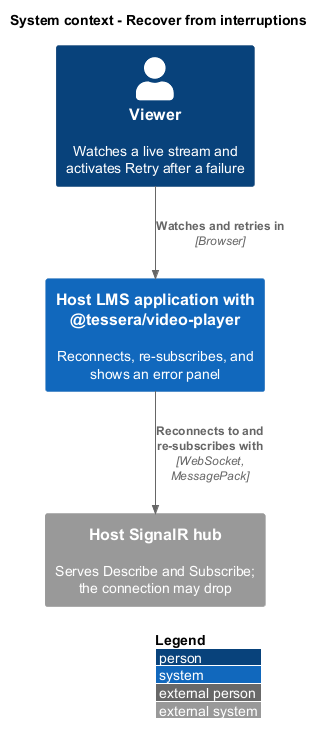
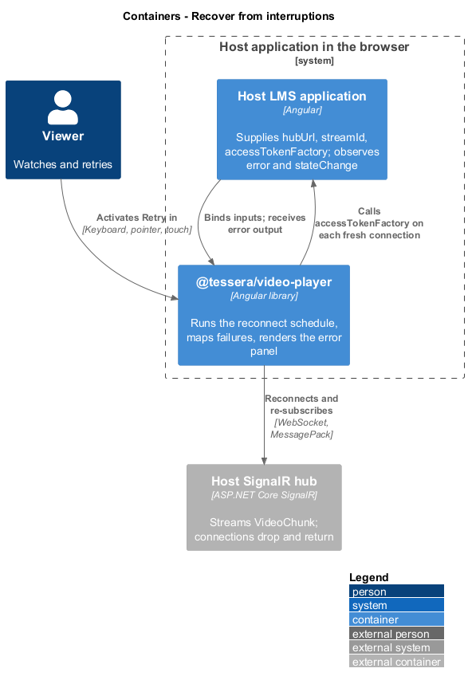
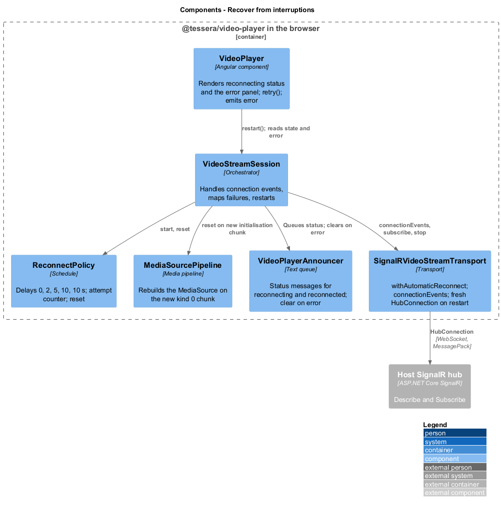
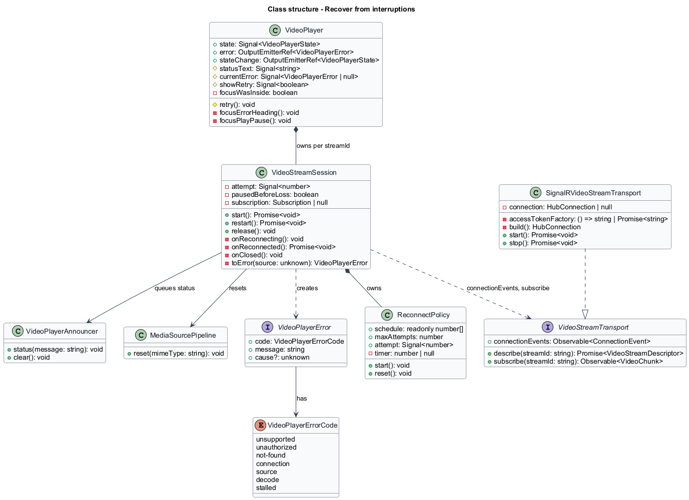
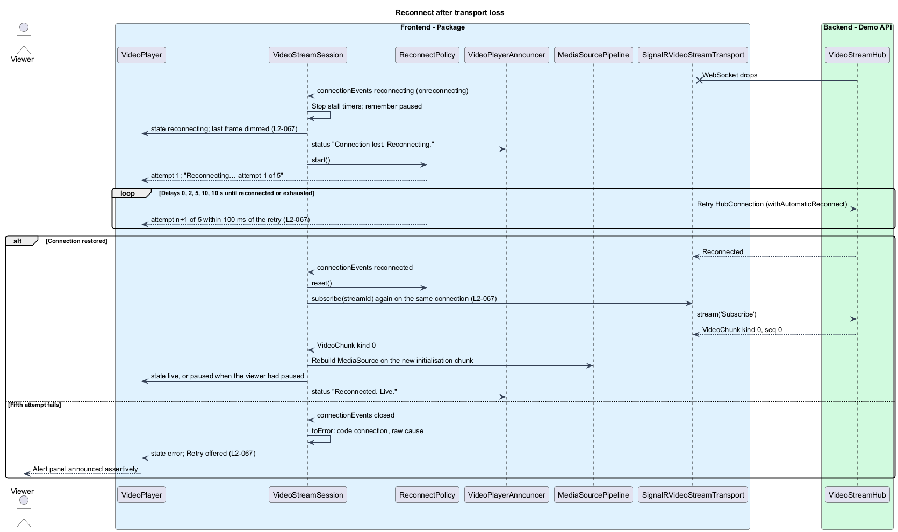
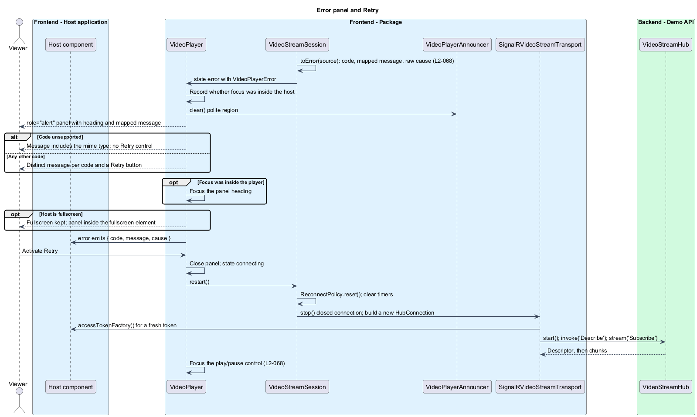

# Recover from interruptions

## Overview

`t-video-player` keeps a live stream watchable across a dropped hub connection and presents every failure in a form the viewer can act on. The hub connection runs over a WebSocket that can break at any moment. The player reconnects on a fixed schedule, re-subscribes when the connection returns, and resumes from a fresh initialisation segment. When recovery fails, or when any other failure occurs, the player shows one error panel with a plain-language message and, for every code except `unsupported`, a Retry control.

**transport loss** — interruption of the hub connection that the transport reports as `reconnecting`

**reconnect schedule** — fixed list of delays 0, 2, 5, 10, 10 s between consecutive reconnect attempts

**attempt** — one try at re-establishing the hub connection, numbered 1 to 5

**error panel** — `role="alert"` element inside the host that names a failure and offers Retry

**error code** — value of `VideoPlayerErrorCode` that classifies a failure

**mapped message** — English or localised sentence shown for an error code in place of any server text

This feature covers reconnection, the attempt status, the transition to the `connection` error, the error panel for every code, and Retry. The first connection belongs to [connect and subscribe](../connect-and-subscribe/), the pipeline rebuild on a new initialisation chunk to [play live stream](../play-live-stream/), and the live-region wording to [expose to assistive tech](../expose-to-assistive-tech/).

## Description

`VideoStreamSession` owns recovery. It subscribes to `VideoStreamTransport.connectionEvents`, holds the `ReconnectPolicy`, and maps every failure to a `VideoPlayerError` before the state changes. `VideoPlayer` renders the state, the status text, and the error panel, and emits `error`.

**Reconnecting.** `SignalRVideoStreamTransport` builds its `HubConnection` with `withAutomaticReconnect([0, 2000, 5000, 10000, 10000])`, so the SignalR client performs the five attempts of `L2-067`. The transport forwards `onreconnecting` as `reconnecting`, `onreconnected` as `reconnected`, and `onclose` as `closed`. On `reconnecting`, the session stops the 10 s and 30 s stall timers, records whether the viewer had paused, sets the state to `reconnecting`, and starts the `ReconnectPolicy`. The last frame stays in the `<video>` element; `video-player.scss` dims it under the host attribute `data-state="reconnecting"`. The session queues "Connection lost. Reconnecting." as a status message through `VideoPlayerAnnouncer`.

The SignalR client raises no per-attempt event, so `ReconnectPolicy` advances the displayed attempt itself. It starts at attempt 1 and schedules each increment after the matching delay of the schedule, so the status text `reconnecting(n, 5)` ("Reconnecting… attempt n of 5") changes within 100 ms of the client's own retry. The policy never counts past attempt 5. `reset()` cancels the pending timer and returns the counter to 0. The session calls `reset()` on `reconnected`, on Retry, and on release, so no timer fires after the component is destroyed.

| State | Stage | Status text | Controls |
|-------|-------|-------------|----------|
| `reconnecting` | Last frame, dimmed | "Reconnecting… attempt n of 5" | Visible; play/pause has `aria-disabled="true"` |
| `error` | Last frame or placeholder | Error panel heading and message | Visible; Retry focusable where offered |

**Reconnected.** A server stream does not survive a reconnect. On `reconnected`, the session disposes the old subscription and calls `transport.subscribe(streamId)` again on the same connection. `Describe` is not repeated; the descriptor is unchanged. The first chunk of the new subscription is `kind` 0, and `MediaSourcePipeline` rebuilds the `MediaSource` on it as [play live stream](../play-live-stream/) describes. The state returns to `live`, or to `paused` when the viewer had paused before the loss, and "Reconnected. Live." is announced.

**Exhausted schedule.** When the fifth attempt fails, the SignalR client stops and the transport emits `closed`. The session, still in `reconnecting`, maps the event to code `connection` and the state becomes `error`. A `closed` event in any other state, for example after `stop()` during release, is ignored.

**Error mapping.** Every failure passes through one function in `VideoStreamSession` that yields the code and keeps the raw text in `cause` (`L2-068`).

| Source | Code |
|--------|------|
| `window.MediaSource` undefined, or `isTypeSupported(mimeType)` false | `unsupported` |
| Transport start rejected with HTTP 401 | `unauthorized` |
| `Describe` rejected with `unknown-stream` | `not-found` |
| `closed` received while `reconnecting` | `connection` |
| `Subscribe` failed with `source-failed: …` or `slow-consumer` | `source` |
| `<video>` `error` event, or `QuotaExceededError` after the single retry | `decode` |
| No chunk for 30 s | `stalled` |

The message comes from the `VideoPlayerStrings` entry for the code, with the English defaults listed in `L2-068`. The `unsupported` entry receives the mime type as text; whether that entry is a function or a placeholder template is `<TO SUPPLY>`. A `HubException` message is never displayed; only `cause` carries it.

**Error panel.** `VideoPlayer` renders the panel inside the host when the state is `error`. The panel has `role="alert"`, a heading with `tabindex="-1"`, the mapped message, and a Retry button for every code except `unsupported`. Before applying the error, the component records whether `document.activeElement` is inside the host; when it was, the heading receives focus after render. The host element is the fullscreen element, so the panel sits inside it and fullscreen is kept. `VideoPlayerAnnouncer` clears the polite region when the alert renders, so the two regions never compete. `error` emits the `VideoPlayerError` exactly once per failure, and `stateChange` emits `error`.

**Retry.** `retry()` on `VideoPlayer` serves the Retry button and `VideoPlayerHarness.retry()`. It closes the panel, sets the state to `connecting`, and calls `restart()` on the session. The session resets the `ReconnectPolicy`, clears every timer, and asks the transport to restart. `SignalRVideoStreamTransport` discards the closed `HubConnection` and builds a new one, so `accessTokenFactory` is called again and the automatic-reconnect schedule starts fresh. `Describe` and `Subscribe` then run as for a first connection. After render, focus moves to the play/pause control. Every code that offers Retry uses this one path; there is no in-place resume.

**Release during recovery.** `release()` on the session runs from `ngOnDestroy` and when `streamId` is cleared. It calls `ReconnectPolicy.reset()`, unsubscribes from `connectionEvents`, and calls `transport.stop()`. The SignalR client cancels its own pending reconnect on `stop()`, so no attempt runs after destruction, and the `closed` event that `stop()` produces is ignored because the state is no longer `reconnecting`.

## Requirements

Source: [L2 detailed requirements](../../../specs/L2.md). The table quotes the source wording exactly, including its modal verb.

| L2 ID | Refines (L1) | Requirement |
|-------|--------------|-------------|
| `L2-067` | `L1-022` | On transport loss the player must retry on the schedule 0, 2, 5, 10, 10 s, re-subscribe when the connection returns, and fail with code `connection` after the fifth failed attempt. |
| `L2-068` | `L1-022` | Every failure must be presented as a visible, focusable error panel with a plain-language message and, except for unsupported media, a Retry control, and must be emitted through the `error` output with a typed code. |

## Diagrams

The context view shows the viewer watching through a host application whose hub connection can drop and return.

The container view places `@tessera/video-player` in the host application's browser, reconnecting to the host's SignalR hub.

The component view shows `VideoStreamSession` reacting to connection events, driving `ReconnectPolicy`, and mapping failures for `VideoPlayer`.

The class view records the session, policy, transport, and error types used by the feature.

A transport loss enters `reconnecting`, the attempt counter follows the schedule, a restored connection re-subscribes and rebuilds the pipeline, and a fifth failure becomes the `connection` error.

A failure renders the alert panel, moves focus to its heading, emits `error`, and Retry starts a fresh connection with a fresh token.

