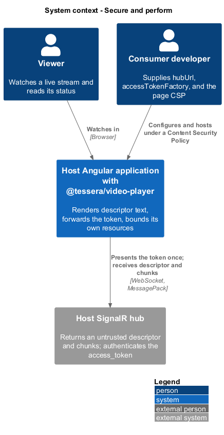
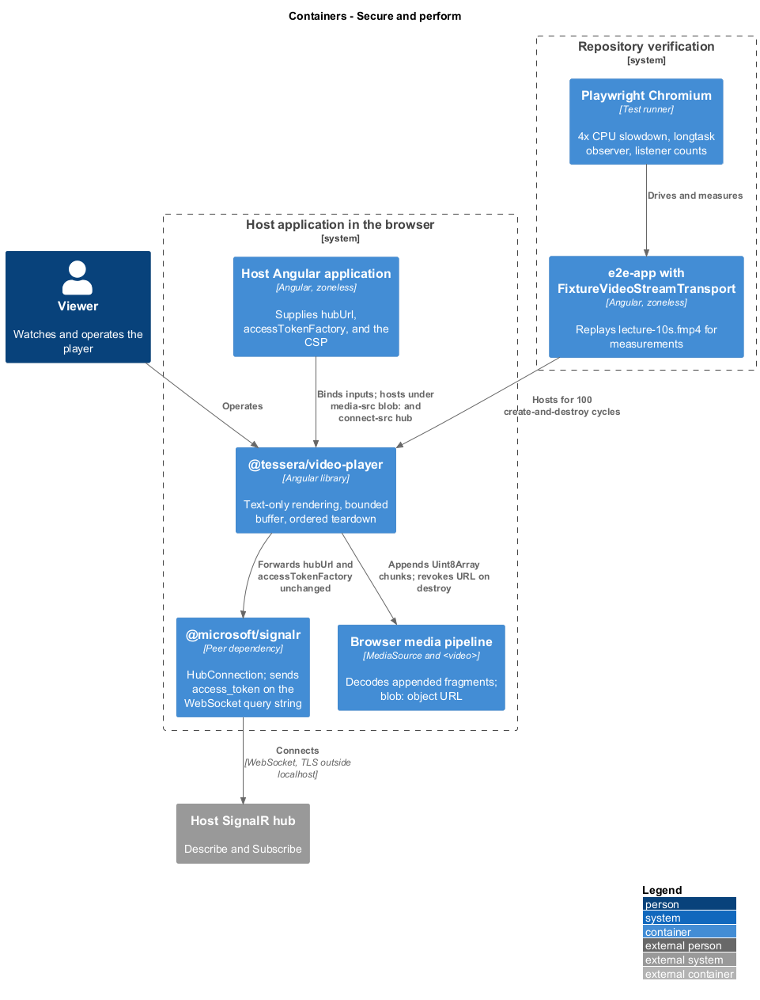
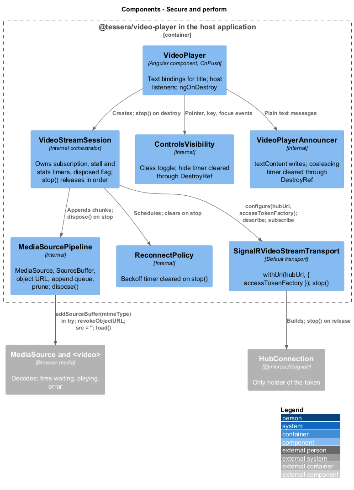
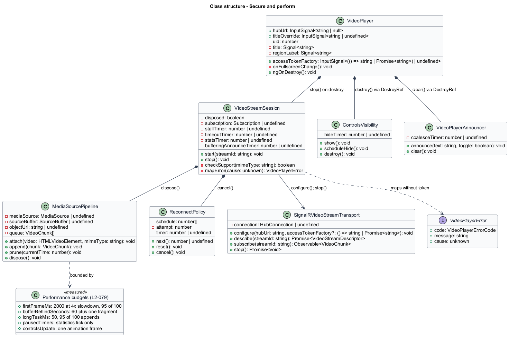
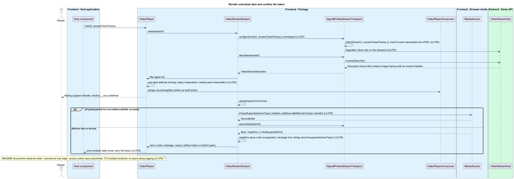
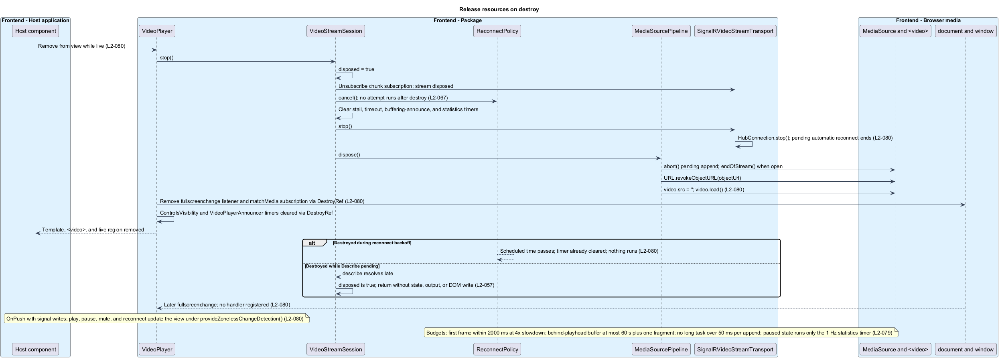

# Secure and perform

## Overview

`t-video-player` renders text it does not author and holds resources that outlive a single change-detection pass: a hub connection, a `MediaSource`, an object URL, media element listeners, and timers. The descriptor's `title` and `mimeType` come from the server, the `hubUrl` and the access token come from the host, and chunk bytes arrive at one fragment per second for as long as the stream runs. This feature fixes how the player renders untrusted text, how it keeps the token out of every observable surface, how it stays within its time and memory budgets, and how it releases everything it acquires.

**Untrusted data** — data the player does not author, namely every `VideoStreamDescriptor` field, every `VideoChunk`, and the host-supplied `hubUrl`

**Access token** — string returned by `accessTokenFactory` that the transport presents to the hub

**Content Security Policy (CSP)** — host page header that lists the origins and schemes the browser may load from

**Long task** — main-thread task longer than 50 ms, as reported by the `longtask` performance entry type

**Buffer window** — media retained behind the playhead: 30 s after pruning, never more than 60 s plus one fragment

**Zoneless change detection** — Angular mode in which signal writes and event bindings, not zone.js patches, schedule rendering

**Teardown** — release of every subscription, connection, media object, URL, listener, timer, and DOM node a player instance acquired

**CPU slowdown** — Chromium emulation that runs script slower by a stated factor, such as 4×

The feature belongs to the video-player subsystem and refines `L1-027`. [Play live stream](../play-live-stream/) owns the append queue and buffer pruning that bound memory; [recover from interruptions](../recover-from-interruptions/) owns the reconnect schedule that teardown cancels; [connect and subscribe](../connect-and-subscribe/) owns the connection that teardown stops.

## Description

**Data boundary.** Angular interpolation renders the title in the ended panel and the status text as text. The region's `aria-label` and the stage's `aspect-ratio` are attribute and style bindings of strings and numbers. `VideoPlayerAnnouncer` writes `textContent`, never `innerHTML`. The title is never used as an element id or an ARIA reference; ids are `t-video-player-{uid}-*` from a module-level counter (`L2-078` AC1). `titleOverride`, when set, replaces the descriptor title at the same text sinks.

`hubUrl` goes from the input to `SignalRVideoStreamTransport.configure()` to `HubConnectionBuilder.withUrl(hubUrl, options)` without trimming, encoding, or template use. The development-mode scheme warning of `L2-057` prints a fixed message and the URL's origin only (`L2-078` AC3). The descriptor's `mimeType` is passed verbatim to `MediaSource.isTypeSupported` and `addSourceBuffer`; both calls sit in a `try` block, and a thrown `TypeError` or `NotSupportedError` maps to `error` with code `unsupported`, the same outcome as a `false` result (`L2-078` AC5).

**Token handling.** `accessTokenFactory` is passed to `withUrl` as `options.accessTokenFactory` and to nothing else. The player never calls it itself, never stores its result, and never includes it in `VideoPlayerError.message`, `VideoPlayerError.cause`, `VideoPlayerStats`, a DOM attribute, or a console line (`L2-078` AC2). `cause` carries the `HubException` message text or the `MediaError.code` only; a SignalR error whose text echoes the negotiate URL is reduced to its message before the `access_token` query could appear, by stripping any `access_token=` parameter with a regular expression before assignment. On Retry a fresh connection calls the factory again, so a rotated token is used without the old one being kept.

`src/video-player/README.md` states the host obligations that the player cannot enforce: the page CSP shall allow `media-src blob:` for the `MediaSource` object URL and `connect-src` for the hub origin (WebSocket and negotiate); the WebSocket transport sends the token as the `access_token` query parameter; TLS is in force outside `localhost`; and servers shall not log query strings (`L2-078` AC4).

**Performance budgets.** The player's cost per second is one chunk append and one statistics tick. The design keeps each of those below the budgets in the table; the Chromium measurements in [verify and document](../verify-and-document/) record the evidence.

| Criterion | Target | Design that meets it |
|-----------|--------|----------------------|
| `L2-079` AC1 | First frame within 2000 ms in 95 of 100 runs at 4× slowdown | `describe` and `subscribe` overlap with `MediaSource` creation; the first media chunk seeks and plays on its own `updateend` |
| `L2-079` AC2 | Behind-playhead buffer never over 60 s plus one fragment; no monotonic heap growth after minute 2 | `MediaSourcePipeline.remove(0, currentTime − 30)` when more than 60 s is behind; the append queue holds at most the chunks received during one `updating` interval |
| `L2-079` AC3 | No long task over 50 ms in 95 of 100 appends of 200 KB | `appendBuffer` receives the `Uint8Array` the transport delivered, with no copy or re-encode; `seq` bookkeeping is integer work |
| `L2-079` AC4 | Paused for 10 s: only the 1 Hz statistics tick fires, no `requestAnimationFrame` loop | Stall timers are cleared on pause; the elapsed-time text is updated from the statistics tick; the LIVE dot pulses in CSS |
| `L2-079` AC5 | Controls show and hide within one animation frame at 200% text | `ControlsVisibility` toggles one host class through a signal; `pointermove` restarts a `setTimeout` without layout reads |

The pipeline appends in `seq` order and serialises on `updateend`, so no append ever waits in a busy loop. The first media chunk sets `currentTime` and calls `play()` inside the same `updateend` handler, which is the shortest path from bytes to a frame.

**Zoneless operation.** `VideoPlayer` uses `ChangeDetectionStrategy.OnPush`. Media element events (`waiting`, `playing`, `pause`, `volumechange`, `error`) are template event bindings that write signals. Transport observables and `HubConnection` callbacks write signals from inside `VideoStreamSession`, which marks nothing for check by hand: a signal write under `provideZonelessChangeDetection()` schedules the view update. The `fullscreenchange` and `keydown` listeners are host listeners. Play, pause, mute, and reconnect therefore reach the view with no zone and no `NgZone.run` (`L2-080` AC1).

**Resource ownership.** Angular view destruction removes the template, the `<video>`, the live region, and every template event binding. `VideoPlayer.ngOnDestroy` then calls `VideoStreamSession.stop()`, which releases the rest in a fixed order (`L2-080` AC2).

| Resource | Owner and release |
|----------|-------------------|
| Chunk subscription | `VideoStreamSession` unsubscribes first, so no chunk reaches a detached pipeline |
| `HubConnection` | `SignalRVideoStreamTransport.stop()` awaits `connection.stop()`; a pending automatic reconnect ends with it (`L2-080` AC3) |
| `ReconnectPolicy` timer | Cleared in `stop()`; a destroy during backoff leaves nothing scheduled (`L2-067` AC6) |
| `MediaSource`, `SourceBuffer`, object URL | `MediaSourcePipeline.dispose()` aborts a pending append, calls `endOfStream()` when open, revokes the URL, sets `video.src = ''`, and calls `video.load()` |
| Stall, buffering-announce, statistics timers | Cleared in `stop()` |
| `ControlsVisibility` hide timer | Cleared through `DestroyRef` |
| `VideoPlayerAnnouncer` coalescing timer | Cleared through `DestroyRef` |
| `document` `fullscreenchange` listener | Removed through `DestroyRef`; a later event reaches no handler (`L2-080` AC5) |
| `window` `matchMedia` subscription for the 47.5em breakpoint | Removed through `DestroyRef` |

A `describe` promise that resolves after destruction finds `session.disposed` true and returns without a state write, output, or DOM write (`L2-057` AC4). 100 create-and-destroy cycles with `FixtureVideoStreamTransport` return active connections, object URLs, and `document` and `window` listener counts to the one-cycle baseline (`L2-080` AC4); the page object's CDP listener count from the combobox lifecycle test is reused.

## Requirements

Source: [L2 detailed requirements](../../../specs/L2.md). The table quotes the source wording exactly, including its modal verb.

| L2 ID | Refines (L1) | Requirement |
|-------|--------------|-------------|
| `L2-078` | `L1-027` | The player must render descriptor fields as text, never write HTML from data, never expose the access token, and document the host's Content Security Policy and transport obligations. |
| `L2-079` | `L1-027` | The player must show the first frame quickly, keep memory bounded, and avoid main-thread stalls while appending. |
| `L2-080` | `L1-027` | The player must use OnPush change detection, work under `provideZonelessChangeDetection()`, and release every resource it acquires when destroyed. |

## Diagrams

The context view shows the two sources of untrusted data the feature guards: the hub, whose descriptor and chunks the player renders, and the host, whose URL and token the player forwards without inspection.

The container view places the package beside the SignalR client, the browser's media pipeline, and the zoneless end-to-end application in which Chromium measures it.

The component view shows the resource owners and the single path the token takes from the input to the `HubConnection`.

The class view records the text sinks, the token path, the teardown surface of each owner, and the budgets the design is measured against.

A hostile title travels to the region name, status text, live region, and ended panel as text; the token reaches only the transport; the URL is never interpolated; and a `mimeType` exception maps to `unsupported`.

Destruction while live disposes the subscription, stops the connection, detaches the media pipeline, and clears every listener and timer, so a later reconnect tick or `fullscreenchange` reaches no component code.

