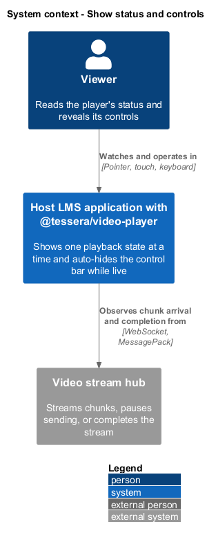
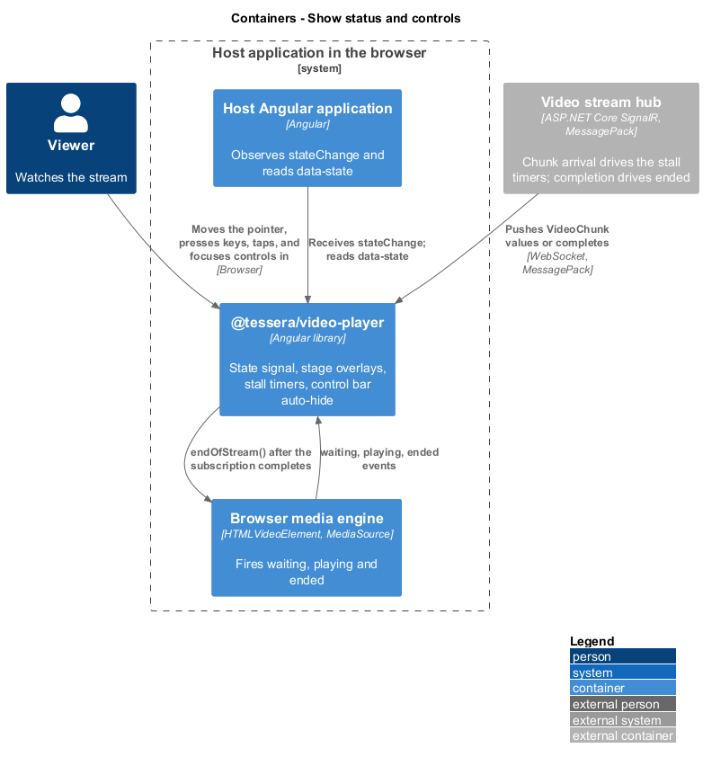
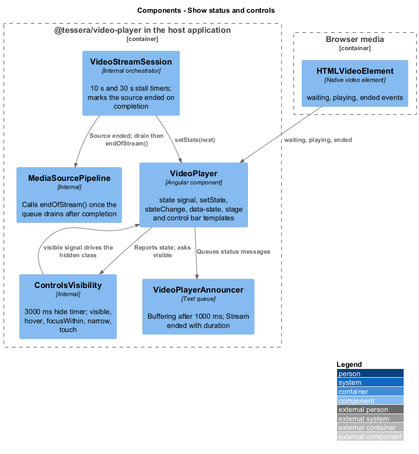
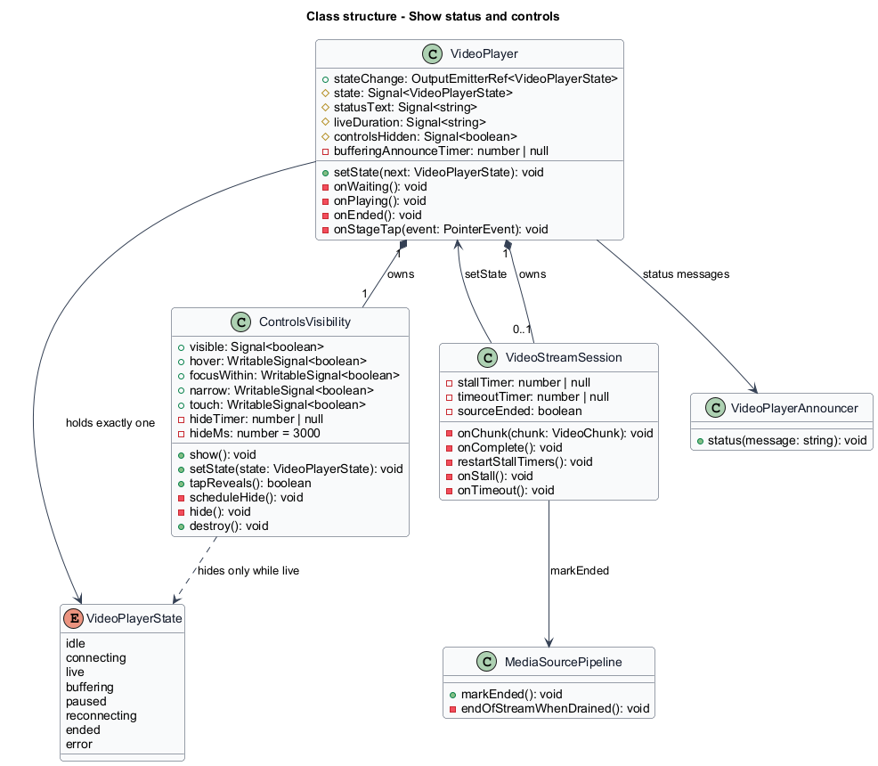
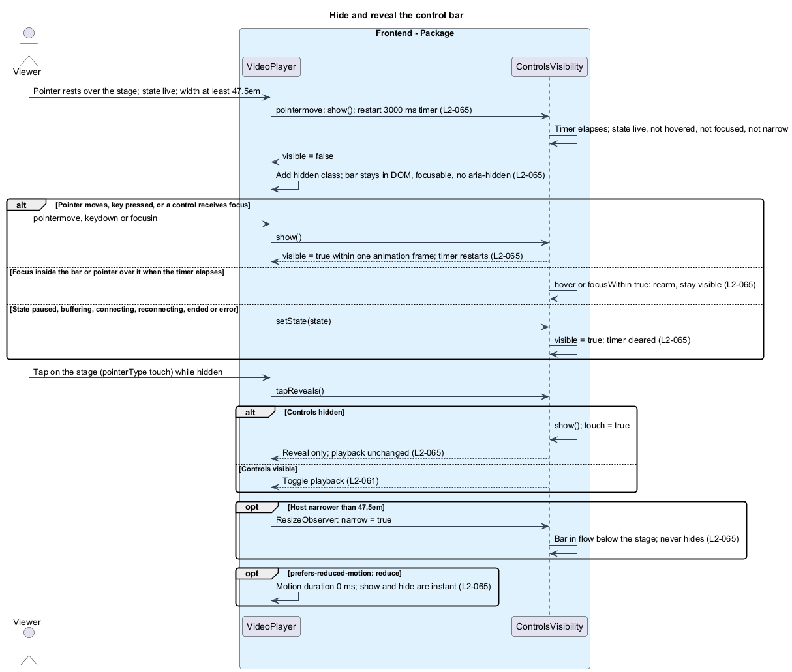
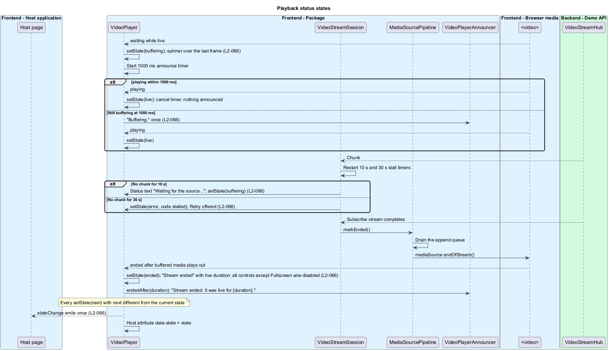

# Show status and controls

## Overview

`t-video-player` tells the viewer at every moment whether the stream is connecting, live, buffering, paused, reconnecting, ended, or failed, and keeps its control bar out of the picture while nothing needs attention. This feature covers the single `state` signal that drives the visible status, the stage overlays for each state, the source stall timers, the ended panel, and the auto-hide behaviour of the control bar.

**state** — one of `idle`, `connecting`, `live`, `buffering`, `paused`, `reconnecting`, `ended`, or `error`, held in `VideoPlayerState`

**stage** — area that holds the `<video>`, its overlays, the central play affordance, and the overlaid control bar

**control bar** — `role="group"` element named "Player controls" holding the player's buttons and the volume slider

**hide timer** — 3000 ms timer started by the last pointer movement while the state is `live`

**source stall** — interval without any chunk, measured by `VideoStreamSession`, 10 s for a warning and 30 s for an error

**narrow layout** — layout below 47.5em in which the control bar sits below the stage and never hides

The `reconnecting` state and the error panel are specified in [recover from interruptions](../recover-from-interruptions/); the live region that speaks the status messages is specified in [expose to assistive tech](../expose-to-assistive-tech/). The controls themselves are specified in [control playback](../control-playback/).

## Description

`VideoPlayer` owns the `state` signal, the host `data-state` binding, the stage template, and the control bar template. `VideoStreamSession` and the `<video>` event handlers request transitions through one `setState(next)` method. `ControlsVisibility` owns the hide timer and the `visible` signal.

**One state, one transition.** `setState(next)` returns without effect when `next` equals the current state. Otherwise it writes the signal, emits `stateChange` exactly once, and the host binding `[attr.data-state]` follows the signal (`L2-066`). No other code writes the signal, so the player is in exactly one state at any time. Milestone announcements are queued by the same transitions; per-second changes never reach the live region.

| State | Stage | Control bar |
|-------|-------|-------------|
| `idle` | Empty stage, no overlay | Visible, play/pause `aria-disabled` |
| `connecting` | Static placeholder with "Connecting…"; no LIVE badge | Visible |
| `live` | Video; LIVE badge | Auto-hides after 3000 ms |
| `buffering` | Last frame with a spinner overlay | Visible |
| `paused` | Last frame with the central play affordance | Visible |
| `reconnecting` | Last frame dimmed; attempt status text | Visible |
| `ended` | "Stream ended" panel with the live duration | Visible; every control except Fullscreen `aria-disabled` |
| `error` | Alert panel | Visible |

The transitions owned by this feature are listed below; connection, reconnection, and error transitions belong to the sibling features.

| From | Event | To |
|------|-------|----|
| `live` | `<video>` fires `waiting` | `buffering` |
| `buffering` | `<video>` fires `playing` | `live` |
| `live` | no chunk for 10 s | `buffering` |
| `live`, `buffering`, `paused` | no chunk for 30 s | `error` (`stalled`) |
| `live`, `buffering` | `<video>` fires `ended` after the subscription completed | `ended` |

**Buffering.** While the state is `live`, a `waiting` event on the `<video>` sets the state to `buffering`; the spinner is overlaid and the last frame stays visible because the `<video>` element is never hidden. A `playing` event returns the state to `live`. Entering `buffering` starts a 1000 ms timer; when it elapses with the state still `buffering`, "Buffering." is queued once (`L2-066`). Leaving `buffering` earlier cancels the timer, so shorter stalls are silent. A pause during `buffering` sets the state to `paused` and removes the spinner. The spinner is a static ring under `prefers-reduced-motion: reduce`.

**Source stall.** `VideoStreamSession` restarts two timers on every received chunk. The 10 s timer sets the status text to "Waiting for the source…" and the state to `buffering` when it is not already. The 30 s timer sets the state to `error` with code `stalled`, which offers Retry. Both timers are cleared on release.

**Ended.** When the subscription's Observable completes, the session marks the source as ended. After the append queue drains, `MediaSourcePipeline` calls `mediaSource.endOfStream()`, so the `<video>` plays out its buffered media and fires `ended`. That event sets the state to `ended`. The stage shows "Stream ended" with the total live duration, computed as the wall-clock time at `ended` minus `startedAt`; the duration format is `<TO SUPPLY>`. Every control except Fullscreen receives `aria-disabled="true"` and stays focusable, and `endedAfter(duration)` ("Stream ended. It was live for {duration}.") is queued (`L2-066`). The title inside the panel is bound as text.

**Controls visibility.** `ControlsVisibility` exposes `visible`, `hover`, `focusWithin`, `narrow`, and `touch` signals and a 3000 ms timer (`L2-065`). `show()` sets `visible` to true and restarts the timer; it is called from `pointermove` on the host, `keydown` inside the host, and `focusin` on any control. The signal write is synchronous, so the OnPush template reflects it on the next animation frame. The timer calls `hide()` only when the state is `live`, `hover` is false, `focusWithin` is false, and `narrow` is false; otherwise it rearms. `hover` follows `pointerenter` and `pointerleave` on the control bar, and `focusWithin` follows `focusin` and `focusout` on it. Any state other than `live` sets `visible` to true and clears the timer, so the controls never hide while the player is not playing.

Hiding adds the `t-video-player__controls--hidden` class to the control bar. The bar remains in the DOM, its controls stay focusable, and it never receives `aria-hidden`, so a Tab into a hidden control reveals the bar through `focusin`. The class animates opacity over `--t-video-player-motion-duration`; `prefers-reduced-motion: reduce` sets the duration to 0 ms so the change is instant. In fullscreen, the hidden class also sets `cursor: none` on the stage.

**Touch.** A `pointerdown` whose `pointerType` is `touch` sets `touch` to true. When the controls are hidden, the stage's tap handler calls `show()` and reports a reveal, so `VideoPlayer` leaves playback unchanged. A second tap while the controls are visible toggles playback. Tapping a control acts and restarts the timer.

**Narrow layout.** A `ResizeObserver` on the host computes `narrow` as a host width below 47.5 times the host font size in CSS px. A container query moves the control bar below the stage, hides the volume slider, and shows icons without text at the same breakpoint. While `narrow` is true the bar is in flow, `visible` stays true, and the hide timer never runs. The observer is disconnected on destroy.

## Requirements

Source: [L2 detailed requirements](../../../specs/L2.md). The table quotes the source wording exactly, including its modal verb.

| L2 ID | Refines (L1) | Requirement |
|-------|--------------|-------------|
| `L2-065` | `L1-021` | The player must hide the control bar 3000 ms after the last pointer movement while playing, reveal it on pointer movement, key press, focus, or touch, and never hide it while a control has focus, the pointer is over it, or the player is not playing. |
| `L2-066` | `L1-021` | The player must be in exactly one of `idle`, `connecting`, `live`, `buffering`, `paused`, `reconnecting`, `ended`, or `error` at any time, drive its visible status from that state, and emit `stateChange` on every transition. |

## Diagrams

The context view shows the viewer reading the player's status while the hub streams or stops.

The container view places the package between the host application, which observes `stateChange`, and the browser's media events.

The component view shows `VideoPlayer` holding the state signal, `VideoStreamSession` requesting transitions and running the stall timers, and `ControlsVisibility` owning the hide timer.

The class view records the state signal, the transition method, the visibility signals, and the stall timers.

The control bar hides after 3000 ms of pointer rest while live, reveals on pointer, key, or focus, and never hides while focused, hovered, not live, or in the narrow layout.

Media events and stall timers move the state through `buffering`, `error`, and `ended`, and every transition emits `stateChange` once and updates `data-state`.

