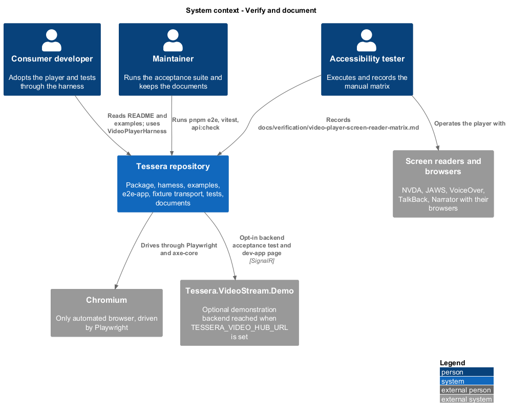
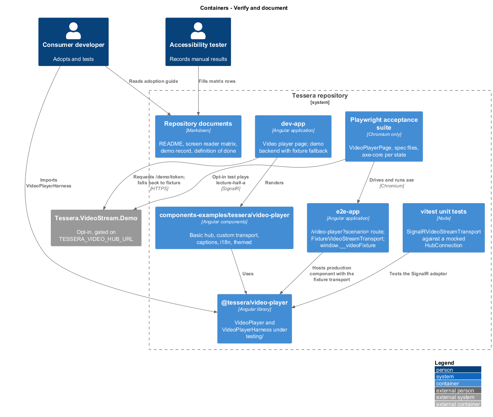
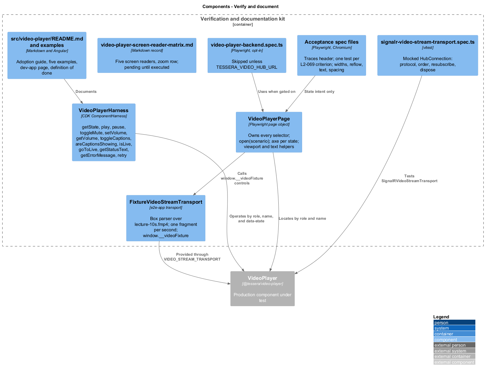
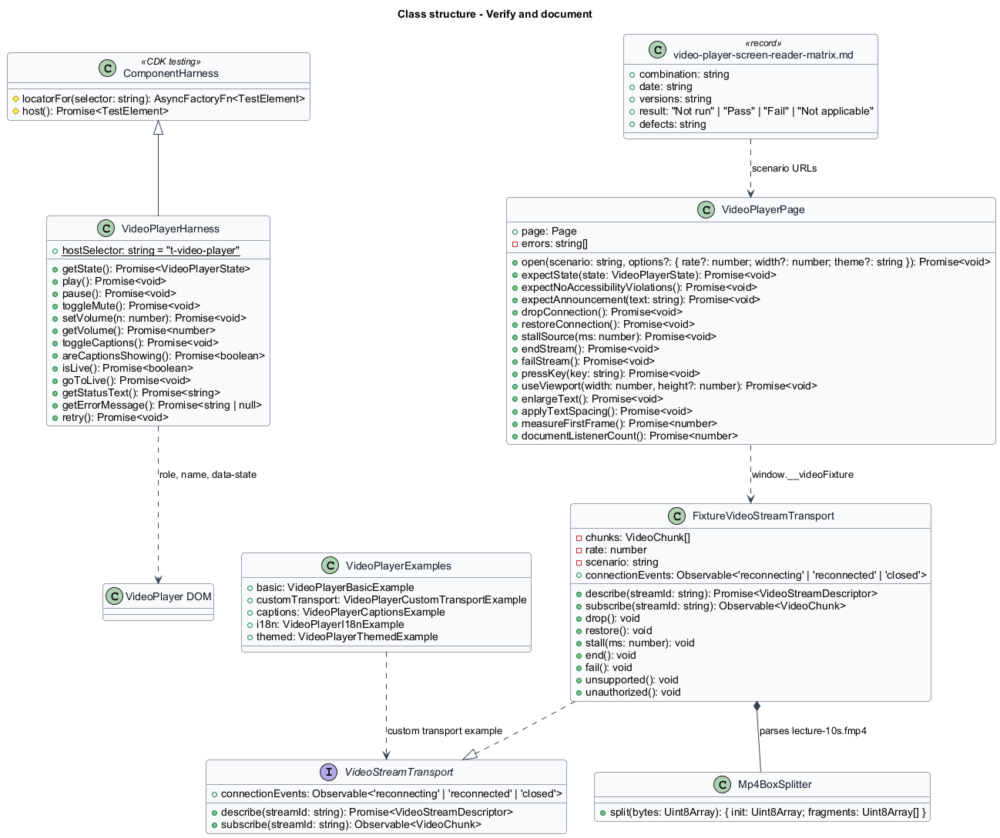
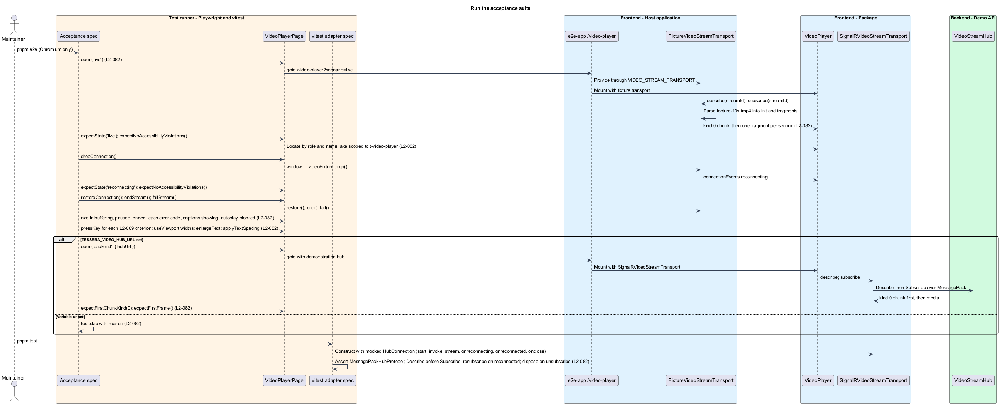
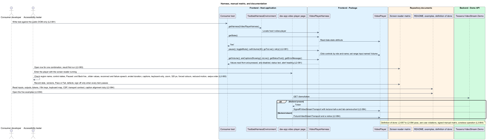

# Verify and document

## Overview

`t-video-player` ships with the means to test it, to prove its accessibility, and to adopt it. This feature describes those means: a harness for consumers' tests, an automated acceptance suite that runs against an in-page fixture stream, a unit test of the SignalR adapter against a mocked hub connection, an opt-in test against the demonstration backend, a manual screen reader procedure with a record, and a documentation page with runnable examples.

**Component harness** — class that wraps one player's DOM behind a stable test API, built on the CDK `ComponentHarness`

**Page object** — class that owns the selectors and interactions of one screen, so that tests state intent only

**Fixture transport** — `VideoStreamTransport` implementation inside the e2e-app that replays a committed fragmented-MP4 file with no server

**Fixture controls** — `window.__videoFixture` object through which a test drops, restores, stalls, ends, or fails the fixture stream

**axe-core** — rule engine that detects accessibility defects in a rendered page

**Screen reader** — assistive technology that presents on-screen content as speech or braille

**Verification matrix** — table that records, for each screen reader and browser combination, the date, versions, result, and defects

**Definition of done** — list of conditions under which the player counts as complete

Automated tests cannot judge what a screen reader says or whether a frame is decoded on a real device, so the design pairs three kinds of verification. Chromium Playwright tests cover states, keyboard behaviour, layout, and axe-core rules on every change, with the stream supplied by the fixture transport. A vitest suite covers the SignalR adapter without a server. Manual runs with five screen readers cover speech output and are recorded in the repository.

The feature belongs to the video-player subsystem and refines `L1-028`. It covers every sibling feature through one page object and one accessibility-checking method; [secure and perform](../secure-and-perform/) defines the budgets that the performance spec measures.

## Description

**Consumer harness.** `VideoPlayerHarness` extends CDK `ComponentHarness` in `src/video-player/testing/video-player-harness.ts` with `hostSelector` `t-video-player`. The package root exports it; there is no testing secondary entry point. It locates elements by role and accessible name, which are public and documented in `L2-070`, and by the host `data-state` attribute (`L2-081` AC7). It never calls private component members.

| Method | Behaviour |
|--------|-----------|
| `getState()` | Read the host `data-state` attribute as `VideoPlayerState` |
| `play()`, `pause()` | Click the control named Play or Pause when its `aria-disabled` is not `true` |
| `toggleMute()`, `setVolume(n)`, `getVolume()` | Click the control named Mute or Unmute; set the range input named Volume and dispatch `input`; read its value |
| `toggleCaptions()`, `areCaptionsShowing()` | Click the control named Captions; read its `aria-pressed` |
| `isLive()`, `goToLive()` | Read whether the LIVE badge has `aria-disabled="true"`; click it when enabled |
| `getStatusText()` | Read the trimmed text of the status element |
| `getErrorMessage()` | Read the heading text of the `role="alert"` panel, or `null` |
| `retry()` | Click the control named Retry inside the alert |

The harness matches the English default names. How a consumer that provides `VIDEO_PLAYER_I18N` passes its overrides to the harness is `<TO SUPPLY>`. The harness contract runs through `runHarnessContract()` in `video-player-harness-contract.ts` with a `TestbedHarnessEnvironment` fixture hosted by the e2e-app, as the combobox does.

**Automated verification.** `VideoPlayerPage` in `test/e2e/pages/video-player-page.ts` owns every selector and interaction. `open(scenario, options)` navigates to `/video-player?scenario={scenario}` with optional `rate`, `width`, and `theme` parameters. The e2e-app route hosts the production component and provides `FixtureVideoStreamTransport` through `VIDEO_STREAM_TRANSPORT` (`L2-082` AC4).

`FixtureVideoStreamTransport` fetches `lecture-10s.fmp4`, a committed synthetic fixture of about ten seconds generated with FFmpeg from `lavfi` sources. A minimal box parser reads each box's 32-bit size and four-character type, yields `ftyp`+`moov` as the `kind` 0 chunk, and yields each `moof`+`mdat` pair as a `kind` 1 chunk. `subscribe` emits the init chunk, then one fragment per 1000 ms divided by `rate`, looping with increasing `seq`. `describe` resolves `{ streamId, title: 'Lecture hall A', mimeType: 'video/mp4; codecs="avc1.4d401f,mp4a.40.2"', startedAt, width: 1280, height: 720 }`. The scenario parameter selects the initial behaviour: `live`, `slow`, `unsupported` (mimeType `video/unknown`), `unauthorized` (`describe` rejects), `not-found`, `ended-after`, and `autoplay-blocked` `<TO SUPPLY>` for the complete list.

`window.__videoFixture` exposes `drop()` (emit `reconnecting` on `connectionEvents`), `restore()` (emit `reconnected` and resubscribe with a fresh init chunk), `stall(ms)` (pause emission), `end()` (complete the observable), `fail()` (error with `source-failed`), `unsupported()`, and `unauthorized()`. Tests call them through page-object methods, never directly.

Chromium is the only automated browser. `expectNoAccessibilityViolations()` runs `AxeBuilder` with `wcag2a`, `wcag2aa`, `wcag21a`, `wcag21aa`, and `wcag22aa` tags, scoped with `.include('t-video-player')`, and checks captured page and console errors. It runs in `connecting`, `live`, `buffering`, `paused`, `reconnecting`, `ended`, each of the seven error codes, captions showing, and autoplay blocked (`L2-082` AC1).

| Verification area | Acceptance files |
|-------------------|------------------|
| Connection, descriptor, pipeline, live edge | `video-player.spec.ts`, `video-player-pipeline.spec.ts` |
| Controls and status | `video-player-controls.spec.ts`, `video-player-status.spec.ts` |
| Reconnection and errors | `video-player-resilience.spec.ts` |
| Keyboard, announcements, ARIA | `video-player-keyboard.spec.ts`, `video-player-announcements.spec.ts` |
| Presentation, responsive, touch | `video-player-presentation.spec.ts`, `video-player-touch.spec.ts` |
| Customisation and hardening | `video-player-customization.spec.ts`, `video-player-security.spec.ts`, `video-player-lifecycle.spec.ts` |
| Consumer adoption | `video-player-harness.spec.ts`, `video-player-examples.spec.ts` |
| Measured performance | `video-player-performance.spec.ts`, isolated with one worker |
| Opt-in backend | `video-player-backend.spec.ts`, skipped unless `TESSERA_VIDEO_HUB_URL` is set |

Each file begins with `// Acceptance tests. Traces to L2-0NN, …` and names its criteria in test titles (`L2-082` AC7). The keyboard spec has at least one test per `L2-069` criterion (`L2-082` AC2). The presentation spec reuses the combobox helpers `useViewport`, `enlargeText`, and `applyTextSpacing` across 320, 576, 768, 992, 1200, and 1920 CSS px and the 320 by 256 reflow viewport; actual 400% zoom stays manual (`L2-082` AC3). The performance spec applies `Emulation.setCPUThrottlingRate` 4 and a `PerformanceObserver` for `longtask` through the page object.

`src/video-player/signalr-video-stream-transport.spec.ts` runs under vitest with a mocked `HubConnection` exposing `start`, `invoke`, `stream`, `onreconnecting`, `onreconnected`, `onclose`, and `stop`. It verifies `MessagePackHubProtocol` selection, `Describe` before `Subscribe`, re-subscription after `onreconnected`, disposal of the stream subscription on unsubscribe, and `stop()` on release (`L2-082` AC5).

`video-player-backend.spec.ts` reads `TESSERA_VIDEO_HUB_URL`, requests the demonstration token from `GET /demo/token` on that origin, opens `/video-player?scenario=backend&hubUrl=…`, waits for the first frame of `lecture-hall-a`, and asserts through a page-object hook that the first chunk observed had `kind` 0. Without the variable the file calls `test.skip` with a reason (`L2-082` AC6).

**Manual release verification.** `docs/verification/video-player-screen-reader-matrix.md` follows the combobox matrix: a status line, a table of combination, date, versions, result, and defects, and a numbered checklist. Required combinations are NVDA/Chrome and JAWS/Chrome on Windows, VoiceOver/Safari on macOS and iOS, TalkBack/Chrome on Android, and Narrator/Edge on Windows, plus a Chrome actual-400%-zoom row at 1280 by 1024. The checklist covers the nine `L2-083` criteria: region name on entry, control name, role, and state, "Paused." and "Back live.", slider value speech, reconnect and failure speech with Retry reachable, ended message with duration, caption cue reading or recorded limitation, keyboard-only, 200% zoom, 320 CSS px, forced colours, and reduced motion, and swipe order on touch screen readers. Scenario URLs point at the e2e-app route with the fixture transport. Every row is created as Not run with tester, commit, and sign-off Pending; an automated pass never completes a manual row.

**Documentation and examples.** `src/video-player/README.md` documents installation and peers, inputs and outputs, the `VideoStreamTransport` contract and `VIDEO_STREAM_TRANSPORT`, the fourteen theme tokens, the i18n keys, the keyboard map, the Content Security Policy requirements and token transport facts from `L2-078`, the host's duty to align caption cue times with the stream's media timeline, harness use, and the definition of done (`L2-084` AC1).

`src/components-examples/tessera/video-player/` contains five standalone components: `VideoPlayerBasicExample` (hub URL, stream id, token factory), `VideoPlayerCustomTransportExample` (an in-memory `VideoStreamTransport`), `VideoPlayerCaptionsExample` (a WebVTT blob track), `VideoPlayerI18nExample` (a partial `VIDEO_PLAYER_I18N` provider), and `VideoPlayerThemedExample` (component tokens over a shared theme) (`L2-084` AC2). `VideoPlayerExamples` renders all five, and `video-player-examples.spec.ts` opens them.

The dev app's video player page requests `GET /demo/token` from the demonstration backend origin `<TO SUPPLY>`. On success it provides `SignalRVideoStreamTransport` with that token and the `lecture-hall-a` and `lab-camera-short` streams; on failure it provides `FixtureVideoStreamTransport` and shows a notice that the backend is absent (`L2-084` AC3). The manual end-to-end check with the backend is recorded in `docs/verification/video-player-demo.md`.

The definition of done requires every `L2-057` to `L2-094` acceptance criterion to pass, zero axe violations in the listed states, the signed manual matrix with no open failures, `api:check` passing, and the zoneless acceptance host exercising play, pause, mute, and reconnect (`L2-084` AC4).

## Requirements

Source: [L2 detailed requirements](../../../specs/L2.md). The table quotes the source wording exactly, including its modal verb.

| L2 ID | Refines (L1) | Requirement |
|-------|--------------|-------------|
| `L2-081` | `L1-028` | The package must ship `VideoPlayerHarness` under `src/video-player/testing/`, built on the CDK `ComponentHarness`, that operates the player through its public DOM only. |
| `L2-082` | `L1-028` | The player must be verified by Playwright in Chromium using page objects against an in-page fixture transport, with axe checks in every state, and the SignalR adapter must be unit-tested against a mocked hub connection. |
| `L2-083` | `L1-028` | Before release the player must pass a manual matrix with NVDA and Chrome, JAWS and Chrome, VoiceOver with Safari on macOS and iOS, TalkBack with Chrome on Android, and Narrator with Edge, recorded in `docs/verification/video-player-screen-reader-matrix.md`; unexecuted checks remain pending. |
| `L2-084` | `L1-028` | The player must ship with an adoption guide, example components, a dev-app page, and a definition of done. |

## Diagrams

The context view shows the three people who use the verification and documentation kit: the consumer developer, the maintainer, and the accessibility tester, with the browsers, screen readers, and optional demonstration backend they reach.

The container view separates the package with its harness, the examples, the dev app, the e2e-app with its fixture transport, the Playwright and vitest runners, and the repository documents.

The component view shows the harness, the page object, the fixture transport and its window controls, the spec files, and the documents that make up the kit.

The class view records the harness API, the page object, the fixture transport with its box parser and controls, and the examples component.

A Playwright test opens a scenario, the fixture transport replays the committed file, the test drives the stream through the window controls and asserts through the page object with axe in each state; the backend test runs only when its variable is set, and vitest covers the SignalR adapter.

A consumer test operates the player through the harness, a tester records a manual matrix row, and the documentation, examples, and dev-app page close the definition of done.

