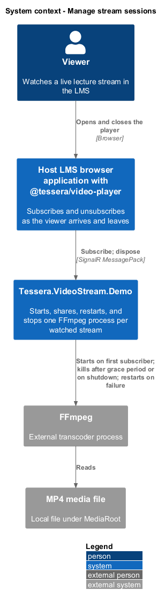
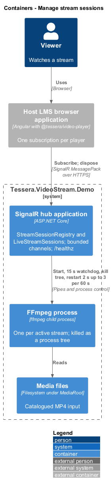
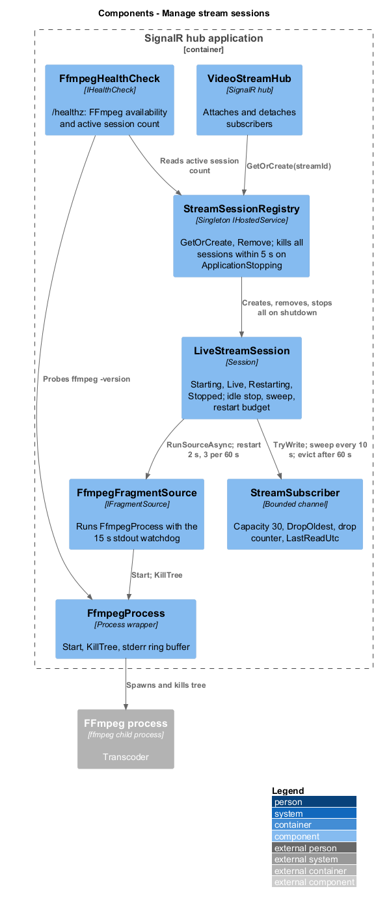
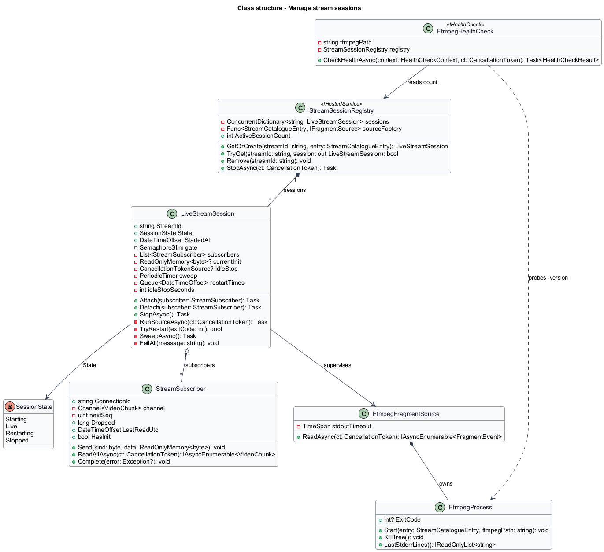
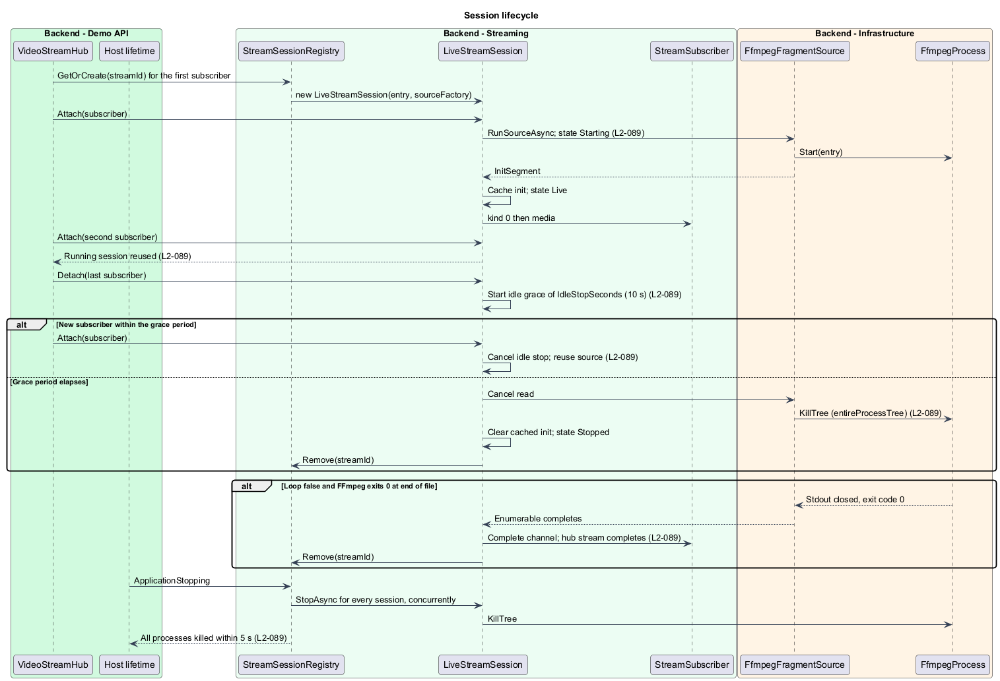
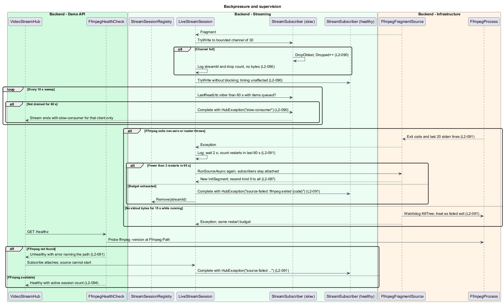

# Manage stream sessions

## Overview

Each catalogued stream that someone is watching costs one FFmpeg process. This feature owns that cost: it starts the process for the first subscriber, shares it among every later subscriber, stops it when nobody is left, restarts it within a budget when it fails, and keeps one slow viewer from holding up the rest. It sits between the hub, described in [serve hub stream](../serve-hub-stream/), and the parser, described in [transcode and fragment](../transcode-and-fragment/).

**session** — `LiveStreamSession` instance that owns one fragment source and the subscribers for one stream identifier

**grace period** — 10 s after the last subscriber leaves during which the session stays alive for a returning subscriber

**restart budget** — allowance of 3 restarts in any 60 s window, each after a 2 s delay

**sweep** — timer that runs every 10 s inside a session to evict subscribers that have stopped draining

**watchdog** — timer that treats the source as hung after 15 s without standard output bytes

**slow consumer** — subscriber whose channel has not been read for 60 s

## Description

`StreamSessionRegistry` is a singleton `IHostedService` holding a `ConcurrentDictionary<string, LiveStreamSession>`. `GetOrCreate(streamId, entry)` returns the existing session or creates one with the registered `Func<StreamCatalogueEntry, IFragmentSource>` factory, which is `FfmpegFragmentSource` in production.

`Remove(streamId)` deletes a session that has ended. On `ApplicationStopping` the registry calls `StopAsync` on every session concurrently and waits at most 5 s, so every FFmpeg process is killed within that bound (`L2-089`).

`LiveStreamSession` has the states `Starting`, `Live`, `Restarting`, and `Stopped`. It owns a `SemaphoreSlim` lock, the subscriber list, `CurrentInit`, an `IdleStopSeconds` option (default 10), the sweep timer, and the restart history.

`IdleStopSeconds` is read from configuration so tests can shorten it.

**Start and reuse.** `Attach(StreamSubscriber)` adds the subscriber under the lock and, when the session has no running source, starts `RunSourceAsync` on a background task and enters `Starting` (`L2-089`). The session stays in `Starting` until the first `InitSegment` arrives, then becomes `Live`.

A second subscriber attaching during `Starting` or `Live` is added to the list and reuses the running source; the hub never starts two processes for one identifier because `GetOrCreate` and `Attach` serialise on the registry's dictionary and the session lock.

**Idle stop.** `Detach(StreamSubscriber)` removes the subscriber and completes its channel. When the list becomes empty the session starts a `CancellationTokenSource` with `CancelAfter(IdleStopSeconds)`. A subscriber attaching within the grace period cancels that source and reuses the session.

When the grace period elapses the session cancels the source's read, calls `FfmpegProcess.KillTree()`, which is `Process.Kill(entireProcessTree: true)`, clears `CurrentInit`, enters `Stopped`, and asks the registry to remove it (`L2-089`).

**End of file.** For an entry with `Loop` false, FFmpeg exits with code 0 when the file ends and the source's enumerable completes. The session completes every subscriber's channel, so each hub stream completes and the player shows its ended state, and the registry removes the session (`L2-089`). A looping entry never reaches this path because `-stream_loop -1` restarts the input inside FFmpeg.

**Backpressure.** Each `StreamSubscriber` wraps `Channel.CreateBounded<VideoChunk>(new BoundedChannelOptions(30) { FullMode = BoundedChannelFullMode.DropOldest, SingleReader = true, SingleWriter = true })`. The session writes with `TryWrite`, which never blocks; when the channel is full the runtime discards the oldest item and the subscriber's `Dropped` counter increments (`L2-090`).

The fan-out loop is a plain `foreach` over a snapshot of the list with no awaits per subscriber, so delivery timing for 19 healthy subscribers is unaffected by one that has stopped reading.

The initialisation chunk is written with the same `TryWrite`; a full channel at that moment drops media, never the init, because the session clears the channel before writing a replacement init. Drops are logged at warning level with the stream identifier, the subscriber's connection identifier, and the cumulative count; no media bytes are logged.

**Slow consumers.** `StreamSubscriber` records `LastReadUtc` each time `ReadAllAsync` yields an item. The session's sweep timer fires every 10 s and evicts any subscriber whose `LastReadUtc` is older than 60 s while its channel holds items. Eviction completes the channel with `HubException("slow-consumer")`, which the hub rethrows to that client only (`L2-090`). A paused player keeps draining because its subscription stays open, so it is not evicted.

**Supervision.** `RunSourceAsync` wraps `await foreach` over the source in a loop. When the enumerable throws, the session inspects the cause (`L2-091`):

| Cause | Action |
|-------|--------|
| Non-zero exit while subscribers exist | Enter `Restarting`; log the exit code and the last 20 stderr lines; wait 2 s; start the source again if fewer than 3 restarts occurred in the last 60 s |
| `InvalidDataException` from the reader | Same as a non-zero exit; the process is killed first |
| No stdout bytes for 15 s while the process runs | Watchdog kills the process tree and treats it as a non-zero exit under the same budget |
| Budget exhausted | Complete every subscriber's channel with `HubException("source-failed: ffmpeg exited {code}")`, enter `Stopped`, and remove the session |
| Cancellation (idle stop or shutdown) | Kill the process tree; no restart |

Subscribers stay attached across a restart. The new process emits a fresh `moov`, which replaces `CurrentInit` and reaches every subscriber as a new `kind` 0 chunk before any further media, as described in [transcode and fragment](../transcode-and-fragment/).

The watchdog is a `PeriodicTimer` inside `FfmpegFragmentSource` that compares the time of the last stdout read to the current time; 15 s without a read raises the hung condition. Stderr is drained continuously throughout, so a diagnostic flood never stalls the encoder, and no stderr text reaches a client.

**Missing FFmpeg.** `FfmpegHealthCheck` runs `{Ffmpeg:Path} -version` at startup and on each `/healthz` request, with a timeout `<TO SUPPLY>`. A missing or failing executable logs an error naming the configured path and reports `Unhealthy`; the response also carries `activeSessions` from the registry (`L2-091`, `L2-094`).

`Describe` does not depend on FFmpeg and still succeeds. `Subscribe` attaches, the source fails to start with `Win32Exception` or `FileNotFoundException`, the restart budget is not spent on a process that never started, and every subscriber receives `HubException("source-failed: ffmpeg not found")`; the exact message text is `<TO SUPPLY>`.

## Requirements

Source: [L2 detailed requirements](../../../specs/L2.md). The table quotes the source wording exactly, including its modal verb.

| L2 ID | Refines (L1) | Requirement |
|-------|--------------|-------------|
| `L2-089` | `L1-029` | The backend must start FFmpeg on the first subscriber, stop it after the last subscriber leaves plus a grace period, and stop every process on shutdown. |
| `L2-090` | `L1-029` | The backend must never let one slow subscriber delay the others, must drop that subscriber's oldest fragments first, and must evict a subscriber that stops draining. |
| `L2-091` | `L1-029` | The backend must restart a failed FFmpeg process within a bounded budget, report exhausted failures to subscribers, drain its standard error, and detect a missing or hung process. |

## Diagrams

The context view shows the demonstration backend owning the lifetime of the FFmpeg process that reads the media file for the viewer's player.

The container view shows the hub application starting, killing, and restarting the FFmpeg child process while the media file is unchanged.

The component view shows `StreamSessionRegistry` holding `LiveStreamSession`s, each fanning out to `StreamSubscriber` channels and supervising an `FfmpegFragmentSource`.

The class view records the registry, session, subscriber, health check, and the process methods they call.

The first subscriber starts the source, the last one leaving starts the grace period, end of file completes every stream, and shutdown kills every process within 5 s.

A full channel drops the oldest fragment, the sweep evicts a slow consumer, and a failed or hung process restarts within the budget or fails every subscriber.

