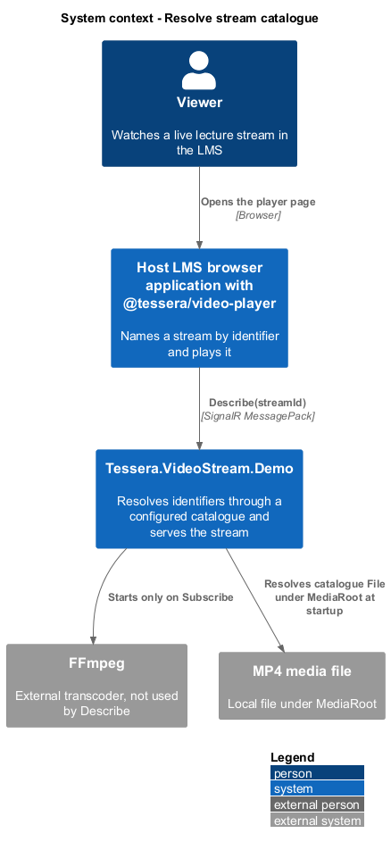
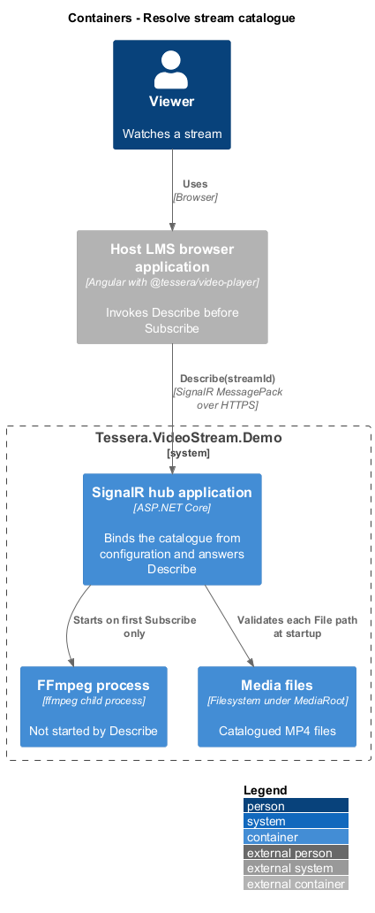
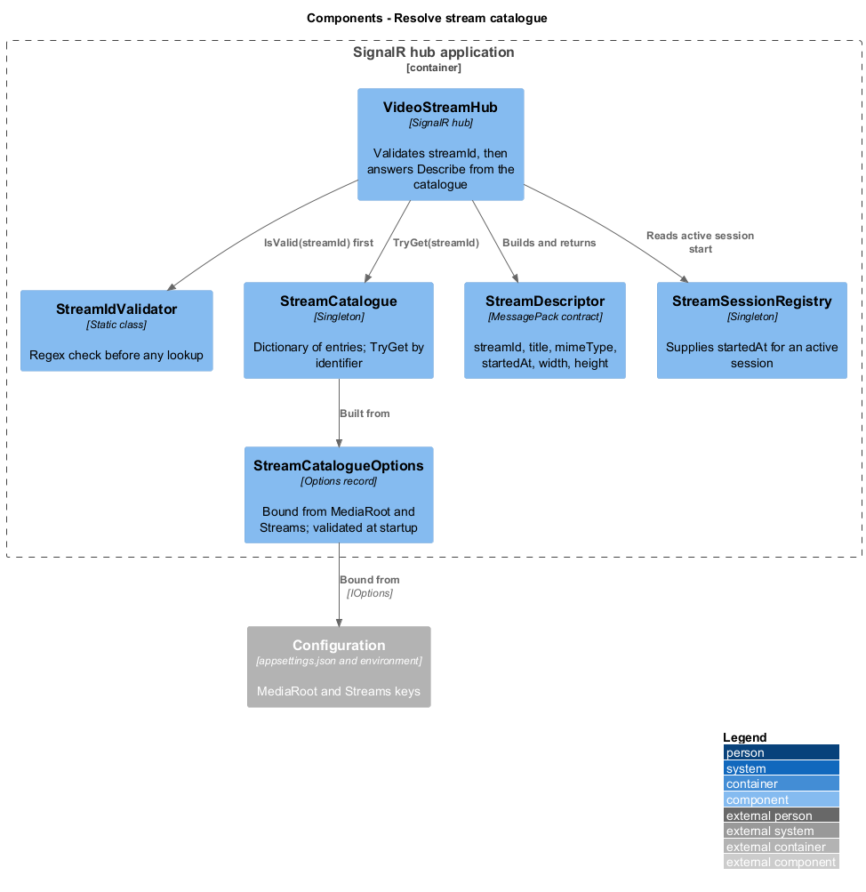
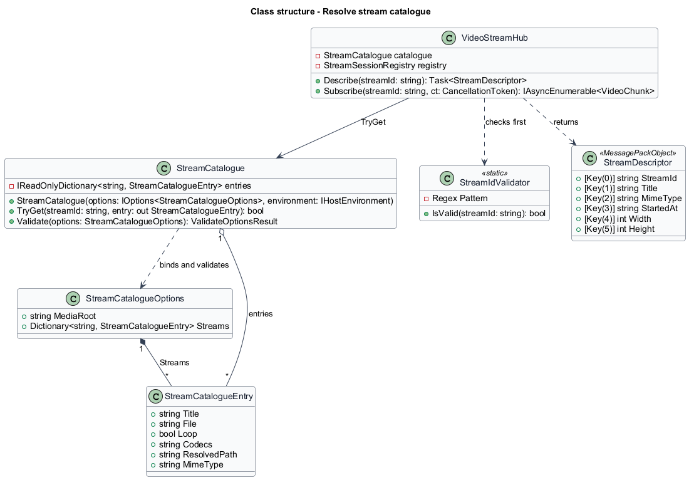
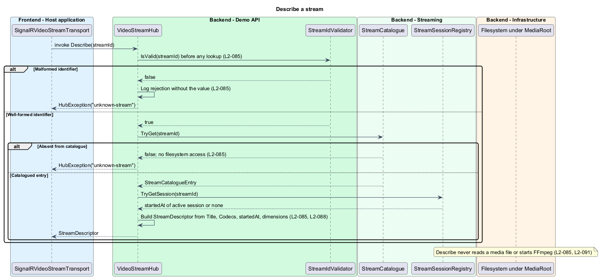
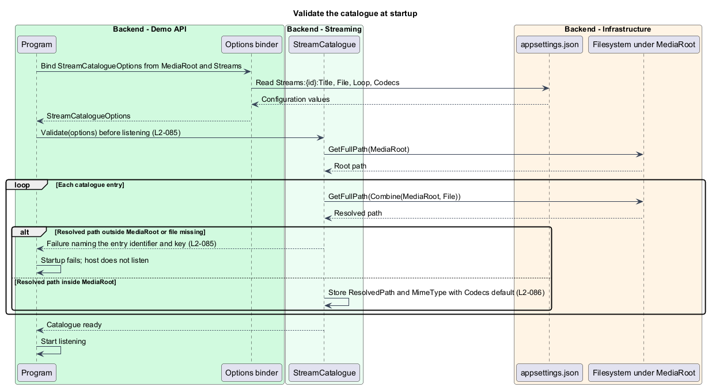

# Resolve stream catalogue

## Overview

`Tessera.VideoStream.Demo` turns a catalogued local MP4 file into a live stream for `@tessera/video-player`. A client names a stream only by identifier. This feature maps that identifier to a configured catalogue entry and answers `Describe` from it. The client never supplies, and the backend never accepts, a filesystem path.

**stream identifier** — client-supplied string naming one catalogue entry, matching `^[a-z0-9][a-z0-9-]{0,63}$`

**catalogue entry** — configured record of `Title`, `File`, `Loop`, and `Codecs` keyed by stream identifier

**media root** — configured directory under which every catalogue `File` resolves

**stream descriptor** — `StreamDescriptor` returned by `Describe` carrying `streamId`, `title`, `mimeType`, `startedAt`, `width`, and `height`

The feature covers configuration binding, startup validation, identifier validation, and lookup. Starting FFmpeg for a resolved entry belongs to [transcode and fragment](../transcode-and-fragment/); the hub method shapes and the authentication boundary belong to [serve hub stream](../serve-hub-stream/).

## Description

`StreamCatalogueOptions` binds the configuration section `Streams`, whose children are `Streams:{id}:Title`, `Streams:{id}:File`, `Streams:{id}:Loop`, and `Streams:{id}:Codecs`, plus the top-level key `MediaRoot`. `StreamCatalogueEntry` is the bound record for one identifier.

`Codecs` defaults to `avc1.4d401f,mp4a.40.2` when absent, and `Loop` defaults to `false`. `StreamCatalogue` is a singleton built from the options at startup. It holds a read-only dictionary of entry by identifier and exposes `TryGet(string streamId, out StreamCatalogueEntry entry)`. `StreamIdValidator` is a static class holding the compiled regular expression `^[a-z0-9][a-z0-9-]{0,63}$` and `IsValid(string streamId)`.

**Startup validation.** `StreamCatalogue` validates each entry once, before the host starts listening (`L2-085`). For each entry it combines `MediaRoot` and `File` with `Path.GetFullPath` and checks that the result starts with the full path of `MediaRoot` plus a directory separator. An entry whose file resolves outside the media root, or whose file does not exist, fails startup with an exception message that names the entry identifier and the configuration key. Validation uses `IValidateOptions<StreamCatalogueOptions>` so a misconfiguration surfaces as an options validation failure at `app.Run()`.

A catalogue with no entries is valid; `Describe` then throws `unknown-stream` for every identifier. The default `appsettings.json` lists `lecture-hall-a` and `lab-camera-short`, described in [test and operate backend](../test-and-operate-backend/).

**Identifier validation.** `VideoStreamHub.Describe` and `VideoStreamHub.Subscribe` call `StreamIdValidator.IsValid` as their first statement. A `null`, empty, or non-matching value throws `HubException("unknown-stream")` before any dictionary lookup, filesystem access, or session creation. The pattern admits lowercase letters, digits, and hyphens only, so `..`, `/`, `\`, and `%` never reach the catalogue.

The log entry for a rejected value records the connection identifier and the fact of rejection; it omits the value, because a malformed identifier may carry hostile content.

**Lookup.** A well-formed identifier absent from the dictionary also throws `HubException("unknown-stream")`. The catalogue lookup is an in-memory dictionary read; neither path reads the filesystem. Both paths use the same exception text so a client cannot distinguish a malformed identifier from an absent one.

**Describe.** For a catalogued identifier, `Describe` builds the `StreamDescriptor`:

| Member | Source |
|--------|--------|
| `streamId` | The validated identifier |
| `title` | `StreamCatalogueEntry.Title` |
| `mimeType` | `video/mp4; codecs="{Codecs}"` |
| `startedAt` | The active `LiveStreamSession` start instant as ISO-8601 UTC when a session exists; `<TO SUPPLY>` when none exists |
| `width`, `height` | `<TO SUPPLY>`; the catalogue entry carries no dimensions in `L2-085`, and the player falls back to 16:9 for values of 0 |

`Describe` does not start a session and does not touch FFmpeg, so it succeeds when FFmpeg is absent (`L2-091`). The title is returned as configured text; the player renders it as literal text (`L2-058`).

**Configuration example.**

```json
{
  "MediaRoot": "media",
  "Streams": {
    "lecture-hall-a": { "Title": "Lecture hall A", "File": "lecture-10s.fmp4", "Loop": true },
    "lab-camera-short": { "Title": "Lab camera", "File": "lecture-10s.fmp4", "Loop": false }
  }
}
```

A relative `MediaRoot` resolves against the content root. The README documents how to point an entry at any local `.mp4` file by editing `File` (`L2-094`).

## Requirements

Source: [L2 detailed requirements](../../../specs/L2.md). The table quotes the source wording exactly, including its modal verb.

| L2 ID | Refines (L1) | Requirement |
|-------|--------------|-------------|
| `L2-085` | `L1-029` | The backend must resolve `streamId` through a configured catalogue and never through a filesystem path supplied by the client. |

## Diagrams

The context view shows the viewer's host application asking the demonstration backend to describe a stream that is ultimately an MP4 file on disk.



The container view places the catalogue inside the SignalR hub application, with the media files under the media root and FFmpeg untouched by `Describe`.



The component view shows `VideoStreamHub` validating the identifier before consulting `StreamCatalogue`, which is bound from `StreamCatalogueOptions`.



The class view records the options, entry, catalogue, validator, and descriptor types.



`Describe` validates the identifier, looks the entry up, and builds the descriptor; malformed and absent identifiers both end in `unknown-stream` without filesystem access.



At startup the catalogue binds its options and resolves each file under the media root, failing with the entry's name when one escapes it.


