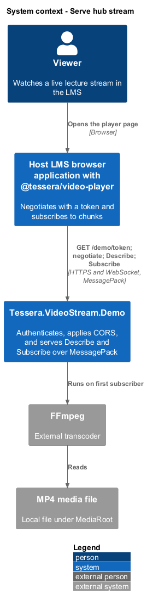
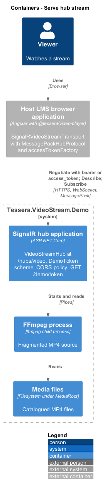
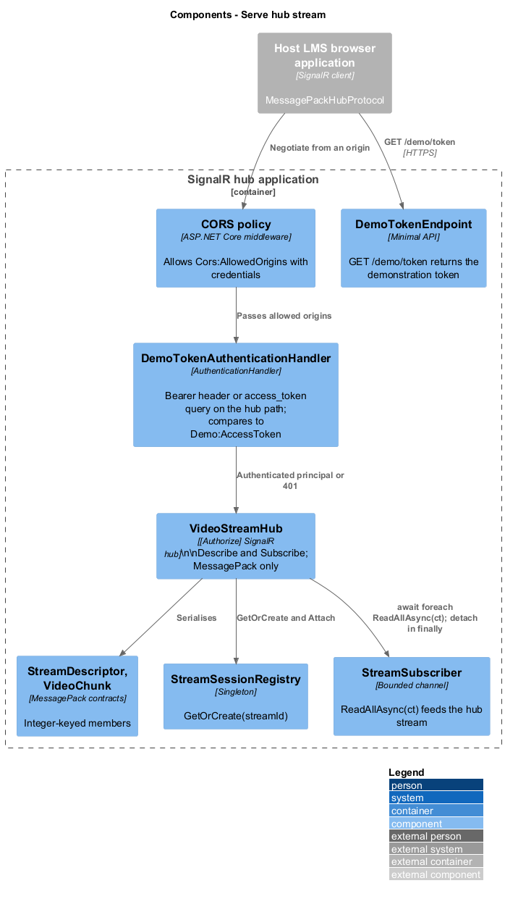
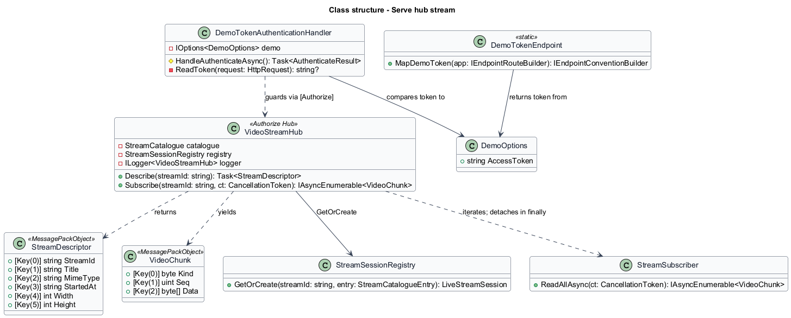
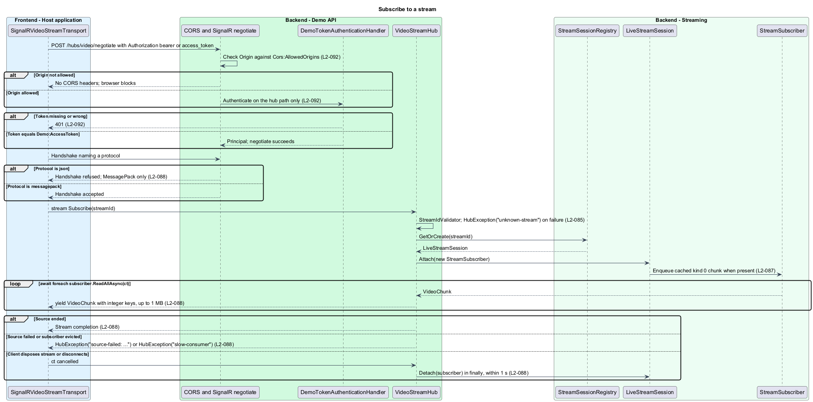
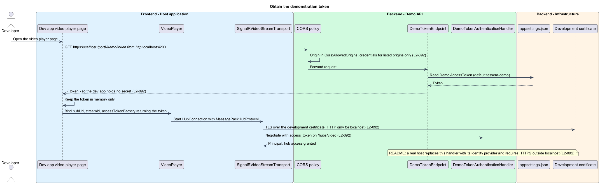

# Serve hub stream

## Overview

`@tessera/video-player` reaches `Tessera.VideoStream.Demo` through one SignalR hub. This feature is the hub's public face: the two methods `Describe` and `Subscribe`, the MessagePack-only protocol, the message shapes recorded in [ADR-0002](../../../adr/frontend/0002-stream-live-video-as-fmp4-over-signalr-messagepack.md), and the boundary that admits a client at all: a replaceable bearer authentication handler and a CORS allow-list.

**hub** — SignalR endpoint `VideoStreamHub` mounted at `/hubs/video`

**negotiate** — SignalR handshake request in which the client presents its token and offers transports and protocols

**demonstration token** — fixed bearer value from `Demo:AccessToken`, default `tessera-demo`, that the demonstration handler accepts

**allowed origin** — browser origin listed in `Cors:AllowedOrigins`, default `http://localhost:4200`, permitted to negotiate with credentials

**server-to-client stream** — hub method returning `IAsyncEnumerable<T>` whose items SignalR forwards to the caller until completion, exception, or cancellation

Identifier validation and catalogue lookup belong to [resolve stream catalogue](../resolve-stream-catalogue/); session start, backpressure, and FFmpeg supervision belong to [manage stream sessions](../manage-stream-sessions/).

## Description

**Hub contract.** `VideoStreamHub` is a `[Authorize]` hub mapped by `app.MapHub<VideoStreamHub>("/hubs/video")`. `Task<StreamDescriptor> Describe(string streamId)` returns the descriptor built in [resolve stream catalogue](../resolve-stream-catalogue/). `IAsyncEnumerable<VideoChunk> Subscribe(string streamId, [EnumeratorCancellation] CancellationToken ct)` validates the identifier, asks `StreamSessionRegistry.GetOrCreate(streamId)` for the `LiveStreamSession`, attaches a `StreamSubscriber`, and then iterates `subscriber.ReadAllAsync(ct)`, yielding each `VideoChunk` (`L2-088`).

The subscriber's channel already holds the cached initialisation chunk as its first item when one exists, so the hub method itself carries no ordering logic.

A `finally` block detaches the subscriber, so a client disposing its stream, a disconnect, or a server-side exception all remove the subscriber from the session; SignalR cancels `ct` on dispose and the removal completes within 1 s.

`StreamDescriptor` and `VideoChunk` in `Contracts/` are `[MessagePackObject]` classes with integer keys: `StreamDescriptor` uses `[Key(0)]` `streamId` through `[Key(5)]` `height`, with `startedAt` as an ISO-8601 UTC string; `VideoChunk` uses `[Key(0)]` `kind` (`byte`, 0 init, 1 media), `[Key(1)]` `seq` (`uint`), and `[Key(2)]` `data` (`byte[]`). Integer keys keep each envelope to a few bytes of overhead per 50 KB to 200 KB fragment.

The source ending normally completes the enumerable, which the client sees as stream completion. A source failure or eviction throws `HubException` from the enumerable with the messages `source-failed: ffmpeg exited {code}` and `slow-consumer`; an unknown or malformed identifier throws `HubException("unknown-stream")` before attaching.

SignalR forwards a `HubException` message verbatim, so these strings are the only failure text a client receives; no stderr content is included.

**Protocol and limits.** `AddSignalR()` is followed by `AddMessagePackProtocol()`, and the registration removes the JSON `IHubProtocol` so MessagePack is the only supported protocol; a client that negotiates with JSON is refused at the handshake (`L2-088`).

`HubOptions.MaximumReceiveMessageSize` and `StreamBufferCapacity` are set so a chunk of up to 1 MB is accepted and the per-connection stream buffer holds 10 items. The MessagePack options use the standard resolver with the `Lz4BlockArray` compression setting `<TO SUPPLY>`.

**Authentication.** `DemoTokenAuthenticationHandler` extends `AuthenticationHandler<AuthenticationSchemeOptions>` under the scheme name `DemoToken`. It reads the bearer token from the `Authorization` header, or, when the request path starts with `/hubs/video` and the header is absent, from the `access_token` query parameter, which is how the SignalR WebSocket transport carries it (`L2-092`).

The handler compares the value to `Demo:AccessToken` with a constant-time comparison and, on a match, issues a `ClaimsPrincipal` with a single `name` claim of `demo`. Any other request fails authentication, so the `[Authorize]` hub returns 401 at negotiate.

The query parameter is honoured on the hub path only. Request logging uses `HttpLoggingFields` without `RequestQuery`, so the token never appears in logs.

The handler is registered through `AddAuthentication("DemoToken").AddScheme<...>` in one place, and the README states that a real host replaces this registration with its identity provider's JWT bearer scheme without touching the hub.

`DemoTokenEndpoint` maps `GET /demo/token` with the same CORS policy as the hub and returns `{ "token": "<Demo:AccessToken>" }`. The dev app fetches it once, stores the value in memory, and supplies it through the player's `accessTokenFactory`, so the dev app carries no secret in source.

The endpoint is a convenience of the demonstration; a real host does not expose one.

**CORS.** The default policy is built from `Cors:AllowedOrigins`, allowing any header and method and `AllowCredentials()` for the listed origins only (`L2-092`).

The hub and the token endpoint require the policy. A negotiate from an unlisted origin receives no `Access-Control-Allow-Origin` header and the browser blocks the connection.

**Transport security.** The default launch profile in `Properties/launchSettings.json` listens on HTTPS with the ASP.NET Core development certificate and on HTTP for `localhost` (`L2-092`).

Because the token travels as a query parameter over WebSocket, the README states that HTTPS is required outside localhost; the player issues its own development warning for a non-TLS `hubUrl` (`L2-057`).

## Requirements

Source: [L2 detailed requirements](../../../specs/L2.md). The table quotes the source wording exactly, including its modal verb.

| L2 ID | Refines (L1) | Requirement |
|-------|--------------|-------------|
| `L2-088` | `L1-029` | The hub must expose `Describe` and `Subscribe` with the MessagePack protocol only and the message shapes recorded in ADR-0002. |
| `L2-092` | `L1-029` | The hub must require an access token through a replaceable authentication handler, accept the token on the hub path only, and restrict cross-origin access to configured origins. |

## Diagrams

The context view shows the viewer's host application negotiating with the demonstration backend, which in turn drives FFmpeg over a media file.

The container view places the hub, the authentication handler, and the token endpoint in the SignalR hub application beside the FFmpeg process and media files.

The component view shows `VideoStreamHub` behind `DemoTokenAuthenticationHandler` and the CORS policy, attaching a `StreamSubscriber` through `StreamSessionRegistry`.

The class view records the hub, the two MessagePack contracts, the authentication handler, and the token endpoint.

A subscription passes authentication, CORS, and protocol checks, then streams chunks until completion, failure, or client dispose.

The dev app obtains the demonstration token from an allowed origin and supplies it through `accessTokenFactory` over HTTPS.

