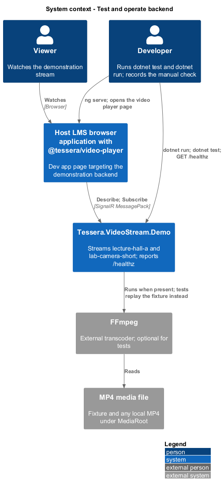
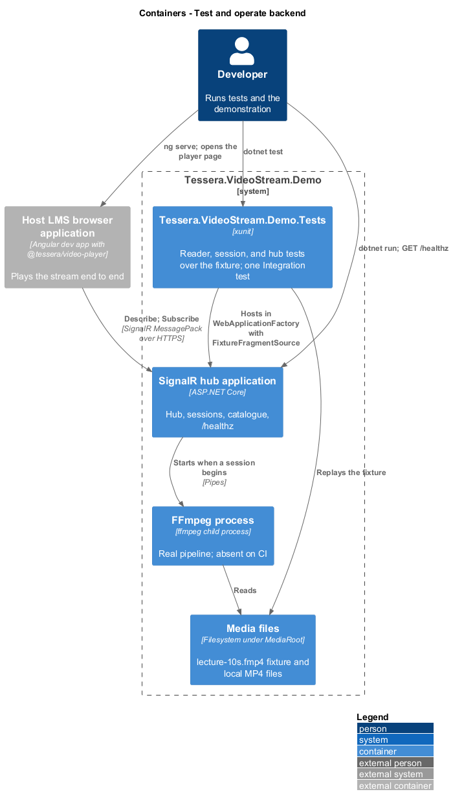
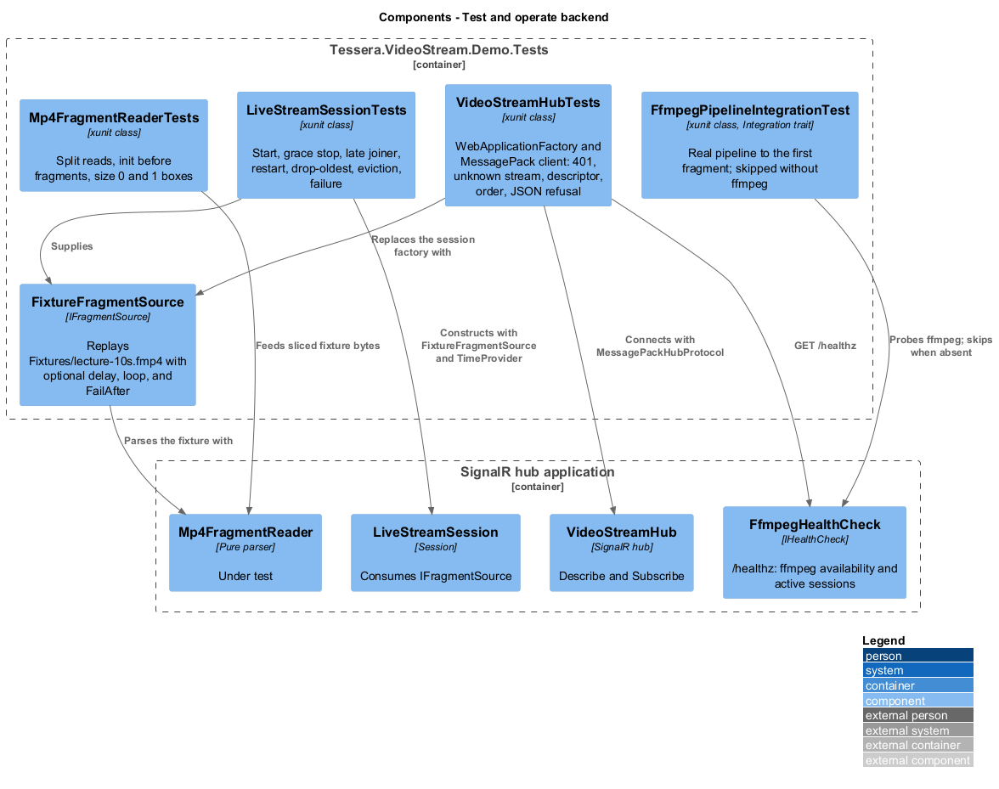
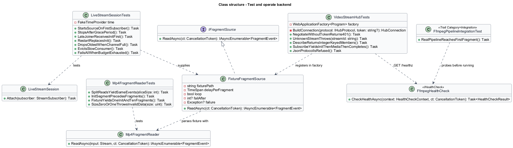
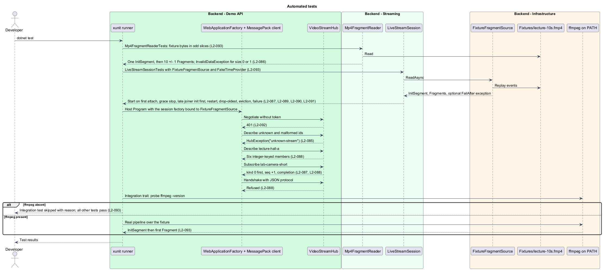
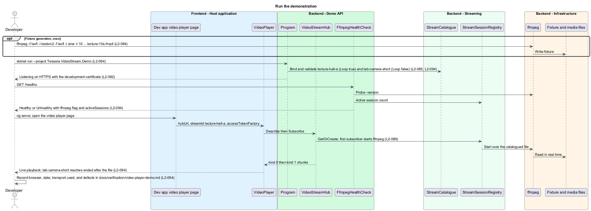

# Test and operate backend

## Overview

`Tessera.VideoStream.Demo` exists so the video player can be exercised end to end on a developer machine. This feature covers the two things that make that credible: an automated test project that proves the backend's behaviour without an FFmpeg installation, and the one-command operation, health reporting, and documentation that let a developer run the demonstration and record that the player plays.

**fixture** — committed ten-second fragmented MP4 file `Fixtures/lecture-10s.fmp4`, generated from FFmpeg `lavfi` sources, replayed by tests in place of a live process

**integration test** — test marked with the `Integration` trait that runs the real FFmpeg pipeline and is skipped with a reason when `ffmpeg` is not on the path

**health endpoint** — `GET /healthz` reporting FFmpeg availability and the active session count

**manual verification record** — `docs/verification/video-player-demo.md`, the signed record of the end-to-end check

The behaviour under test is designed in [resolve stream catalogue](../resolve-stream-catalogue/), [transcode and fragment](../transcode-and-fragment/), [serve hub stream](../serve-hub-stream/), and [manage stream sessions](../manage-stream-sessions/). This page records how each is proven and operated.

## Description

**Solution layout.** `demo/video-stream-backend/Tessera.VideoStream.sln` holds `Tessera.VideoStream.Demo` and `Tessera.VideoStream.Demo.Tests`, an xunit project on the workspace .NET version `<TO SUPPLY>`.

The test project references the demonstration project, `Microsoft.AspNetCore.Mvc.Testing` for `WebApplicationFactory`, `Microsoft.AspNetCore.SignalR.Client`, and `Microsoft.AspNetCore.SignalR.Protocols.MessagePack`. The fixture is copied to the test output directory.

**Fixture source.** `FixtureFragmentSource` implements `IFragmentSource` by opening the fixture and running `Mp4FragmentReader` over it, yielding each event after an optional delay (default 0 so tests run fast, configurable to 1 s per fragment for timing tests). A `Loop` flag re-opens the file at the end; a `FailAfter` count throws a configurable exception after that many fragments to drive failure propagation tests.

Because `LiveStreamSession` depends only on `IFragmentSource`, the tests register `FixtureFragmentSource` through the session factory and the demonstration code paths run unchanged (`L2-093`).

**Reader tests.** `Mp4FragmentReaderTests` feed the fixture bytes through a stream that returns them in deliberately odd slice sizes (1 byte, 7 bytes, 4096 bytes, and a size that splits every box header) and assert the same events in each case: one `InitSegment` first, then 10 ± 1 `Fragment`s, with no media before the init (`L2-086`, `L2-093`).

A test writes a box header with size 0 and another with size 1 and asserts `InvalidDataException`.

**Session tests.** `LiveStreamSessionTests` construct a session with `FixtureFragmentSource`, `IdleStopSeconds` set to a short value, and a `TimeProvider` so timers advance without waiting (`L2-093`).

They cover: the source starts only on the first `Attach`; the source stops and the init cache clears after the grace period; a subscriber attached after the init receives `kind` 0 `seq` 0 first; a `FailAfter` source followed by a restart delivers a second `kind` 0 to an existing subscriber; a subscriber that never reads sees `Dropped` grow and the oldest item gone while another subscriber's delivery count is unaffected; the sweep ends a non-draining subscriber with `slow-consumer`; and a source that fails past the restart budget ends every subscriber with `source-failed`.

**Hub tests.** `VideoStreamHubTests` host the application in `WebApplicationFactory<Program>` with the session factory replaced by `FixtureFragmentSource` and connect a `HubConnection` built with `MessagePackHubProtocol` over the factory's handler (`L2-093`).

They cover: negotiate without a token returns 401; `Describe("no-such-stream")` and `Describe("../x")` both throw `unknown-stream`; `Describe("lecture-hall-a")` returns the six integer-keyed members with `startedAt` parseable as ISO-8601 UTC; `Subscribe("lab-camera-short")` yields `kind` 0 first, `seq` values increasing by 1, and completes; and a `HubConnection` built with the JSON protocol fails its handshake.

**Integration test.** One test carries `[Trait("Category", "Integration")]`. It checks for `ffmpeg` on the path through `FfmpegHealthCheck`'s probe; when absent it skips with the reason "ffmpeg not found on PATH".

When present it runs `FfmpegFragmentSource` over the fixture and asserts one `InitSegment` followed by at least one `Fragment` within a timeout `<TO SUPPLY>` (`L2-093`). `dotnet test` on a machine without FFmpeg therefore passes every non-integration test and reports one skip.

**Running the demonstration.** `dotnet run --project demo/video-stream-backend/Tessera.VideoStream.Demo` starts the backend on the default launch profile. The committed `appsettings.json` catalogues `lecture-hall-a` with `Loop` true, so it streams indefinitely, and `lab-camera-short` with `Loop` false, so the player's ended state can be observed after about ten seconds (`L2-094`).

Both entries point at the fixture under `MediaRoot`.

`GET /healthz` returns `Healthy` with `{ ffmpeg: true, activeSessions: n }` when FFmpeg answers `-version`, and `Unhealthy` naming the configured path otherwise; `Describe` still works in the unhealthy state and `Subscribe` fails with `source-failed` (`L2-091`).

**Documentation.** `demo/video-stream-backend/README.md` documents: prerequisites (the .NET SDK, FFmpeg with `libx264` and `aac`, the development certificate); the configuration keys `MediaRoot`, `Streams`, `Ffmpeg:Path`, `Demo:AccessToken`, `Cors:AllowedOrigins`, and `IdleStopSeconds`; the hub contract from [ADR-0002](../../../adr/frontend/0002-stream-live-video-as-fmp4-over-signalr-messagepack.md); how to point an entry at any local `.mp4` by setting `File`; that a real host replaces `DemoTokenAuthenticationHandler` with its identity provider; that HTTPS is required outside localhost; and the FFmpeg command that generates the fixture (`L2-094`).

The fixture command uses `lavfi` sources, `testsrc2` for video and `sine` for audio, for 10 s at 30 fps, encoded with the same codec arguments as the live pipeline so its `moov` matches the default `Codecs`.

**End-to-end record.** With the backend and `ng serve` for the dev app both running, the dev app's video player page targets `https://localhost:{port}/hubs/video` and plays `lecture-hall-a`.

The developer records the result, the browser, the date, and any defects in `docs/verification/video-player-demo.md` (`L2-094`). The page falls back to the fixture transport when the backend is absent (`L2-084`), so the record states which transport was used.

## Requirements

Source: [L2 detailed requirements](../../../specs/L2.md). The table quotes the source wording exactly, including its modal verb.

| L2 ID | Refines (L1) | Requirement |
|-------|--------------|-------------|
| `L2-093` | `L1-029` | The backend must have an xunit test project that runs without FFmpeg by replaying a committed fixture, plus one opt-in integration test for the real pipeline. |
| `L2-094` | `L1-029` | The demonstration backend must run with one command, expose a looping and a finite stream, report its health, and document how to point it at any local MP4 file. |

## Diagrams

The context view shows the developer running the backend and the dev app, with FFmpeg and the media file as the external pieces the tests replace.

The container view adds the test project beside the hub application, FFmpeg, and the media files, with the fixture standing in for the process.

The component view shows the test classes targeting the reader, the session, and the hub, with `FixtureFragmentSource` behind the `IFragmentSource` seam and `FfmpegHealthCheck` behind `/healthz`.

The class view records the fixture source, the test classes, and the health check.

`dotnet test` runs the reader, session, and hub tests against the fixture and skips the integration test when FFmpeg is absent.

`dotnet run` exposes the two catalogued streams and the health endpoint, the dev app plays a stream end to end, and the result is recorded.

