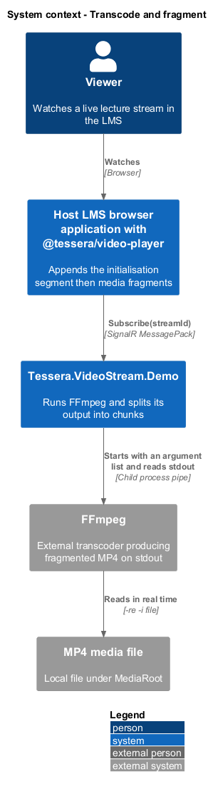
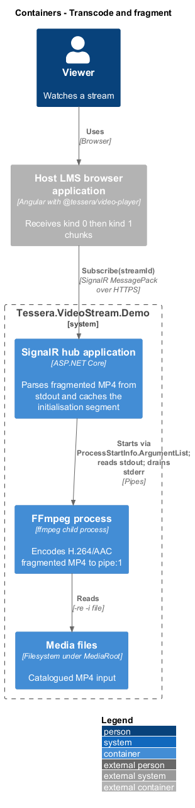
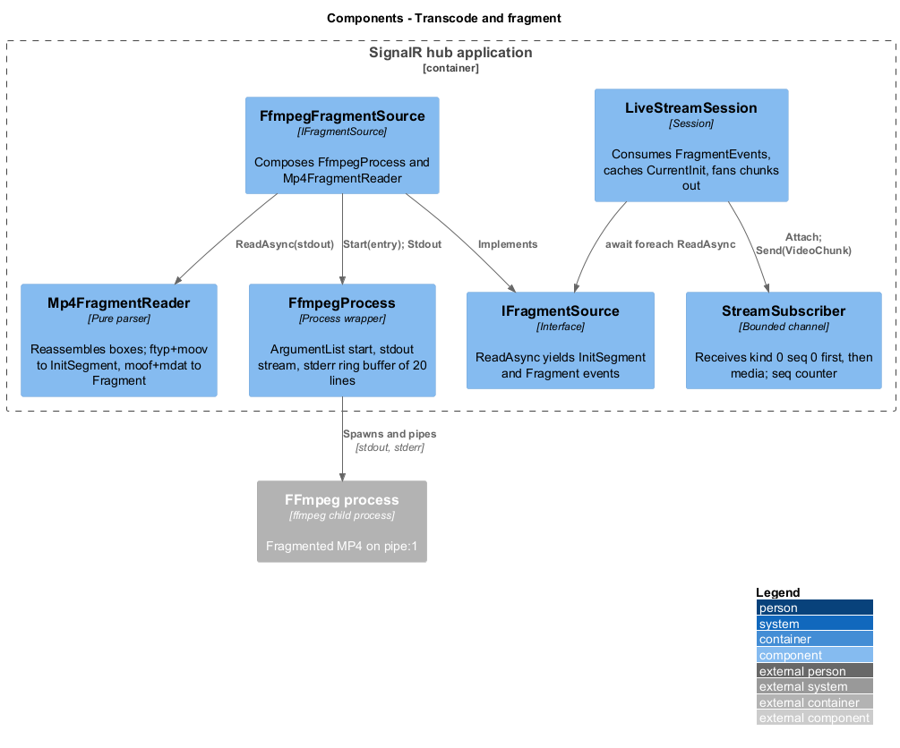
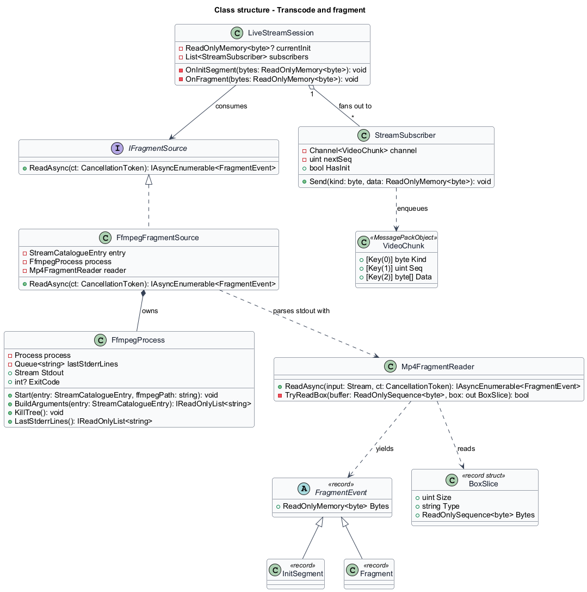
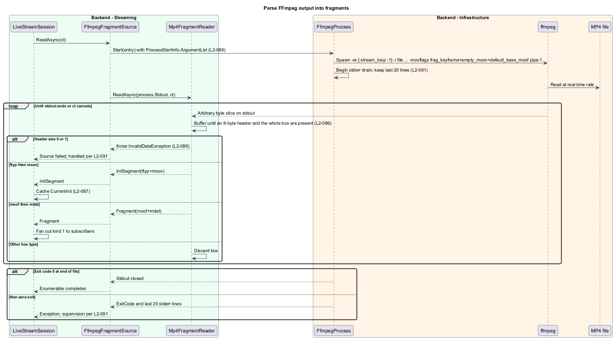
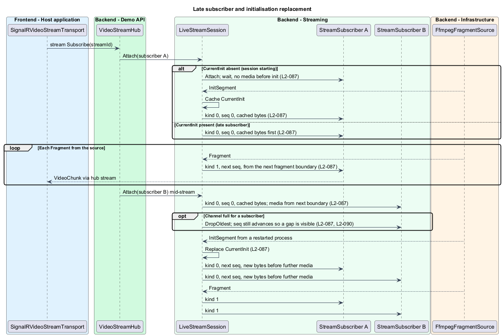

# Transcode and fragment

## Overview

`Tessera.VideoStream.Demo` has no live camera. It makes a live stream by running FFmpeg over a catalogued MP4 file in real time and reading fragmented MP4 from the process's standard output. This feature turns that byte stream into the two kinds of `VideoChunk` the player consumes, and keeps the initialisation segment so a subscriber that joins mid-stream can decode from its first fragment.

**fragmented MP4** — MP4 layout in which an initialisation segment is followed by self-contained media fragments instead of one trailing sample table

**box** — length-prefixed MP4 unit of a 32-bit big-endian size, a four-character type, and a payload

**initialisation segment** — `ftyp` box followed by a `moov` box that a decoder consumes once before any fragment

**fragment** — `moof` box followed by its `mdat` box, about 1 s long and starting on a keyframe

**late subscriber** — subscriber that joins after the session has already parsed its initialisation segment

**fragment boundary** — point between one fragment's `mdat` and the next fragment's `moof`

The feature covers the FFmpeg argument list, the box parser, and the cache-and-deliver rule for initialisation segments.

Deciding when a process starts, stops, or restarts belongs to [manage stream sessions](../manage-stream-sessions/); the hub methods belong to [serve hub stream](../serve-hub-stream/).

## Description

`IFragmentSource` is the seam between the parser and the session: `IAsyncEnumerable<FragmentEvent> ReadAsync(CancellationToken ct)`. `FragmentEvent` is an abstract record with two cases, `InitSegment(ReadOnlyMemory<byte> Bytes)` and `Fragment(ReadOnlyMemory<byte> Bytes)`. `FfmpegFragmentSource` is the production implementation; `FixtureFragmentSource` replays `Fixtures/lecture-10s.fmp4` for tests and is described in [test and operate backend](../test-and-operate-backend/).

**FFmpeg invocation.** `FfmpegProcess.Start(StreamCatalogueEntry entry)` builds a `ProcessStartInfo` for the executable at `Ffmpeg:Path` (default `ffmpeg`) with `UseShellExecute` false and `RedirectStandardOutput` and `RedirectStandardError` true. Arguments go through `ProcessStartInfo.ArgumentList`, one element each, never a concatenated string (`L2-086`).

The list is `-hide_banner -loglevel warning -re`, then `-stream_loop -1` only when `Loop` is true, then `-i {ResolvedPath}`, `-map 0:v:0 -map 0:a:0?`, `-c:v libx264 -preset veryfast -tune zerolatency -profile:v main -pix_fmt yuv420p -r 30 -g 30 -keyint_min 30 -sc_threshold 0`, `-c:a aac -ar 48000 -b:a 96k`, and `-f mp4 -movflags frag_keyframe+empty_moov+default_base_moof -frag_duration 1000000 pipe:1`. `-re` paces the output at the file's real-time rate; `-g 30` with `-r 30` places a keyframe every second so each fragment starts on one; `empty_moov` makes the `moov` emit before any sample so the initialisation segment is available immediately.

The `mimeType` for the stream is `video/mp4; codecs="{Codecs}"`, with `Codecs` defaulting to `avc1.4d401f,mp4a.40.2`, which matches `-profile:v main` at level 3.1 and AAC-LC.

`FfmpegProcess` exposes standard output as a `Stream` and starts a background task that drains standard error line by line, logs each line at debug level, and keeps the last 20 lines in a ring buffer for failure reports (`L2-091`). The drain is continuous so a full stderr pipe never blocks the encoder.

**Box parsing.** `Mp4FragmentReader` is a pure parser with no process dependency: `IAsyncEnumerable<FragmentEvent> ReadAsync(Stream stdout, CancellationToken ct)`. It reads into a `PipeReader` and consumes boxes one at a time. For each box it reads the 8-byte header, then waits until the pipe holds the whole box before slicing it, so a box split across any number of reads is reassembled (`L2-086`).

A header size of 0 (box extends to end of file) or 1 (64-bit extended size) throws `InvalidDataException`, because a live stream has no end and the chosen `movflags` never emit extended sizes.

The reader accumulates `ftyp` and `moov` into one `InitSegment` event, then pairs each `moof` with the following `mdat` into one `Fragment` event. Boxes of any other type between fragments, such as `sidx` or `free`, are discarded.

A second `ftyp` or `moov` after fragments starts a new `InitSegment`; it occurs only when a restarted process writes to a fresh stdout, which the session handles as a new source. Over the committed ten-second fixture the reader yields exactly one initialisation segment and 10 ± 1 fragments.

`FfmpegFragmentSource.ReadAsync` composes the two: it starts the process, runs `Mp4FragmentReader` over its stdout, and yields each event. Stream end with exit code 0 completes the enumerable; a non-zero exit, a parser exception, or cancellation surfaces to the session as described in [manage stream sessions](../manage-stream-sessions/).

**Initialisation segment cache.** `LiveStreamSession` consumes the source's events. On `InitSegment` it stores the bytes as `CurrentInit`, records that the session is live, and sends a `VideoChunk` of `kind` 0 to every attached `StreamSubscriber` before any later media (`L2-087`).

On `Fragment` it sends a `kind` 1 chunk to each subscriber that has already received the current initialisation segment.

`LiveStreamSession.Attach(StreamSubscriber)` runs under the session lock. When `CurrentInit` is present, the subscriber's first chunk is `kind` 0 with `seq` 0 carrying the cached bytes, and its media begins at the next fragment boundary; no partial fragment and no fragment emitted before attachment is replayed (`L2-087`). When `CurrentInit` is absent, the subscriber is attached but receives nothing until the segment is parsed, so no media ever precedes it.

After a source restart the new `InitSegment` replaces `CurrentInit` and every subscriber receives a fresh `kind` 0 chunk before further media, because the new `moov` may differ from the old one.

**Sequence numbers.** Each `StreamSubscriber` owns a `uint` counter starting at 0. Every chunk delivered to that subscriber, initialisation or media, takes the next value, so values increase by 1 per delivered chunk. When the subscriber's bounded channel drops a fragment under backpressure, the counter has already advanced, so the receiver observes a gap and can distinguish a server-side drop from a stall (`L2-087`, `L2-090`).

The cached initialisation chunk resent after a restart takes the next value too; `seq` 0 is reserved for the first chunk of a subscription.

## Requirements

Source: [L2 detailed requirements](../../../specs/L2.md). The table quotes the source wording exactly, including its modal verb.

| L2 ID | Refines (L1) | Requirement |
|-------|--------------|-------------|
| `L2-086` | `L1-029` | The backend must run FFmpeg to produce fragmented MP4 on standard output and split that output into an initialisation segment and keyframe-aligned fragments. |
| `L2-087` | `L1-029` | The backend must cache the current initialisation segment and deliver it before any media to every subscriber, including those that join after the session started. |

## Diagrams

The context view shows the demonstration backend driving FFmpeg over a local MP4 file to feed the viewer's player.

The container view shows the hub application reading the FFmpeg child process's standard output while the process reads a media file.

The component view shows `FfmpegProcess` and `Mp4FragmentReader` composed by `FfmpegFragmentSource` behind the `IFragmentSource` seam that `LiveStreamSession` consumes.

The class view records the process wrapper, the parser, the event records, the source interface, and the session's cache.

FFmpeg starts with an argument list, its output is reassembled into boxes, and the reader yields one initialisation segment then fragments, failing on unsupported box sizes.

A late subscriber receives the cached initialisation segment first, an early subscriber waits for it, and a restart resends it to everyone.

